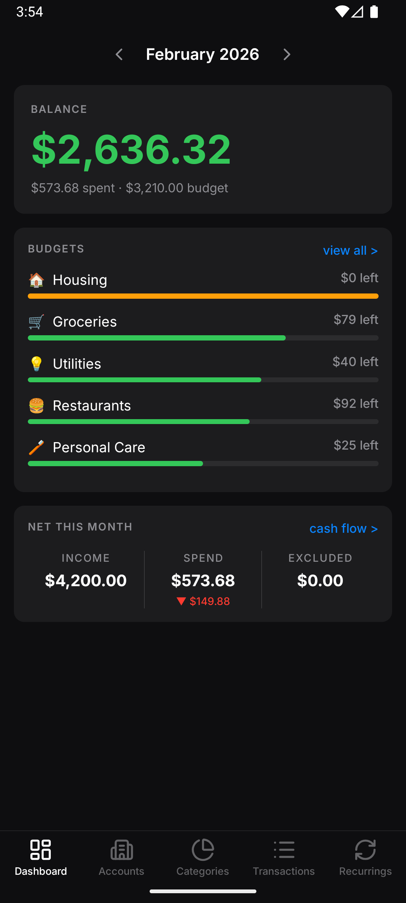
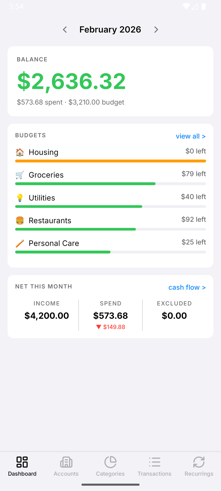
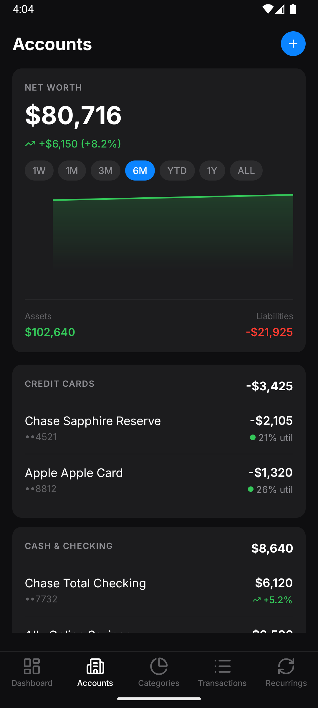
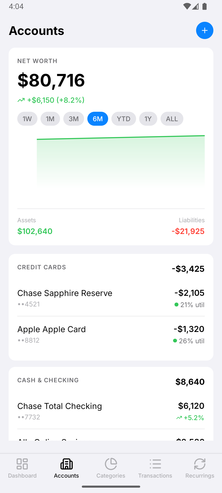
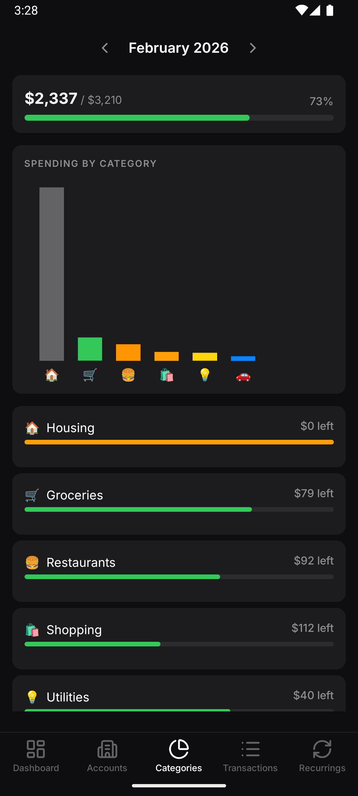
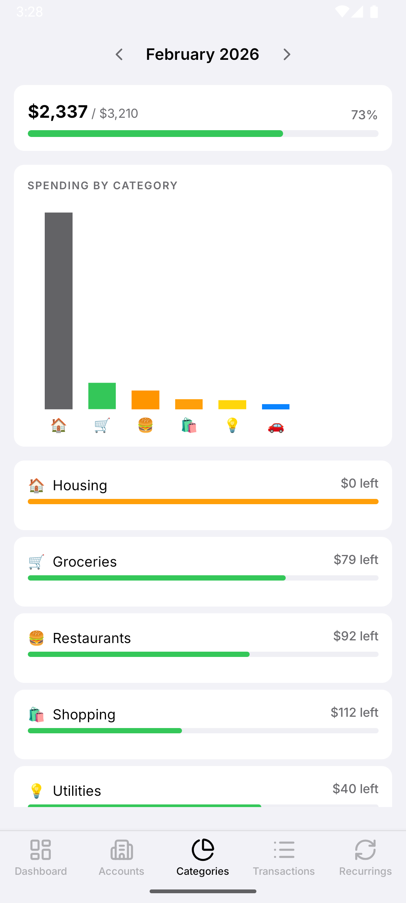
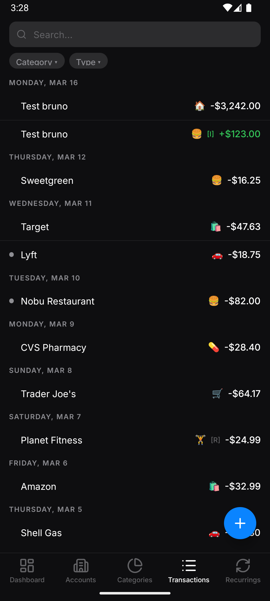
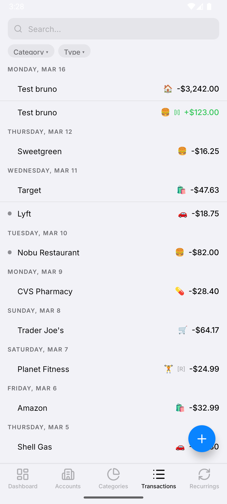
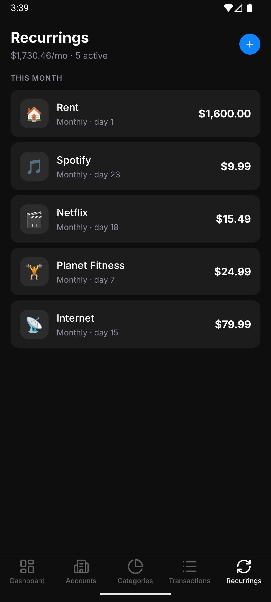
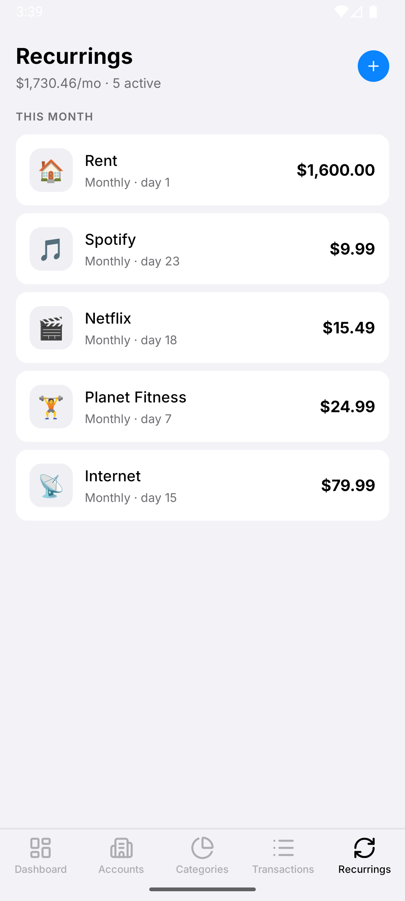

# Copilot Money Clone — Bruno Manchinelli

## Assignment given
Clone this app to the best of your ability in < 6 hours. Implement everything except the actual financial connections.

[Copilot: Track & Budget Money App - App Store](https://apps.apple.com/us/app/copilot-track-budget-money/id1447330651)

- Have claude build a plan using their help center https://help.copilot.money/en/
    - Give it screenshots of every screen.
- Use a local in-app db.
- Prioritize the most important features, it should be functional and usable.
- Make sure it looks and feels good.

### Constraints:
- Time limit: < 6 hours
- Scope: All core functionality except financial institution connections
- Data: Local in-app database
- Quality bar: Functional, usable, visually close to the original


## Setup

### Prerequisites
- Node.js 18+
- [Expo Go](https://expo.dev/go) app on your iOS or Android device, **or** a configured iOS Simulator / Android Emulator

### Run

```bash
cd copilot-clone
npm install
npx expo start
```

Scan the QR code with Expo Go, or press `i` for iOS simulator / `a` for Android emulator.

> The app uses a local SQLite database seeded with mock data on first launch — no accounts or API keys required.

---

## Result
### Screens implemented
1. Dashboard
2. Categories / Budgets
3. Transactions
4. Transaction Detail
5. Accounts

### Artifacts
 - [Scrapped Help Center](./docs/help-center/INDEX.md)
 - [Scrapped Screenshots](./docs/screenshots/)
 - [Used Promts](./docs/prompts/)

### Screenshots
| Screen | Dark | Light | 
|--------|------|-------|
| Dashboard |  | 
| Accounts |  | 
| Categories |  | 
| Transactions |  | 
| Recurrings |  | 

### Video


## Approach: AI-Orchestrated Development
The exercise was treated as a product replication problem, not a UI-only coding task.

The workflow mirrors how I currently ship software with AI-assisted development:
convert product knowledge → structured PRD → constrained implementation passes.

This reduces ambiguity and allows AI agents to operate within well-defined boundaries.

### Phase 0: Product Reverse Engineering
Before writing code, I created a machine-readable product specification:
- Scraped Copilot's help center (105 articles, 40+ screenshots)
- Fed to Claude Code to generate machine-readable PRD
- Defined TypeScript contracts and mock data before writing any UI code

This allowed implementation prompts to reference stable product definitions instead of raw documentation.

### Phase 1-5: Sequential Claude Code Execution
Development proceeded through focused implementation phases.

Each phase was executed through Claude Code with the PRD as the primary context source.

| Phase | Scope |
|-------|-------|
| 1 | Data layer + navigation + Dashboard (hero screen) |
| 2 | Categories + Transactions | 
| 3 | Detail sheet + Accounts |
| 4 | Polish pass | ~40min |

Between phases, context was compressed to prevent prompt drift and keep the agent focused.

## Architecture 
The architecture intentionally mirrors patterns familiar from native mobile development.
```
Screens
   ↓
Feature Hooks
   ↓
State Store
   ↓
Database 
```

### Screens

Expo Router screens compose the UI and interact only with feature hooks.

### Feature Hooks

Hooks act as application services, combining database queries and state.

### State Store

Global UI state managed via lightweight store primitives.

### Database

Local relational store used for persistence and reactive queries.

## Technology Choices

The stack was optimized for rapid iteration and AI-agent reliability.

| Layer     | Choice                     | Rationale 
|-----------|----------------------------|------------------------------------------------
|Framework	| Expo	                     | Fast setup, stable RN runtime
|Navigation	| Expo Router	               | File-based routing reduces boilerplate
|State	    | Zustand	                   | Minimal abstraction, predictable state updates
|Database	  | expo-sqlite + DrizzleORM   |Typed SQL with reactive queries
|Charts	    | react-native-gifted-charts |Quick finance-grade visualizations
|UI Styling	| NativeWind	               |Tailwind-style classes are AI-friendly
|Sheets	    | @gorhom/bottom-sheet	     | Standard interaction pattern
|Icons	    | lucide-react-native	       | Consistent iconography

The guiding principle was reduce framework complexity so iteration speed stays high within a short time constraint.

## Feature Scope
The goal was to implement the most product-defining flows.

### Dashboard
 - Spending pace visualization
 - Budget snapshot
 - Recent transactions
  Upcoming recurring charges
 - Monthly net summary

### Categories / Budgets
 - Category list with emoji icons
 - Budget progress indicators
 - Monthly spend tracking

### Transactions
 - Date-grouped transaction list
 - Review indicators
 - Manual transaction creation

### Transaction Detail
 - Bottom sheet editor with:
 - Merchant
 - Amount
 - Category
 - Date
 - Notes
 - Budget inclusion toggle
 
 ### Accounts
 - Net worth chart
 - Account grouping
 - Balance summary

## Design Priorities
The visual design focused on replicating Copilot’s core UI language:
 - Emoji-driven categories
 - Color-based budget signals
 - Card-based dashboard layout
 - Readable financial typography
 - Dark mode support
These patterns are central to Copilot’s usability and product identity.

## What I Would Improve With More Resources
### Full Agentic Pipeline
With higher token limits and more development time, the system could shift toward a fully automated agent workflow:
```
PRD → Implementation Agent
       ↓
Code Review Agent
       ↓
QA Agent
       ↓
CI/CD Pipeline
       ↓
Human PR Approval
```

In this setup:
 - Implementation agents generate feature code
 - Review agents enforce architecture rules
 - QA agents generate test cases and verify flows
 - CI pipelines validate builds and linting

The human role becomes product supervision and final approval rather than direct implementation.

### Budget Intelligence
Add spending pace projections and budget forecasting logic.

### Recurring Transaction Detection
Introduce rule-based classification for recurring expenses.

### Data Layer Abstraction
Introduce repository interfaces to enable cloud synchronization.

### Chart Fidelity
Improve chart interactions and animations to match Copilot more closely.

## Closing Thoughts
The six-hour constraint makes product prioritization more important than raw implementation speed.

The approach focused on:
- Identifying the core product surfaces
- Modeling them clearly
- Implementing them with maintainable architecture

AI tools accelerate syntax generation, but architecture and product decisions still determine the quality of the result.

The workflow used here treats AI as a development amplifier, while keeping architectural control and product judgment firmly human.