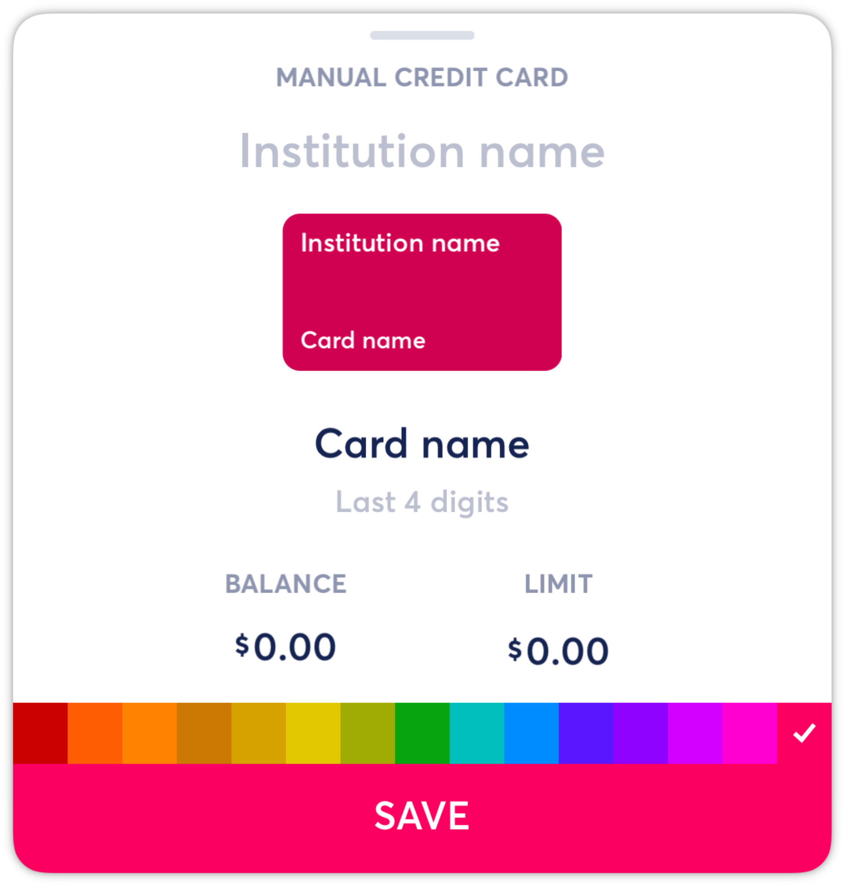

# Creating Manual Accounts

**Source:** https://help.copilot.money/en/articles/4537532-creating-manual-accounts

Copilot allows you to create manual accounts when necessary.

- In the Accounts view, tap **Add** next to the appropriate account type section. Then select **Track manually**, and then select the type of account you'd like to create.

From here, you will be prompted to customize your manual account.

- Add the institution name
- Add the card name
- Add the last 4 digits
- Enter your current balance
- For credit cards, enter your card limit
- Select the color you want associated with your manual account

Once you have created the manual account, you can always tap on the manual account in the Accounts tab to edit any details for this card, including the balance.
​
You can also create manual transactions associated with this manual account. See this article to learn more about **[Creating Manual Transactions](https://intercom.help/copilotmoney/en/articles/4038706-creating-manual-transactions)**.

Learn about how manual account balances and transactions work together in Copilot [here](https://help.copilot.money/en/articles/10682991-understanding-manual-accounts).

👋 Still have questions? Contact us via the in-app chat.

---
Related Articles[Creating Manual Transactions](https://help.copilot.money/en/articles/4038706-creating-manual-transactions)[Creating Manual Internal Transfer Payments](https://help.copilot.money/en/articles/4235839-creating-manual-internal-transfer-payments)[Hiding and Closing Accounts](https://help.copilot.money/en/articles/5031610-hiding-and-closing-accounts)[Tracking Holdings with Manual Accounts](https://help.copilot.money/en/articles/6097003-tracking-holdings-with-manual-accounts)[Understanding Manual Accounts](https://help.copilot.money/en/articles/10682991-understanding-manual-accounts)
