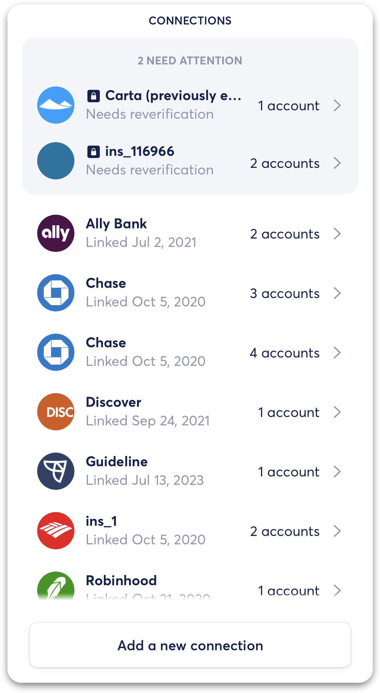
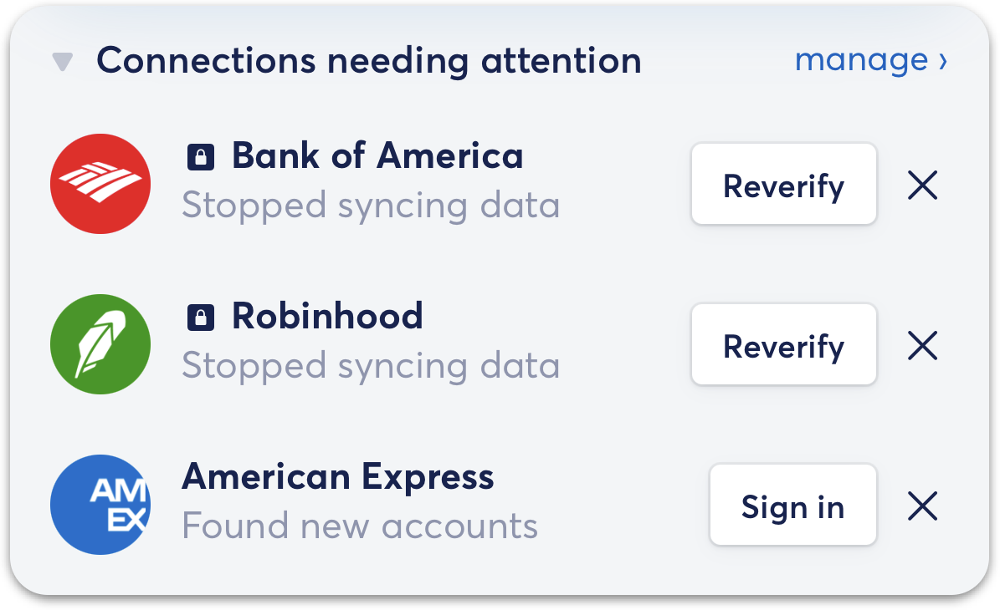
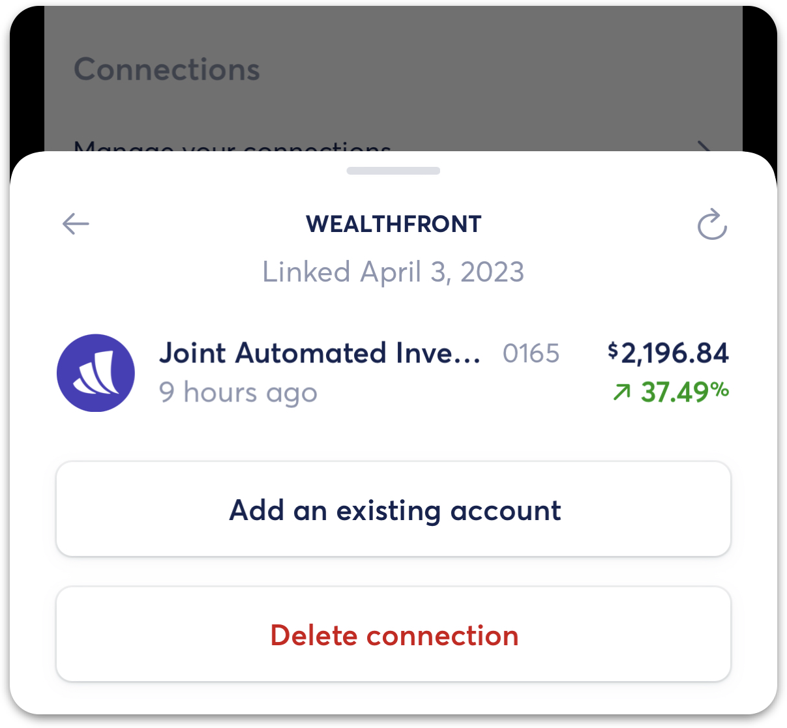
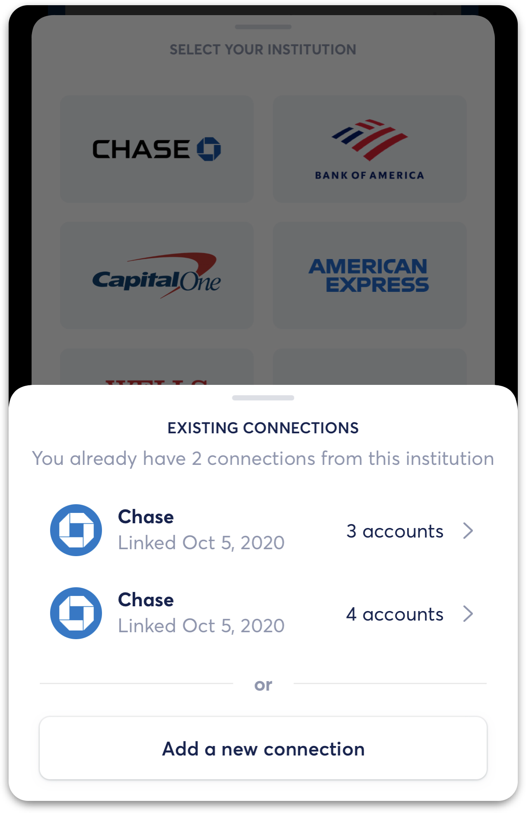
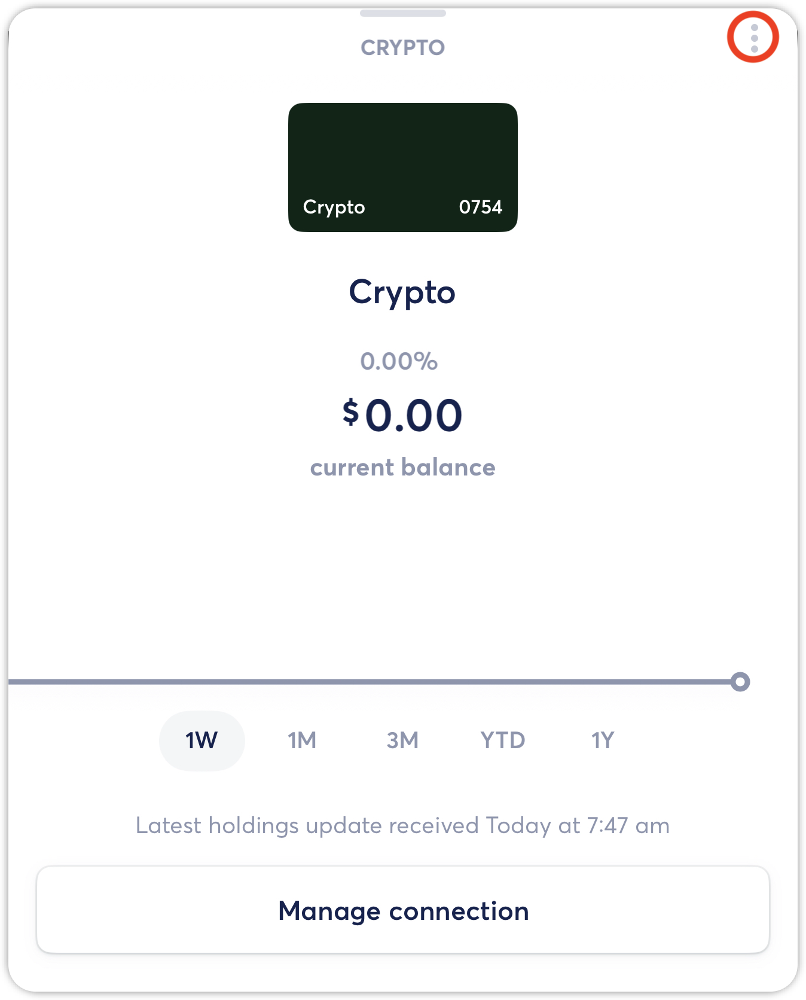
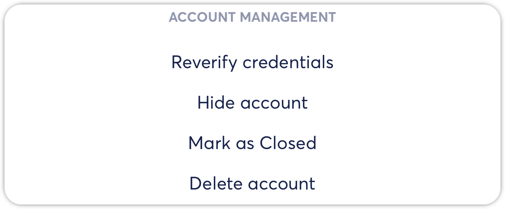
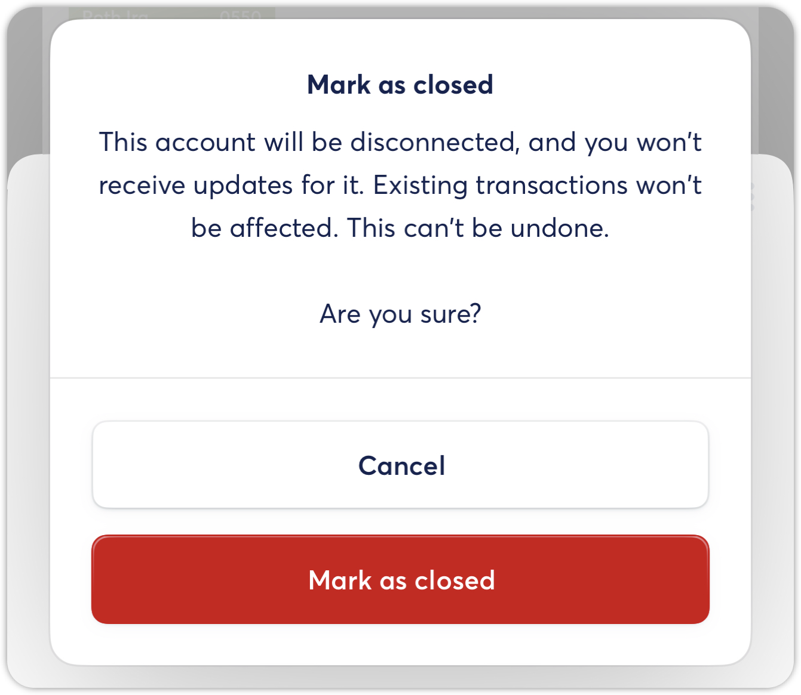
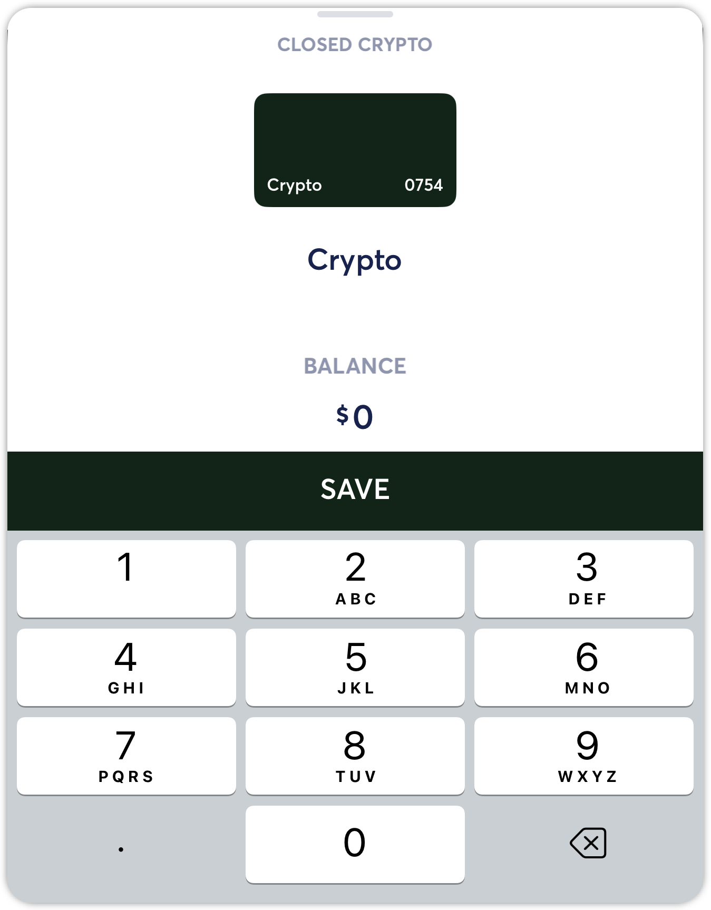
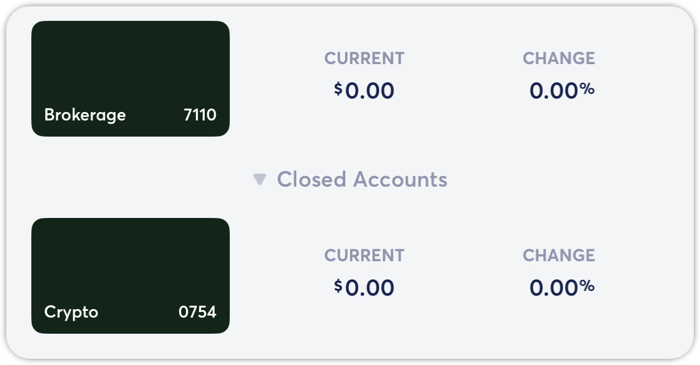

# Hiding and Closing Accounts

**Source:** https://help.copilot.money/en/articles/5031610-hiding-and-closing-accounts

Copilot's **Hide** and **Mark as Closed** features make it easy to clean up your Accounts tab without deleting accounts, allowing you to only see the most important accounts without losing any balance or transaction data.

---

# **Hide**

Using the Hide account feature will collapse the account into the Hidden Accounts section of the Accounts tab. **Hiding an account will not remove it from your Net Worth calculations or hide any of your transactions associated with the account. Additionally, hidden accounts will continue to receive transaction and balance updates.**

You can unhide accounts at any time by tapping on the Hidden Accounts section of the Accounts tab, tapping on the account, and then selecting Unhide from the account's settings.

# **Mark as Closed**

Using the Mark as Close feature disconnects a connected account from your institution, **preventing Copilot from receiving any further balance or transaction updates for the account.** **This action is not reversible.** Marking an account as closed will not remove it from your Net Worth calculations or hide any of your transactions associated with your account.

​**Examples of when to use the Mark as Closed feature:**

- You have received a new card number, and the old card number is listed as a separate account in Copilot with your historic transaction and balance data.
- You have closed an account, like paid off loan or rolled over 401k, but would like to keep all balance and/or transaction data associated with the account.

# **How to Hide an Account**

*This action is reversible. You can learn how to unhide an account below.*
​
You can hide an account by going to the Accounts tab, and then tapping on the account you want to hide.

Tap on the three dots in the top right-hand corner of the account view. In the following menu, tap **HIDE**.

After tapping this option, you will see that your account is added to the new **Hidden Accounts** section in the Accounts tab.

You can tap on **Hidden Accounts** to expand this section and see your hidden accounts.

# **How to Unhide an Account**

To unhide an account, simply tap on the account and then tap on the three dots in the top right-hand corner of the account view. You will see the option to **Unhide**.

Unhiding an account returns it to the normal list of accounts in the Accounts tab.
​

# **How to Mark an Account as Closed**

*This action is not reversible. You can use the description and guidelines in the Mark as Closed section above to confirm this action is the right choice for your account. This action will not impact your actual bank account's status or impact any of the accounts in Copilot associated with the same institution.*
​
You can Mark an Account as Closed by going to the Accounts tab, and then tapping on the account you want to Mark as Closed.

Tap on the three dots in the top right-hand corner of the account view. In the following menu, tap **Mark as Closed**.

This selection will present you with the following confirmation before proceeding.

Tap **Mark as Closed** to complete this action. After marking an account as closed, the account will be disconnected from the data aggregator and no longer receive any transaction or balance updates. The account will also be added to the**Hidden & Closed Accounts** section in the Accounts tab.
​
After marking an account as closed, you will also be able to set a final balance for the account (eg., $0). You can tap **SAVE** to confirm the ending balance.

You can tap on **Closed Accounts** to expand this section and view any closed accounts.

​
​
​

👋  **Still have questions?**Contact us via the in-app chat.

---
Related Articles[Creating Manual Accounts](https://help.copilot.money/en/articles/4537532-creating-manual-accounts)[Adding Cryptocurrency Addresses](https://help.copilot.money/en/articles/5961560-adding-cryptocurrency-addresses)[Tracking Holdings with Manual Accounts](https://help.copilot.money/en/articles/6097003-tracking-holdings-with-manual-accounts)[Accounts FAQ](https://help.copilot.money/en/articles/10261860-accounts-faq)[Understanding Manual Accounts](https://help.copilot.money/en/articles/10682991-understanding-manual-accounts)
