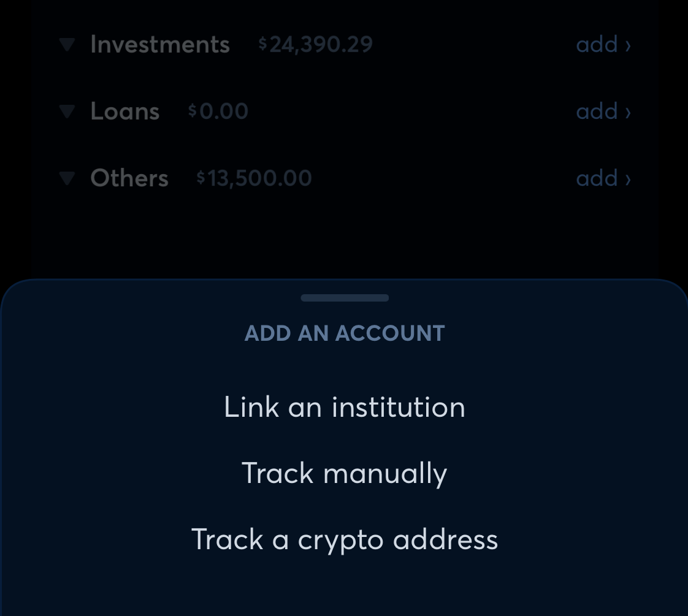
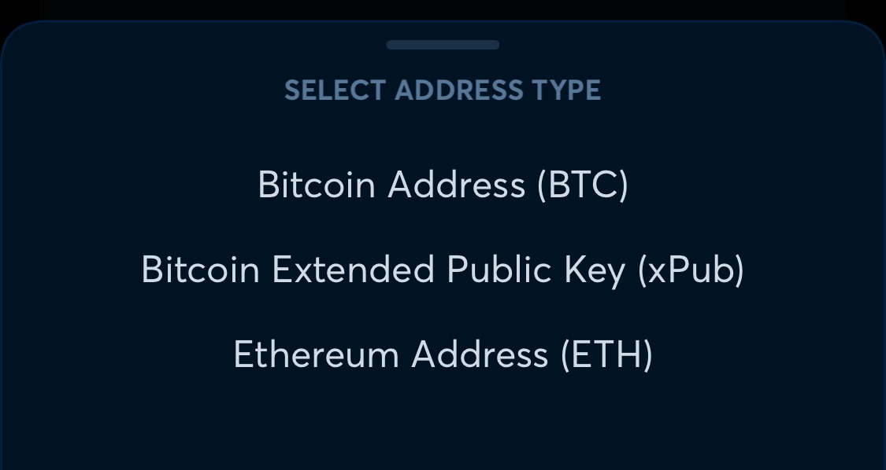
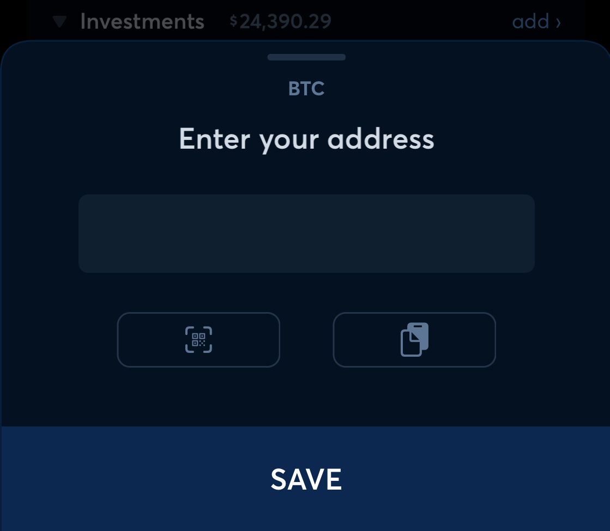
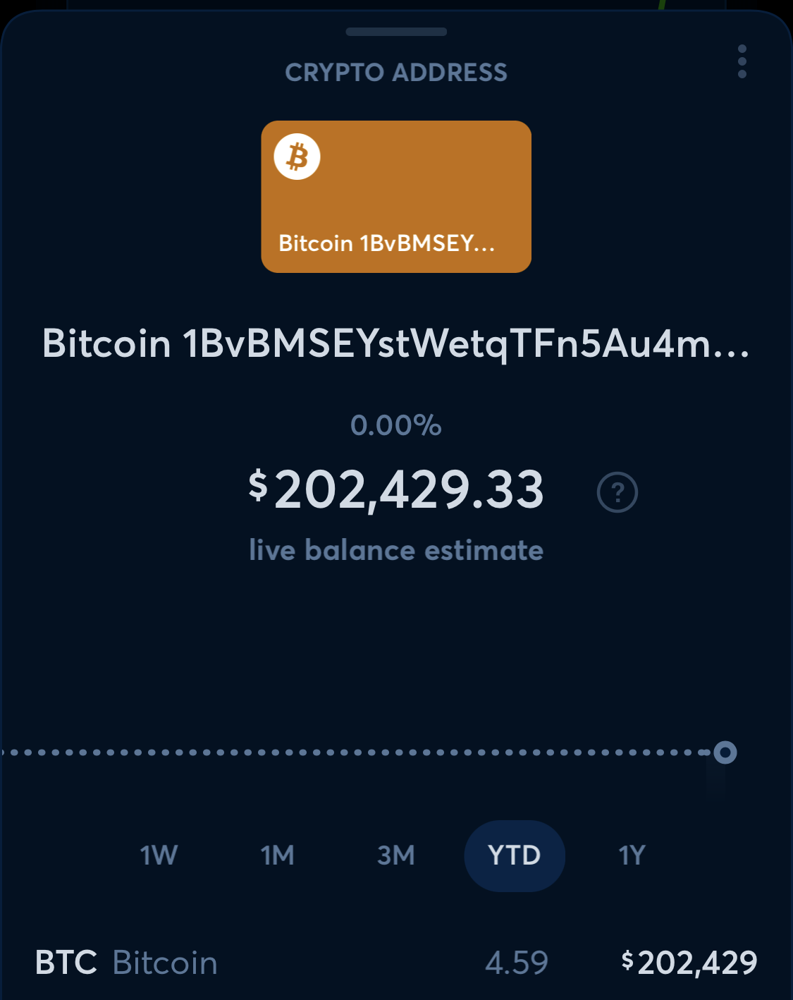
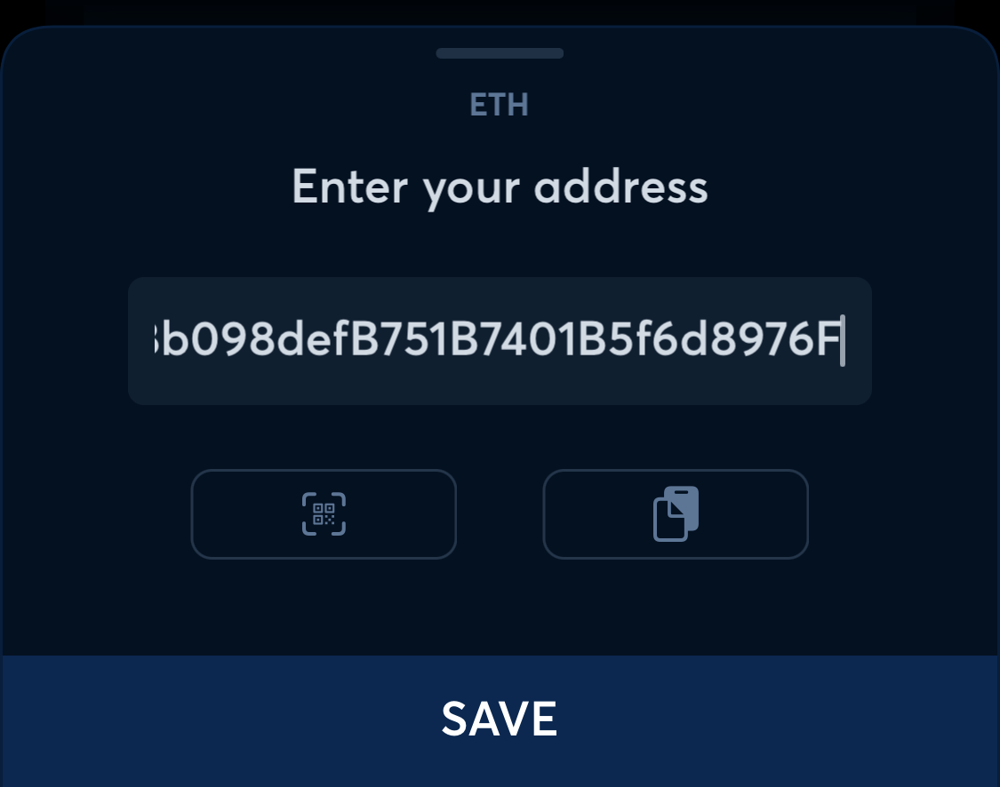
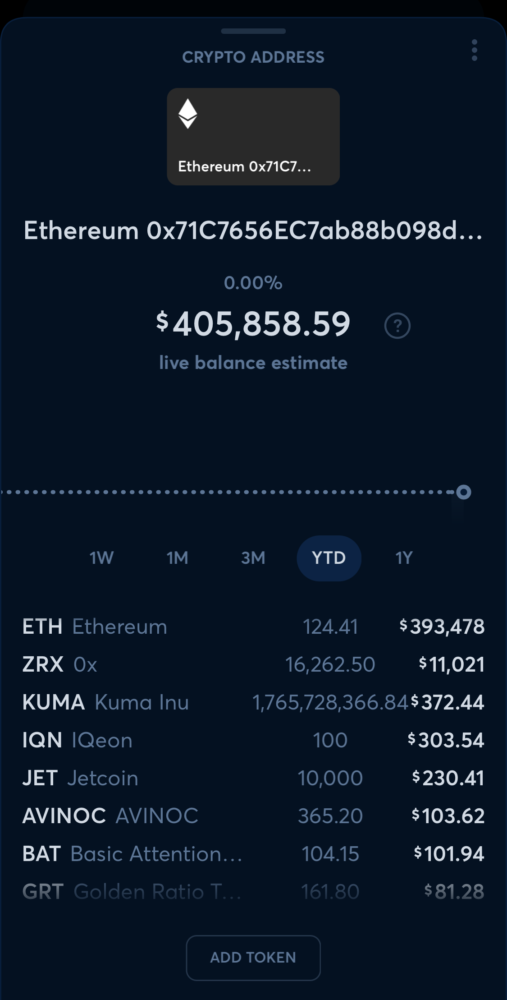
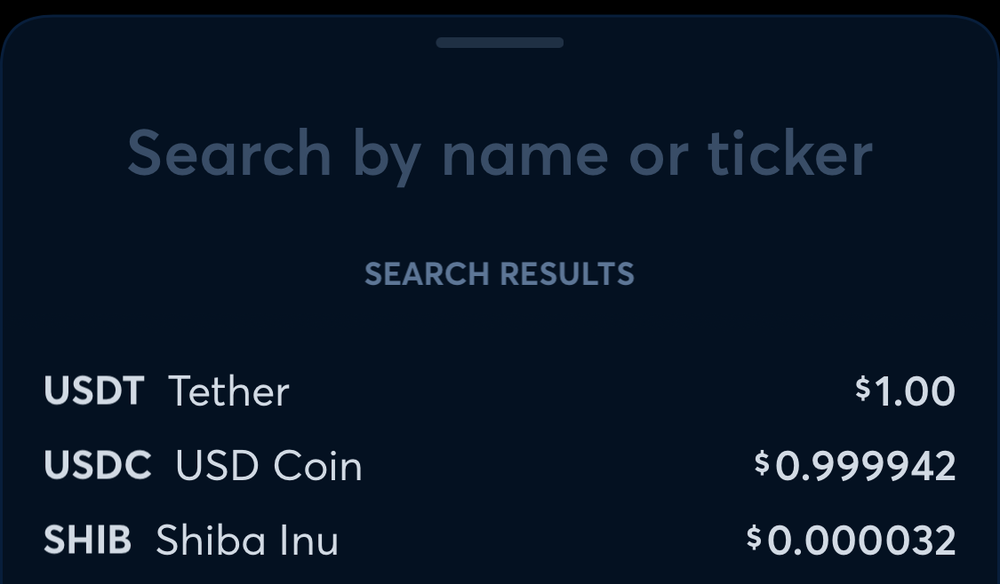

# Adding Cryptocurrency Addresses

**Source:** https://help.copilot.money/en/articles/5961560-adding-cryptocurrency-addresses

# **Adding an Address**

To add an address, first tap **add >** next to the Investments section of the Accounts tab. Then, tap **Track a crypto address**.

# **Adding a Bitcoin Address**

To add a Bitcoin address, then tap **Bitcoin (BTC).**

Tap the QR button to scan or paste your copied address to add. Then, tap **SAVE**.

You can see your Bitcoin added to Copilot for automatic tracking.
​
You can tap on the account name to edit, tap the balance to turn off live balance estimate or **[mark the account as closed](https://intercom.help/copilotmoney/en/articles/5031610-hide-and-close-accounts#h_4c15c69de6)**, **[hide it](https://intercom.help/copilotmoney/en/articles/5031610-hide-and-close-accounts#h_9294282732)**, or delete.
​

# **Adding an xPub Key**

**[Tap here to learn how to find your Bitcoin Extended Public Key](https://intercom.help/copilotmoney/en/articles/5973714-connecting-a-bitcoin-hardware-crypto-wallet)** for entry.

# **Adding an Ethereum Address**

To add an Ethereum address, then tap **Ethereum (ETH)**.

Tap the QR button to scan or paste your copied address to add. Then, tap **SAVE**.

After saving, you can tap on the account name to edit, tap the balance to turn off live balance estimate or **[mark the account as closed](https://intercom.help/copilotmoney/en/articles/5031610-hide-and-close-accounts#h_4c15c69de6)**, **[hide it](https://intercom.help/copilotmoney/en/articles/5031610-hide-and-close-accounts#h_9294282732)**, or delete.
​
You can see your Ethereum added to Copilot for automatic tracking. You will also automatically see any common coins you hold at this address. To add additional tokens for your Ethereum address, tap **ADD TOKEN**.

Search to find and add tokens.

👋  **Still have questions?**Contact us via the in-app chat.

---
Related Articles[Connecting a Bitcoin Hardware or Crypto Wallet](https://help.copilot.money/en/articles/5973714-connecting-a-bitcoin-hardware-or-crypto-wallet)[Migrating Investments Accounts](https://help.copilot.money/en/articles/6096952-migrating-investments-accounts)[Crypto Support with Copilot](https://help.copilot.money/en/articles/6162313-crypto-support-with-copilot)[Real Estate Accounts](https://help.copilot.money/en/articles/8047816-real-estate-accounts)[Adding Widgets](https://help.copilot.money/en/articles/9834331-adding-widgets)
