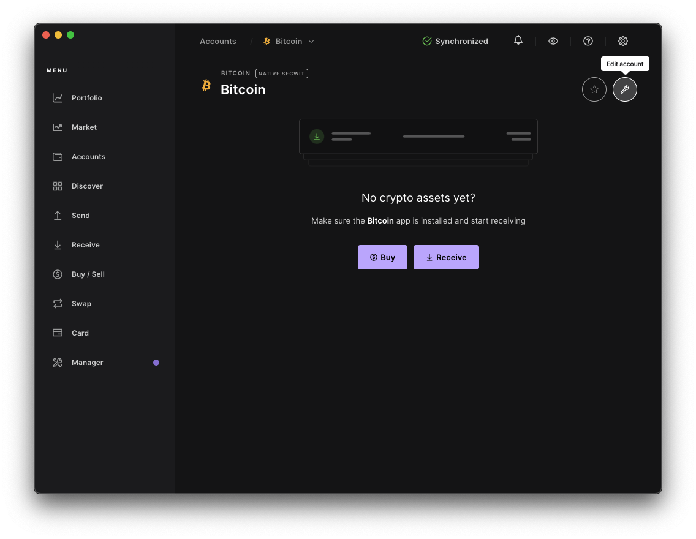
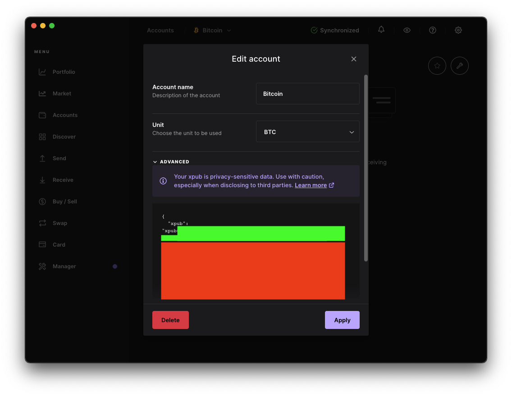
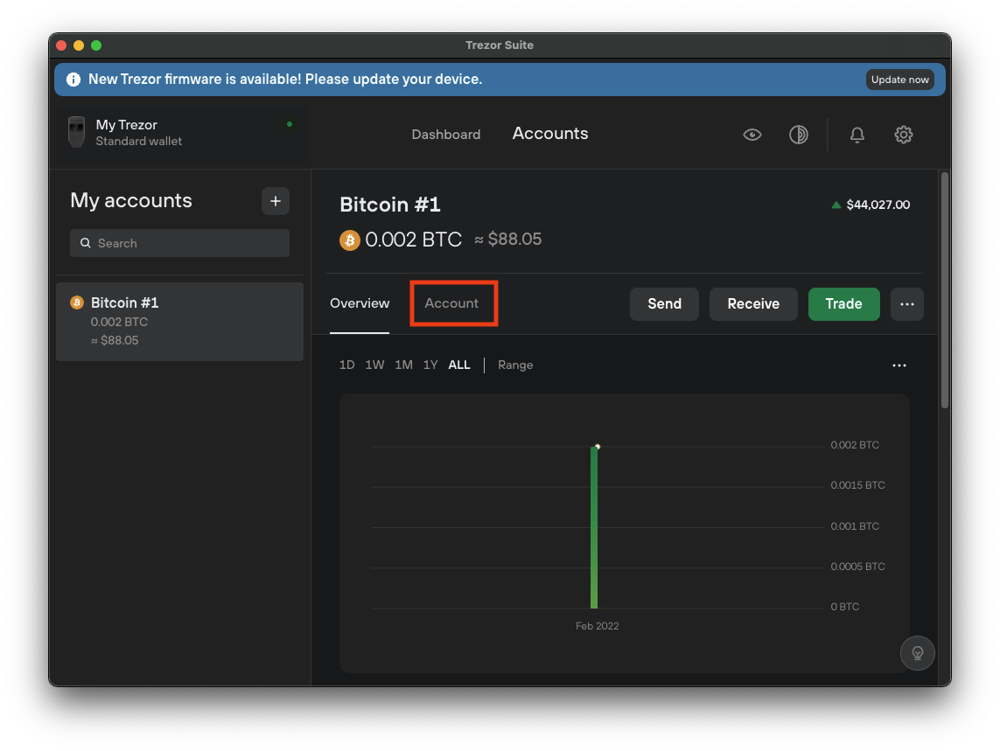
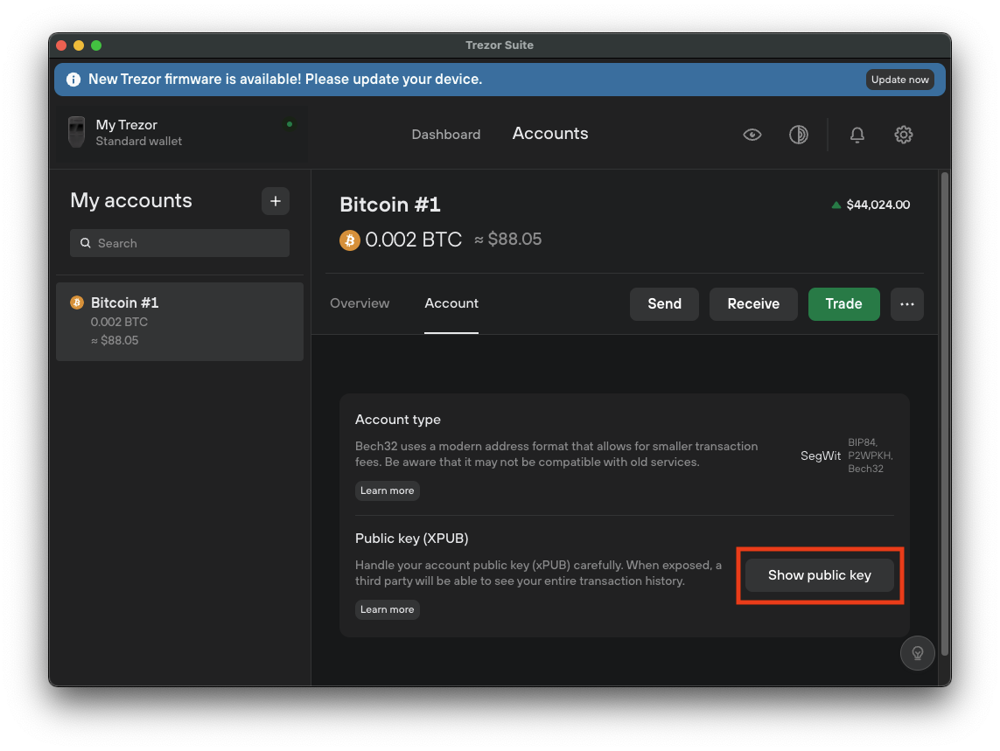
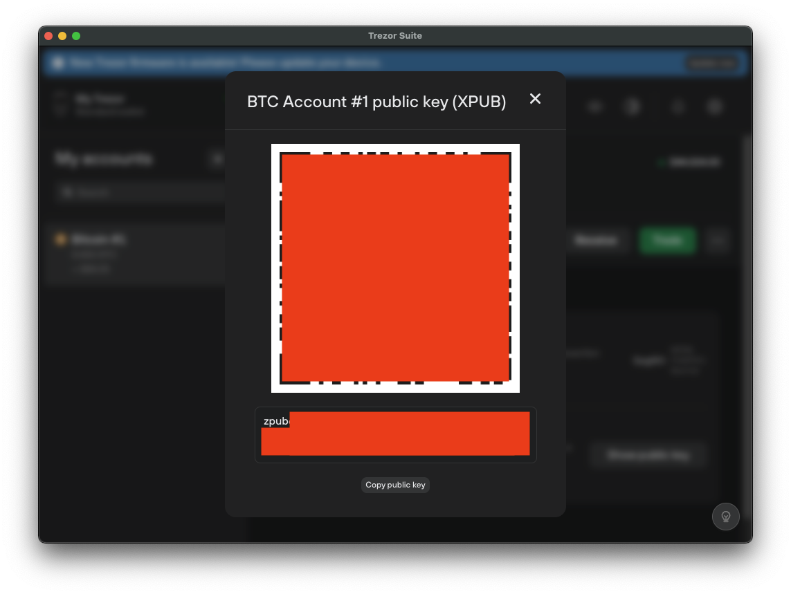

# Connecting a Bitcoin Hardware or Crypto Wallet

**Source:** https://help.copilot.money/en/articles/5973714-connecting-a-bitcoin-hardware-or-crypto-wallet

The following are guides for connecting different crypto wallets into Copilot. These instructions all result in the retrieval of a Bitcoin Extended Public Key (e.g. xpubXXX) which allows Copilot to track the addresses associated with that account.

---

# **Ledger**

To connect a Ledger hardware wallet, first connect your device to the Ledger Live app. Once you have done so, open your Bitcoin account and select Edit Account.

Inside the account's settings, open the Advanced section and copy the xpub key. It should be the long value hidden under the green box below:

Once you have copied it, add it to your Copilot app as described [here](https://intercom.help/copilotmoney/en/articles/5961560-adding-cryptocurrency-addresses), under the Bitcoin Extended Public key option, or under the Bitcoin option if Extended Public does not yet appear.

---

# **Trezor**

To connect a Trezor hardware wallet, first connect your device to the Trezor Suite app. Once you have done so, open the Bitcoin account and click on Account:

Inside the Account section, click on "Show public key":

Copy the key or scan the QR code as seen below (it may start with xpub, ypub or zpub):

Once you have copied the value, add it to your Copilot app as described [here](https://intercom.help/copilotmoney/en/articles/5961560-adding-cryptocurrency-addresses), under the Bitcoin Extended Public key option, or under the Bitcoin option if Extended Public does not yet appear.

---
Related Articles[Adding Cryptocurrency Addresses](https://help.copilot.money/en/articles/5961560-adding-cryptocurrency-addresses)[Binance.US API Key Instructions](https://help.copilot.money/en/articles/6133451-binance-us-api-key-instructions)[Bitstamp API Key Instructions](https://help.copilot.money/en/articles/6133452-bitstamp-api-key-instructions)[Gemini API Key Instructions](https://help.copilot.money/en/articles/6133456-gemini-api-key-instructions)[Crypto Support with Copilot](https://help.copilot.money/en/articles/6162313-crypto-support-with-copilot)
