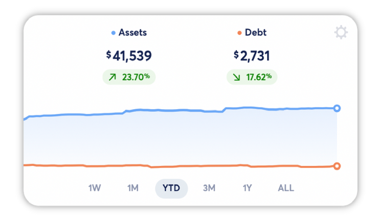
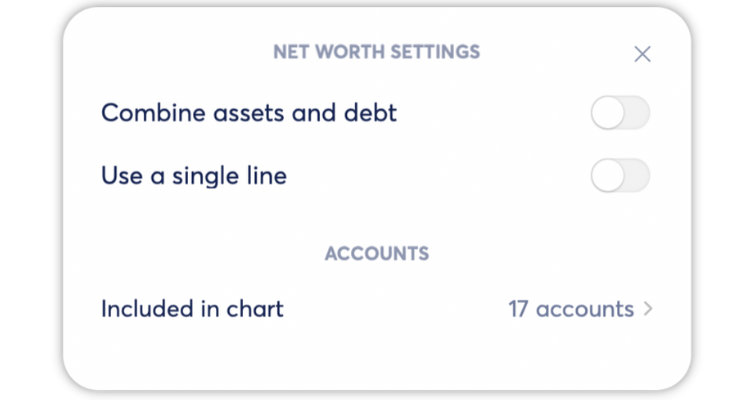

# Accounts Tab Overview

**Source:** https://help.copilot.money/en/articles/6213732-accounts-tab-overview

Copilot's Accounts tab is designed to give you a bird's eye view of all of your financial accounts, organized by account type.

If an account is incorrectly typed in the Accounts tab or if you're having any issues with a connected account, please contact us via the in-app chat for support.

---

## **Net Worth Graph**

At the top of the Accounts tab you will see a graph detailing your Net Worth. You can change the timeframe of the chart and the change value for all listed accounts by tapping on the desired timeframe.

The gear icon in the top right-hand corner of the graph lets you customize the graph. These customizations include combining your assets and debt into one value and line, or splitting the assets and debts into two values and two separate lines.

In the iOS and iPad app, tap and hold on the chart to see data points for exact dates.

In the Mac app, hover over the chart to see data points for exact dates.
​

You can also exclude select accounts from the Net Worth chart total. Excluding accounts here does not exclude them from the Account type totals below the chart.

## Connections Needing Attention

Under the Net Worth chart is a section titled Connections Needing Attention.
​
​**If a connection requires re-verification,** you'll see the Institution's name and "stopped syncing data" below. You can tap the Reverify button to the left to re-enter your credentials and confirm permission to continue seeing updates.

**If a connection has new accounts available to add,** you'll see the Institution's name and "found new accounts" below. You can tap the Reverify button to the left to re-enter your credentials and to give sharing permission for additional accounts.
​
If you choose to tap the **X** option instead, the notification will be cleared and visible under **manage >** (in the iOS app) or **view connections >** (in the Mac and iPad app). You can also access connections management under **Connections** in the **Settings**section. Check out our article on **[Adding and Managing Connected Accounts](https://help.copilot.money/en/articles/5593601-adding-and-managing-connected-accounts)** here.
​
​**Please note:** Connections that require re-verification will not update until reverified. If you have any issues with this process, please contact our team via the in-app chat.
​

## **Credit Cards**

The Credit Cards section of your Accounts tab contains all of your credit card accounts. At the top of this section you will always see a combined balance for all of your credit card accounts. These accounts count towards your Debt total in the Net Worth chart.

To the right of each account you can view the current balance of the account, and the credit utilization with a color coded indicator. Credit utilization at or below 33% will show a green dot next to the credit utilization number.

**Want to create a new connection or add a new account to an existing connection?** Check out our article on **[Adding Connected Accounts](https://help.copilot.money/en/articles/5593601-adding-connected-accounts)** here.

## **Depository**

The Depository section of your Accounts tab contains all of your depository accounts. At the top of this section you will always see a combined balance for all of your depository accounts. These accounts count towards your Asset total in the Net Worth chart.

To the right of each account you will see the account’s balance as well as a percentage change in that account’s balance. This percentage change is linked to the time frame selected in the Net Worth graph at the top of this tab.

**Want to create a new connection or add a new account to an existing connection?** Check out our article on **[Adding Connected Accounts](https://help.copilot.money/en/articles/5593601-adding-connected-accounts)** here.

## **Investments**

The Investments section of your Accounts tab contains all of your investment accounts. At the top of this section you will always see a combined balance for all of your investment accounts. These accounts count towards your Asset total in the Net Worth chart.

To the right of each account you will see the account’s balance as well as a percentage change in that account’s balance. This percentage change is linked to the time frame selected in the Net Worth graph at the top of this tab.

**Want to create a new connection or add a new account to an existing connection?** Check out our article on **Adding Connected Accounts** here.

## **Loans**

The Loans section of your Accounts tab contains all of your loan accounts. At the top of this section you will see a combined balance for all of your loan accounts. These accounts count towards your Debt total in the Net Worth chart.
​
To the right of each account you will see the account’s balance as well as a percentage change in that account’s balance. This percentage change is linked to the time frame selected in the Net Worth graph at the top of this tab.

**Want to create a new connection or add a new account to an existing connection?** Check out our article on **[Adding Connected Accounts](https://help.copilot.money/en/articles/5593601-adding-connected-accounts)** here.

## **Other**

The Other section of the Accounts tab collects all of your accounts that don’t fit into the categories listed above. Copilot automatically creates a manual cash account after onboarding, and that account is visible in this section.

To the right of each account you will see the account’s balance as well as a percentage change in that account’s balance. This percentage change is linked to the time frame selected in the Net Worth graph at the top of this tab.

**Want to create a new connection or add a new account to an existing connection?** Check out our article on **[Adding Connected Accounts](https://help.copilot.money/en/articles/5593601-adding-connected-accounts)** here.

👋 **Still have questions?**Contact us via the in-app chat.

---
Related Articles[Investments Tab Overview](https://help.copilot.money/en/articles/5377645-investments-tab-overview)[Dashboard Tab Overview](https://help.copilot.money/en/articles/6045480-dashboard-tab-overview)[Categories Tab Overview](https://help.copilot.money/en/articles/9504513-categories-tab-overview)[Cash Flow Tab Overview](https://help.copilot.money/en/articles/9682232-cash-flow-tab-overview)[Accounts FAQ](https://help.copilot.money/en/articles/10261860-accounts-faq)
