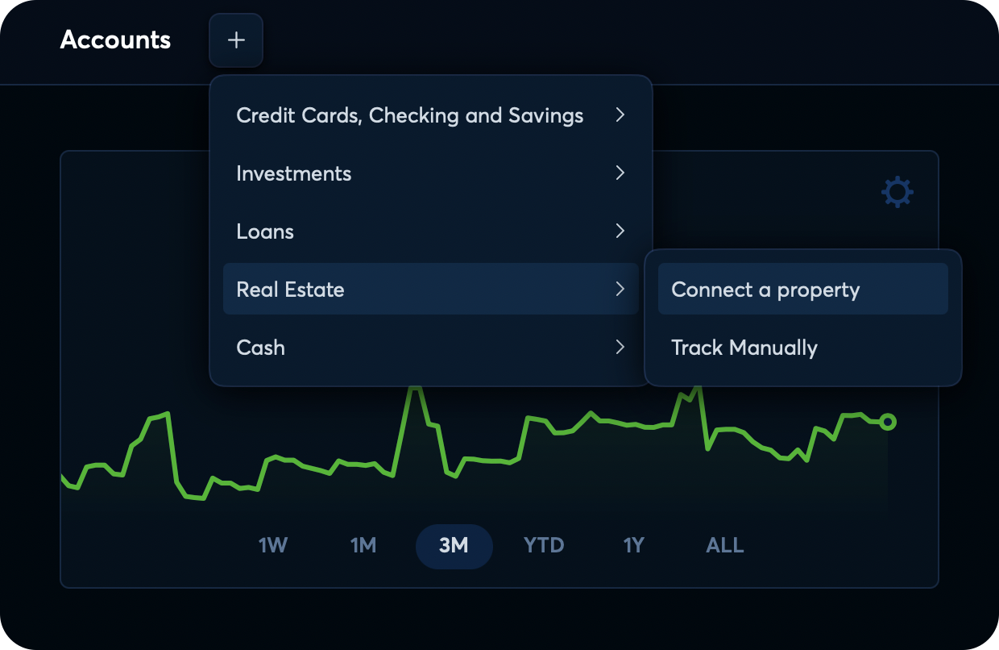
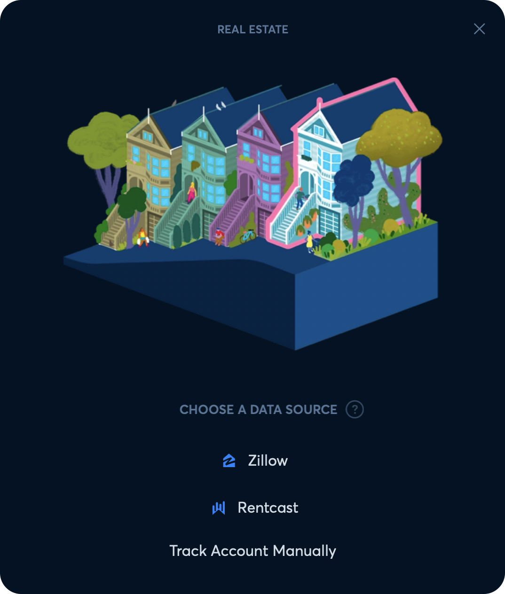
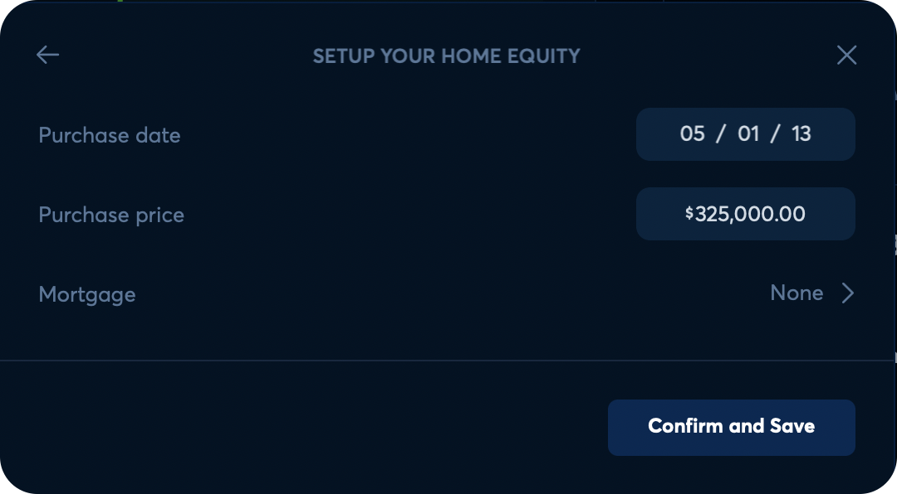
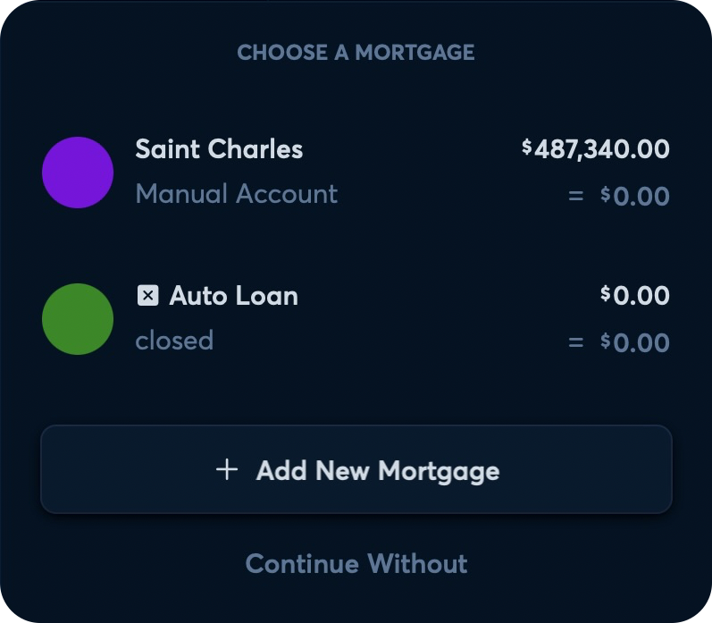
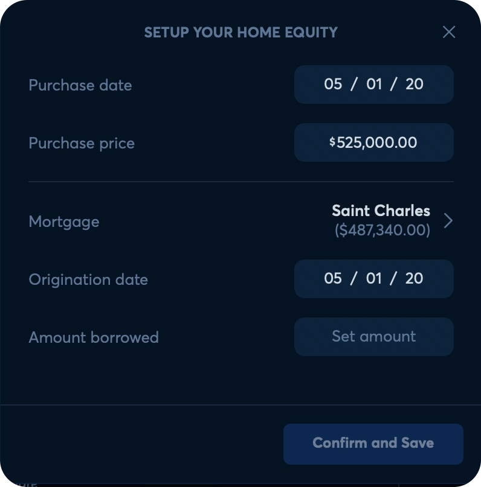
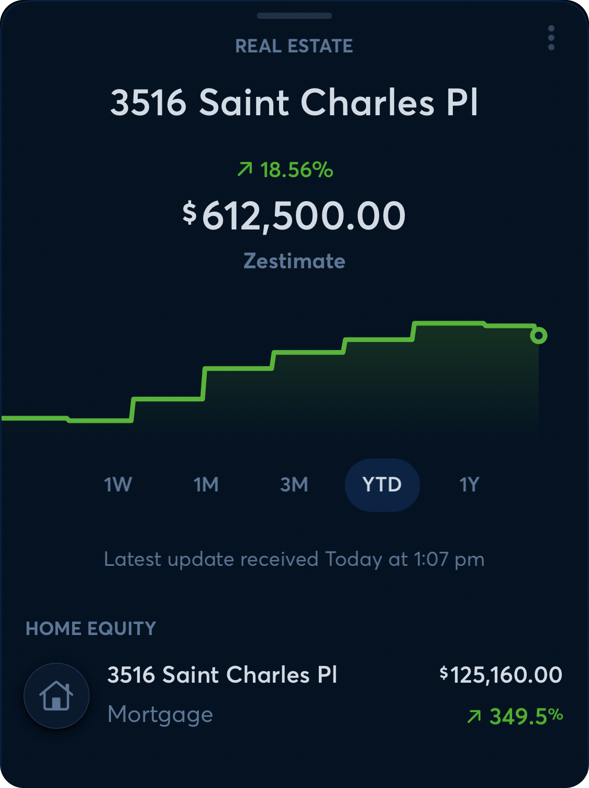
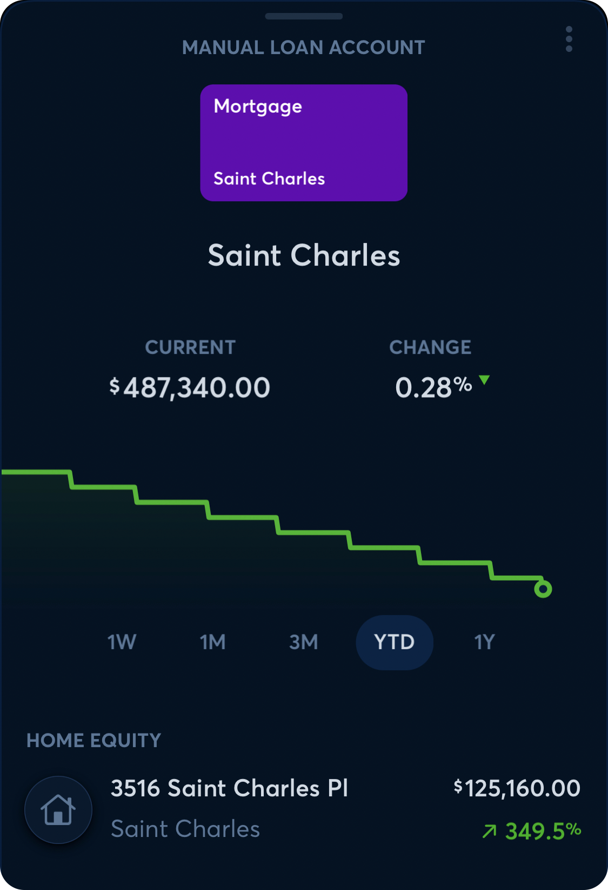
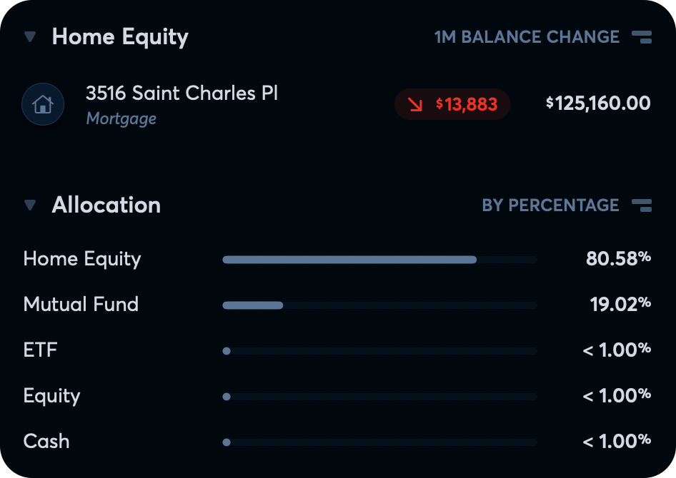

# Real Estate Accounts

**Source:** https://help.copilot.money/en/articles/8047816-real-estate-accounts

With Copilot, you can add owned properties to track estimated value and connect a mortgage account for a home equity value (property estimate - mortgage balance = home equity).

---

# Adding Property in Copilot

To add property in Copilot, tap **add** in the Real Estate section at bottom of the Accounts tab in the iOS app or tap the **+** located at the top of the Accounts tab in the Mac and iPad app.

After selecting **Connect a property**, you'll be presented with the option to select one of three data sources for tracking.

---

# Zillow, Rentcast, and Manual Tracking

## Zillow

Our [Zillow](https://zillow.com) integration will allow you to enter a Zillow property URL to see the listed Zestimate for your property in Copilot. **On connection, the Zillow integration will provide historic real estate valuation data, as available on the Zillow listing.**Your Zillow value will be updated once a month, typically at the beginning of each month.

## Rentcast

Our [Rentcast](https://www.rentcast.io/) integration uses the following information in the account creation step to provide three estimates for you to choose from (low, mid, high):

- Property address
- Type of property
- Number of bedrooms
- Number of bathrooms
- Square footage - *not mandatory, but estimates will likely be more accurate if this value is provided*

After linking your property with Rentcast, you'll have the option to choose between a low, mid, high, or manual estimate. You can change the displayed estimate to a different tier at any time. **Please note that the Rentcast integration does not provide historic real estate valuation data on connection.**

## Manually

Just like any account type with Copilot, you can choose to create a fully manual real estate account. After creating the account, you can add data points by updating the balance as frequently as you'd like.

After selecting a method for tracking and completing the data source specific information, you can enter the purchase price, purchase date, and connect a mortgage to see your home equity.

---

# Linking a Mortgage to a Property

You can link a mortgage to a property at any time. The first opportunity to link a mortgage account is while linking your property in Copilot.

Tap **None >** to link a Mortgage. Then, select the related mortgage from your existing loan accounts, or tap **+ Add New Mortgage** to create a manual mortgage account or link a mortgage account via Plaid.

After selecting a mortgage account to link to your property, enter your origination date (date mortgage takes affect) and the amount borrowed on that date.

---

# Viewing Your Home Equity

After connecting a property and linking the mortgage account, you'll be able to view a home equity by tapping either the Real Estate account or linked Mortgage account in the Accounts tab.

Real Estate accounts are considered investment accounts, so home equity will be visible on the Investments tab under Home Equity and as part of the investment allocation.

👋 **Still have questions?**Contact us via the in-app chat.

---
Related Articles[Adding Cryptocurrency Addresses](https://help.copilot.money/en/articles/5961560-adding-cryptocurrency-addresses)[Migrating Investments Accounts](https://help.copilot.money/en/articles/6096952-migrating-investments-accounts)[Understanding Manual Accounts](https://help.copilot.money/en/articles/10682991-understanding-manual-accounts)[Account Management FAQ](https://help.copilot.money/en/articles/10684135-account-management-faq)[Quick Start Guide](https://help.copilot.money/en/articles/11157550-quick-start-guide)
