# Cash Flow Tab Overview

**Source:** https://help.copilot.money/en/articles/9682232-cash-flow-tab-overview

Copilot's Cash Flow tab is designed to give you a quick look at how you're doing in three important areas — income, spending, and net income. In this tab, you can compare your progress across various time frames and get down to category and transaction level details.

**Please Note:**Cash Flow is available on iPhones running iOS 16 or higher, iPads running iPadOS 16 or higher, and Macs running macOS 13 or higher.

---

**In the Mac app,** hover over any of the charts to see each range's value and specific comparison data, and tap to see category and/or transaction level details for the selected bar's range.

**In the iPad app,** you can tap on any of the charts to see the same set of details.
[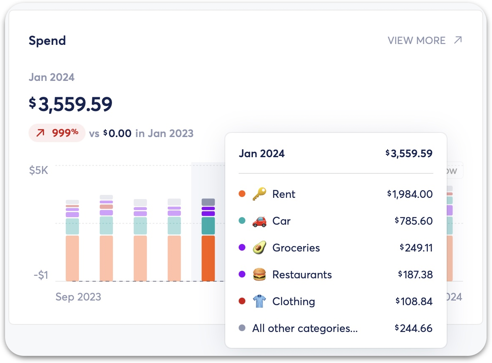](https://downloads.intercomcdn.com/i/o/1154010289/0f203319e96436fb962c2d02/image.png?expires=1773322200&signature=cd18a3fcc941aae03921731ef69d126645e47779eb5595a64d2cf54a4ff5115b&req=dSEiEsl%2FnYNXUPMW1HO4zRLSPUuGmhYrq8RjsquVj36BYSsonXnvzkk9qY6c%0AyYSsw0mAGi%2Bs4%2FL%2BedM%3D%0A)
**In the iOS app,**you can tap on any of the bars in the charts to see the range's value and specific comparison data. Double tap to see category and transaction level details.
[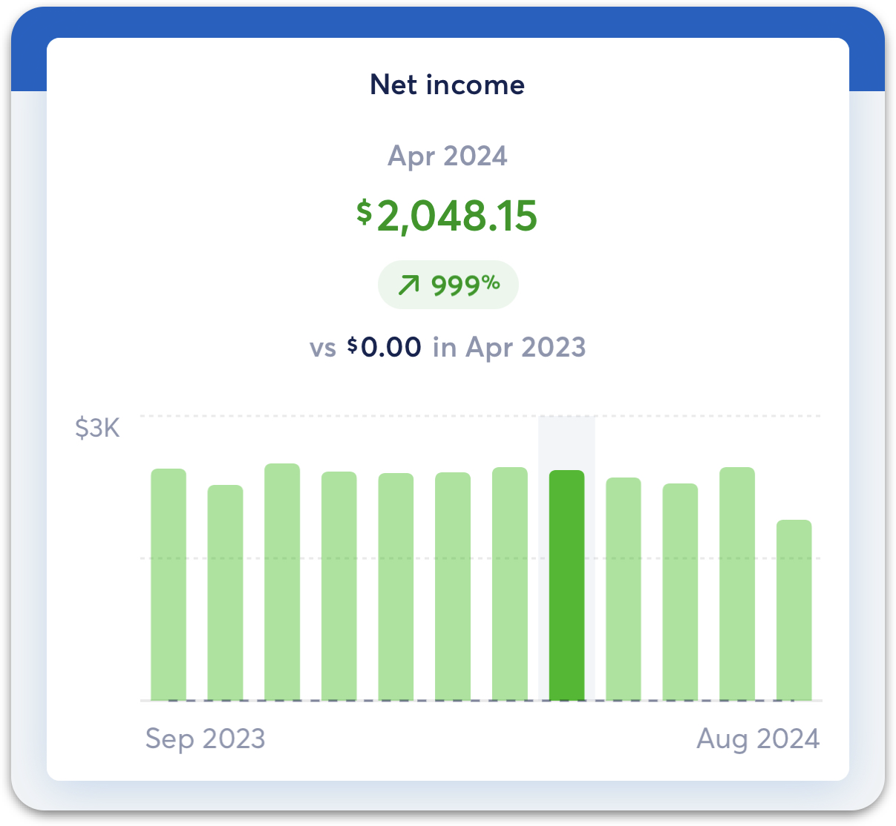](https://downloads.intercomcdn.com/i/o/1154016711/094de77bf5bdf63d400f5f9b/image.png?expires=1773322200&signature=a8ad54e0875023f09de6617c990a15d9fb7d6020a48d1c7b64358ce5d3c22cfe&req=dSEiEsl%2Fm4ZeWPMW1HO4zXL9ThopUVRo6VIhZLWzOmcVpVefiA4bGo%2BRP%2BiF%0A3Kr6qt9xjCTCbJImuJU%3D%0A)
# Net Income

Net income is defined as your income minus spend for the selected period. You can tap on a bar in the chart or select "View More" in the top right of the card to see **[Key Metrics](https://help.copilot.money/en/articles/6918427-understanding-key-metrics-for-spending)**and your income and spending totals per month.
[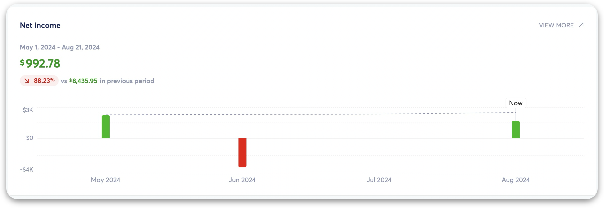](https://downloads.intercomcdn.com/i/o/1154010883/946f49243df0052aa7e567eb/image.png?expires=1773322200&signature=3d2a91750fd6bfef55dbee997d986175cbd8a2133bc447b0a131ff731e20be55&req=dSEiEsl%2FnYlXWvMW1HO4zSsLmWD4paCD52IKHwUMYOYp%2Bmb0r7hQ5yRbjalB%0AVGhvsbuM5%2FfqEHsplIU%3D%0A)
# Spending

The spending card shows a chart of all spending in a stacked bar chart, with each region of the bar representing a category. You can tap on a bar in the chart or select "View More" in the top right of the card to see **[Key Metrics](https://help.copilot.money/en/articles/6918427-understanding-key-metrics-for-spending)** and a category breakdown of your spend, **[including a new section for Excluded Transactions](https://help.copilot.money/en/articles/9718801-excluded-transactions)**.
[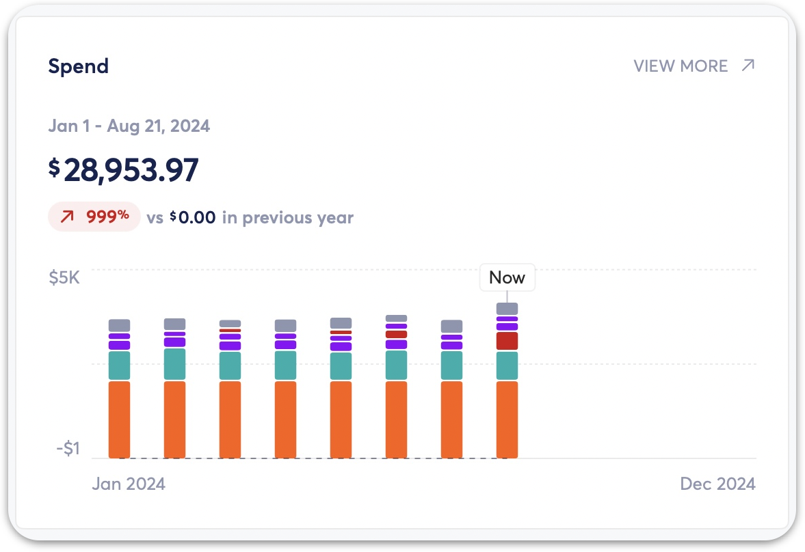](https://downloads.intercomcdn.com/i/o/1154011190/d3b2a10ca1726f5e490e6b84/image.png?expires=1773322200&signature=7a73f84ee8ce8ec3158c75ff985c379fe2f54dde00a19c98dae1a7b2471b2de4&req=dSEiEsl%2FnIBWWfMW1HO4zYmsyQ3VuMtcnlfm7iCnke8kh%2B96Q12DB5u48Cw6%0AiYFZOsE9F%2FdotrjR2A4%3D%0A)[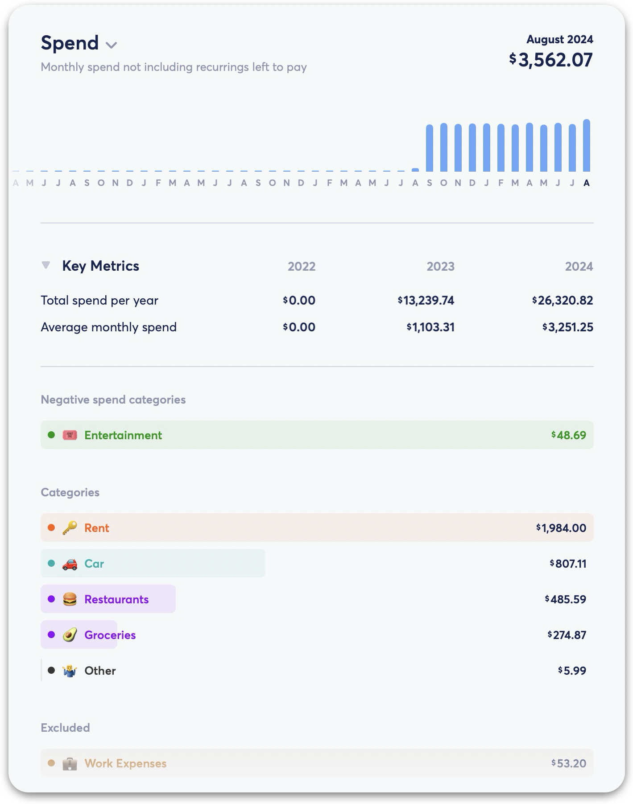](https://downloads.intercomcdn.com/i/o/1154010703/5ba22c7747c40ef4f6807edb/image.png?expires=1773322200&signature=3da1d23a6bd8b6fe63fd01a7dfb96f5b765bfaf4350a8675e2c40c3ff8562593&req=dSEiEsl%2FnYZfWvMW1HO4zQw1HjquvGmJY1f%2BFTRSkk84b2tS5qFd2x3kHxTX%0AH3MGYrGa8TgxU8uymJQ%3D%0A)
# Income

The income card shows a chart of all income transactions. Money you earn is considered income. These transactions aren’t included in your spending budgets. **[Learn more about Copilot's transaction types.](https://help.copilot.money/en/articles/3971267-transaction-types)**

You can tap on a bar in the chart or select "View More" in the top right of the card to see **[Key Metrics](https://help.copilot.money/en/articles/6918427-understanding-key-metrics-for-spending)** and all income transactions.
[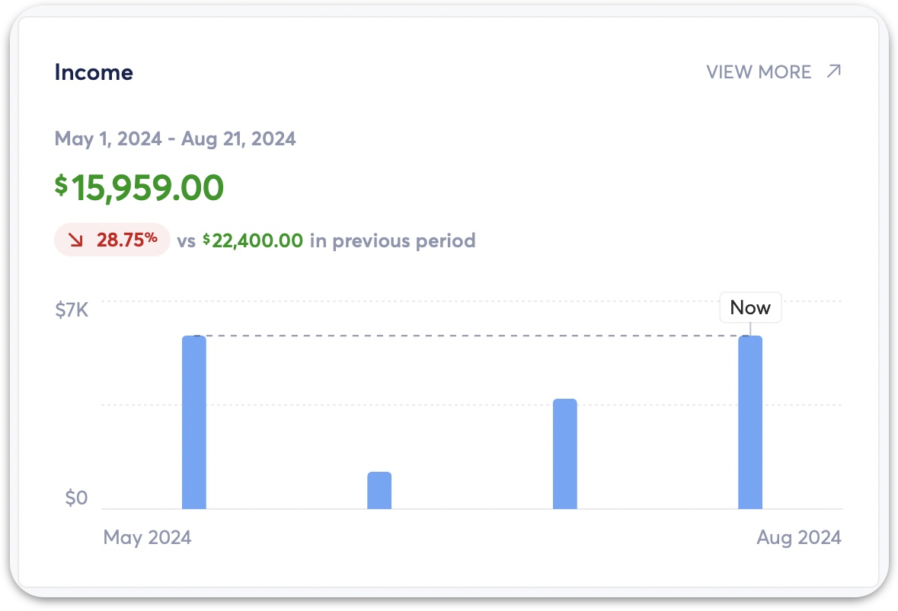](https://downloads.intercomcdn.com/i/o/1154010993/8bee0895099e656bc82dff56/image.png?expires=1773322200&signature=ab4c3457eb33fd6f64e2ed16aae199d9160b653775e2bf458f7d2b06cf53f87c&req=dSEiEsl%2FnYhWWvMW1HO4zdKu7NceAgnz7oDKOe2Px2IzgVeAoE1K3j2SV2OJ%0A1dBnwp2n4zyWkiYSvro%3D%0A)
# Date Ranges

In the Cash flow tab, you can filter by the following ranges:

- **Year-to-date:** January 1st to "today", not including any unpaid recurrings or future dated transactions.
- **Month-to-date:** First of the current month to "today", not including any unpaid Recurrings or future transactions.
- **Last 12 months**
- **Last 3 months**
- **Last 4 weeks**

**Something to keep in mind is that Cash Flow only looks at what happened up until today**, and doesn't take into account any unpaid Recurrings or future transactions like the Categories tab. Because of this, the spending totals seen in the Cash Flow tab may be different than the Categories tab.

**In the Mac and iPad app,** you can switch between ranges using the bar at the top.
​
[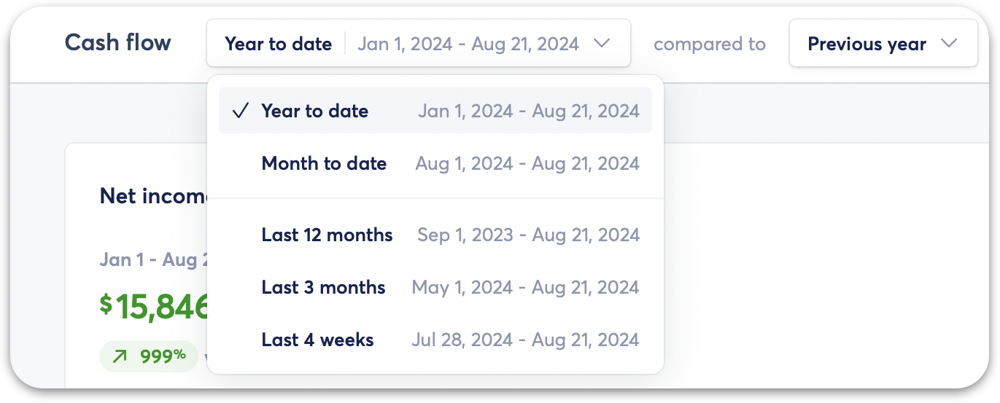](https://downloads.intercomcdn.com/i/o/1154011543/5d0e2765fdfbf565b8960bb2/image.png?expires=1773322200&signature=120468947a9ad94fee460c6d14a9428c331e485e276fd96abdae0b39b6109de7&req=dSEiEsl%2FnIRbWvMW1HO4zeV1DiTDwhaUwSJFjs3IZxgvZKwdWDkxzU1HAA4Z%0AsMM6zNobxFpJpns2L5I%3D%0A)
**In the iOS app,** you can switch between ranges using the bar at the bottom.
[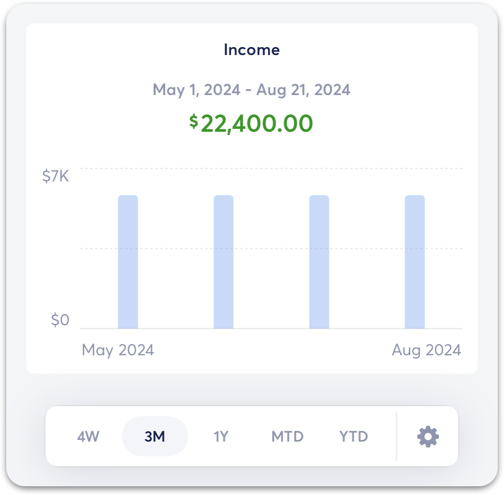](https://downloads.intercomcdn.com/i/o/1154017311/b937a86410a36dfedc48c92f/image.png?expires=1773322200&signature=68b3532cd7ad8253885721abff2577a6c2f09ade99f8b28cb46bcb035e60c1b0&req=dSEiEsl%2FmoJeWPMW1HO4zetWhRgLzZ35O2ru3f0SPoq4ojpVZyYkuoYgfV2%2F%0Aq7Y2oZwWQ0%2BKU%2BKjg8E%3D%0A)
# Comparisons

The comparison setting enables you to see a comparison of a selected date range with the same previous range. For example, you can compare the last four weeks to the four weeks before that.

The dotted line charts the previous period against the current period.
[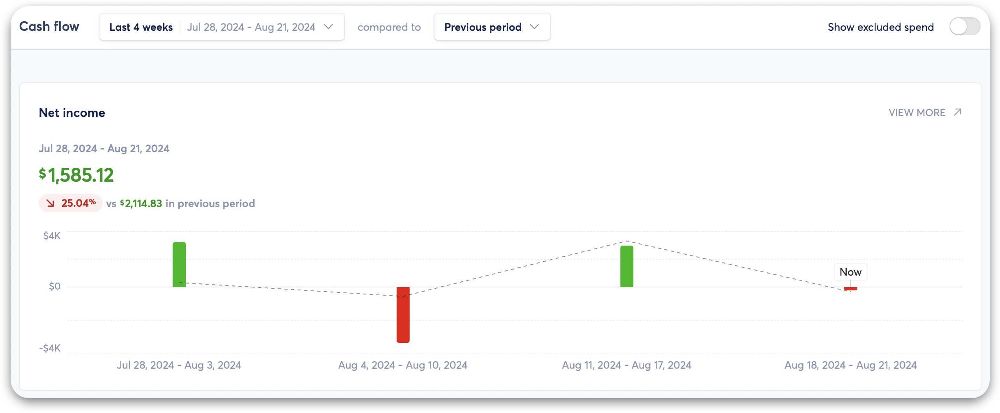](https://downloads.intercomcdn.com/i/o/1154010491/798c5ee9120d84b721466df8/image.png?expires=1773322200&signature=dda28a6c369ef72790769c886c052ed6626ffee12eb4b6988840a4c273880164&req=dSEiEsl%2FnYVWWPMW1HO4zccocsPWd5i6J1gYez9DaAmZWkvxlAApChrg%2BSmm%0As%2BBqH5%2Bn2W8pR0Tirwc%3D%0A)
​**In the Mac and iPad app,** you can hide comparison data using the bar at the top.
[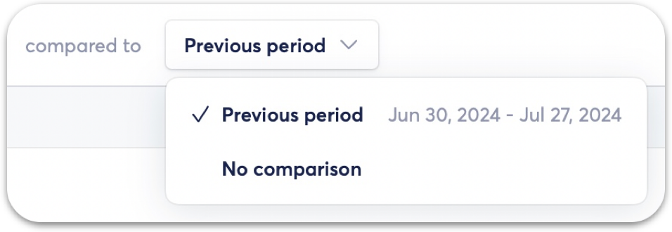](https://downloads.intercomcdn.com/i/o/1154011426/1647e7f27f1fdf362f1f8f81/image.png?expires=1773322200&signature=ce12f6fdf97ad63cf83b6542d1c997713746be57e4b53676eb5a907def5f1d70&req=dSEiEsl%2FnIVdX%2FMW1HO4zV4iS5XgJZZEGhsjbwa8PQzGEA4TbRCVcSvjVg9A%0AIx%2BXxQKB%2FnFdGu9D%2FcI%3D%0A)
**In the iOS app,** you can hide comparison data by tapping the gear icon on bottom bar.
[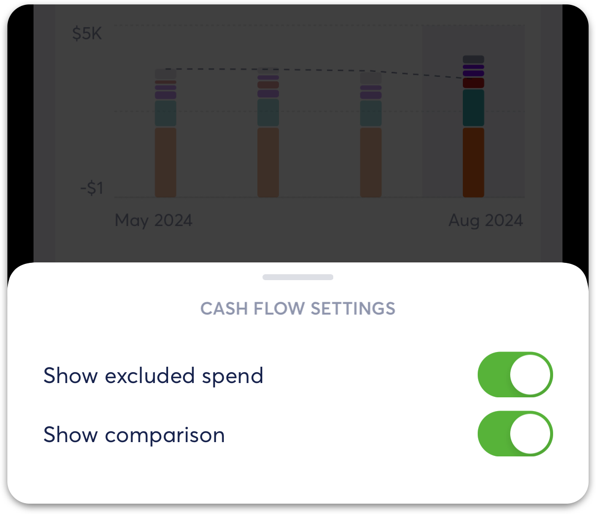](https://downloads.intercomcdn.com/i/o/1154017096/28d634319dffd1d9f5ce9ab6/image.png?expires=1773322200&signature=2f8290030e9c5a4a1eac2f5476e2cd2bce3bf7449c6fdc4a5104b053caabe158&req=dSEiEsl%2FmoFWX%2FMW1HO4zaXXFiu4TMyZarBALOILJ96R%2F6c3AegJQZ8jPiJJ%0AZT5DJ1n6Ws3gCt5jYrg%3D%0A)
**Note:** If the Month-to-date range is selected, the previous month comparison will be the same range as the month-to-date currently. For example, if it is July 24th, then the month-to-date comparison of the previous month will be June 1st to 24th.

# Excluded Spend

In the Cash Flow tab, you have the ability to include your excluded transactions in your total spend amount for a better view of your actual spend for cash flow purposes. With excluded spend included, excluded spend will also be included in the Net this month card on the Dashboard tab.
[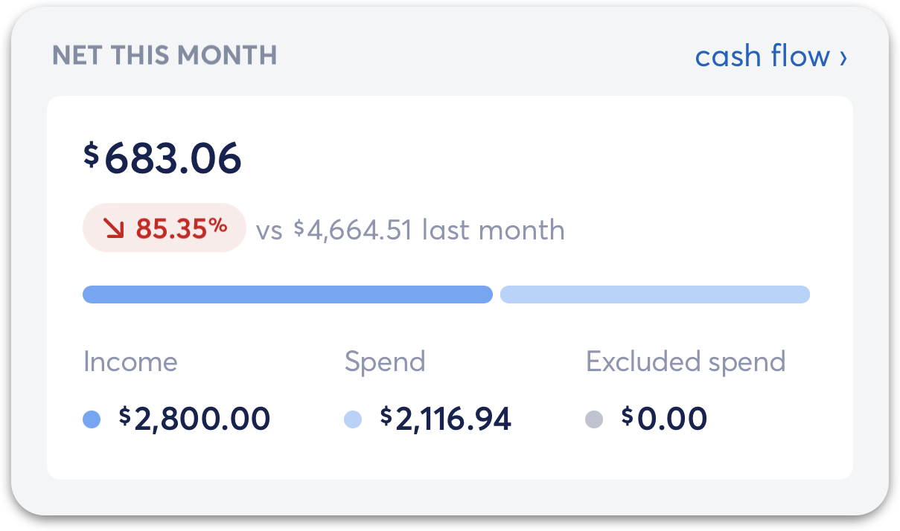](https://downloads.intercomcdn.com/i/o/1154888981/c978a6eeeb8025cb95f31a7f/image.png?expires=1773322200&signature=5174521236007160ba552410bd6d87a39c29c48b943c2b50f07f2abbfede4991&req=dSEiEsF2lYhXWPMW1HO4zYHMVGA5oO7hAECaB8tJrVQlIiMD8H5gQViQV%2Bd6%0A%2B342CRDfXtu2vL1pyr8%3D%0A)
**In the Mac and iPad app,** you can toggle on the "show excluded spend" option in the top right corner. **In the iOS app,** you can access this setting by tapping on the gear icon in the bottom left of the Cash Flow tab.**[Learn more about how excluded transactions work in Copilot](https://help.copilot.money/en/articles/9718801-excluded-transactions)**.

👋 **Still have questions?**Contact us via the in-app chat.

---
Related Articles[Dashboard Tab Overview](https://help.copilot.money/en/articles/6045480-dashboard-tab-overview)[Categories Tab Overview](https://help.copilot.money/en/articles/9504513-categories-tab-overview)[Excluding Transactions](https://help.copilot.money/en/articles/9718801-excluding-transactions)[Quick Start Guide](https://help.copilot.money/en/articles/11157550-quick-start-guide)[Savings Goal Tab Overview](https://help.copilot.money/en/articles/11470324-savings-goal-tab-overview)
