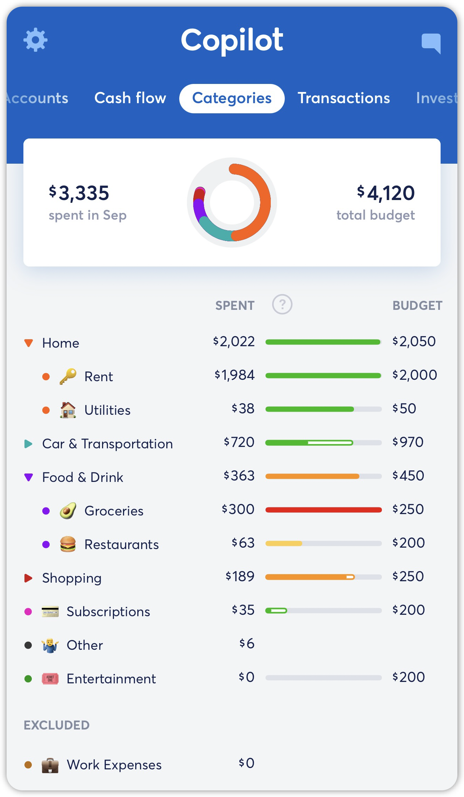

# Categories FAQ

**Source:** https://help.copilot.money/en/articles/10216528-categories-faq

## Why can’t I delete the ‘other’ category?

The "Other" category is the only category that cannot be deleted, but you can rename it to anything you like. This category is used for transactions that aren’t automatically categorized based on the initial data we get from the data aggregator (for example, Plaid) or don’t have an existing transaction name rule.
​
If you do not want to allocate monthly spend to the "Other" category, then you can set the budget to $0.

## Can I categorize my internal transfers?

We do not support categorizing internal transfer transactions. If you’d like to categorize this transaction, you will need to change the transaction type to ‘Regular.’ Internal transfers don’t count toward your monthly spend. However, you can use the [Tags](https://intercom.help/copilotmoney/en/articles/9554342-tags) feature to track these transactions.

## How can I categorize my income?

We don’t support income categories at this time, but you can use the tag feature to keep track of your different types of income.

## How can I edit the category name?

You can edit a category name by tapping on the category, then tap on the existing category name, then you should be prompted to edit the name. Then tap SAVE to confirm the change.

## What is the difference between an unfilled and filled in bar in my Categories?

The category bar will appear ‘unfilled’  if there's expected spending from an unpaid Recurring. A solid bar means the money has already been spent.
​

## Why do some of my categories show a spending/budget bar, while others don’t?

This is because the category is set to have the '**same budget for all months**' and the budget for the category has been set to **$0**. Since there is technically no budget for this category, it does not show a spending/budget bar, as there is no budget to compare the spending to.

👋 **Still have questions?** Contact us via the in-app chat.

---
Related Articles[Groups of Categories](https://help.copilot.money/en/articles/3767655-groups-of-categories)[Categories Tab Overview](https://help.copilot.money/en/articles/9504513-categories-tab-overview)[Dashboard FAQ](https://help.copilot.money/en/articles/10238054-dashboard-faq)[Category Tips & Tricks](https://help.copilot.money/en/articles/10684301-category-tips-tricks)[Transactions FAQ](https://help.copilot.money/en/articles/10761907-transactions-faq)
