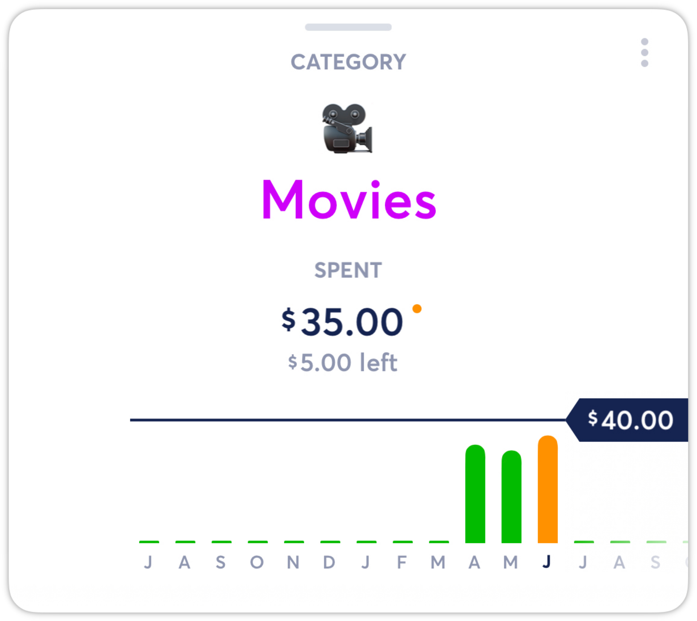
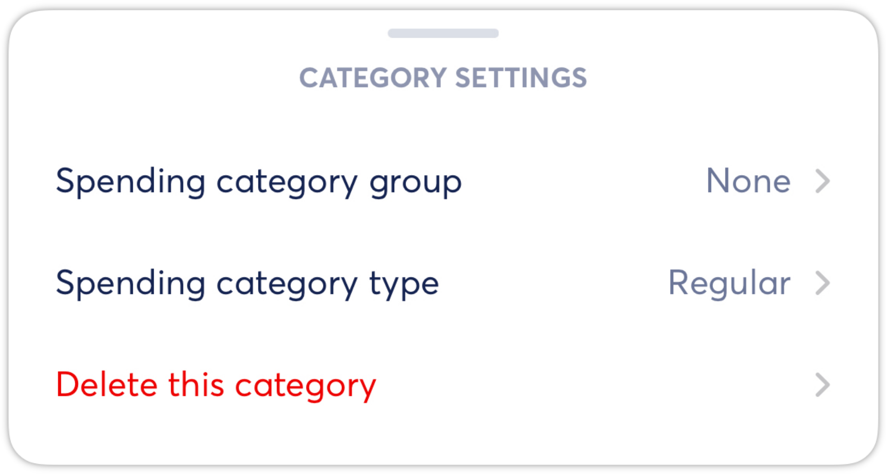
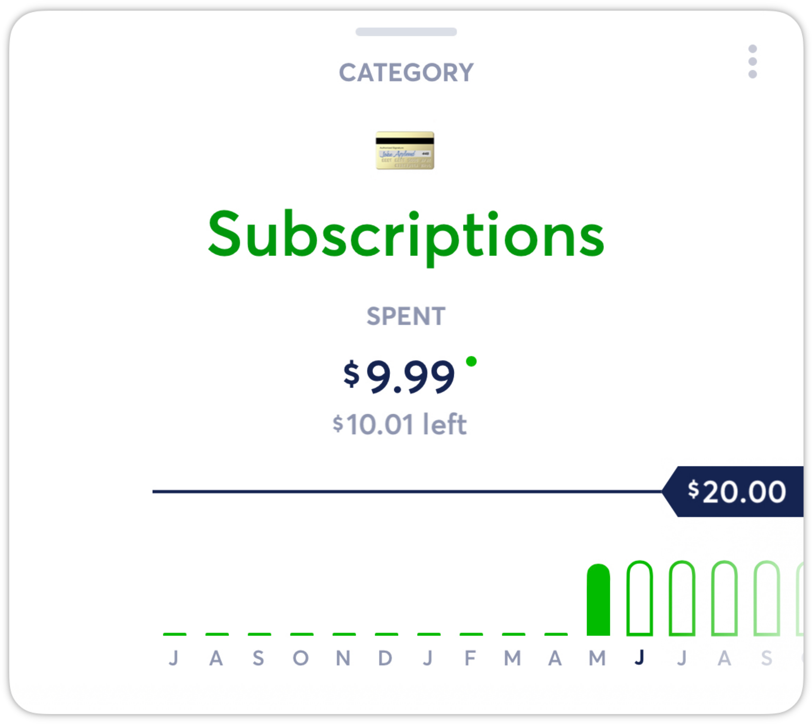
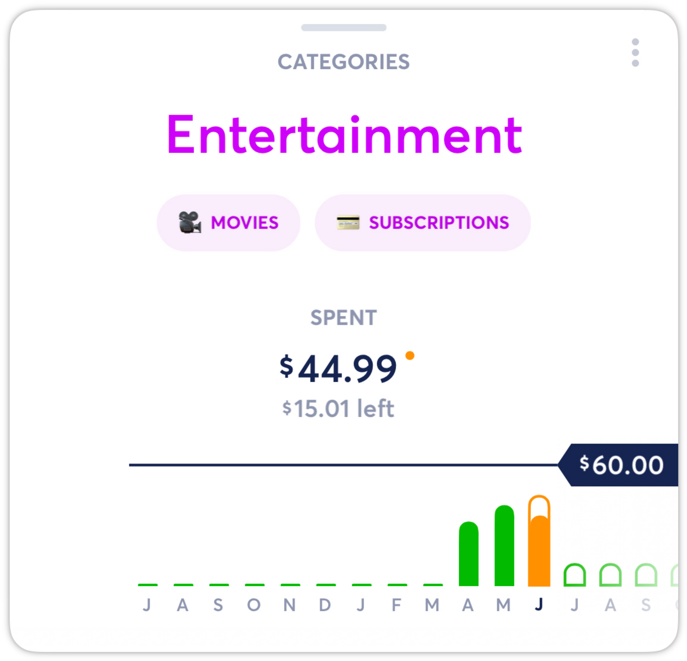
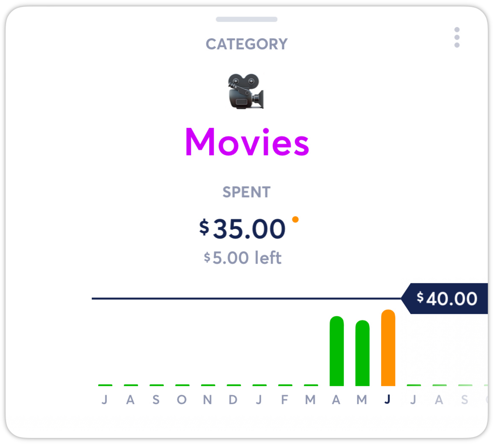
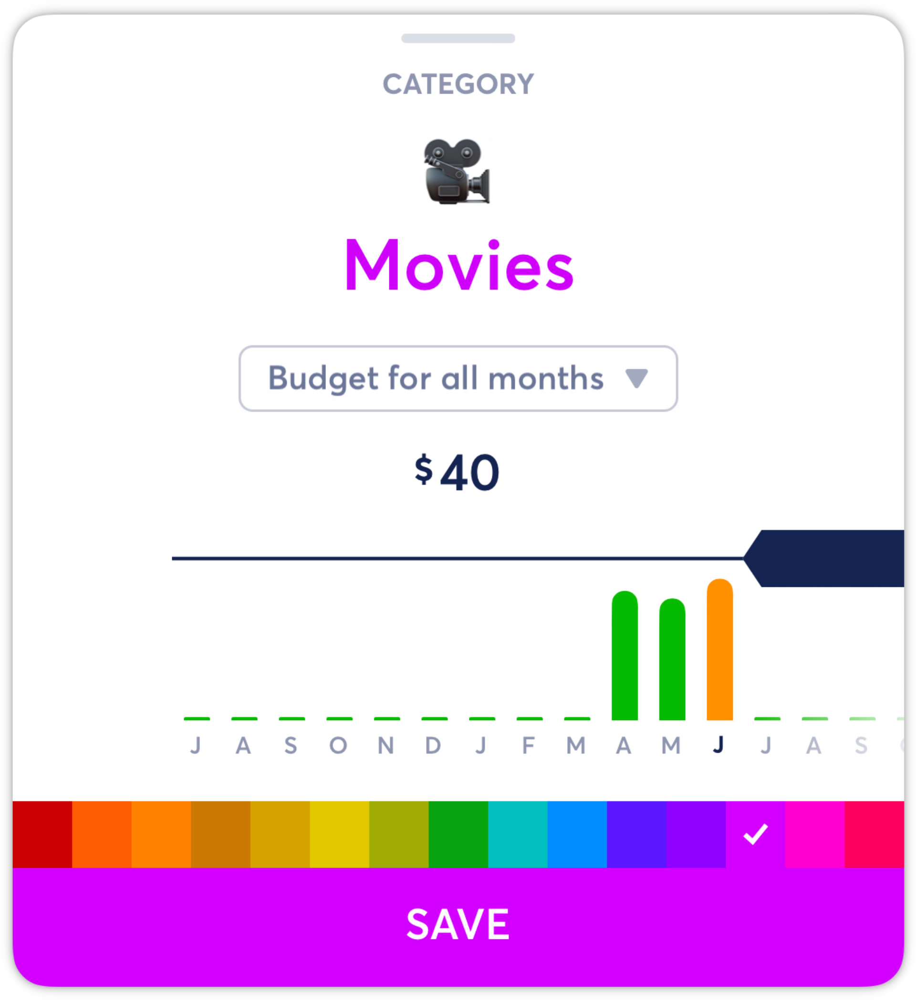
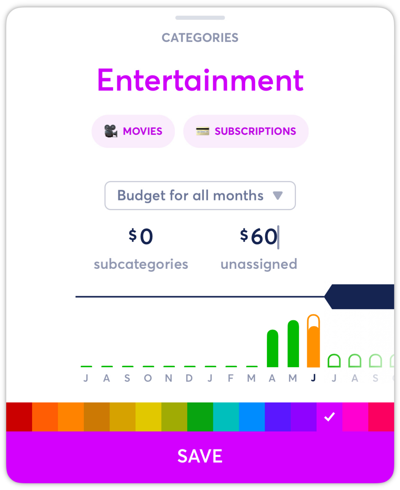
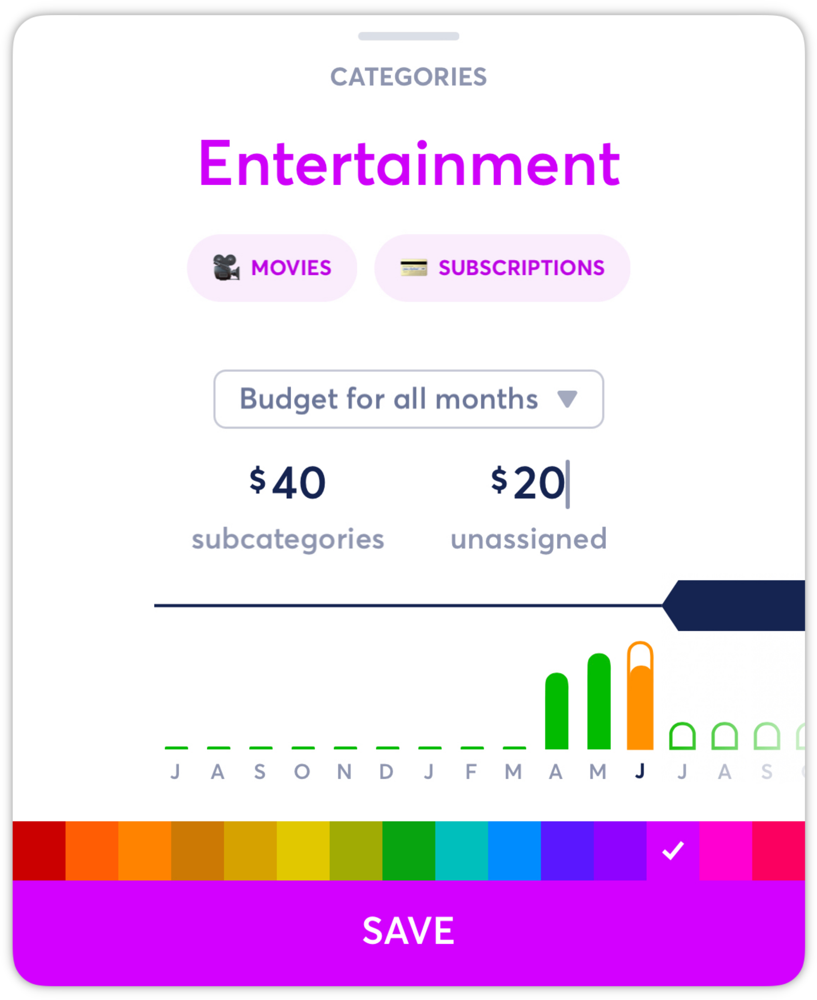
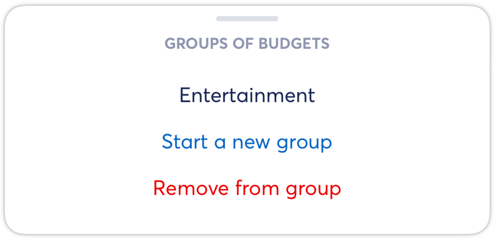

# Groups of Categories

**Source:** https://help.copilot.money/en/articles/3767655-groups-of-categories

Copilot allows you to group categories together to better organize your spending.

---

# Create a Group of Categories:

- From the **Categories** tab, select an existing category, then tap the menu button at the top right.

- From the **Category Settings** menu, select the **Spending category group** option.

- In the **Groups of Budgets** menu you can select an existing group or **Start a new group.**

- Select **Start a new group**and enter the name. You can also enter an **Unassigned Budget** for the group. Set an unassigned budget if you do not want to set a budget for each subcategory or if you want to add budget for subcategory overages.

*Example: Create the Group “Food” with categories “Groceries” and “Restaurants”, and set the Group unassigned budget to $500 rather than $250 for Groceries and $250 for Restaurants. This is useful if your monthly spend fluctuates due to cooking vs. dining out more often.*

- Save and then select another category to add to the group.

- Open the menu on the top right and select **Spending category group** again and choose your recently created group name.

- Then on the **Categories** tab, you will see the new group which you can expand or select to see the group budget and subcategories.

# Edit Group Budgets:

- From the **Categories** tab, select an existing **Group**.

- To edit a subcategory budget, select the individual category.

- Then, tap or slide the budget bar to adjust the budget.

- To edit a group **Unassigned Budget**, either tap on the group name or slide the budget bar to adjust the subcategory and/or unassigned budgets.

- Set an**Unassigned Budget** if you do not want to set a budget for each subcategory or if you want to add budget for subcategory overages.

- In the **Groups of Categories** view, you will see the new group budget.

# Remove a Single Category from a Group:

- From the **Categories** tab, select an existing category, and then open the menu on the top right, then select **Spending category group** at the bottom of the view.
- In the **Groups of Budgets**menu, select **Remove from group.**

# Ungroup a Set of Categories:

- From the **Categories** tab, select an existing group and from the menu on the top right select **Ungroup these categories** at the bottom of the view.
- **Confirm Ungrouping** or close the view to cancel.

👋 Still have questions? Contact us via the in-app chat.

---
Related Articles[Categories Tab Overview](https://help.copilot.money/en/articles/9504513-categories-tab-overview)[Other Category](https://help.copilot.money/en/articles/9829368-other-category)[Categories FAQ](https://help.copilot.money/en/articles/10216528-categories-faq)[Category Tips & Tricks](https://help.copilot.money/en/articles/10684301-category-tips-tricks)[Separating Business and Personal Spending](https://help.copilot.money/en/articles/10760959-separating-business-and-personal-spending)
