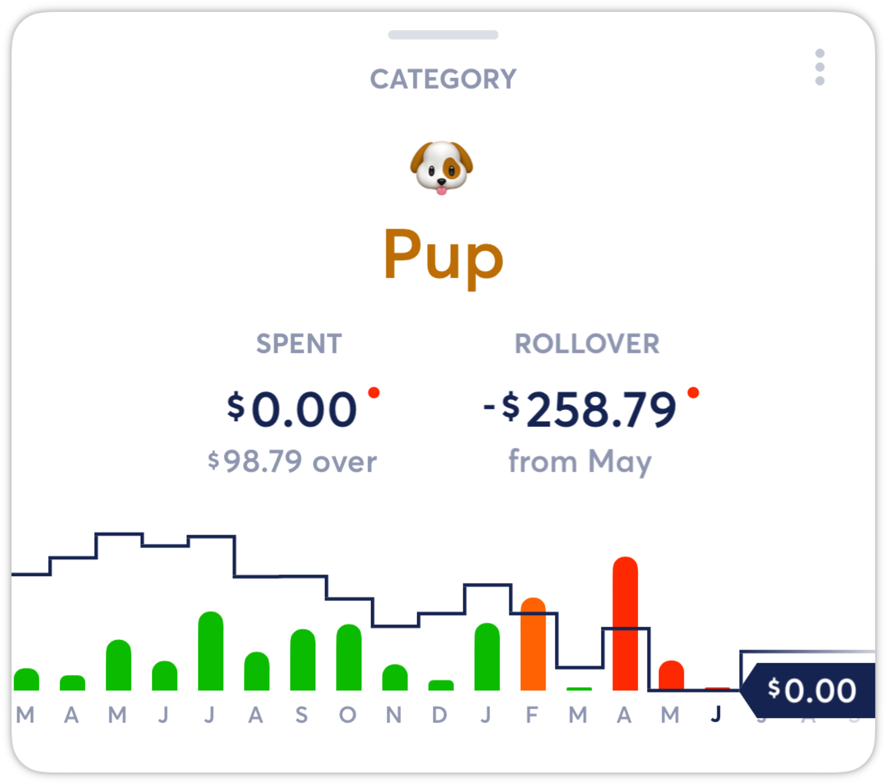
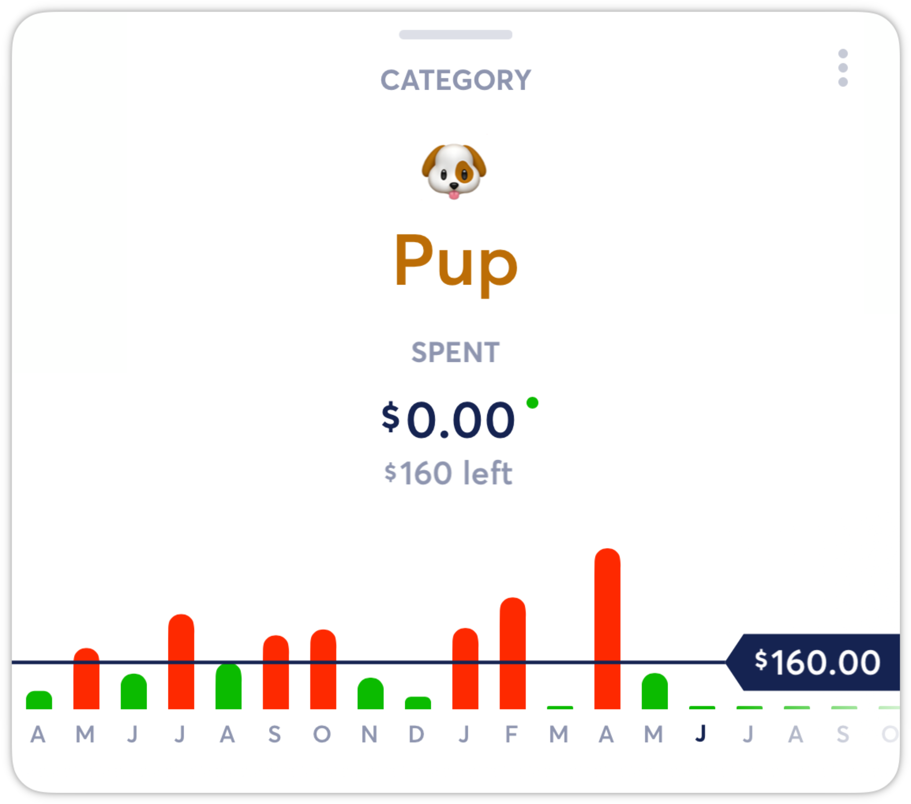
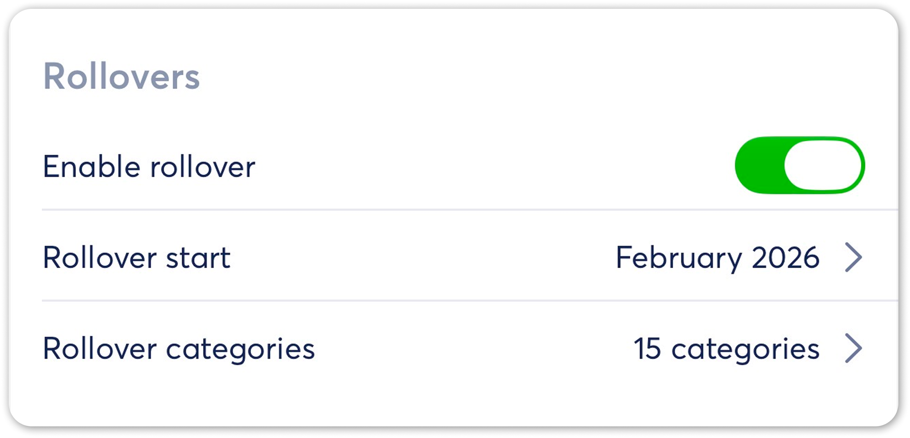

# Budget Rollovers

**Source:** https://help.copilot.money/en/articles/3790828-budget-rollovers

Rollovers carry your remaining budget balance from one month to the next month to help you track fluctuating spend across multiple months.

---

# Enabling Rollovers

To turn on **Rollovers**, enable in the Settings and select the **First month with a rollover**. For example, if the **Rollovers** start date is February 2026, then the remaining balance from January 2026 will rollover to February.

With **Rollovers** are enabled, the remaining spend or over spend from one month will carry over to the next month. For example, the overspend in April carried over to May. Rollovers are also cumulative, meaning over or under spend will accumulate month over month.

With Rollovers, you can use the same budget for all months or edit budgets month to month to impact the Rollover amount. [Learn more about editing budgets by month here.](https://intercom.help/copilotmoney/en/articles/6206293-editing-budgets-by-month)

# Disabling Rollovers

You can also disable **Rollovers** for certain categories by tapping them. For example, if your Internet bill is a fixed amount each month, you do not need to rollover the remaining balance.

A category budget with **Rollovers** disabled will only change if budgets are edited month to month. For example, this category was around $37 under budget in May.

Disabling **Rollovers** for all categories via the Settings toggle will revert your budgets to monthly budgets with no leftover spend or over spend rollovers.

👋  Still have questions? Contact us via the in-app chat.

---
Related Articles[Editing Budgets by Month](https://help.copilot.money/en/articles/6206293-editing-budgets-by-month)[Optional Budgeting](https://help.copilot.money/en/articles/6282850-optional-budgeting)[Separating Business and Personal Spending](https://help.copilot.money/en/articles/10760959-separating-business-and-personal-spending)[Settings Overview](https://help.copilot.money/en/articles/11062072-settings-overview)[Savings with Copilot](https://help.copilot.money/en/articles/11471870-savings-with-copilot)
