# Editing Budgets by Month

**Source:** https://help.copilot.money/en/articles/6206293-editing-budgets-by-month

With Copilot's Budgets 2.0 update, you can maintain the same category budgets for all months or choose to set unique budgets month to month in each category.
​
This update also allows you to see all historic months and future months in the Categories chart:

- **For historic months**, the first month on the chart indicates the month of the category's first transaction.
- **For future budgets,** you'll always be able to see 12 months from the current month. All expected Recurrings are now reflected in future spending.

---

# **Budgeting Modes:**

- The same budget for all months
- Different budgets for different months

# **The same budget for all months**

To set a budget amount for all months, tap or click on the budget line in any category or group view. On iPhone, tap the drop down located under the category or group name.

On Mac, click on **Budget for...**to toggle between budgeting modes.

After selecting this option, you will be presented with the following budgeting modes.
[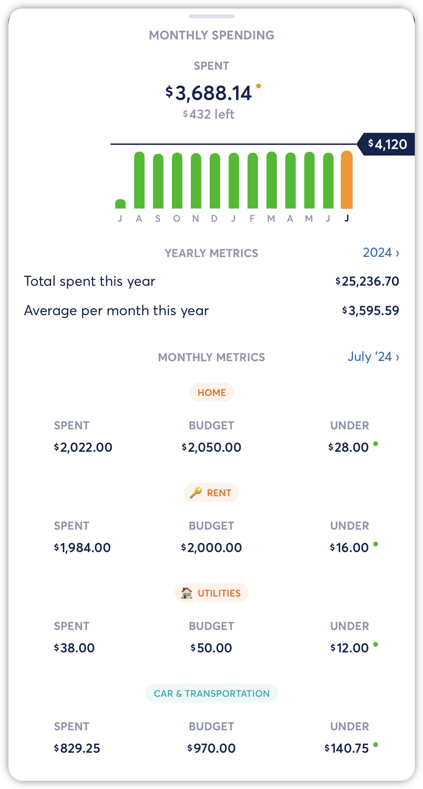](https://downloads.intercomcdn.com/i/o/gw2wbwl7/1278179619/fd20b32737506ab138f21f59d3bc/image.png?expires=1773322200&signature=f9e198f8363ef8a7d5e83496217bc0d26ab0e5fe8faaf01d005986492097b44e&req=dSIgHsh5lIdeUPMW1HO4zTuSfdHhRALmPXS3O0AgVL6TmtjOZeltc9gskfXo%0ASzNoJ0s1o%2Fl5aSaPFQ8%3D%0A)[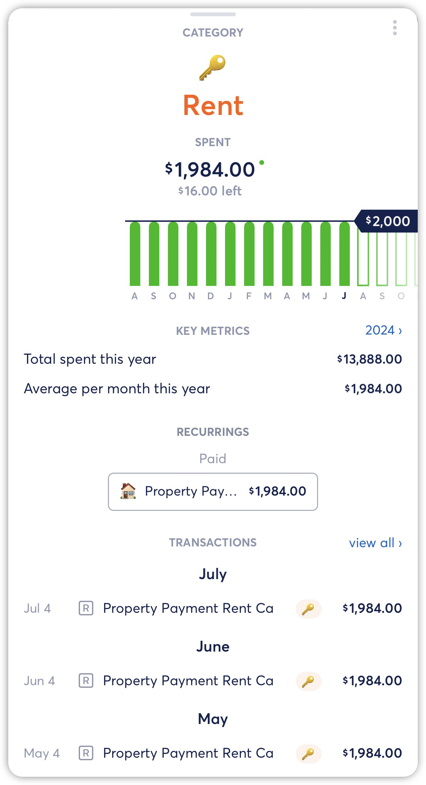](https://downloads.intercomcdn.com/i/o/gw2wbwl7/1278180306/8589b871f96afc173442b2577980/image.png?expires=1773322200&signature=8a7eb524d0b0998614194fc9b7e3eb7e481114b588266f3b45e77ba14fe77749&req=dSIgHsh2nYJfX%2FMW1HO4zRw%2FeWnrN7IaCifacc%2BUtIZe6jxB4PMwJBWtLSbb%0A0cowR2cKwyhJeNgmg3s%3D%0A)
Selecting **The same budget for all months** mode maintains the same budget for all months, historic and future.
​
​***Please note:***If you are already using the **Different budgets for different months** mode, selecting **The same budget for all months** and setting a budget will overwrite any different budgets set for different months in that category.
[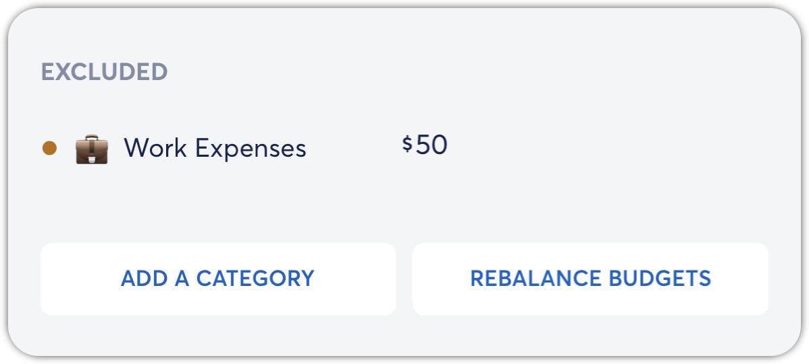](https://downloads.intercomcdn.com/i/o/gw2wbwl7/1278182384/5af1f7af77692b20fe2e0f3c40fc/image.png?expires=1773322200&signature=eb7cbdfa36ba06cc467adcf34922577ff4b86caa59160dceaadf4ddbfe6b8bd0&req=dSIgHsh2n4JXXfMW1HO4zU%2BEpzS%2FAu8Ie8wDG9Z0Tpna44ctua2mXiIgYiM3%0AGW9Pzv85MeNgPO%2FrftQ%3D%0A)
If Rollovers are turned on for the related category, you will see the budget line now shows the historical budget per month based on the Rollover budget, even if it's the same budget for all months. Rollovers are not shown for future months.
[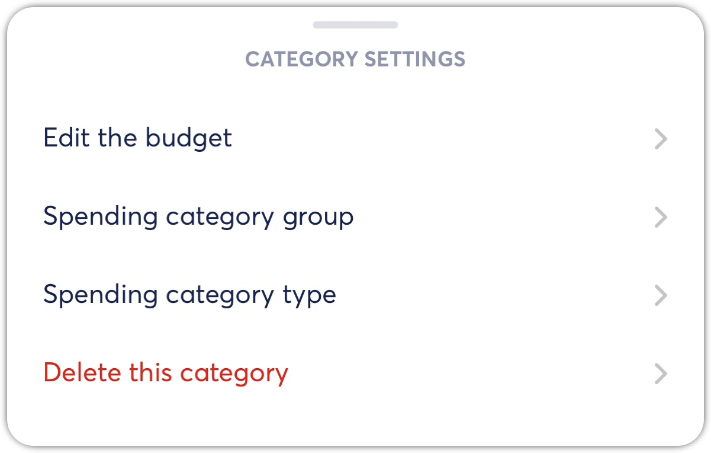](https://downloads.intercomcdn.com/i/o/gw2wbwl7/1278184754/225f6836c87d5272edb36c4795cc/image.png?expires=1773322200&signature=125e6de94b22cddeab68a965a2de58a0b6edccf798f3c574cfe83851066a3496&req=dSIgHsh2mYZaXfMW1HO4zZsEcj5aqhq5JKJXDrhwKUy1tNIwPurjas3I7qA2%0AhhAoEt%2BuJ6%2F%2BAbGK8fo%3D%0A)[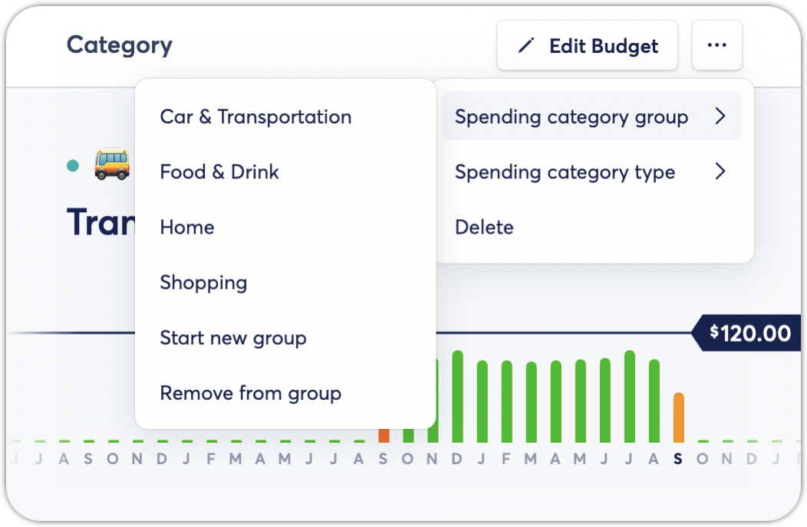](https://downloads.intercomcdn.com/i/o/gw2wbwl7/1278185166/f11008e48d854180f0edbfe22c71/image.png?expires=1773322200&signature=9656da5a2de7f75500f159ce897cf4dde3628644b13a2feab8e604cb193af78b&req=dSIgHsh2mIBZX%2FMW1HO4zRBCmQp%2FKB9BBnXV73uxFVS2A5tYDUP7pmjL4wnt%0A07SZHYsXGFVzLXP%2Bx6M%3D%0A)
# **Different budgets for different months**

To set a budget amount for a single month, tap or click on the budget line in any category or group view. On iPhone, tap the drop down located under the category or group name.

On Mac, tap on **Budget for all months** to toggle between budgeting modes.

After selecting this option, you will be presented with the following budgeting modes.
[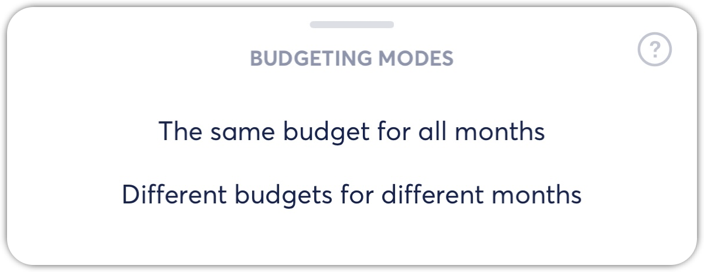](https://downloads.intercomcdn.com/i/o/gw2wbwl7/1278185595/600691383568ad69fdf38d9cadb7/image.png?expires=1773322200&signature=1441dc148f565f65663681a518c1e3cdce8c565f6393ce875c474a7c03c910ce&req=dSIgHsh2mIRWXPMW1HO4zVWd0AstAtsQ3XqtElv5WKRkrZaRkzRwW1MWBGt1%0AH21VznqdJgn6EMVWLRo%3D%0A)[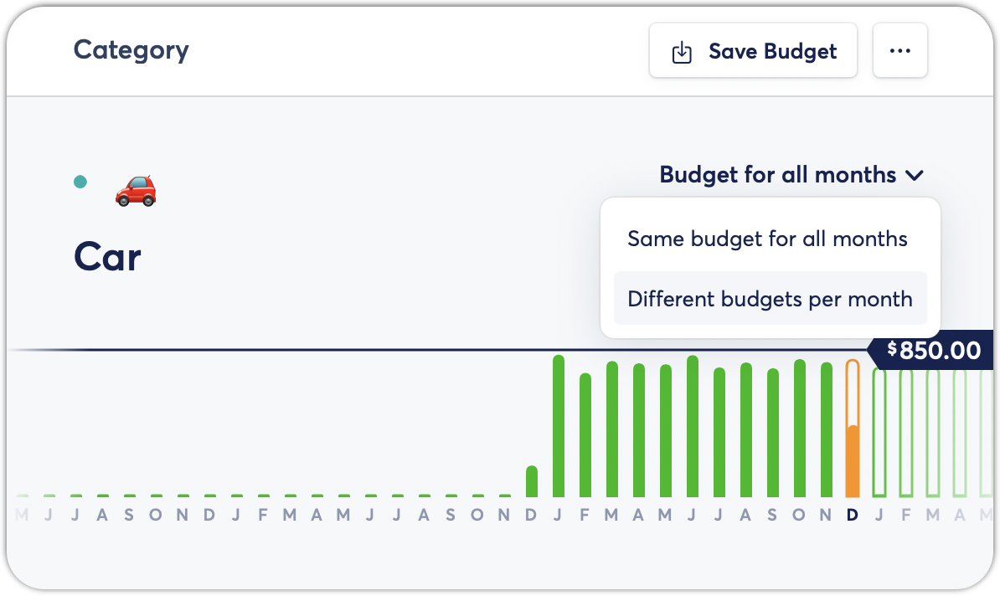](https://downloads.intercomcdn.com/i/o/gw2wbwl7/1278189279/f588eb525d96af6ff37d3d2bc226/image.png?expires=1773322200&signature=5bc2b46b2cb98dbee5eb2b199b2e41ed1611c8a9f9ec09e449c03b6a4f832af2&req=dSIgHsh2lINYUPMW1HO4zVgznKdvEQRa1Ehj9G0xVlkMOkHTYUNi03ML60p8%0Az4gmc82BcdPNLG%2BuqNE%3D%0A)
Selecting the **Different budgets for different months** mode allows you to set different budgets for each month, historic and future. For example, this category with different budgets per month allows for a lower budgets in September and November, while maintaining the same budget for previous months.
[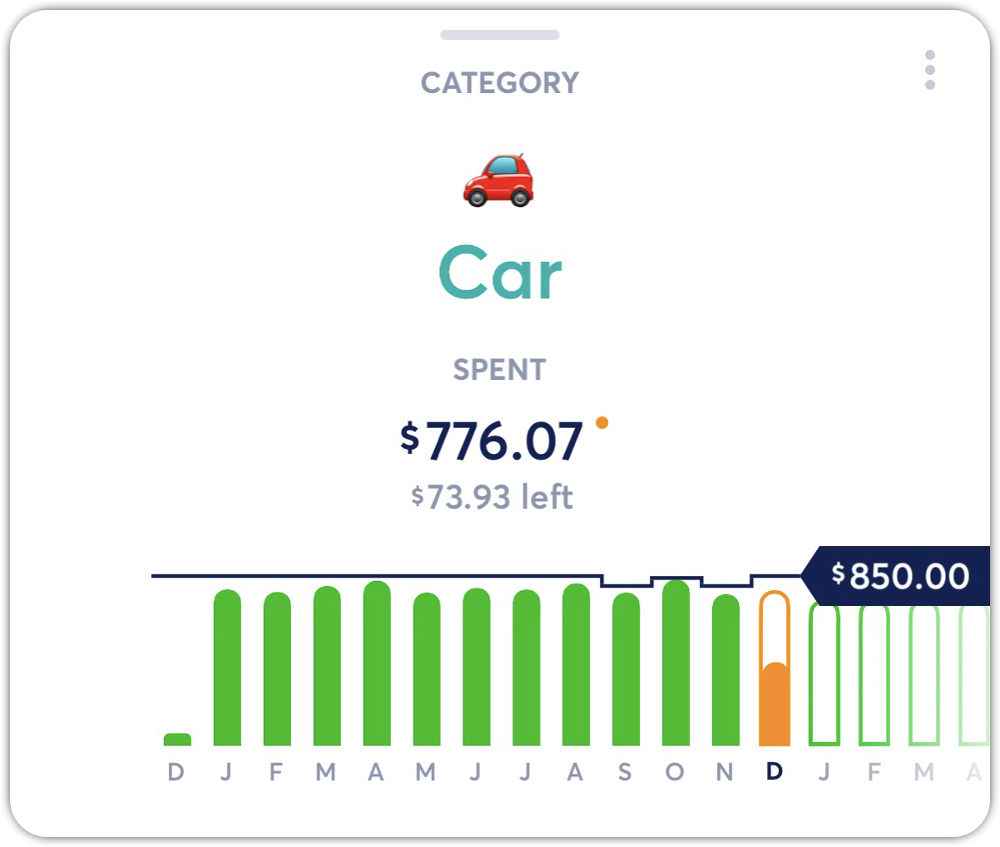](https://downloads.intercomcdn.com/i/o/gw2wbwl7/1278191385/ea19397eece615f05b88e4fa3c69/image.png?expires=1773322200&signature=fab250599f98135b4bf94c34922e0ce8bfb6eaf000612ccb8e5cce1513a4789d&req=dSIgHsh3nIJXXPMW1HO4zXCOeaYQD6DPBPLwzp6GjRgjMy6FNrq%2By92yRxRR%0AvTQx5%2BioanF%2Bejz9z6Q%3D%0A)[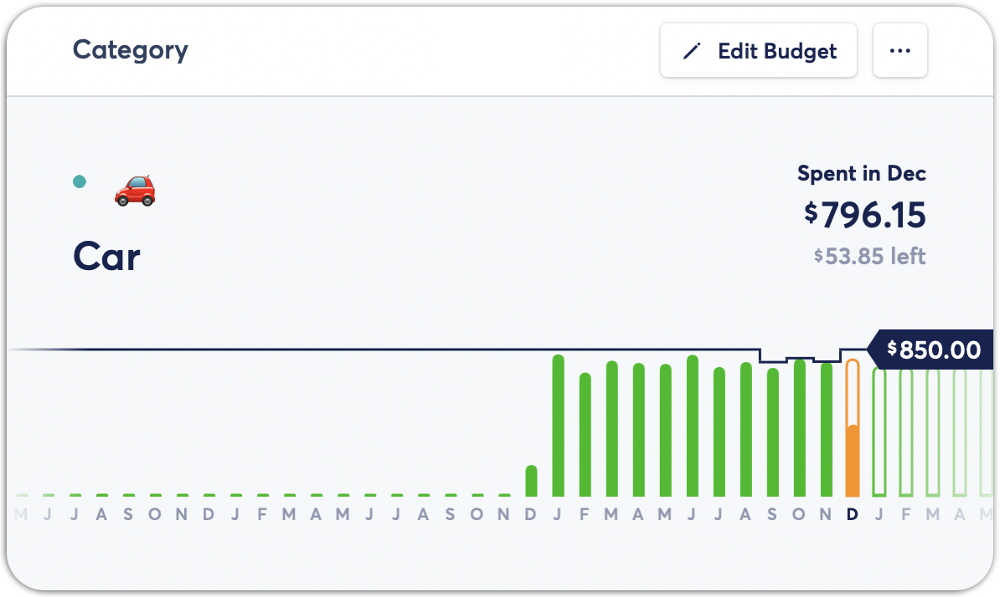](https://downloads.intercomcdn.com/i/o/gw2wbwl7/1278191837/b669a7aa886f3500ceef5b6fda8b/image.png?expires=1773322200&signature=4cfb238089e1998ac8c37f1c737ce2e59ca77b170b3d7fd5e0ad8763a24261b7&req=dSIgHsh3nIlcXvMW1HO4zRU3%2FLTd2%2Fm%2BQbqEGTT89fercXjVabvwpwufqyrE%0AlSedNoWa8rpj753ie7A%3D%0A)
This mode also works with categories with Rollovers enabled, allowing you to change the amount in a Rollover category for individual months.
​
If Rollovers are turned on for the related category, you will see the budget line now shows the historical budget per month based on the Rollover budget. Rollovers are not shown for future months.
​

To set a different budget for an individual month, tap or click on the budget slider. Then, either drag the slider up or down, or enter a budget amount for the selected month.
[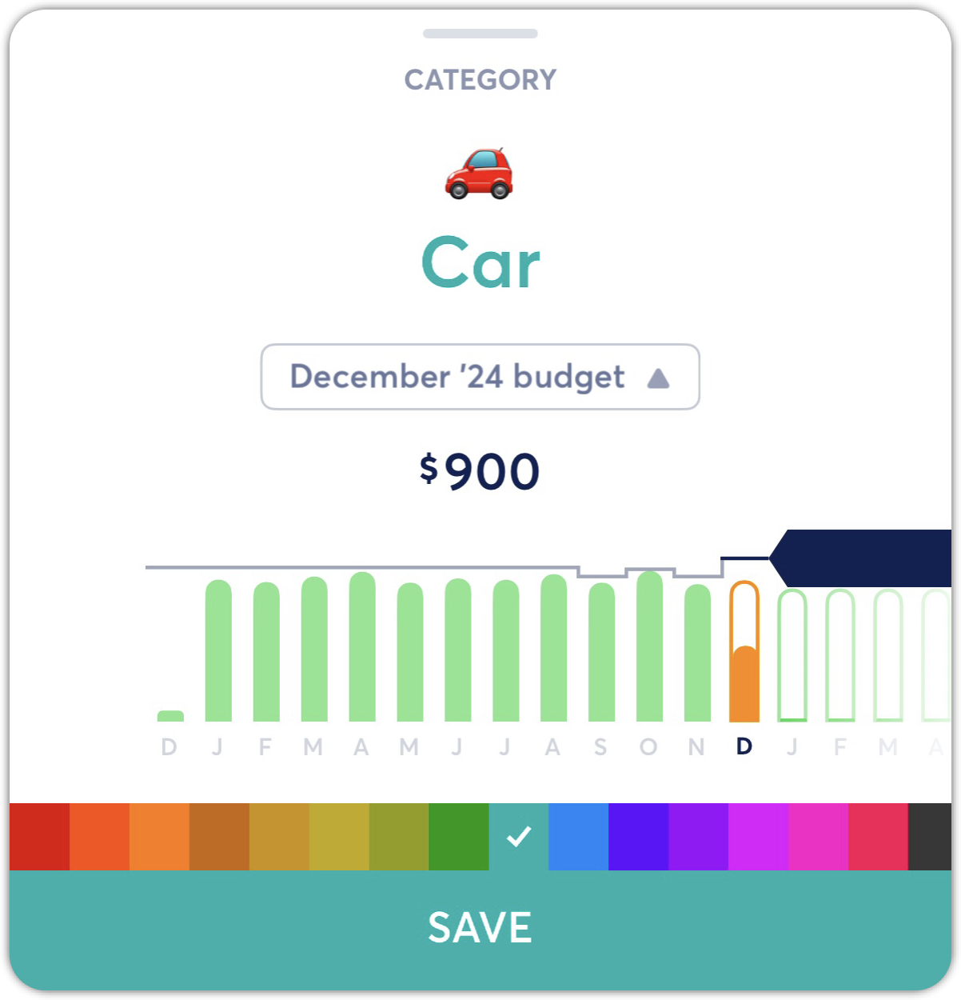](https://downloads.intercomcdn.com/i/o/gw2wbwl7/1278193646/6591f410c4c47e02bc1021a04f2b/image.png?expires=1773322200&signature=e324c2da37c2a08f3ba59033bfc997d2cc95d28bc22dcd41947caabf76df124c&req=dSIgHsh3nodbX%2FMW1HO4zdipfdbHEwQkTKw5TUKgWphdg5u0HGqBBs%2F2hpM%2B%0Aipm%2FB1vbeJuyBDmMAv8%3D%0A)[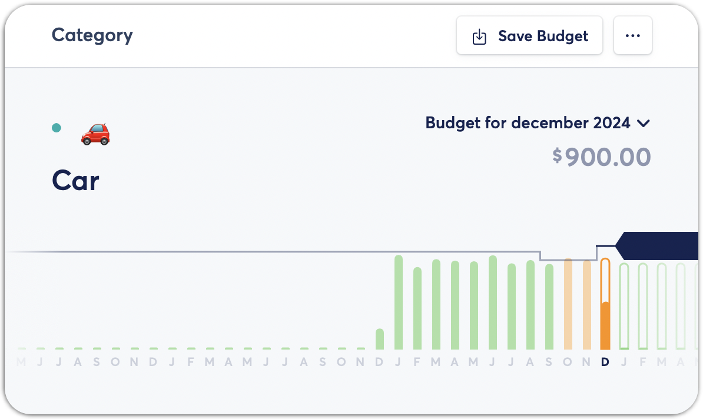](https://downloads.intercomcdn.com/i/o/gw2wbwl7/1278194255/4f0df959c5167ff6a33ff5d5871f/image.png?expires=1773322200&signature=3334ecfdd6943f62959264113ba1922ab2d673028f610d132fdea93e55a38a67&req=dSIgHsh3mYNaXPMW1HO4zUKTKsgtWYACyzCLdK059RlqQ%2BGZn8My4cRg7XrU%0Ati17TrR2zHl0MMXCo0k%3D%0A)
If you make a change to a month's budget in **Different Budgets for Different Months** mode, and there are no budgets set for the months afterward in that category, Copilot will change the budget for future months to match the budget you've set for the single month.
​
If you've already set a different budget for a future month, then Copilot will not edit that month's set budget (or any of the following monthly budgets in this category).

👋 Still have questions? Contact us via the in-app chat.

---
Related Articles[Budget Rollovers](https://help.copilot.money/en/articles/3790828-budget-rollovers)[Rebalancing Your Budget](https://help.copilot.money/en/articles/6206302-rebalancing-your-budget)[Optional Budgeting](https://help.copilot.money/en/articles/6282850-optional-budgeting)[Settings Overview](https://help.copilot.money/en/articles/11062072-settings-overview)[Quick Start Guide](https://help.copilot.money/en/articles/11157550-quick-start-guide)
