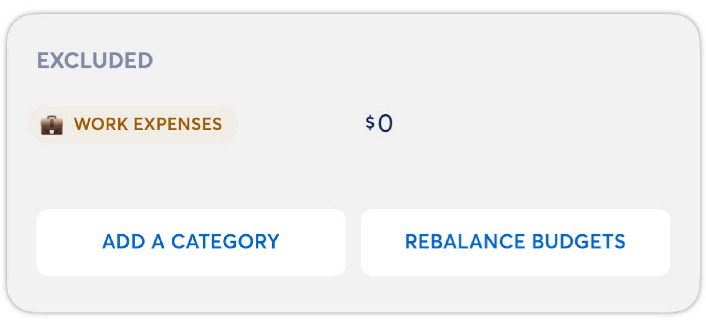
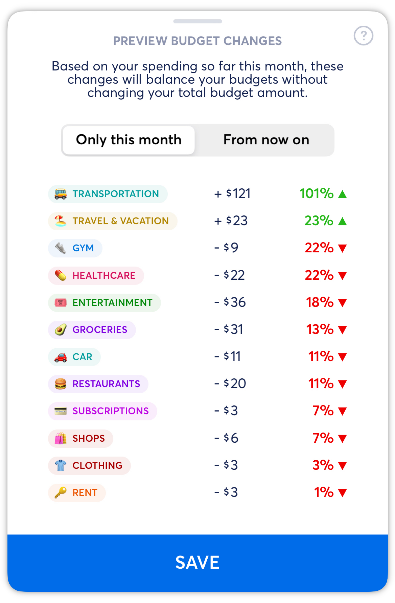

# Rebalancing Your Budget

**Source:** https://help.copilot.money/en/articles/6206302-rebalancing-your-budget

The rebalance feature allows you to adapt your category budgets to your actual spend (within your existing total budget) when you have significant increase or decrease in spending in different categories.

To rebalance your budget, tap on the **Rebalance Budgets** button at the bottom of the Categories tab.

On the **Mac and iPad apps**, the **Rebalance** button is at the top of the Categories tab.

Then, Copilot will show a preview of the suggested rebalance. If you do not want to rebalance your budget based on Copilot's suggested rebalance, you can swipe down from the top of the model to cancel.

Before tapping **SAVE**, consider the toggle at the top of the view. **Only this month** will only rebalance your budget with the changes listed for the current month. **From now on** will apply the rebalance to this month and all months going forward if you haven't already set custom budget amounts for future category budgets.

After tapping save, you will see the rebalance applied to your category budgets.

👋 **Still have questions?**Contact us via the in-app chat.

​

---
Related Articles[Dashboard Tab Overview](https://help.copilot.money/en/articles/6045480-dashboard-tab-overview)[Editing Budgets by Month](https://help.copilot.money/en/articles/6206293-editing-budgets-by-month)[Optional Budgeting](https://help.copilot.money/en/articles/6282850-optional-budgeting)[Categories Tab Overview](https://help.copilot.money/en/articles/9504513-categories-tab-overview)[Quick Start Guide](https://help.copilot.money/en/articles/11157550-quick-start-guide)
