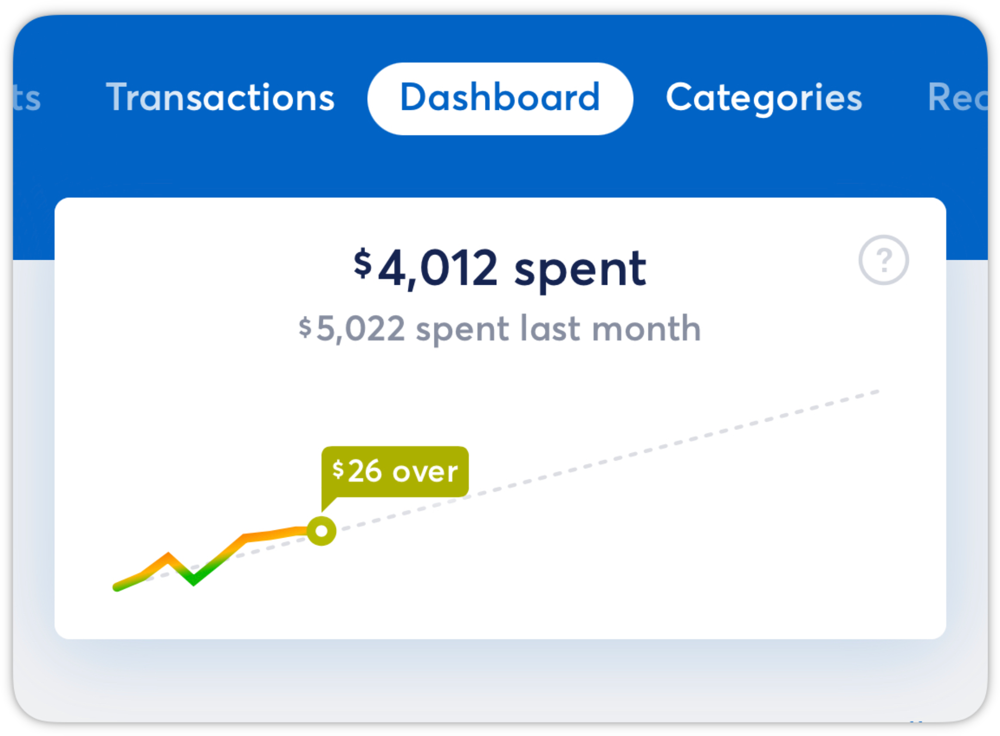
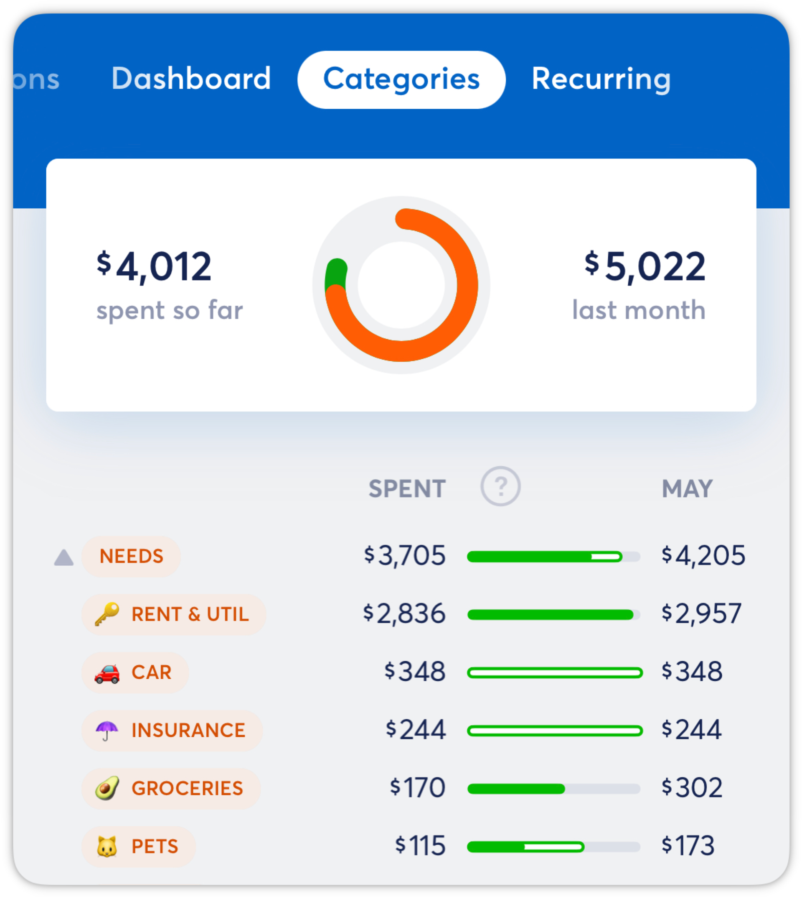
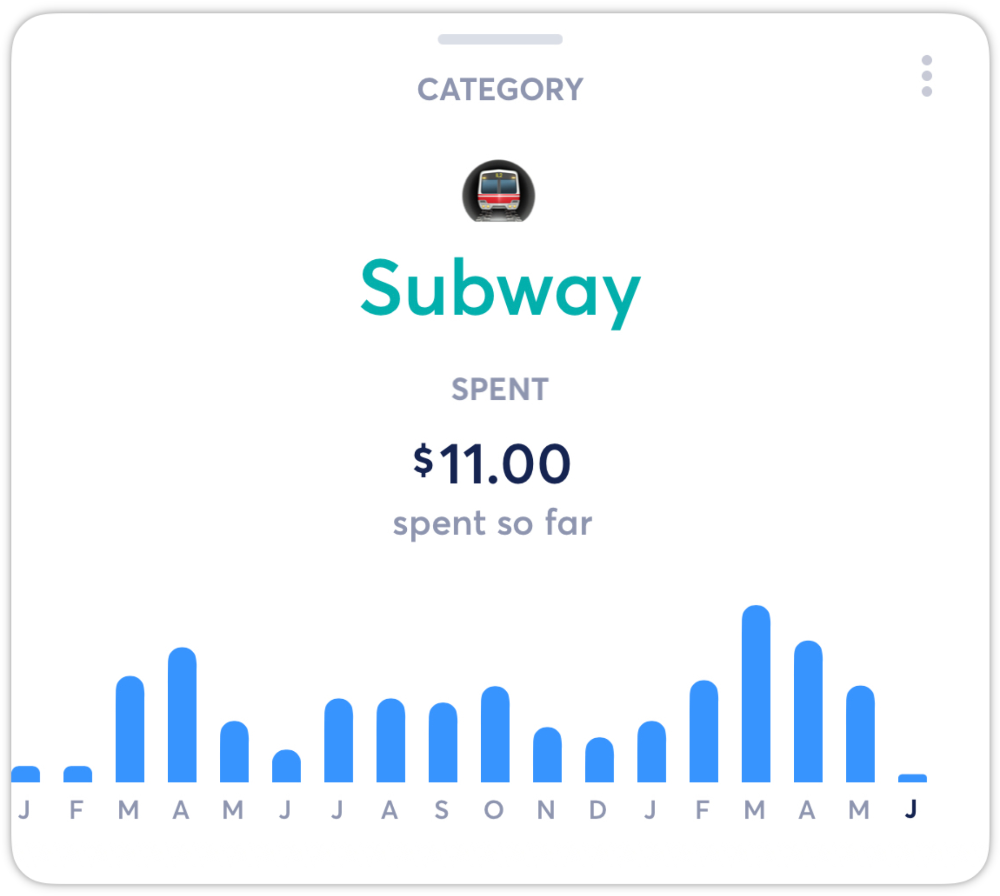

# Optional Budgeting

**Source:** https://help.copilot.money/en/articles/6282850-optional-budgeting

The Optional Budget feature allows you to disable budgeting from spending tracking.

To disable budgeting, navigate to Copilot settings by tapping on the gear icon on the upper left hand corner within the Copilot app, then scroll to the **Features**section. From here, you can disable budgeting at any time.

Enabling budgeting will revert your account back to the budgets you set before disabling the budgeting feature.

**When budgeting is turned off,** instead of measuring monthly spend against a set budget, Copilot will compare this month's spending to last month in the Dashboard chart.

The top value is the amount you've spent this month, including any future recurring payments that are expected to be paid out. Below it you see how much you spent last month.

The dotted line represents what you spent last month, spread evenly to represent an ideal spending rate. This charted line represents your spending rate throughout the month, and the number on the charted line tells you if you're on target to spend more or less than last month, if the month were to end today.

In the Categories tab, Copilot will compare your overall spending and category spending to last month. The option to rebalance budgets is removed from the Categories tab, as there are no budgets to rebalance in this mode.
​

Excluded categories function the same with and without budgets enabled. Spending in excluded categories will not be included in the total spending.

**Note**: When reviewing your individual categories, it will not include a budget line.

👋 **Still have questions?**Contact us via the in-app chat.

---
Related Articles[Budget Rollovers](https://help.copilot.money/en/articles/3790828-budget-rollovers)[Dashboard Tab Overview](https://help.copilot.money/en/articles/6045480-dashboard-tab-overview)[Editing Budgets by Month](https://help.copilot.money/en/articles/6206293-editing-budgets-by-month)[Rebalancing Your Budget](https://help.copilot.money/en/articles/6206302-rebalancing-your-budget)[Categories Tab Overview](https://help.copilot.money/en/articles/9504513-categories-tab-overview)
