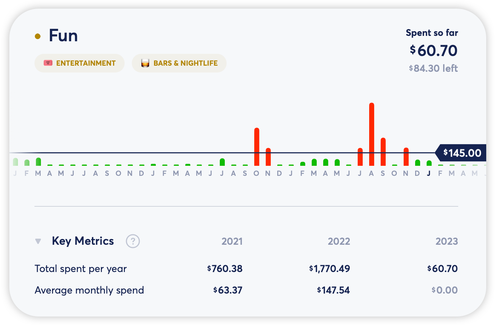

# Understanding Key Metrics for Spending

**Source:** https://help.copilot.money/en/articles/6918427-understanding-key-metrics-for-spending

Key Metrics can be found by tapping/clicking on a category.

## Total spent per year

We sum your total spend for each month of the year to determine your total spent per year. In this field, we include your total spend so far in the current month to this value.

## Average monthly spend

To calculate your average monthly spend, we sum all complete months and divide by the number of complete months to determine your average monthly spend per year.
​
​**For the current year, we do not factor the spend of the current month into this calculation for a more accurate view of average monthly spend for a complete month**. This value will update on the first of the next month to include the previous month's complete spend.

👋 Still have questions? Contact us via the in-app chat.

---
Related Articles[Dashboard Tab Overview](https://help.copilot.money/en/articles/6045480-dashboard-tab-overview)[Categories Tab Overview](https://help.copilot.money/en/articles/9504513-categories-tab-overview)[Separating Business and Personal Spending](https://help.copilot.money/en/articles/10760959-separating-business-and-personal-spending)[Savings with Copilot](https://help.copilot.money/en/articles/11471870-savings-with-copilot)[Copilot Money for Web](https://help.copilot.money/en/articles/11780342-copilot-money-for-web)
