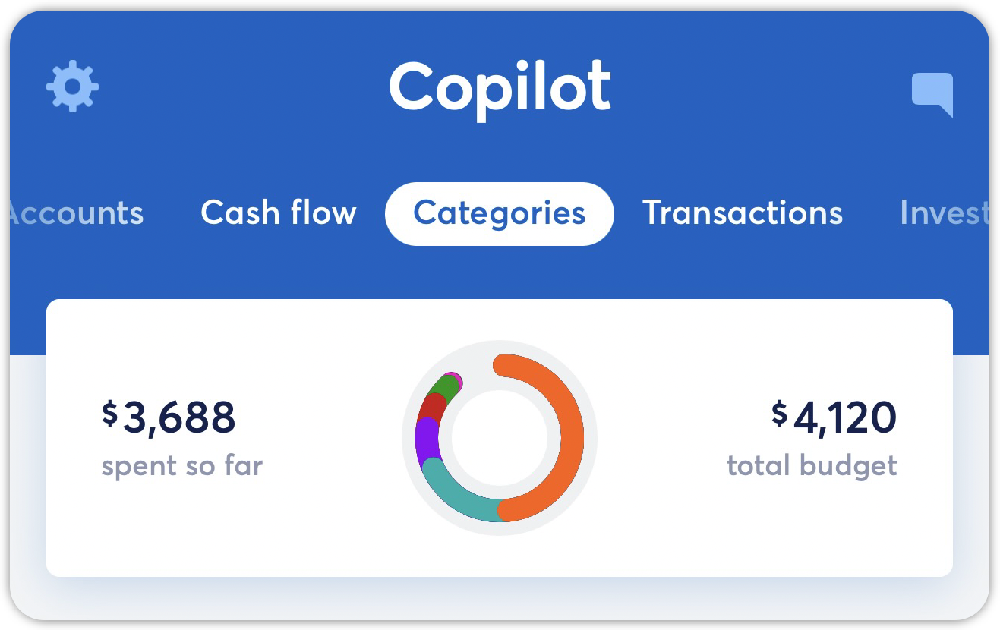

# Other Category

**Source:** https://help.copilot.money/en/articles/9829368-other-category

Copilot provides a set of default spending categories during the onboarding process to help you get started. Within this list of categories, there is an **Other** category. Transactions surface under the **Other** category when Copilot is unsure on how to categorize a transaction.

The **Other** category is also used when you delete one of your spending categories.  Any transactions associated with the deleted category get moved into the **Other** category automatically. Because of this, you **cannot delete the Other category**.

"**Delete this category**" is not an option when editing the **Other** category. If you're attempting to delete a budget category and this option isn't present, this likely means that this is the default **Other**category but was renamed.

👋 Still have questions? Contact us via the in-app chat.

---
Related Articles[Dashboard Tab Overview](https://help.copilot.money/en/articles/6045480-dashboard-tab-overview)[Copilot Intelligence for Spending](https://help.copilot.money/en/articles/8182433-copilot-intelligence-for-spending)[Categories Tab Overview](https://help.copilot.money/en/articles/9504513-categories-tab-overview)[Tags vs. Categories](https://help.copilot.money/en/articles/9554367-tags-vs-categories)[Categories FAQ](https://help.copilot.money/en/articles/10216528-categories-faq)
