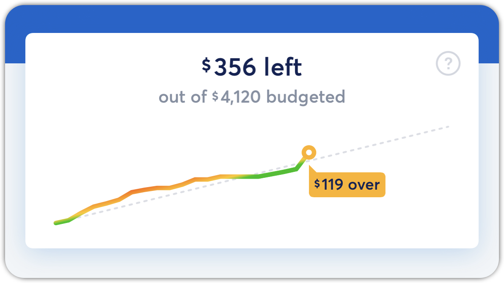
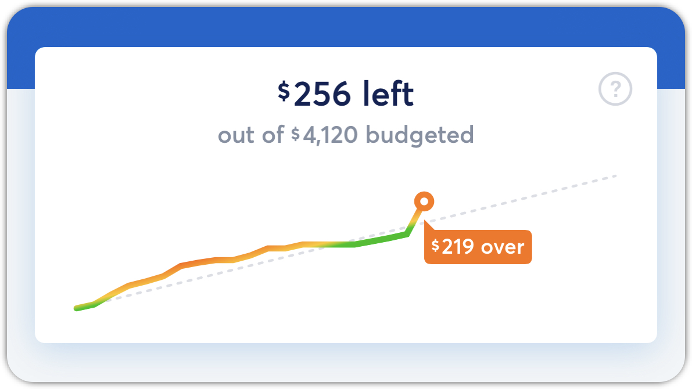
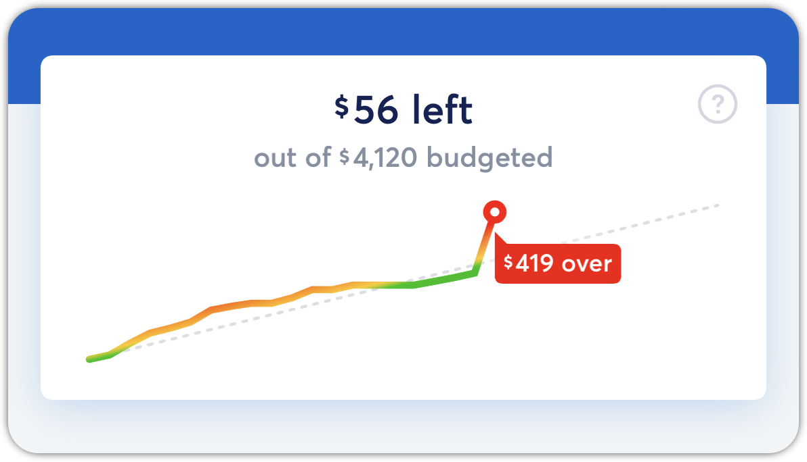

# Dashboard Line Colors

**Source:** https://help.copilot.money/en/articles/10309907-dashboard-line-colors

# What does the dashboard line color mean?

The solid line color will depend on the current day, as we calculate the ideal percentage used (current day / number of days in the month). Learn more about what these colors mean below:

---

## **Green**

If the percentage used (spent / budget) is less than the ideal spending rate, we show a green color.

## **Light Orange**

If the difference between the ideal and the used is less than 20%, we show a light orange.

## **Dark Orange**

If the difference between the ideal and the used is more than 20%, we show a dark orange.

### **Red**

If the amount spent exceeds the budget, the color will be red.

👋 **Still have questions?**Contact us via the in-app chat.

---
Related Articles[Dashboard Tab Overview](https://help.copilot.money/en/articles/6045480-dashboard-tab-overview)[Categories Tab Overview](https://help.copilot.money/en/articles/9504513-categories-tab-overview)[Dashboard FAQ](https://help.copilot.money/en/articles/10238054-dashboard-faq)[Credit Utilization](https://help.copilot.money/en/articles/10310069-credit-utilization)
