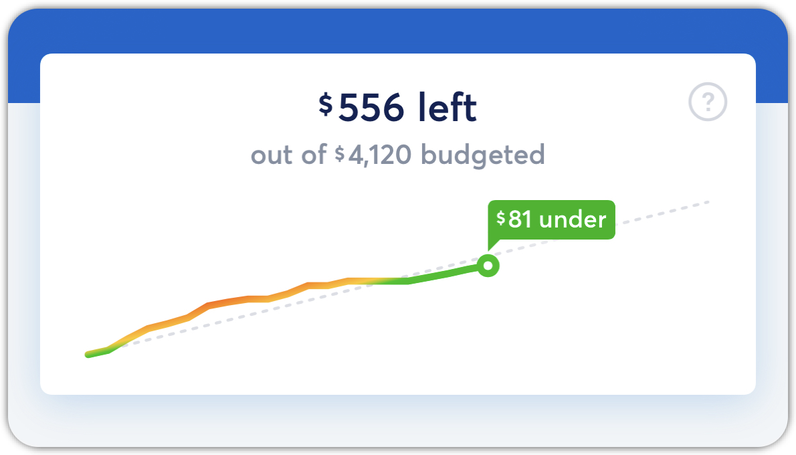

# Income vs. Budget

**Source:** https://help.copilot.money/en/articles/5542019-income-vs-budget

Copilot does not correlate your income with your spending automatically. Instead, Copilot allows you to set your budget to your preference. Because of this, there isn't anywhere you’ll need to enter your monthly income amount in the app.

Instead, you should make sure that all income transactions are correctly typed as *Income* so they are visible in the "Income" section of the **Dashboard** tab.
​
You can set a total spending budget based on your personal knowledge of your income and your review of historic income. Tap on the "Net This Month" section in the **Dashboard** tab to [visit the Cash flow](https://help.copilot.money/en/articles/9682232-cash-flow-tab-overview#h_26e0aeaa2a) tab for more insights.

​

👋 **Still have questions?**Contact us via the in-app chat.

---
Related Articles[Dashboard Tab Overview](https://help.copilot.money/en/articles/6045480-dashboard-tab-overview)[Optional Budgeting](https://help.copilot.money/en/articles/6282850-optional-budgeting)[Dashboard FAQ](https://help.copilot.money/en/articles/10238054-dashboard-faq)[Quick Start Guide](https://help.copilot.money/en/articles/11157550-quick-start-guide)
