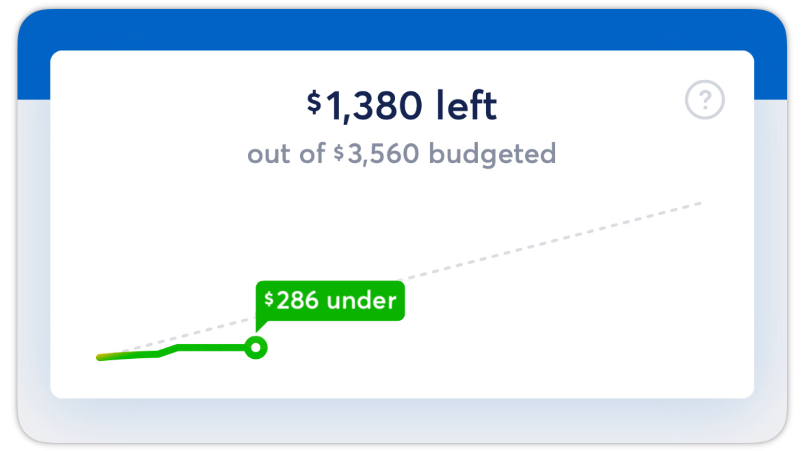
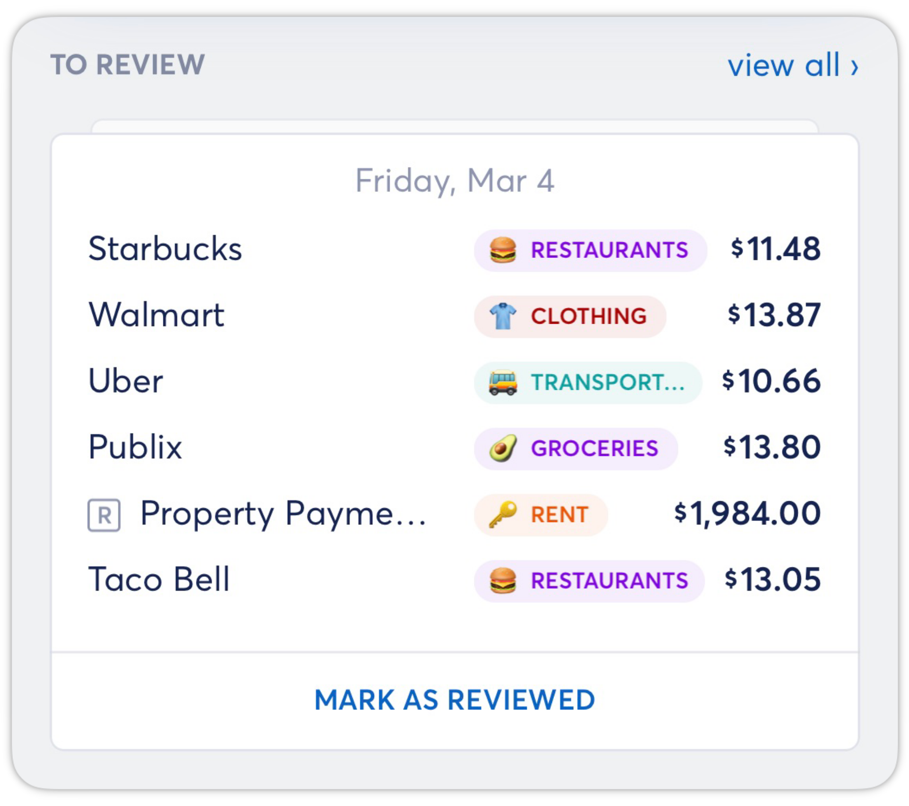
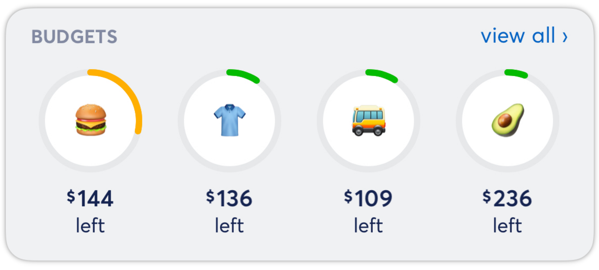
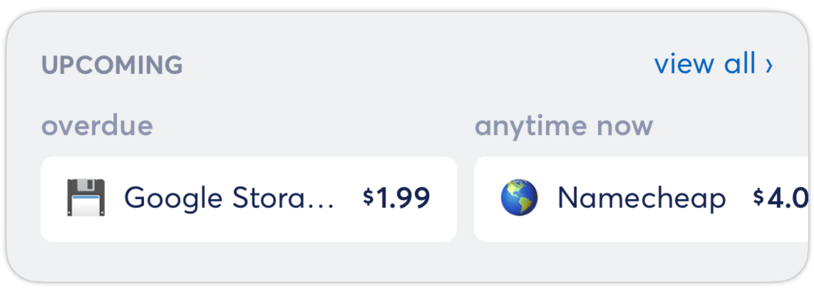
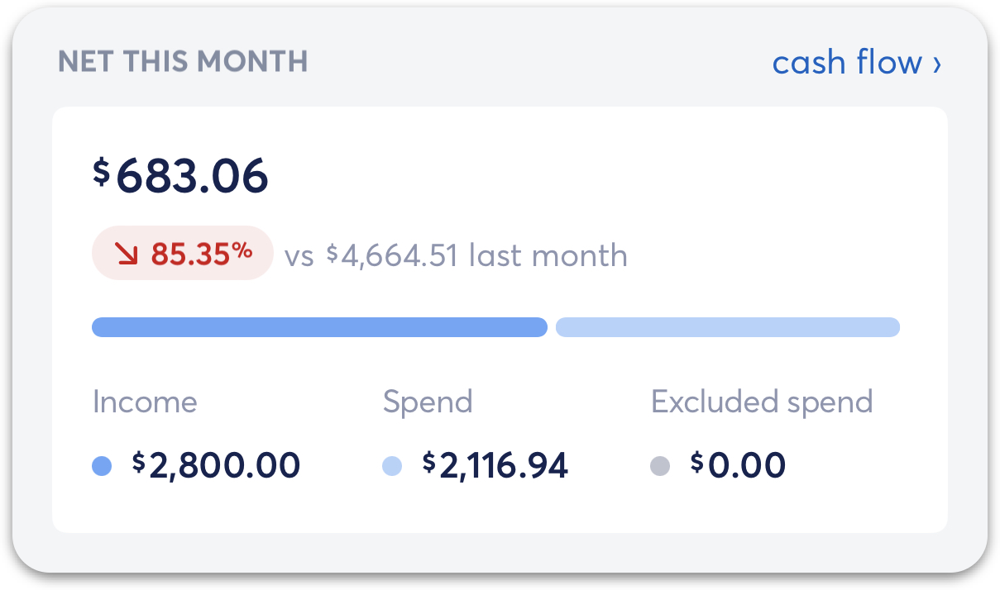
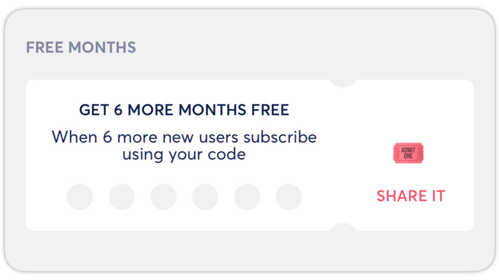

# Dashboard Tab Overview

**Source:** https://help.copilot.money/en/articles/6045480-dashboard-tab-overview

Copilot's Dashboard tab allows you view new transactions, trending budget categories, upcoming recurrings, net income, and referral credits.

- [Dashboard Graph](#h_655155a2b4)
- [To Review](#h_e406e39083)
- [Budgets](#h_a370de537d)
- [Upcoming](#h_ecd920f206)
- [Net This Month](#h_ee76349a9a)
- [Free Months](#h_10357e419b)
- [Tabs in Copilot](#h_03c53ee558)

---

# **Dashboard Graph**

The top of the Dashboard tab features a graph with spending progress for the month. At the top of this graph is the Free to Spend value. This is the amount of money that can still be spent without going over budget for the month. Any recurring transactions expected to post in the current month are not included in the chart.
​
The dotted line on this graph represents the ideal spending rate to stay within the current monthly budget.

The solid line on this graph represents your spending rate throughout the month. The point at the end of the line reflects your current progress as of today compared to your ideal spending target. The **[dashboard line color](https://intercom.help/copilotmoney/en/articles/10309907-dashboard-line-colors)**will depend on the current day, as we calculate the ideal percentage used.

**Note:**Large transactions like rent or mortgage payments at the beginning of the month can cause the spending rate to spike. **[Creating Recurrings](https://intercom.help/copilotmoney/en/articles/3760068-create-recurrings)** for these transactions will remove spikes because they are not included in the spending graph.

# **To Review**

The **To Review** section of the Dashboard displays all new transactions that have been imported but have not been marked as reviewed by you. If all transactions listed here are correctly categorized and named, you can tap **MARK AS REVIEWED** and they will be dismissed.
​
To make edits to these transactions, tap on a transaction in the list, make any necessary changes, and then tap save. Tapping **view all >** will take you to the Transactions tab.

# **Budgets**

The Budgets section of the Dashboard provides a snapshot of your trending budget categories and how much you have left to spend in these categories. Tapping **view all >**will take you to the Categories tab.

# **Upcoming**

The Upcoming section of the Dashboard displays upcoming expected recurrings. You can horizontally scroll through this list to see future recurring transactions. Tapping **view all >** will take you to the Recurring tab.

# **Net This Month**

The Net This Month section of the Dashboard displays income, spend, and excluded spend for the month-to-date and compares it to the previous month-to-date. Tapping on **cash flow >**brings you to [Copilot's Cash flow tab](https://help.copilot.money/en/articles/9682232-cash-flow-tab-overview#h_26e0aeaa2a).
​
​[Learn more about how Income works compared to budgets in Copilot here.](https://intercom.help/copilotmoney/en/articles/5542019-income-vs-budget)

​

# **Free Months**

The Free Months section of the Dashboard features a unique referral code that can be shared with others to give them an extended free trial. This section also shows progress towards earning free months of Copilot. When you have referred enough users to earn free months, you will see a prompt on this chart showing REDEEM IT.

# Tabs in Copilot

In the iOS app, the Dashboard tab will always be your home tab by default for a quick overview of the state of your spending and income. To rearrange the order of your tabs to the left and right of the Dashboard tab, navigate to **Settings**, and select **App Sections** under the Appearance section.
​

​

👋 **Still have questions?**Contact us via the in-app chat.

---
Related Articles[Categories Tab Overview](https://help.copilot.money/en/articles/9504513-categories-tab-overview)[Transactions Tab Overview](https://help.copilot.money/en/articles/9554412-transactions-tab-overview)[Cash Flow Tab Overview](https://help.copilot.money/en/articles/9682232-cash-flow-tab-overview)[Recurrings Tab Overview](https://help.copilot.money/en/articles/9778259-recurrings-tab-overview)[Dashboard FAQ](https://help.copilot.money/en/articles/10238054-dashboard-faq)
