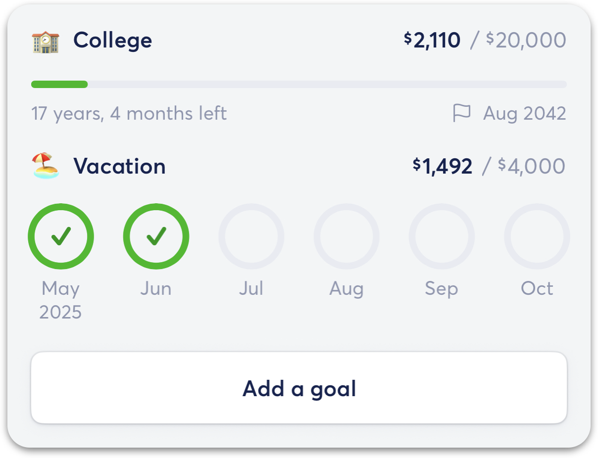
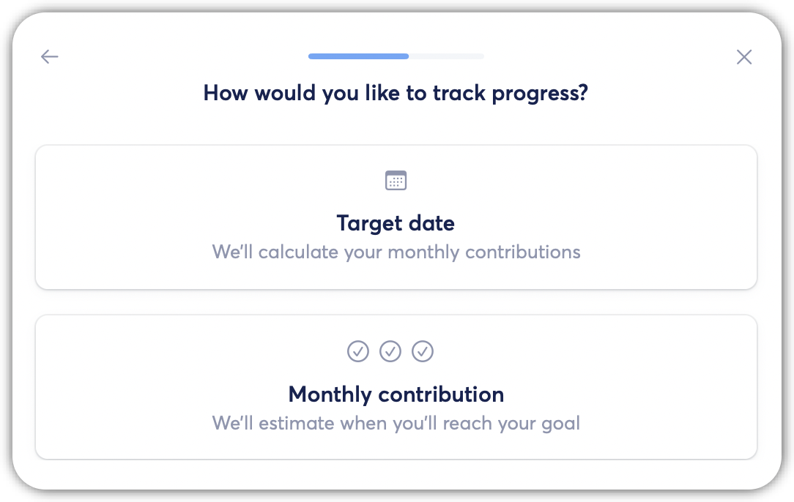
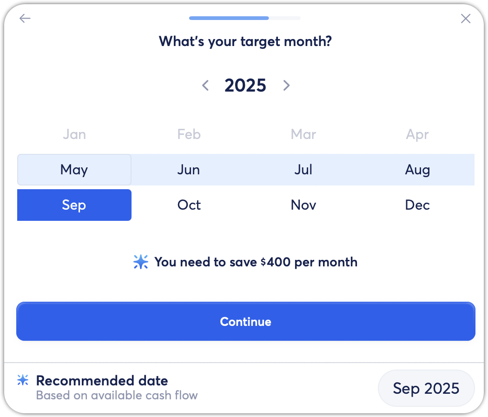
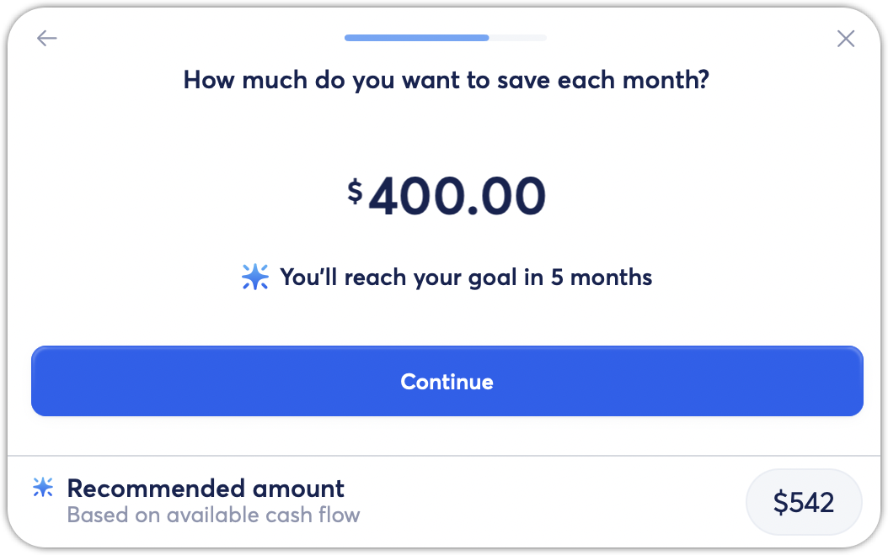
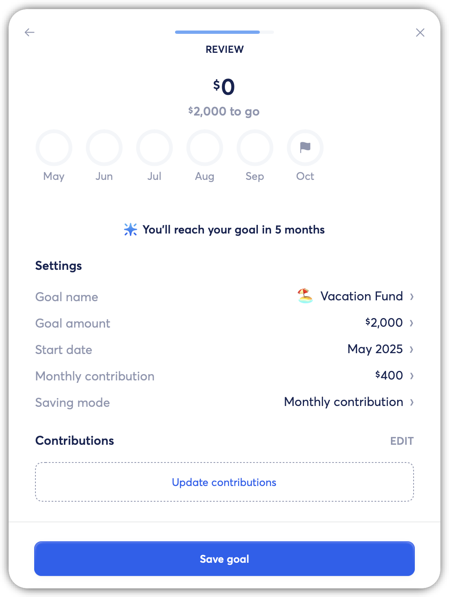
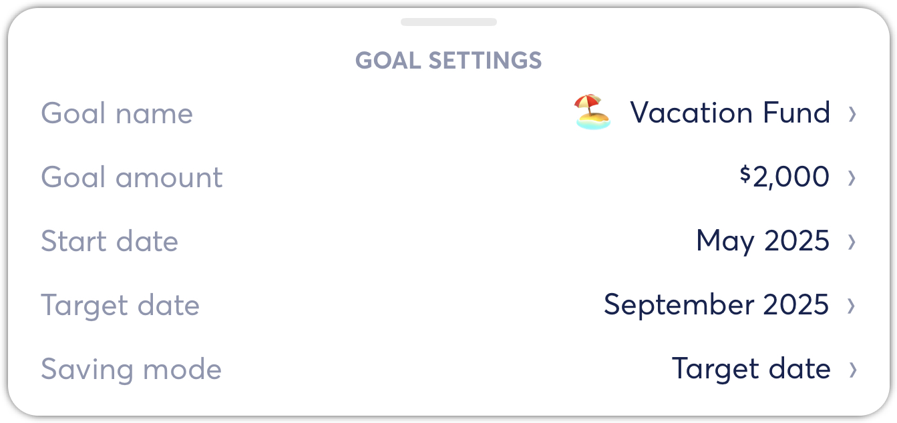
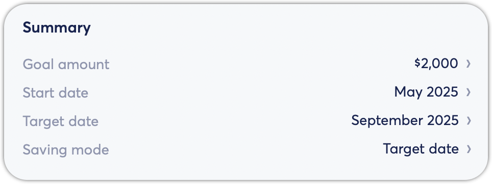

# Creating New Goals

**Source:** https://help.copilot.money/en/articles/11100462-creating-new-goals

You can create a new goal directly within the Goals tab or from an existing transaction. To create a new goal from the Goals tab **in the Mac and iPad apps**, you can tap on **Add a goal** in the top header bar to create a new savings goal.

**In the iOS app**, you can select Add a goal at the bottom of the Goals tab.
​

To create a savings goal from an existing transaction, tap on a **transaction > Goal > New** to create a new savings goal.

Both of these actions will bring you to the same goal creation screen. Then, you'll decide what you want to save for! You can use any of the recommended goal listed, or you can create a custom goal. If you choose to create a custom goal, you'll be prompted to give the goal a name and an emoji before continuing.

Then, enter the target amount you want to save for and tap continue.

Next, you'll decide if you want to start a goal from scratch or if you already have savings from account(s) that can be use for this goal.

If you already have savings that can be use for this goal, you'll be prompted to allocate part of the account's balance for this goal by dragging the balance bar or tapping to enter an amount. Or, you can toggle on **Always use the entire balance** to use the entire balance of the selected account.

Next, pick how you would like to track the progress of the goal. Either by selecting a **target date** or **monthly contribution**. This can also be edited at a later time.

With **target date**, you'll decide when you want to complete this goal by and we'll show you the amount you'll need to save every month to complete this goal in time.

***Note:****The last day of the target month is the last day to complete the goal in time. So if you want a goal to be ready on the 1st of a particular month, the target month should be set to the month before.*

With **monthly contribution**, you'll decide how much you want to save each month, and we'll show you how long it'll take to reach the goal.

Then, review all the selections you have made for this goal and tap **Save goal** to create the goal. You can also edit all the settings listed within the review screen to make any adjustments if needed. You can also edit the contributions before saving the goal as well.

You can update the Goal settings for an active goal at any time by tapping on the goal, then tap on Goal settings, then you can tap on any of the settings to update the selection.

On the **macOS app**, you can tap on an active goal then tap on any of these settings in the Summary section to make adjustments.

👋 **Still have questions?**Contact us via the in-app chat.

---
Related Articles[Updating Goal Progress](https://help.copilot.money/en/articles/11100474-updating-goal-progress)[Archiving Goals](https://help.copilot.money/en/articles/11100497-archiving-goals)[Spending from Savings Goals](https://help.copilot.money/en/articles/11100511-spending-from-savings-goals)[Goals FAQ](https://help.copilot.money/en/articles/11139571-goals-faq)[Savings Goal Tab Overview](https://help.copilot.money/en/articles/11470324-savings-goal-tab-overview)
