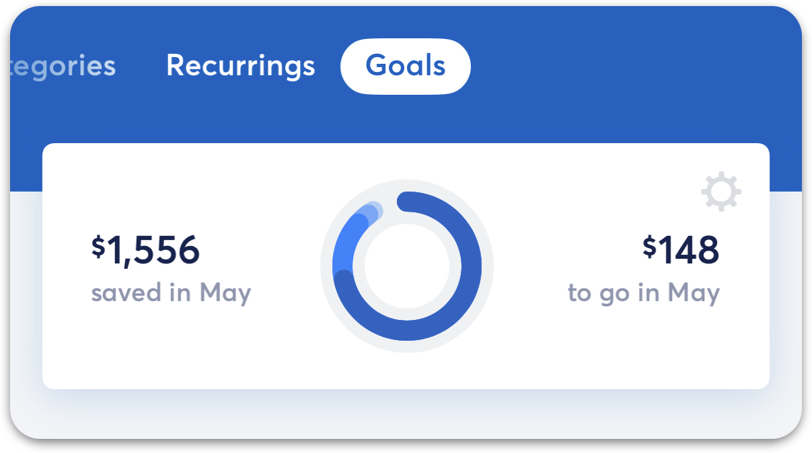
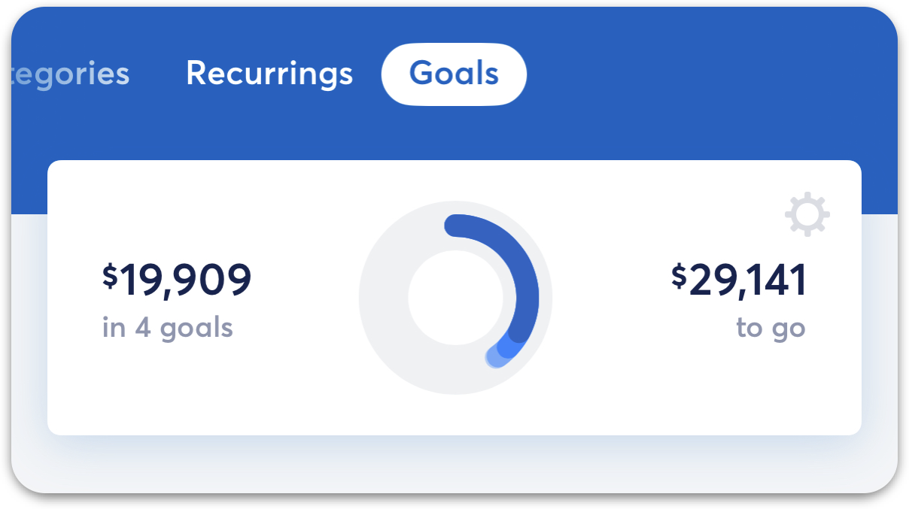

# Archiving Goals

**Source:** https://help.copilot.money/en/articles/11100497-archiving-goals

Archiving a Goal permanently closes a goal while allowing you to keep a snapshot of the money you saved. **This is a permanent action and cannot be undone.**

---

# When to Archive a Goal

When you've completed a Savings Goal and don't want to reactivate it, you can choose to archive it. You can also archive a Goal that has not been completed.

**A few things to note:**

- Your historical information will be frozen, so you won't be able to edit allocations or transactions associated with the Savings Goal.
- All balances associated with the Savings Goal will be removed. This means that your funds are now available to use towards another Savings Goal. **Archived Goals cannot be un-archived.**

Archiving is a great option for Goals that are one-time expenses, like your Wedding or Summer Vacation. If you'd prefer to keep spending and saving from a funded Goal, you can reactivate it instead. Learn more about **[spending from a Savings Goal](https://help.copilot.money/en/articles/11100511-spending-from-savings-goals)**.

# How to Archive a Goal

**In the iOS app**, tap the Goal > Tap the wheel icon on the top right corner > Archive goal > Archive.

**In the macOS app**, click the Goal > Click the "..." on the top right corner > Archive goal > Archive.

# Deleting a Goal

If you'd prefer to remove the Goal entirely, you can delete it using the same steps above. Doing this will unlink any balances or transactions you've associated with the Goal. Just like with archiving a Goal,**deleting a Goal cannot be undone**.

👋 Still have questions? Contact us via the in-app chat.

---
Related Articles[Pausing and Archiving Recurrings](https://help.copilot.money/en/articles/3983286-pausing-and-archiving-recurrings)[Updating Goal Progress](https://help.copilot.money/en/articles/11100474-updating-goal-progress)[Spending from Savings Goals](https://help.copilot.money/en/articles/11100511-spending-from-savings-goals)[Goals FAQ](https://help.copilot.money/en/articles/11139571-goals-faq)[Savings Goal Tab Overview](https://help.copilot.money/en/articles/11470324-savings-goal-tab-overview)
