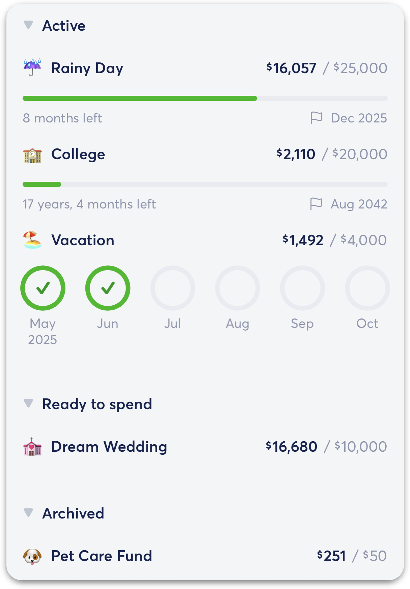
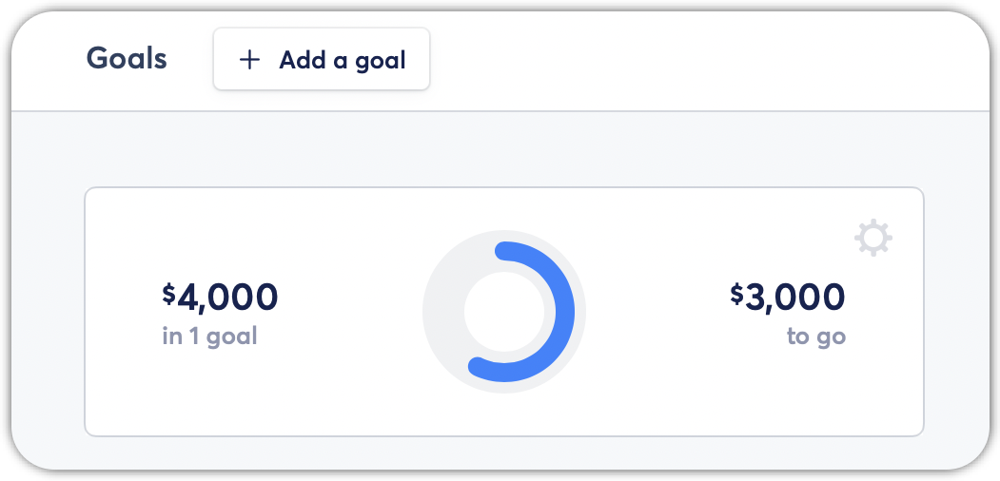
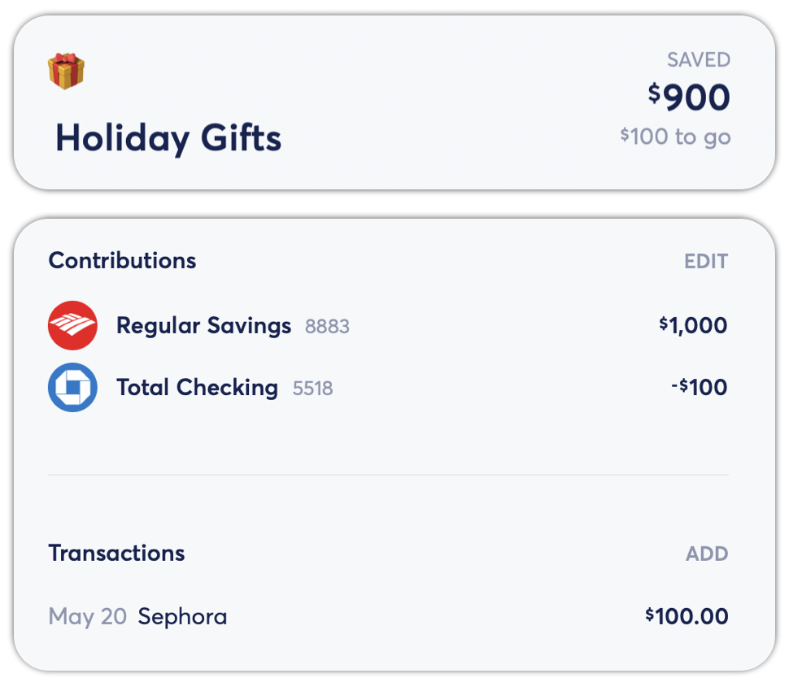
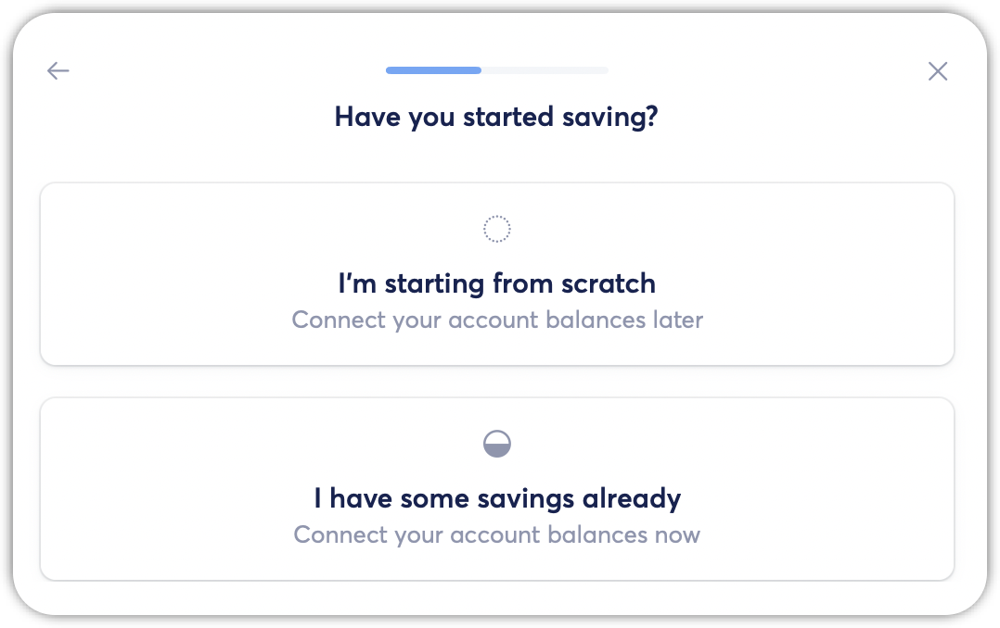
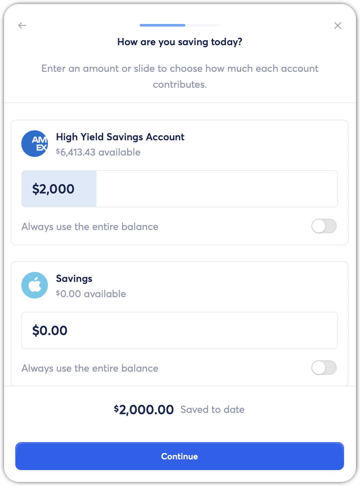
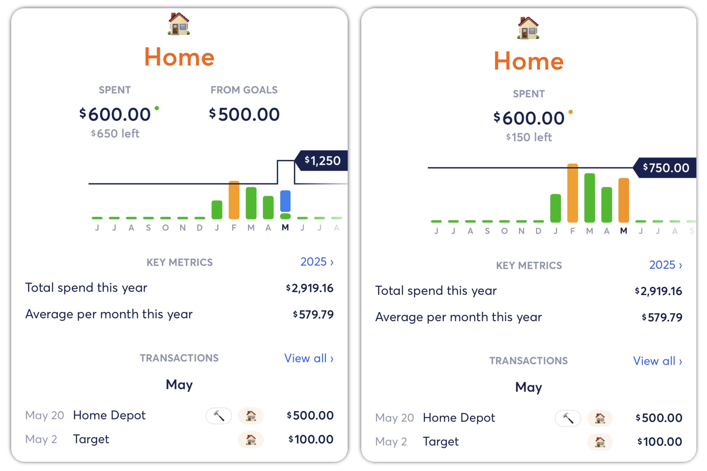

# Spending from Savings Goals

**Source:** https://help.copilot.money/en/articles/11100511-spending-from-savings-goals

When you allocate balances or add transactions to a Savings Goal, this money isn't considered spent – it's considered saved up for future use. However, you can spend your saved funds at any time, and your Goals will adjust accordingly.

---

# Spending from an Active Savings Goal

When a Goal is **Active**, it means you're still working to reach your target amount. You can track how you've dipped into Active funds via account balance or transactions.

## Allocating Balance

Edit how much of your account balance you're allocating towards a Savings Goal.

**In the iOS app**, tap the Goal > Update progress > Edit allocations > Slide the balance bar to the desired amount with your finger *OR* tap the current allocation amount and type in a new number > Continue. As a shortcut, tap "Allocations" next to Contributions.

**In the macOS app**, click the Goal > Update progress > Edit allocations > Slide the balance bar to the desired amount with your mouse *OR* click the current allocation amount and type in a new number > Continue. As a shortcut, click "Edit" next to Contributions.

Learn more about **[updating your Savings Goal progress by allocating balances](https://help.copilot.money/en/articles/11100474-updating-goal-progress#h_87cca90cb1)**.

## Adding Transactions

Add any spending transaction to count against the money you've saved.

### Example

Let's say you have an Emergency Fund with a target amount of $5,000. You've already saved $4,000, so you have $1,000 left to save.

If you have an unexpected car expense of $500, you can associate that car transaction with this Goal.

Your Emergency Fund will dip to $3,500 saved. So you'll have $1,500 left to reach the target amount.

**In the iOS app**, tap the Goal > Update progress > Add transactions > Type in the search bar > Tap on one or multiple transactions > Add to goal. As a shortcut, tap **"**Add transaction" next to Transactions.

**In the macOS app**, click the Goal > Update Progress > Add transactions > Type in the search bar > Click on one or multiple transactions > Add to goal. As a shortcut, click "Add"next to Transactions.

Learn more about **[updating your Savings Goal progress by adding transactions](https://help.copilot.money/en/articles/11100474-updating-goal-progress#h_0b602effa8)**.

---

# Spending from a Ready to Spend Goal

When a Goal is **Ready to Spend**, it means you've already saved the target amount. Your funds are now ready to use!

Similar to spending from an Active Goal, you can either adjust your balance allocation or add transactions to count against your Ready to Spend Goal.

### Example

Let's say you've been saving for Holiday Gifts throughout the year and have reached your target amount of $1,000.

If you buy a $100 gift, you can associate that transaction with Holiday Gifts.

The Holiday Gifts Goal will dip to $900 saved. Then you can choose to keep spending from this Goal, or save another $100 to reach your target amount again.

---

# Goal Settings

You can always adjust how any active or ready to spend Goal responds when you dip into saved funds. **In the iOS app**, tap the Goal > Tap the wheel icon on the top right > Toggle settings on/off. Or, you can access this view by tapping "Goal settings"next to Summary.

**In the macOS app**, click the Goal > Click the "..." button > Toggle settings on/off.

## Reactivate When Funds Dip

When this setting is enabled, your completed Savings Goal will automatically move from **Ready to Use** to **Active** if your fund falls below the target amount. Then you can continue working towards your target amount again. Enabling reactivation is useful for Goals you expect to frequently spend money from, like sinking funds.

## Update Budgets on Spend

When this setting is **enabled**, Regular transactions associated with a Savings Goal are not included in your category spend. Instead, Savings Goal spend is separated from your monthly spend to show that you set aside money for these Savings Goal transactions. Savings Goal spend appears as a blue bar in the category view. If you disable this setting or delete the Goal, all associated transactions revert to being included in your monthly spend as usual.

When this setting is **disabled**, Regular transactions associated with a Goal are included in your category spend. This allows you to track all your spending – whether for a Goal or not – in Regular categories.

### Example

Let's say you have a $500 home repair transaction associated with your Home Improvement Goal.

If *Update budgets on spend* is enabled, your "Home" category budget will experience a $500 bump to show that you already set aside money for this transaction.

If *Update budgets on spend* is disabled, this $500 transaction will count towards your monthly "Home" spend.

*The "Home" category when*Updates budgets on spend*is****enabled****vs.****disabled:***

👋 Still have questions? Contact us via the in-app chat.

---
Related Articles[Creating New Goals](https://help.copilot.money/en/articles/11100462-creating-new-goals)[Updating Goal Progress](https://help.copilot.money/en/articles/11100474-updating-goal-progress)[Archiving Goals](https://help.copilot.money/en/articles/11100497-archiving-goals)[Goals FAQ](https://help.copilot.money/en/articles/11139571-goals-faq)[Savings Goal Tab Overview](https://help.copilot.money/en/articles/11470324-savings-goal-tab-overview)
