# Investments Tab Overview

**Source:** https://help.copilot.money/en/articles/5377645-investments-tab-overview

Copilot's Investments tab allows you to view all of your investments in one place.

---

# **Display Settings**

In the main display, you can choose to view your Returns or Balances. Enable Live Balance Estimate to update your balance based on the most recent market data. Your live balance is represented by a dashed line.

In these settings you can enable a Benchmark, which will compare the performance of your Investments to another specific holding. We currently offer the following options for Benchmarks:

- Vanguard S&P 500 ETF
- Vanguard Total Stock Market ETF
- iShares Core MSCI Total International Stock ETF
- Vanguard Total International Bond ETF
- iShares Core MSCI Emerging Markets ETF
- Invesco QQQ Trust, Series 1
- Vanguard Real Estate ETF
- iShares Core MSCI EAFE ETF
- Bitcoin
- Ethereum
[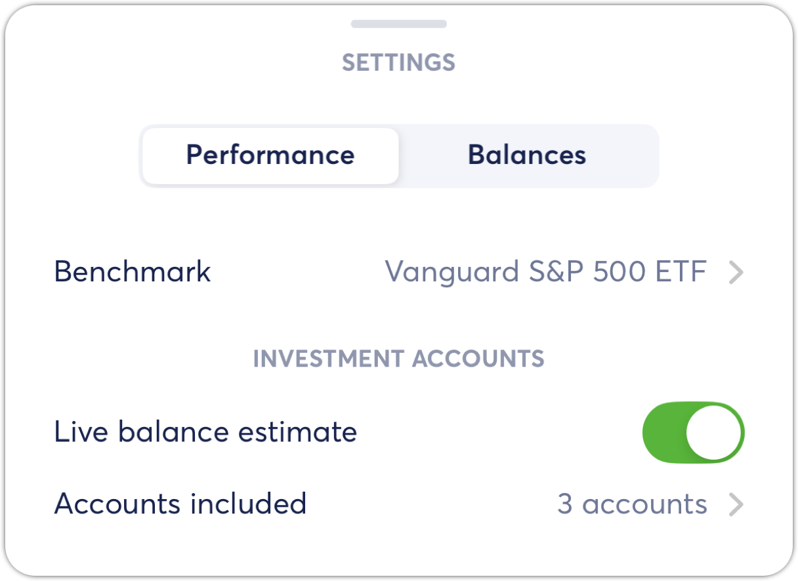](https://downloads.intercomcdn.com/i/o/gw2wbwl7/1278100852/9220360640d75738b3c1a96c993c/image.png?expires=1773322200&signature=3d4d30b675bda32aa82151135cc4b4cfa8d51dfcffad8750612e309dd9e0b5ac&req=dSIgHsh%2BnYlaW%2FMW1HO4zRgfEe2qGA%2FCF9wjDwhGpFnV7xV03b5FiqVVQCt4%0ADSEiJGwJB64kZfIksTo%3D%0A)
You can also select the accounts to display in Investments. If you turn off an account, then the account data will be removed from the Main Display, Accounts, Allocation and Holdings sections on the Investments tab.
​
[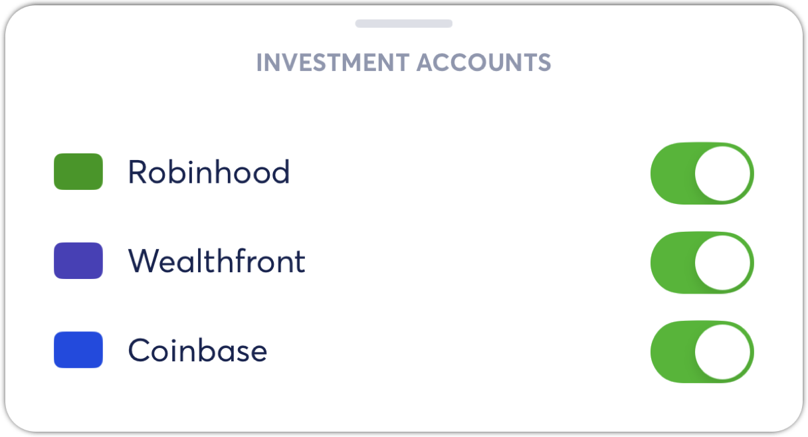](https://downloads.intercomcdn.com/i/o/gw2wbwl7/1278105661/85730de4114370fc2cf964d999aa/image.png?expires=1773322200&signature=365f3c395331eb81bf3144cd7e61048e1d5ee05c5ffc1790195af505760c21cf&req=dSIgHsh%2BmIdZWPMW1HO4zR188PND%2Fp5%2FuUOybIqNMMJ7jtf0YOAW%2FBe1ot2W%0AqCxPuYxbir5cJPlouFw%3D%0A)
## Live Balance Estimates

In order to improve the experience of keeping track of your investments, we created the option to turn on live estimates for your account balances. We combine near real-time market data with the once-a-day update we receive from your institutions to show you how your holdings are performing today. See more details [here](https://intercom.help/copilotmoney/en/articles/5497913-live-balance-estimates).

## Performance

We look at how your holdings perform over time by excluding the transfer of funds into or out of your investments account. See more details [here](https://intercom.help/copilotmoney/en/articles/5497919-estimated-returns).

Note that performance is only calculated for linked investment accounts and manual holdings accounts, because we calculate returns based on your holdings. See more details about manual holdings accounts [here](https://help.copilot.money/en/articles/6097003-tracking-holdings-with-manual-accounts).

# **Your Top Movers**

This section displays your securities that are changing the most during market trading hours. Choose to display top movers based on either the Price Change or Your Equity Change.
[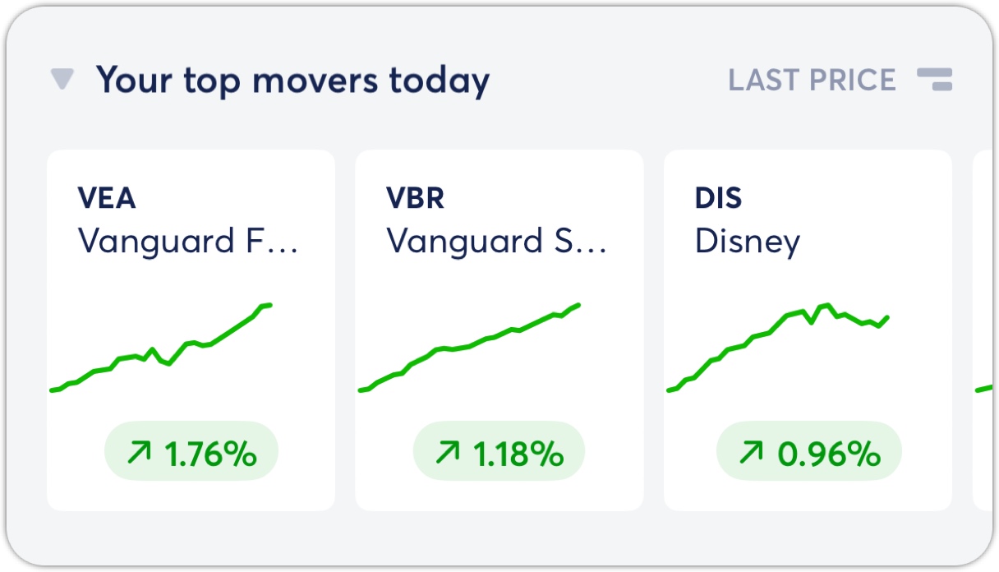](https://downloads.intercomcdn.com/i/o/gw2wbwl7/1278106362/a50db8416dce037c28afe2e70035/image.png?expires=1773322200&signature=b56a22989f068b800a0a2216a452debbced16ca6a4a3d2d06671eeae3b72cf83&req=dSIgHsh%2Bm4JZW%2FMW1HO4zS7k82ME%2BiHtROvS6UapT2HKiJCnUNDfaz2ZFIVd%0ARarwcus7WuA4N%2FoMyEM%3D%0A)
# **Accounts**

The Accounts list view displays all of the linked and manual Investment accounts enabled in the Main Display.

- You can update the list view timeframe by adjusting the Main Display.
- You can choose to display your Return, Balance Change or Balance.
[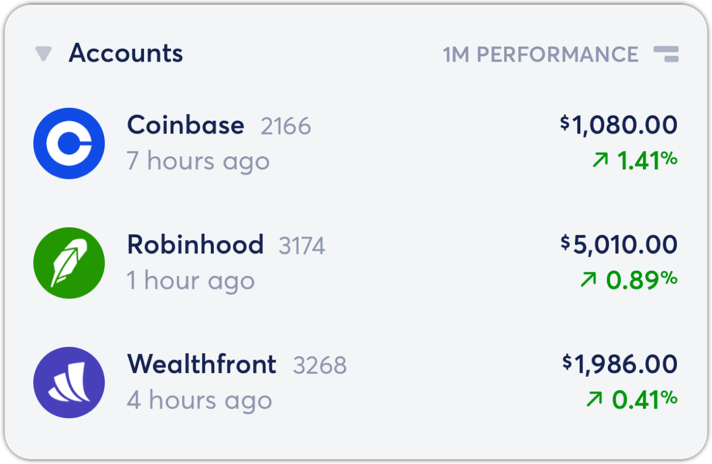](https://downloads.intercomcdn.com/i/o/gw2wbwl7/1278106953/6377e16a10870a55103aba3752c0/image.png?expires=1773322200&signature=55a4a6f765bc13591c27a820952948e7bf3ef01559832cdab2a3b3a47f29ffe1&req=dSIgHsh%2Bm4haWvMW1HO4zZUPgBPrGhgNKXmPe2NTfFebjTKXWD0x12a3MemS%0AV8zQ%2B9g6AeS1MlDBpUs%3D%0A)[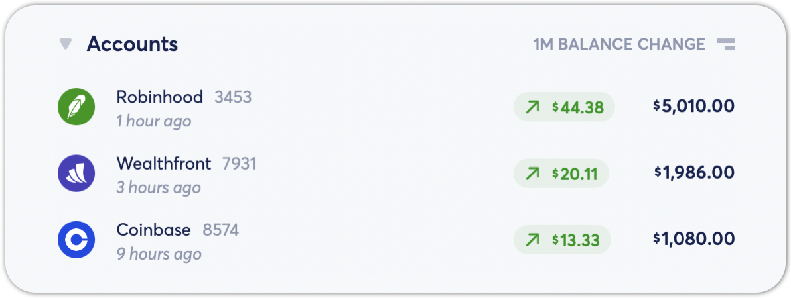](https://downloads.intercomcdn.com/i/o/gw2wbwl7/1293450119/05701ce891c05866c482faa33fb2/image.png?expires=1773322200&signature=ab0458e644c16313ab02f46d6e95a8cbde02950d54bacdc4383b1eb4fb4a9381&req=dSIuFc17nYBeUPMW1HO4zedumPNXAht%2BcSZVukUHw9l1aRHF7yJy8T3Xb3xj%0ABzOyHofQSkbQ62i071Y%3D%0A)
When viewing an individual account, you can adjust the time frame and choose to enable or disable Live Balance Estimate for that specific account. You can also enabled Benchmarks for that specific account.
[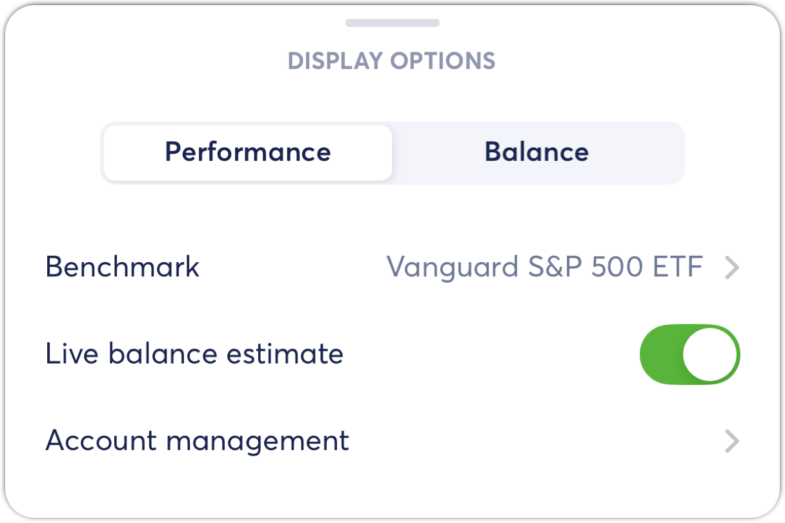](https://downloads.intercomcdn.com/i/o/gw2wbwl7/1278107724/422d42c1a2cc5a603149e5e64cf2/image.png?expires=1773322200&signature=731d89a0cb9d160bfffabcc51d0c83359098d7da279d4b9b4b28129f77826ec1&req=dSIgHsh%2BmoZdXfMW1HO4zezWHgtXOSF2WUS9SOSiFYfnzaDdbr7VLtzexi2l%0ALNqpFvo5ouZ0nNjrj04%3D%0A)[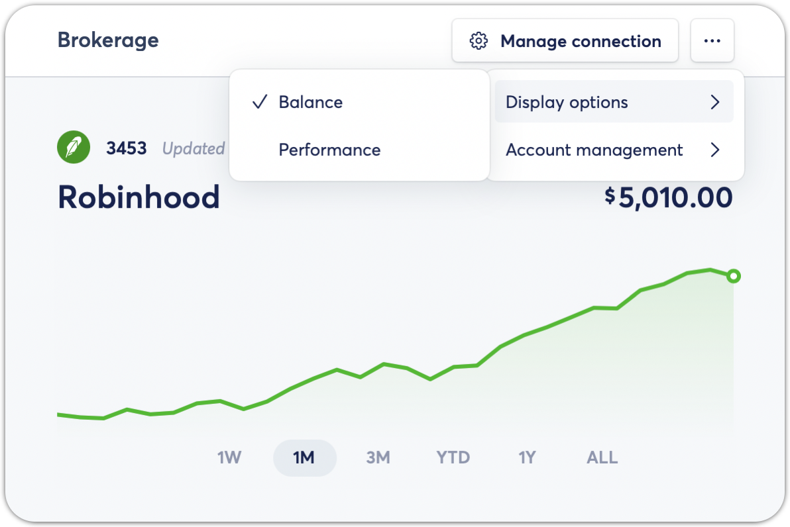](https://downloads.intercomcdn.com/i/o/gw2wbwl7/1293450947/89f0fcba59bc55b5690184ed8e23/image.png?expires=1773322200&signature=56c56e973e00a398ab4fe9c0d631abb5260398f26ca8ead4075c45613171790f&req=dSIuFc17nYhbXvMW1HO4zQHnHItKO6EdEjnT5C%2BOJShUi7A%2BwfDQd7vPwpx%2B%0A4e2dqGLa0Y8YF9pOqao%3D%0A)
From the account view, you can select an individual security for detailed information about your holdings. See more details about the security display options below.

- **Note that your holdings are updated once per day after the market closes.**

# **Allocation**

This section displays your investment allocations based on the types of securities held in linked accounts.
[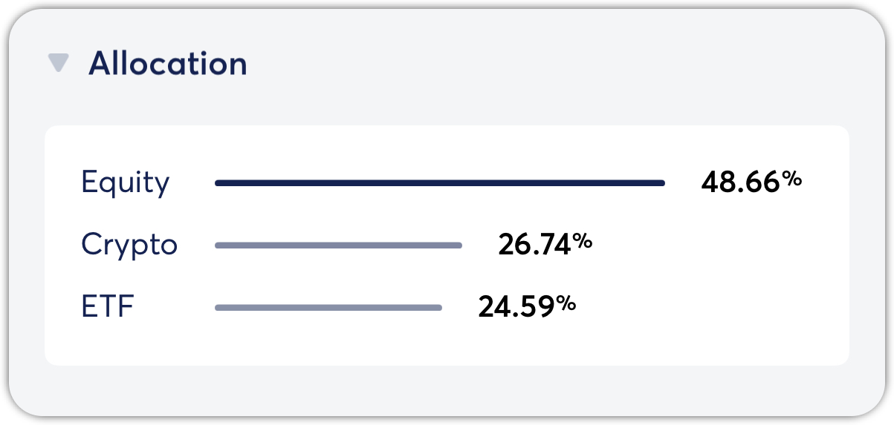](https://downloads.intercomcdn.com/i/o/gw2wbwl7/1293455512/9cbc494828bd570f8615e2459215/image.png?expires=1773322200&signature=2bd971fc85d19147421953f2fbd9bb6268e7e7146b2a0609d80c8d624b6d855f&req=dSIuFc17mIReW%2FMW1HO4zTZUbBR6wIq160%2FxC%2FFmsvhP5mQYX8tZN9HvjCet%0AcaiO5jdyBwFCnDMBNMY%3D%0A)[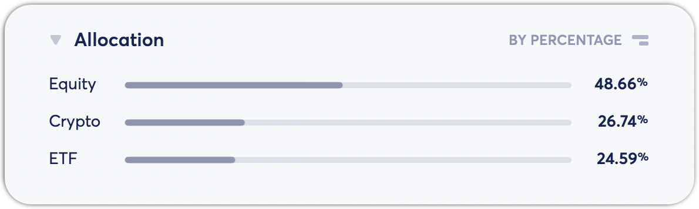](https://downloads.intercomcdn.com/i/o/gw2wbwl7/1293451525/fd88afd05a97ed76d3b822535c88/image.png?expires=1773322200&signature=2e763841fccaf9e1c9e9e6014cb156a32b1c37649dabdd09ab2c7710b5fabd8e&req=dSIuFc17nIRdXPMW1HO4zfXsnkxgUHcvQvdfeYPVhikt1kgqT6LMwslgaNTo%0At15HpAF4Q7SwZ2DANl8%3D%0A)
Security types currently available:

- **Cash**: cash, currency and money market funds
- **Derivative**: Options, warrants and other derivative instruments
- **Equity**: Domestic and foreign equities
- **ETF**: Multi-asset exchange-traded investment funds
- **Fixed Income**: Bonds and CDs
- **Loan**: Loans and loan receivables
- **Mutual Fund**: Open and closed-end vehicles pooling funds of multiple investors
- **Other**: Unknown or other investment types

We are planning to implement allocation improvements, including enhanced classification and visualization.

# **Holdings**

The Holdings list view displays all securities from linked Investment accounts. You can update the list view timeframe by adjusting the Main Display.

## Holdings Display Options

**Last Price**: The Last Price data is delayed by ~15 minutes. For securities, we receive Last Price updates during market trading hours. For cryptocurrency, we receive Last Price updates 24/7.

**Your Equity**: Between daily account data refreshes, we estimate your equity for each security at the time of the Last Price update.

**Quantity**: We receive your total number of shares of each security in the daily account data refresh after the market closes. Any changes you make to your connected accounts during the day (trades, deposits, and withdrawals) will only be reflected in the app the day after when we receive the daily refresh.

**Equity Allocation**: This is calculated based on Your Equity.

# **Security Display Options**

When viewing an individual security, you can customize the data displayed.

- **Display Options:**Last Price, Your Equity or Quantity
- **Change Indicator**: By Percentage or By Amount

We also provide your average cost and total return metrics, if we have received the necessary information from your institutions. If you have a security in multiple linked investment accounts, then your holdings are consolidated to display your total positions for each security.
[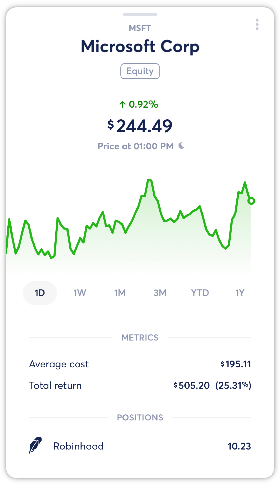](https://downloads.intercomcdn.com/i/o/530132029/7069506771ab91a2c8901869/Security_Display.png?expires=1773322200&signature=0ca01e7c3a2c5c6dfdba26407c6dd996b03912202493345cfa9b07b7aa207299&req=cSMnF8p8nYNWFb4f3HP0gJdbhaRKAJRp9cvYodTehSqqrpxgeE7Qyq9bwARG%0Aoq53y8Aw2WuXTAsj1w%3D%3D%0A)[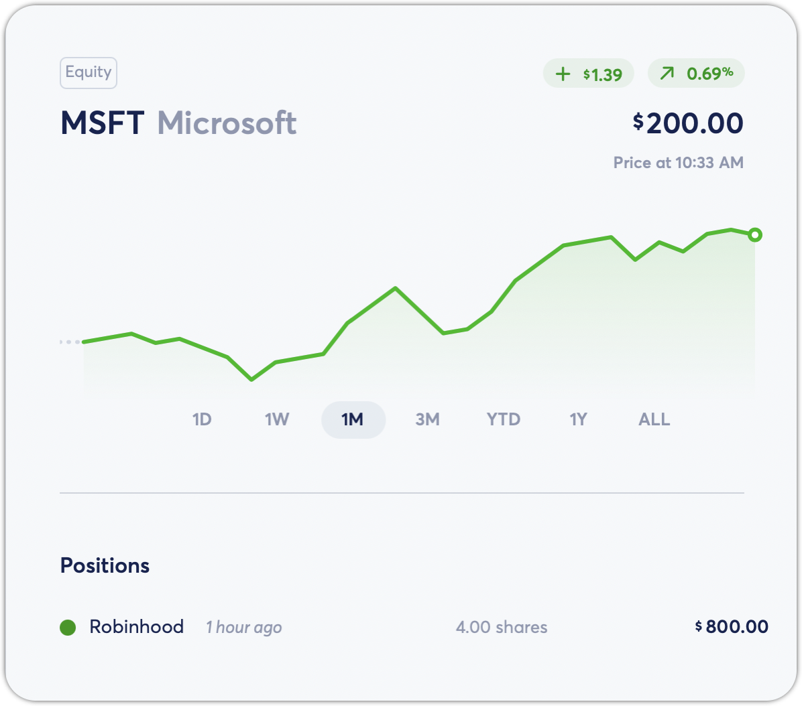](https://downloads.intercomcdn.com/i/o/gw2wbwl7/1293453552/a7cae8e93b3dc2609d7d76f2c9f9/image.png?expires=1773322200&signature=ac603cddaeae441aa0dd2b3355ae6d7240c9274c33f7cbdf45ac77c2bb485a15&req=dSIuFc17noRaW%2FMW1HO4zWYJplhyoNL2m3ZYBNiQ5nRaq2ur1GmYOCj73UMt%0Av%2F0RCjQC42g6sjOQUuc%3D%0A)
👋  **Still have questions?** Contact us via the in-app chat.

---
Related Articles[Calculating Investment Performance](https://help.copilot.money/en/articles/5497919-calculating-investment-performance)[Dashboard Tab Overview](https://help.copilot.money/en/articles/6045480-dashboard-tab-overview)[Accounts Tab Overview](https://help.copilot.money/en/articles/6213732-accounts-tab-overview)[Recurrings Tab Overview](https://help.copilot.money/en/articles/9778259-recurrings-tab-overview)[Investment Account Limitations](https://help.copilot.money/en/articles/10262766-investment-account-limitations)
