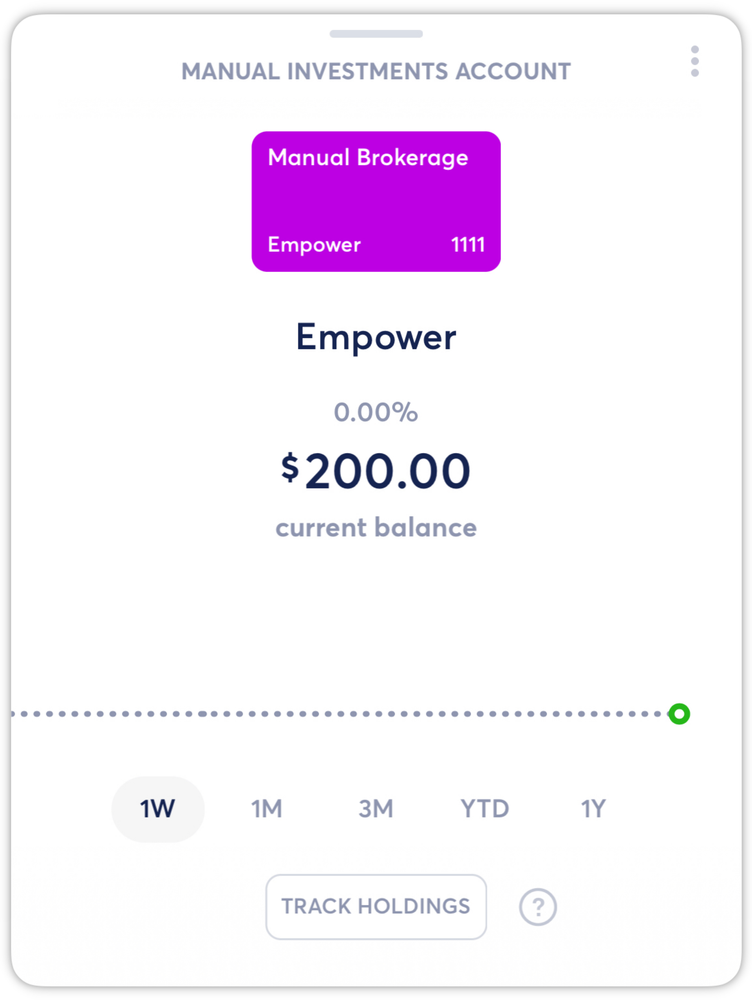
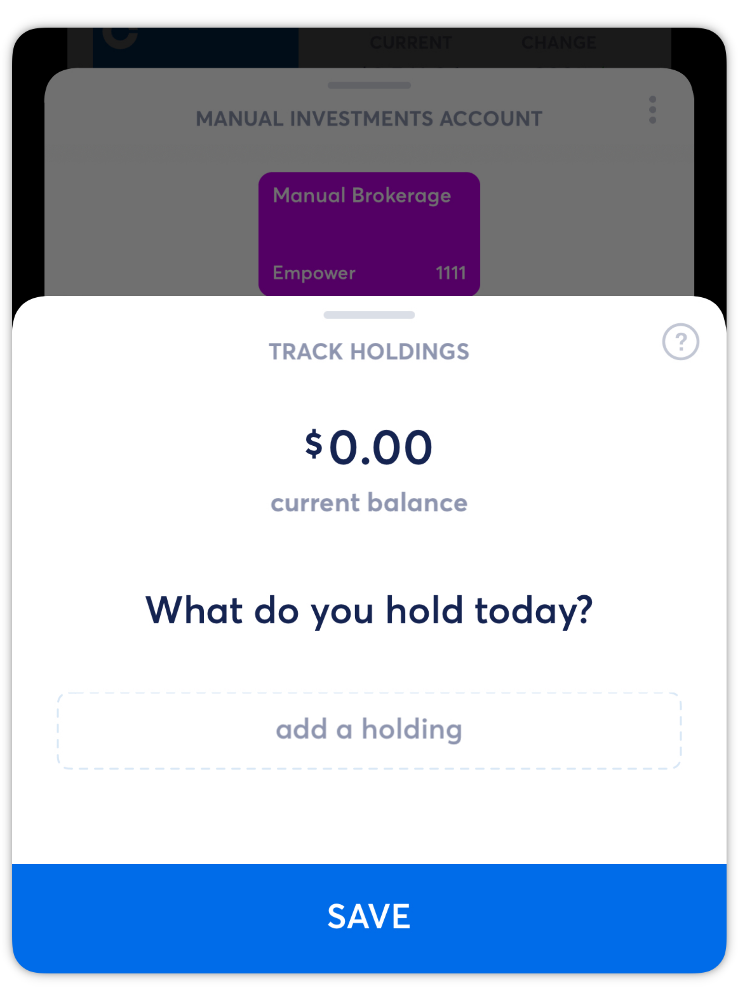
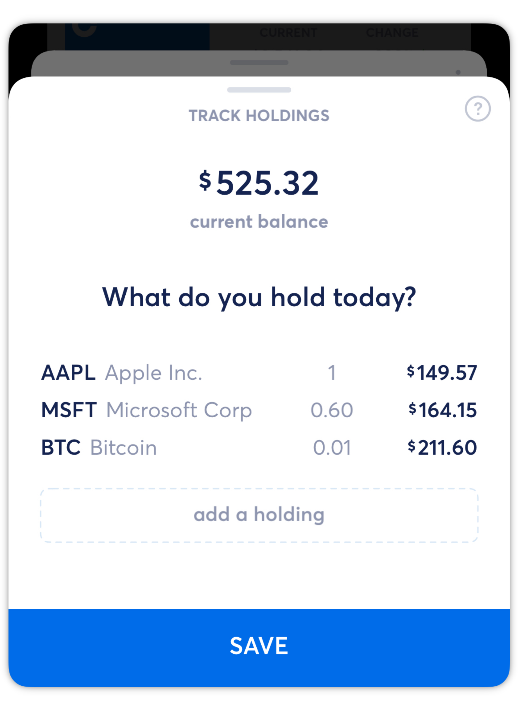

# Migrating Investments Accounts

**Source:** https://help.copilot.money/en/articles/6096952-migrating-investments-accounts

If you have been tracking an investment account through balances manually for an institution we don’t yet support, you’ll now be able to track it manually through your holdings.
​
Once you enter what you currently hold, Copilot will automatically keep track of your balance and give you the same live estimate you can see for your other investment accounts.

To migrate a manual balance account to a manual holdings account, tap on **TRACK HOLDINGS** at the bottom of the account view.
​

Then, tap **add a holding** to search for your existing holdings and enter the current quantities (what you hold as of today) within your account. Copilot's near real-time price will be listed alongside each holding.

After entering all holdings for the account, tap **SAVE**.

Migrated from a manual balance account to a manual investment account, Copilot will now automatically keep track of your balance and give you the same live estimate you can see for your other investment accounts.
​
​**[Tap here to learn how to record movements in a manual holdings account.](https://intercom.help/copilotmoney/en/articles/6097003-tracking-holdings-with-manual-accounts#h_f89ba02b65)**

​

## 👋 **Still have questions?**Contact us via the in-app chat.

---
Related Articles[Creating Manual Accounts](https://help.copilot.money/en/articles/4537532-creating-manual-accounts)[Tracking Holdings with Manual Accounts](https://help.copilot.money/en/articles/6097003-tracking-holdings-with-manual-accounts)[Real Estate Accounts](https://help.copilot.money/en/articles/8047816-real-estate-accounts)[Investment Account Limitations](https://help.copilot.money/en/articles/10262766-investment-account-limitations)[Understanding Manual Accounts](https://help.copilot.money/en/articles/10682991-understanding-manual-accounts)
