# Tracking Holdings with Manual Accounts

**Source:** https://help.copilot.money/en/articles/6097003-tracking-holdings-with-manual-accounts

Once you enter what you currently hold, Copilot will automatically keep track of your balance and give you the same live estimate you can see for your other investment accounts.

If you have a manual investment account (tracked by balance), you can learn how to [migrate this account to a manual investment holding account here](https://intercom.help/copilotmoney/en/articles/6096952-migrating-investments-accounts).

---

# Creating a Manual Holdings Account

To create a manual holdings account, tap on **add >** next to the Investments section of the Accounts tab or the **+** icon on lower right corner **>** Investments. Then, tap **Track holdings manually**.

To start populating your holdings, tap **add a holding**.
[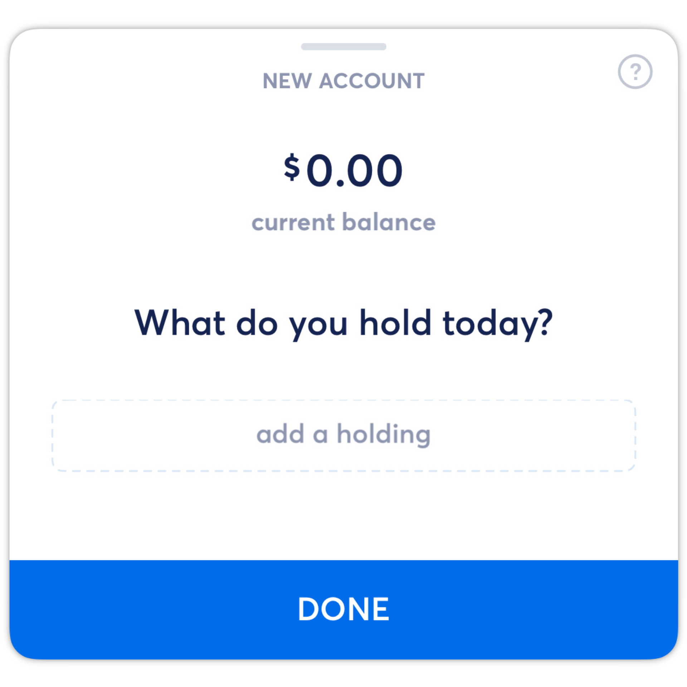](https://downloads.intercomcdn.com/i/o/525520945/d4850ee56225f7d5a805a9df/Pic01.png?expires=1773322200&signature=663ad6273316b0b6887f44821b1d06f3b491a3815c0aae5f49b174267f78492a&req=cSIiE8t%2BlIVaFb4f3HP0gGmRjDMQvm5BiLPvu5Le7oMcIXtuudLNKKTye9MM%0AnOzDOSc%2F60dTPxeidg%3D%3D%0A)
Tapping on **add a holding** will bring up a list of all securities and cryptocurrencies that are trackable in manual holdings accounts. The near real time live price is listed next to the security.
[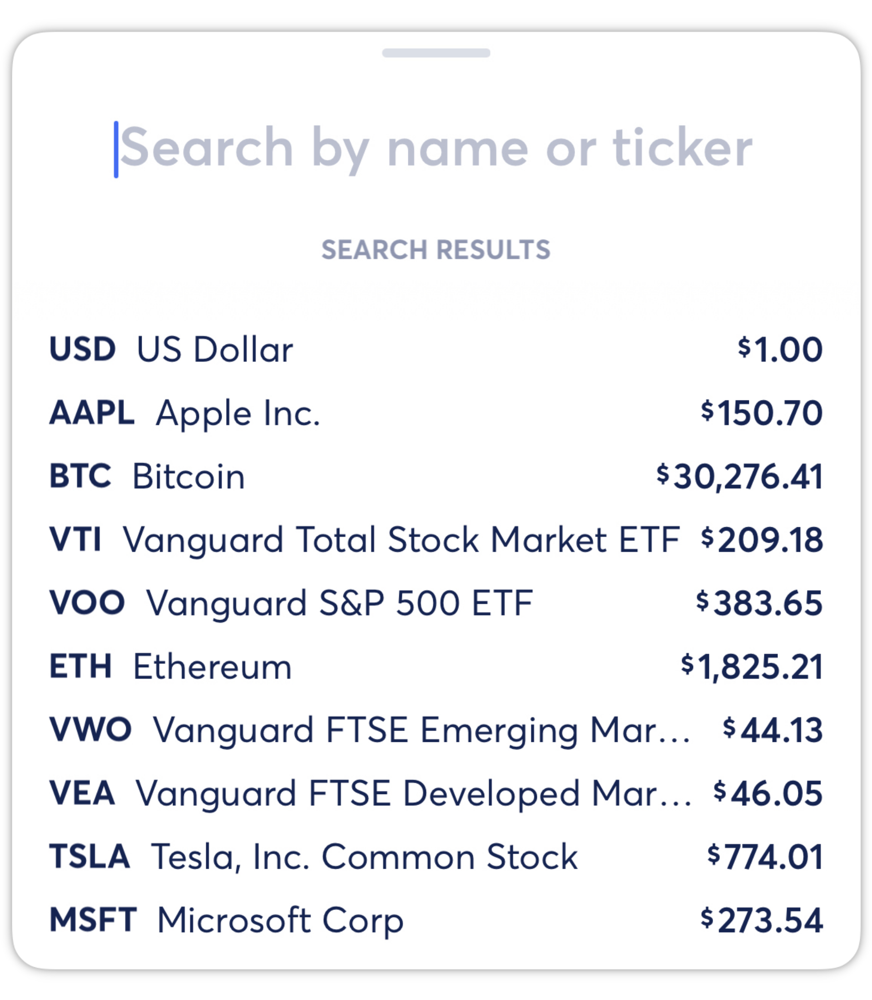](https://downloads.intercomcdn.com/i/o/525521010/f962f0d30f508fdeefbfc2a6/Pic02.png?expires=1773322200&signature=80fd748173de767609059ecfe88dc75eebe4b22fbc9c88ec42962aa423a84a7e&req=cSIiE8t%2FnYBfFb4f3HP0gCsZV6TG4QTDTtmLEhrfx%2BKTYuxiBtuSBo68MhRK%0AXLwORjY%2FDk3uPYJl9w%3D%3D%0A)
After selecting a security, you will be prompted to enter how much of the selected security you hold (fractional shares supported). Then, tap **SAVE**.
​
[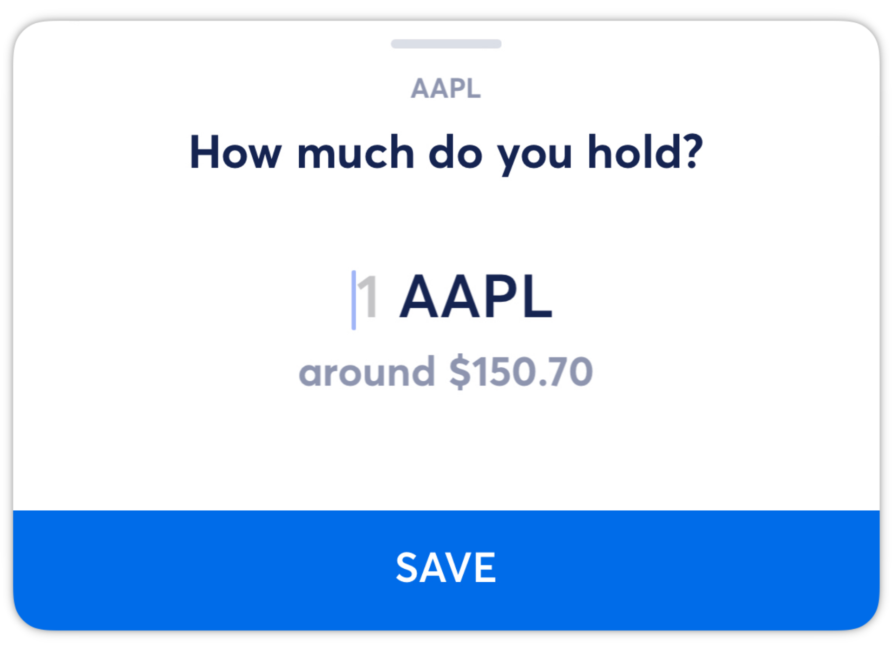](https://downloads.intercomcdn.com/i/o/525521089/63e1c6a74dfdfa6ac5063346/Pic03.png?expires=1773322200&signature=688849aa00c663feb19985b444b40e956bb317a76134fa8d0f29e9b37be1fd80&req=cSIiE8t%2FnYlWFb4f3HP0gOZNtgIVJU2ac%2BMtAL0udV70eXK8IkH1AeE2YTpl%0AYtLiAiBAh%2FiZJuEeLw%3D%3D%0A)
Next, continue to tap **add a holding** to enter all current holdings for this account. Adding all current holdings during the set-up process is important, as we use this information as a reference for all future movements and returns calculations.
[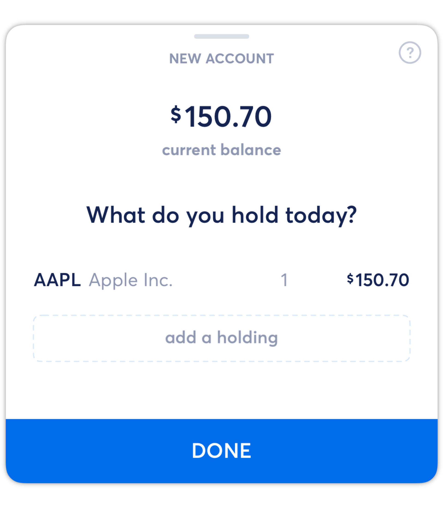](https://downloads.intercomcdn.com/i/o/525521153/e1dfaebe457a64bc15c3ebb5/Pic04.png?expires=1773322200&signature=0336f9813eb83327ff71564cd503ce5241c2bd669116c5491ed5b135f3626709&req=cSIiE8t%2FnIRcFb4f3HP0gEapSM%2Fb7ubNZPUXrgW%2BGU7w4STqIjpTnBrauY4l%0ARGFvV02Y4mA521blxg%3D%3D%0A)
After you've entered all of your current holdings for the account, tap**DONE**.

Then, enter the account name and select an account color.
[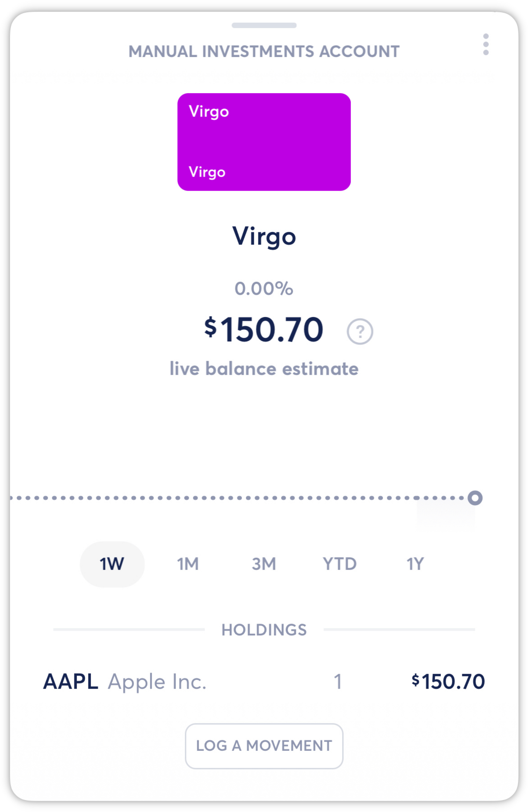](https://downloads.intercomcdn.com/i/o/525521346/e0bd6edb827645f504965464/Pic06.png?expires=1773322200&signature=8c0902ee64b1fb07ec2485925a10121e5907486063674d025b255596123cc71e&req=cSIiE8t%2FnoVZFb4f3HP0gLxdv9NgdwoxbPb5zjb2NCerRopr50ldJTLR9MYZ%0AKAGQ3hy8CBFs1Jkv9Q%3D%3D%0A)
After setting up your manual tracking account, Copilot will start to automatically keep track of your balance based on your holdings and give you the same live estimate you can see for your other investment accounts.
​

---

# Logging Movements

Logging movements for your manual holdings account allows you to mimic movements in your investment account to maintain an accurate live balance estimate.
​
​**Please note:**Any movements created prior to the account creation date will not affect the current holdings, as Copilot assume what you entered on the account creation date were the current true holdings. However, historic movements will affect the historic data in the chart.

## Buy

To log a buy, tap **LOG A MOVEMENT** at the bottom of the account view.

Then, enter the quantity bought in the movement.
[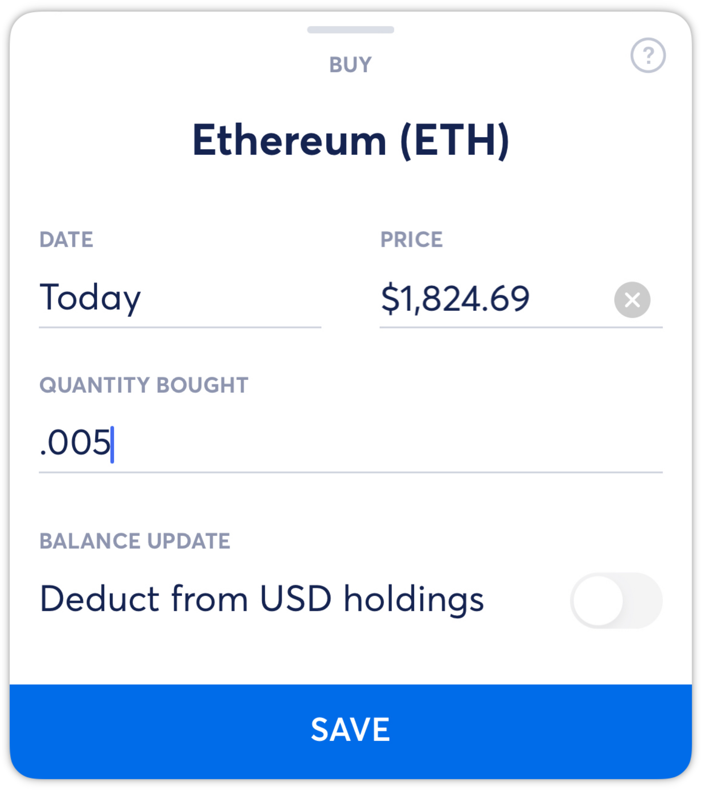](https://downloads.intercomcdn.com/i/o/525536475/5792068ceb1f3770a2cef045/Pic07.png?expires=1773322200&signature=edbf7b725ceeafdc65a938e009736cefbcb52a17f2d5695115b82f85a02de9b5&req=cSIiE8p4mYZaFb4f3HP0gGc0v0hzFAwstJK%2BJQxKYF7LQ5xxOraZrUTi%2BgjN%0A7dLrv0W0K%2By%2BSNBqYw%3D%3D%0A)
The date is pre-populated for today's date and the price is pre-populated for the current price. Editing the date will also change the pre-populated price. You can edit either of these fields by tapping on them.

The**Deduct from USD holdings** toggle will be editable if you have any USD holdings currently in this manual holdings account. If not, this option will not be editable.
​
​**Please note:**The USD holdings for an account cannot go below $0, so if you have $10 in the account and log a buy movement for $20, the USD holdings will update to $0 and we assume that the $10 was transferred from an outside account.

After reviewing and/or editing the all fields, tap **SAVE** to save the movement.

## **Sell**

To log a sell, tap **LOG A MOVEMENT** at the bottom of the account view.

Then, select the holding you are selling (all or partial).
[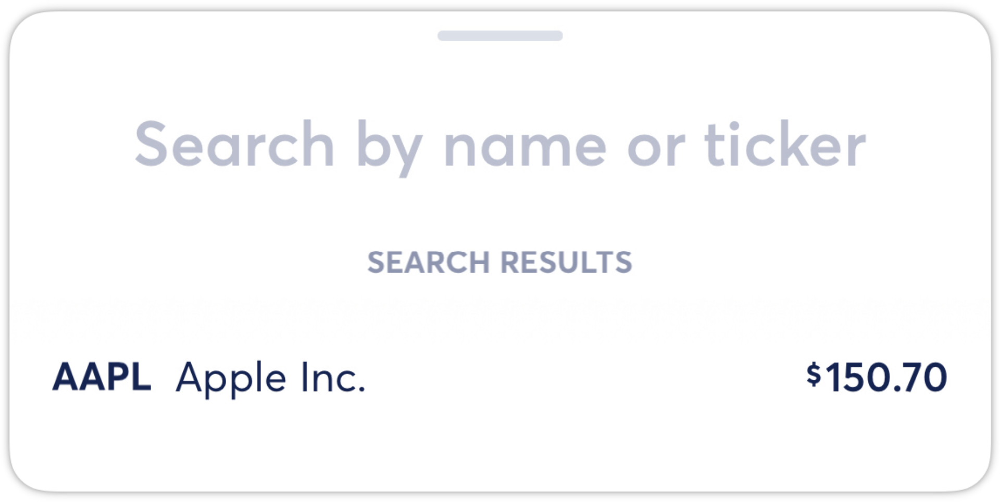](https://downloads.intercomcdn.com/i/o/525536546/84058be8b2779b459e920465/Pic08.png?expires=1773322200&signature=84449a967350b624af3376d9c3615dcf39502996f964b34671cfcb271fc09c7e&req=cSIiE8p4mIVZFb4f3HP0gJyqkvWZCHuolpEMNutBmyKRhaXKlrcew%2FA55NaA%0Ai3%2FNgQasqKRcoJlySw%3D%3D%0A)
After selecting the holding, enter the quantity sold.
[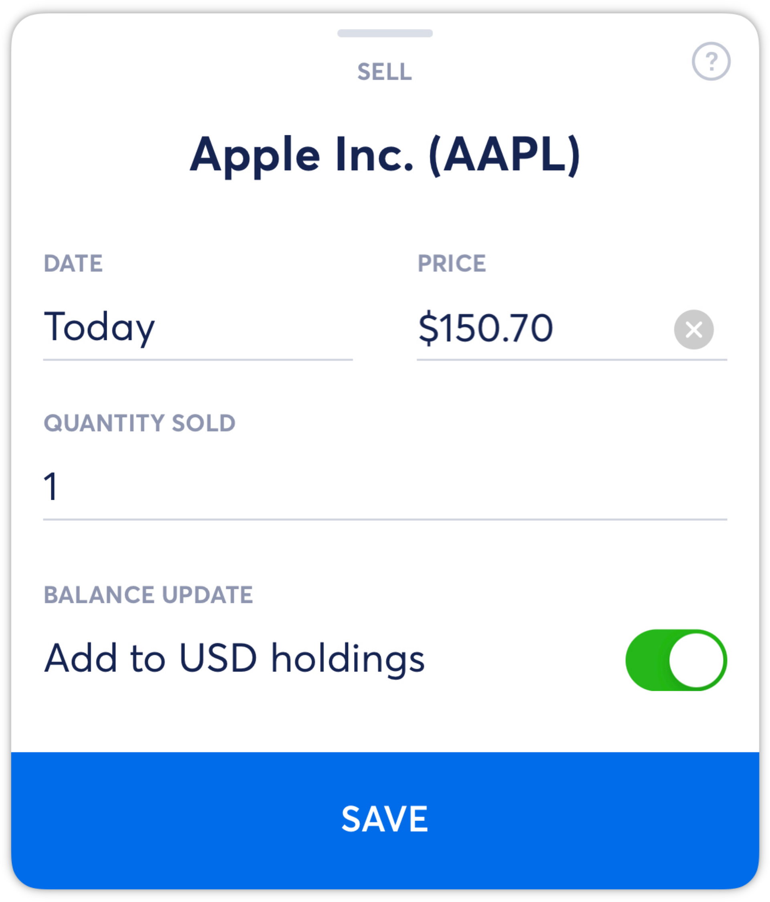](https://downloads.intercomcdn.com/i/o/525536588/1e8dd2333931241332ef82df/Pic09.png?expires=1773322200&signature=4f37d6ebfb868eb455f5aca06075d9a3c5d0d6d91a8b2f8232b0b286bbcc4223&req=cSIiE8p4mIlXFb4f3HP0gJ7ThXNcnEXSijKI5oBQZ0UVH2323xh7J9NcgX9i%0AELli%2B9qCsYcKr1Tb5A%3D%3D%0A)
The date is pre-populated for today's date and the price is pre-populated for the current price. Editing the date will also change the pre-populated price. You can edit either of these fields by tapping on them.

The**Add to USD holdings** toggle will add the sum of the movement to the USD holdings for this manual account. If the toggle is off, we assume that the sum was transferred to an outside account.

After reviewing and/or editing the all fields, tap **SAVE** to save the movement.

## Transfer In

Transfer In movements may refer to times where holdings are transferred from another investment account, but will most commonly refer to transferring USD into an account for buying power.
[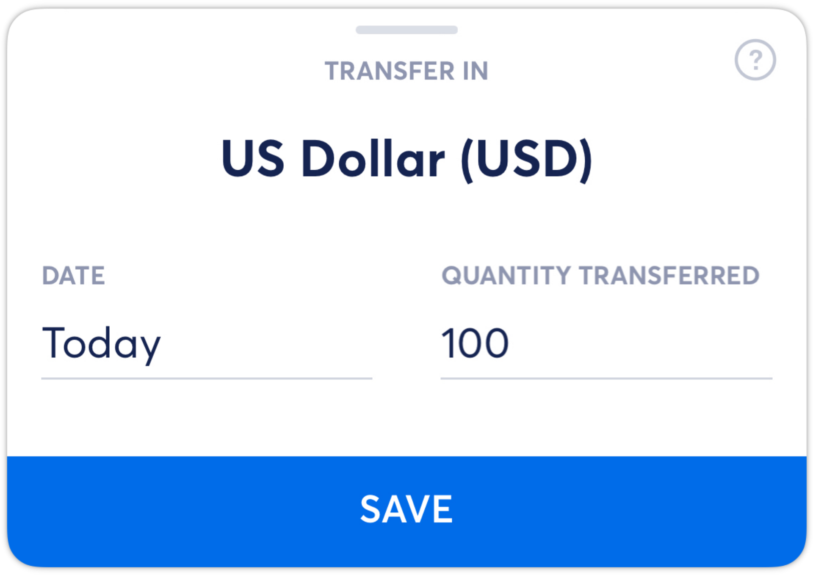](https://downloads.intercomcdn.com/i/o/525536669/ccab3cda582921325f80b6ea/Pic10.png?expires=1773322200&signature=269b253cde2ee1c609e6fbbee3465a8cb5f05ddb9326695885d4844468b9ea30&req=cSIiE8p4m4dWFb4f3HP0gELjdQNxPzTrUfRijDxm80ycdBcvwS%2BpCBK8w5%2BX%0ANpS7Ls8mGOzxm6bs%2Bg%3D%3D%0A)
For a Transfer In, you'll select the date of the Transfer In and the quantity transferred. Tap **SAVE** to save the movement.

## Transfer Out

Transfer Out movements may refer to times where holdings are transferred from this account to another investment account, but will most commonly refer to transferring USD out of this account.
[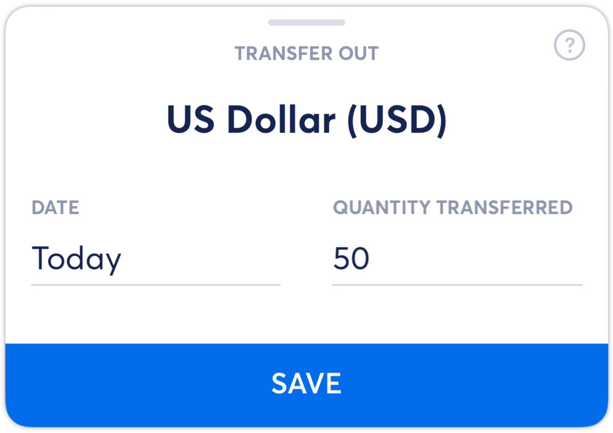](https://downloads.intercomcdn.com/i/o/525536718/16c10173ccc89a1fe1b0af91/Pic11.png?expires=1773322200&signature=16b545bb6438c93de6c2c83db8b86ebb238685f5ed8e74e2469048468a785273&req=cSIiE8p4moBXFb4f3HP0gJ%2FkCO3P1OvkBD%2FipjdEUyoEc74a%2FpMgrLm0WhLF%0A8DWMPb6gkheQ%2BhDzCg%3D%3D%0A)
For a Transfer Out, you'll select the date of the Transfer Out and the quantity transferred. Tap **SAVE** to save the movement.

## Delete a Movement

To delete a movement, tap on the movement at the bottom of the account view, then tap on menu icon in the top right-hand corner to see and select **Delete this transaction**.
[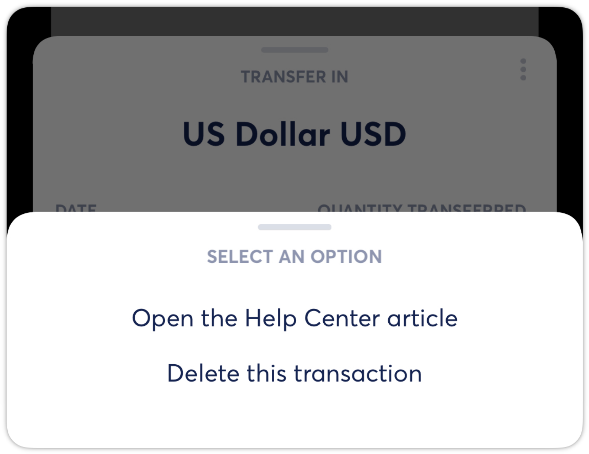](https://downloads.intercomcdn.com/i/o/525536777/6899035e1e80794c541d4774/Pic12.png?expires=1773322200&signature=4ca1ff7b5e8758bb2144e45182d93f68e62b43b0b38d004cf97bcbfd2cc143a7&req=cSIiE8p4moZYFb4f3HP0gImuXL%2BFD%2FgXm9%2FuKD5q8FDXZkZmRxols7pUDhV0%0AQdKbzUt%2Bk9xduUvkYg%3D%3D%0A)
👋 **Still have questions?**Contact us via the in-app chat.

​

---
Related Articles[Creating Manual Transactions](https://help.copilot.money/en/articles/4038706-creating-manual-transactions)[Creating Manual Internal Transfer Payments](https://help.copilot.money/en/articles/4235839-creating-manual-internal-transfer-payments)[Creating Manual Accounts](https://help.copilot.money/en/articles/4537532-creating-manual-accounts)[Migrating Investments Accounts](https://help.copilot.money/en/articles/6096952-migrating-investments-accounts)[Understanding Manual Accounts](https://help.copilot.money/en/articles/10682991-understanding-manual-accounts)
