# Creating Recurrings

**Source:** https://help.copilot.money/en/articles/3760068-creating-recurrings

Copilot’s Recurring feature allows you to automatically capture your expected spend, such as Rent, Bills, and Subscriptions. You can create recurring schedules for weekly, bi-weekly, monthly or non-monthly spend.

---

# Create a Monthly Recurring from the Recurring View

Tap the **+**button to create a new schedule. Then, search for the recurring transaction by name.

Select either an individual transaction or create a recurring for all transactions that contain that transaction name. We will estimate the frequency based on the transaction(s) selected in the step above. **Confirm the Frequency**.

For this example, select **Every month** to open the **New Monthly Recurring** view.

In the **New Monthly Recurring** view, you can edit the emoji, name, filter settings (ie. Transactions named *Spotify* from *$9* to *$10*around*the 23rd*every*month*), category and transactions (add or delete).

After you save the **New Monthly Recurring**, your next expected payment will be noted and the transaction(s) will be marked with an **[R]**to indicate **Recurring**.

# Create a Monthly Recurring from the Transactions View

Search for the recurring transaction by name.
[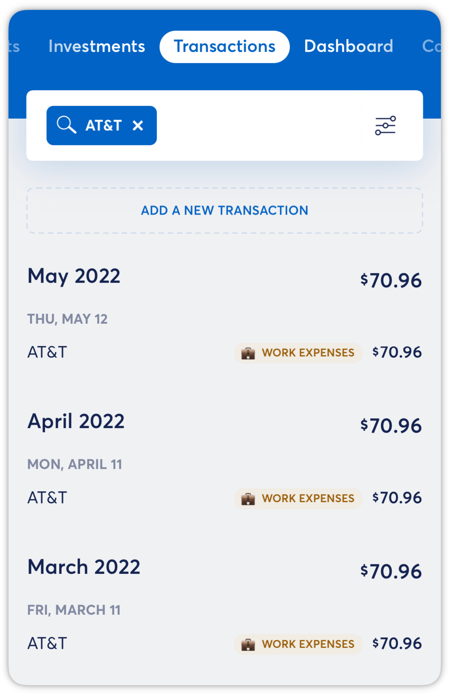](https://downloads.intercomcdn.com/i/o/525554967/dae7e21cf0fddbc254f640e4/Pic06.png?expires=1773322200&signature=0c2ee6ddcef3eec9206eeb2034d1808585c21f75df5ebc555d211e0c181a9555&req=cSIiE8x6lIdYFb4f3HP0gI6BoSaUwV45TQvXjvYGWhuyMt%2FaXwnKomgSUxuv%0AejR0HNRfIvybhDiq3g%3D%3D%0A)
Select one of the transactions and select **Recurring** at the bottom of the view.
[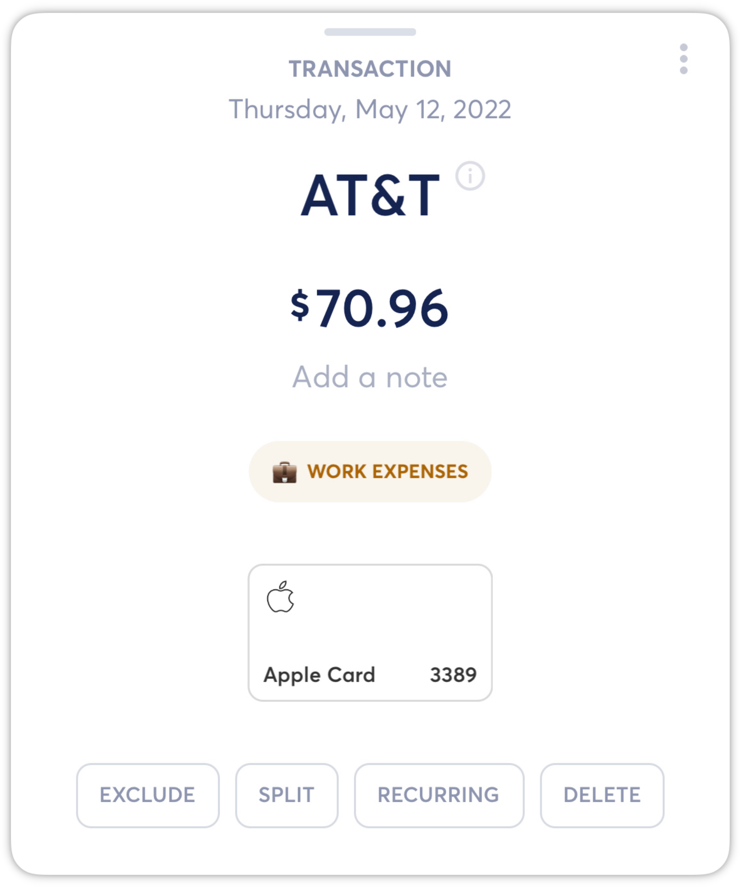](https://downloads.intercomcdn.com/i/o/525555020/0ec6b84f96013efd8b8184d5/Pic07.png?expires=1773322200&signature=af1fc917123af53e4515b09d801a2c5a057b7b0a5a20d68b17462d736ab7b1c8&req=cSIiE8x7nYNfFb4f3HP0gMpZiimQLl6ePGBNFp7qVVhIK6aFRi6EqPWVBbah%0AD%2BtTZIr7buNvi5XVBQ%3D%3D%0A)
The**Recurrings** menu will open with a list of your existing recurrings, plus the option to **Start a new one**.
[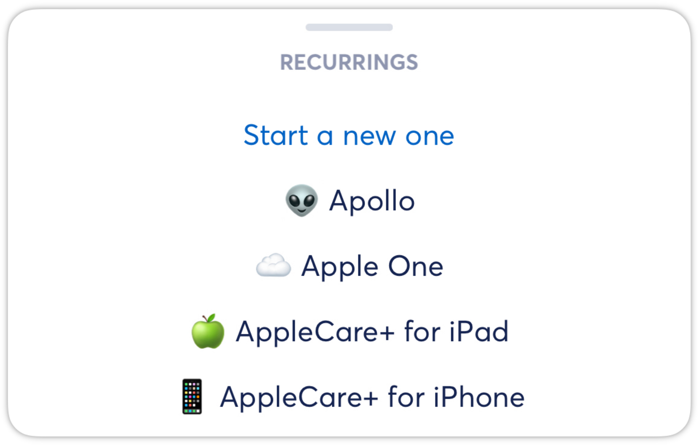](https://downloads.intercomcdn.com/i/o/525555050/194a130eeadea9a765fdca20/Pic08.png?expires=1773322200&signature=d7b8611a7db8af97722a59a7f49e8115ac09c681a8f93198bd30c5374781401e&req=cSIiE8x7nYRfFb4f3HP0gESRR5BU4phfZWBJDmtMtnrUXohIlhTXjqqJKbMj%0A89DBvzKD4x665IzLGw%3D%3D%0A)
After you select **Start a new one**, the **New Monthly Recurring** view will open. Here you can edit the emoji, name, filter settings (ie. Transactions named *Spotify* from *$9* to *$10*around*the 23rd and 24th*), category and transactions (add or delete).
[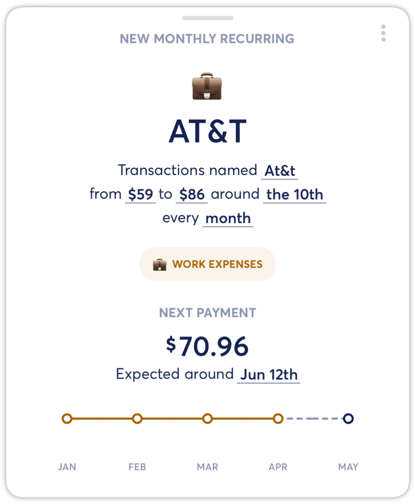](https://downloads.intercomcdn.com/i/o/525555080/b8733763d26cfc5c0def2273/Pic09.png?expires=1773322200&signature=0cda963b9c18c9f5535e4b8cec4f43f17c163d98eaaa70d5c31d3974000e1325&req=cSIiE8x7nYlfFb4f3HP0gG1TdtZdteiU0HSySHC4MjVxnZG%2B7Sq73rwuexI5%0AMCL9wxLGZNFiRKZKFw%3D%3D%0A)
After you save the **New Monthly Recurring**, your next expected payment will be noted and the transaction(s) will be marked with an **[R]**to indicate **Recurring**.

# Create a Non-Monthly Recurring from the Recurring View

Tap the **+**button to create a new schedule. Then, search for the recurring transaction by name.
[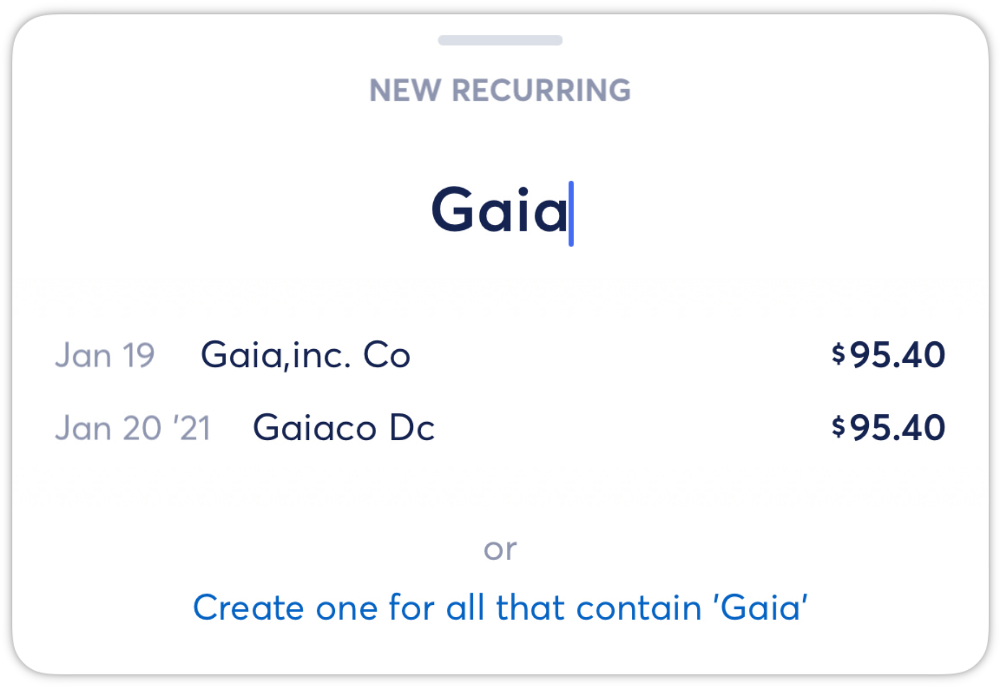](https://downloads.intercomcdn.com/i/o/525555120/ec3e685898723f00e3e689ff/Pic10.png?expires=1773322200&signature=7b8548d57061a7d1f146999cb468a89648beaae619c1c921e926f322913620ce&req=cSIiE8x7nINfFb4f3HP0gNaDUdnF%2FKk5hpJJUpB6a%2F4sdOvMd0T3r%2FwWGAyJ%0ASkR1%2FEg%2FFPti%2F5Y5IA%3D%3D%0A)
Select either an individual transaction or create a recurring for all transactions that contain that transaction name. We will estimate the frequency based on the transaction(s) selected in the step above. **Confirm the Frequency**.
[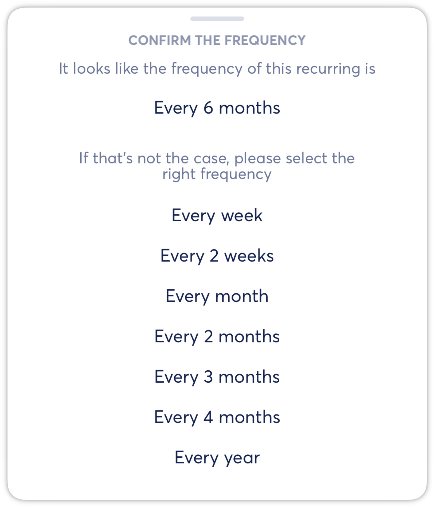](https://downloads.intercomcdn.com/i/o/525555145/94f748daafc20a7a6a83f994/Pic11.png?expires=1773322200&signature=16be0ac8512a3f95313f19dbc24015e6ad46dd0ce6d32f205eaa4a0b6126296b&req=cSIiE8x7nIVaFb4f3HP0gEeGQ%2FEnJmII4LqNY3XyUCSfyVZHDlH7kZhgUKoD%0Avgz5%2FT6VaWgHUII6Wg%3D%3D%0A)
For this example, select **Every year** to open the **New Annually Recurring** view.

In the **New Annually Recurring** view, you can edit the emoji, name, filter settings (ie. Transactions named *Gaia* from *$95* to *$96*around*the 19th and 20th*every*year*), category and transactions (add or delete).
[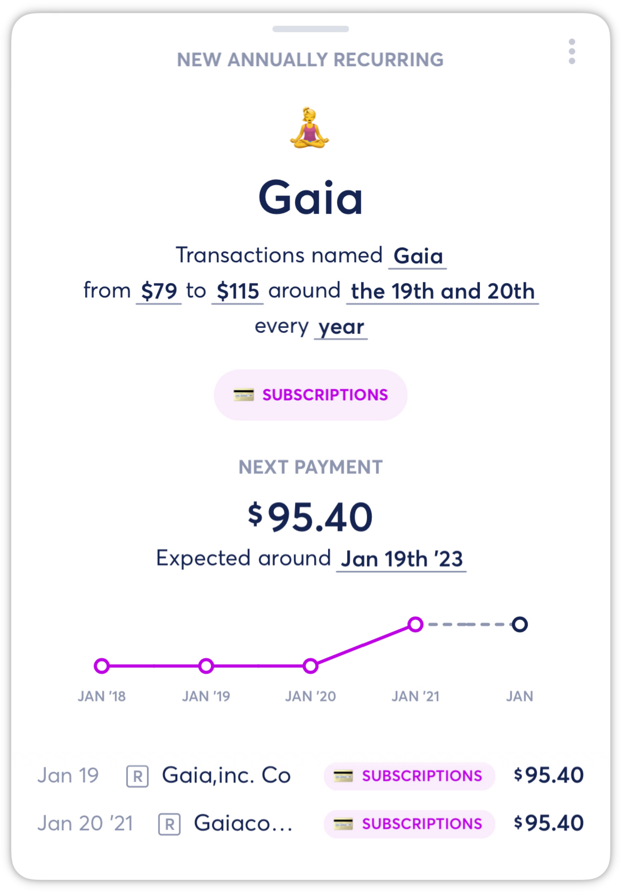](https://downloads.intercomcdn.com/i/o/525555192/0ad48420b6673fe098748370/Pic12.png?expires=1773322200&signature=1a44af2740c2aa427b851390fd51b0382dca619c2a13cd3ebf6e0881fbf1741f&req=cSIiE8x7nIhdFb4f3HP0gNhBrqIw8g4OPfZ3%2BouJA67%2FW48Y44dZo6%2FZM%2F33%0AfM%2BFyCxiD%2Fd5%2BZg9aQ%3D%3D%0A)
After you save the schedule, your next expected payment will be noted and the transaction(s) will be marked with an **[R]**to indicate **Recurring**.
[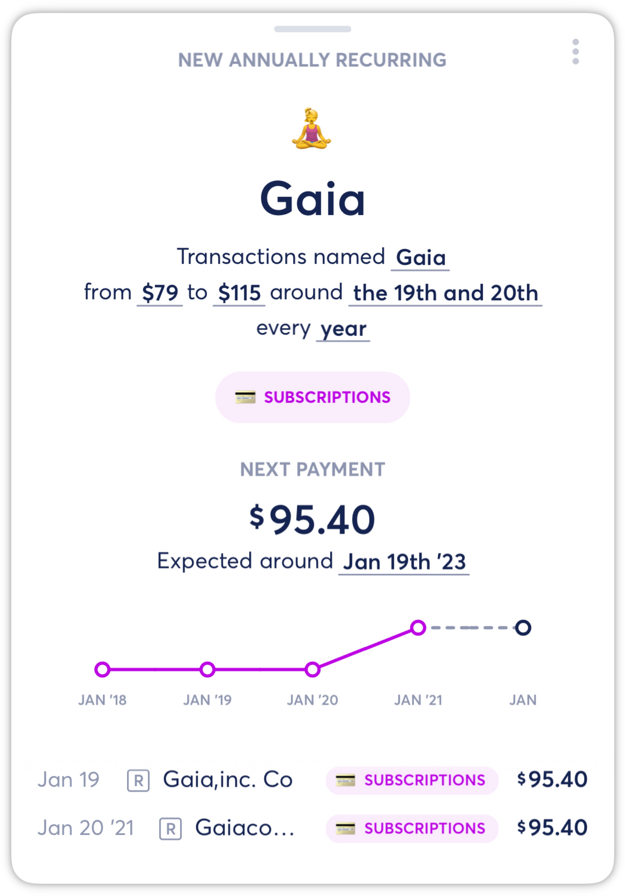](https://downloads.intercomcdn.com/i/o/525555245/8592ce010713d659c033537b/Pic13.png?expires=1773322200&signature=75557e6c80ce2205d0c1fda5583cb8f3dfef1d14ec8cc4eeeedfb69e5cf55560&req=cSIiE8x7n4VaFb4f3HP0gLc3QCXlA44Cer6XWOV3Myn6nx%2FizmMNjfNXWBW4%0ARdINdGA27j7luUqzIg%3D%3D%0A)
The **Recurring** view displays your recurrings for This Month, In the Future, Paused and Archived.
[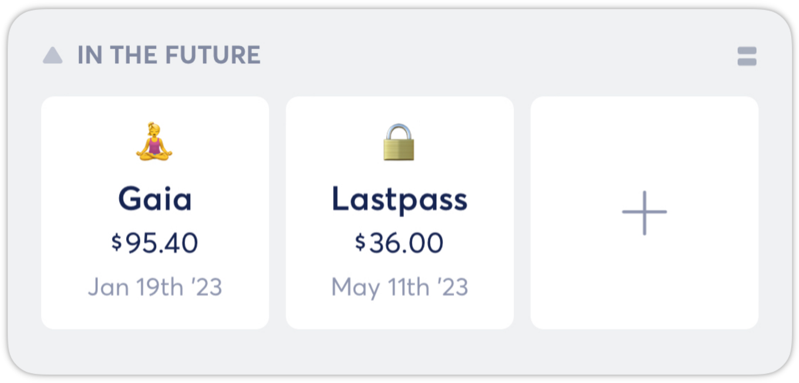](https://downloads.intercomcdn.com/i/o/525555281/c50235fe129bbae6ede57867/Pic14.png?expires=1773322200&signature=8c1da2d78b9609864b30be938d98e0a3da47c146b2e7422cdf00d534def36a6b&req=cSIiE8x7n4leFb4f3HP0gCJ4MGUVagXfUxtKoduruVavOpb%2FVkLV%2FI%2BQ94cS%0A1qxWtrNhrGLsstUjog%3D%3D%0A)
# Create a Non-Monthly Recurring from the Transactions View

Search for the recurring transaction by name.
[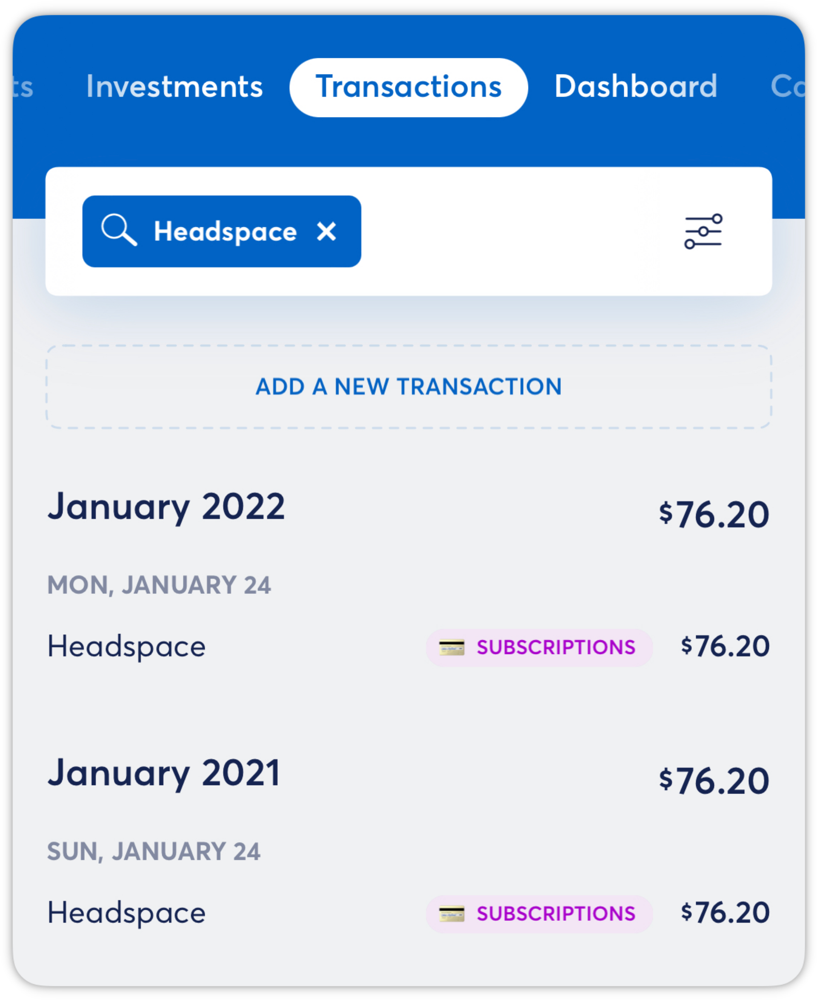](https://downloads.intercomcdn.com/i/o/525555322/272a4abb05ac56da1bac54ef/Pic15.png?expires=1773322200&signature=d2633e0fadc313a1555152ab7e9c330d2e2ddbd04e10cf2100308d8344d27848&req=cSIiE8x7noNdFb4f3HP0gDX4RdYSafBabwb15mvK7sPGTEMXhAg19t5mXjUf%0AusrYMAln%2Fbw5cpdu%2Fg%3D%3D%0A)
Select one of the transactions and select **Recurring** at the bottom of the view.
[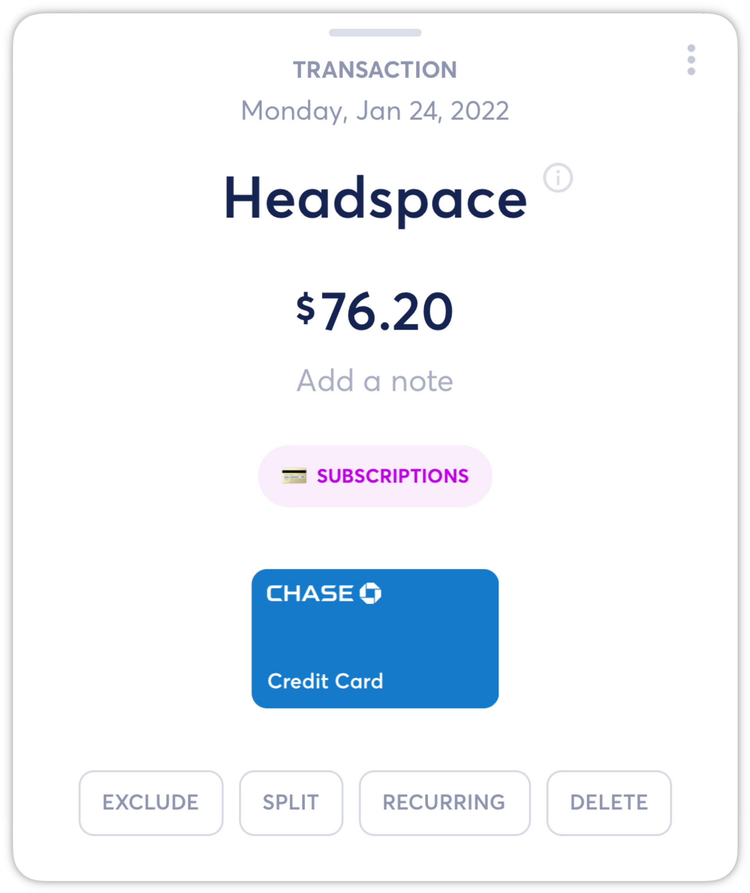](https://downloads.intercomcdn.com/i/o/525555350/0e881a126eb093811ed4a256/Pic16.png?expires=1773322200&signature=d2971816cc5ec29db88156f0fbbc7a6acf59d649817897038f857feb04719bb7&req=cSIiE8x7noRfFb4f3HP0gMxf3oRIFj35Sh6lOXvOn%2FZDTiNTRDH65cw1dyHm%0AQ%2BACuddFUx2tezc4yg%3D%3D%0A)
The**Recurrings** menu will open with a list of your existing recurrings, plus the option to **Start a new one**.
[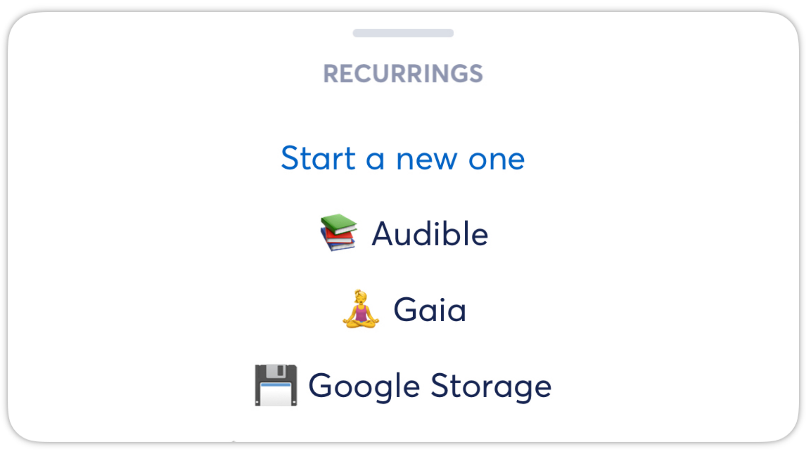](https://downloads.intercomcdn.com/i/o/525555375/d54d21eb75c015121bf0d425/Pic17.png?expires=1773322200&signature=b218850ab84f802977724b5495a3dc5c2a7ceea023e74b1d8c997085df562a37&req=cSIiE8x7noZaFb4f3HP0gDC14hkGomO1qvZLr5I9WS9OMOt5sWUfPeQiRWCL%0ACpnbK12sVNO64KzttA%3D%3D%0A)
Once you select **Start a new one**, we will estimate the frequency based on the transaction selected. **Confirm the Frequency**.
[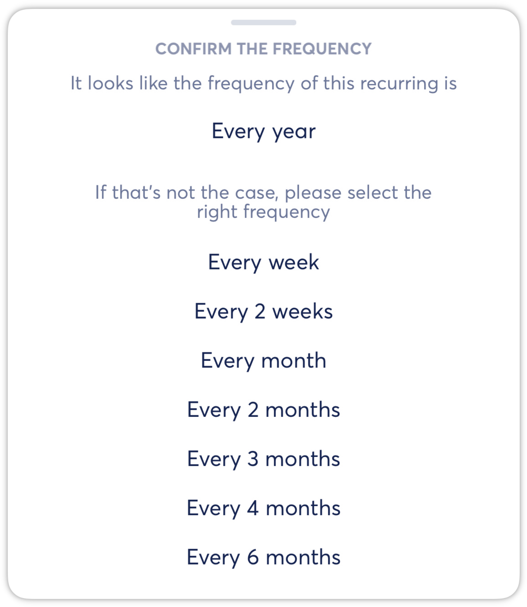](https://downloads.intercomcdn.com/i/o/525555406/a0638e769544dd9190e6969b/Pic18.png?expires=1773322200&signature=6bafe9b77cda32bd36a6fa7397f55af15a36305bde27657baa269973388529a0&req=cSIiE8x7mYFZFb4f3HP0gEbokVcGN6%2FH%2BjmgbmRtcEr%2B3ufKq%2F5ScIrUZk8n%0AvwbRRD3k04QqpjVcXA%3D%3D%0A)
For this example, select **Every year** to open the **New Annually Recurring** view, where you can edit the emoji, name, filter settings (ie. Transactions named *Headspace* from *$75* to *$77*around*the 24th*every*year*), category and transactions (add or delete).
[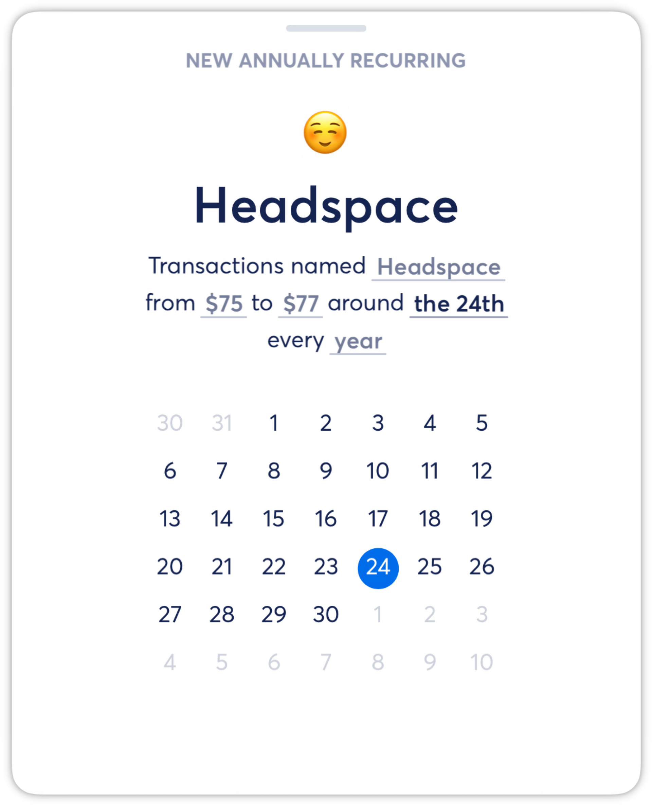](https://downloads.intercomcdn.com/i/o/525555440/520b6010e570914755a07b97/Pic19.png?expires=1773322200&signature=cafe9a45d967fb30f4b4ed102c3fcf72538829e8eda2cef3344c93cd8bd67f6e&req=cSIiE8x7mYVfFb4f3HP0gPWlG%2FBYUxU2%2FiU2dr8O81hEzFY1MRma%2BxEIQlFD%0AF5c7hFU652YOJgR7jw%3D%3D%0A)
After you save the schedule, your next expected payment will be noted and the transaction(s) will be marked with an **[R]** to indicate **Recurring**.
[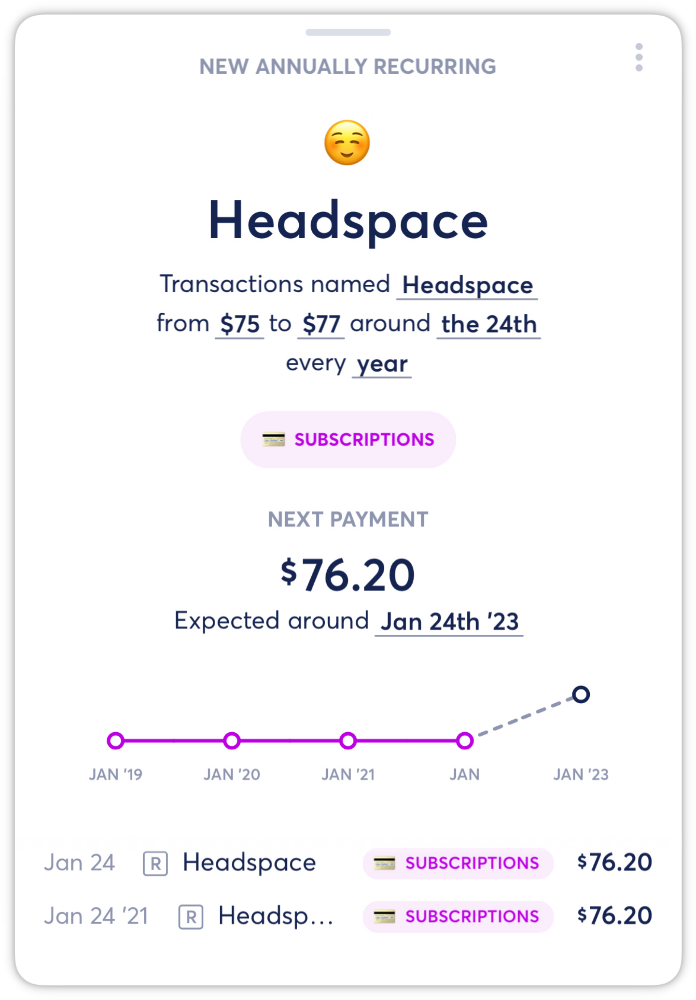](https://downloads.intercomcdn.com/i/o/525555476/969fc1ec4ca7a51c91648d5c/Pic20.png?expires=1773322200&signature=bf5280bf64374df572191e2edeaa4b96a2e2568a5c6200d6f886a93e2cc2585f&req=cSIiE8x7mYZZFb4f3HP0gByMvglBR4mYujxPxmkGJDop%2FjfXU0mqv995Tre2%0Aygof0Ug0kmp1jvGEdQ%3D%3D%0A)
👋 Still have questions? Contact us via the in-app chat.

---
Related Articles[Editing Recurrings](https://help.copilot.money/en/articles/3783837-editing-recurrings)[Pausing and Archiving Recurrings](https://help.copilot.money/en/articles/3983286-pausing-and-archiving-recurrings)[Shared Recurring Expenses](https://help.copilot.money/en/articles/5324776-shared-recurring-expenses)[Multiple Recurrings for the Same Merchant](https://help.copilot.money/en/articles/5327632-multiple-recurrings-for-the-same-merchant)[Recurring Transaction Name](https://help.copilot.money/en/articles/10671662-recurring-transaction-name)
