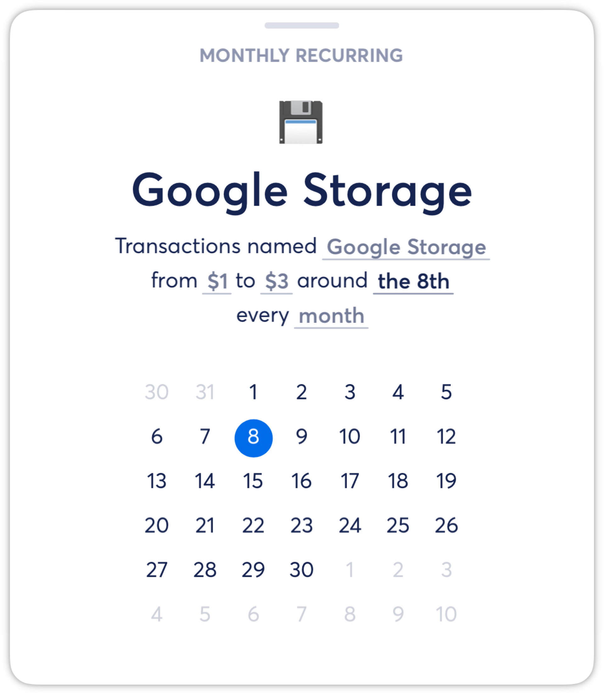
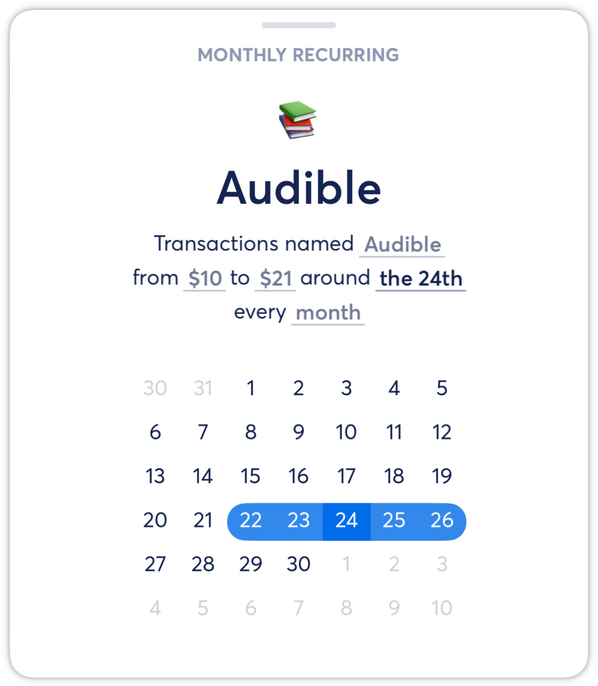

# Optimizing Recurrings

**Source:** https://help.copilot.money/en/articles/3783499-optimizing-recurrings

Recurring filter settings help with automatically detecting transactions as an existing recurring when the transaction shows up in Copilot. It's important that the recurring filter settings are set up correctly and also optimized to always look for the correct transaction.

---

# Optimizing Transaction Name

Some recurring transactions might have a slightly different name every month, so we want to make sure the recurring is looking for the part of the transaction name that's always present.

For example, this Uber One subscription might be charged with a different transaction name every month, such as "**Uber One**", "**Uber Pass**", or "**Uber**". So it's best that the recurring is looking for transactions with just "**Uber**" included in the transaction name, instead of looking specifically for "**Uber One**" or "**Uber Pass**" in the transaction name.

# Optimizing Transaction Date

Recurring transaction can be charged on the same day every month, or on a near by day. Or, sometimes it depends on when you decide to make this payment every month. So when it comes to setting a date for a recurring, we recommend that you look at the historic transactions for this recurring and check for the date they're typically charged on.

In this example, this recurring is looking for a transaction around 8th of every month.

In this example, this recurring is looking for a transactions around the 24th of every month but with multiple near by dates selected.

In this example, this recurring is looking for a transaction on any day of the month.

# Optimizing Transaction Amount

Just like transaction date, you can set a range for the transaction amount as well. This is helpful if you have multiple recurrings from the same merchant that are charged on the same date.

In this example below, both of these recurrings are charged on the same day every month with the same transaction name "Apple". But because these recurrings are looking for different transaction amount, it's able to capture the correct transactions into the corresponding recurrings every month.

👋 Still have questions? Contact us via the in-app chat.

---
Related Articles[Creating Recurrings](https://help.copilot.money/en/articles/3760068-creating-recurrings)[Editing Recurrings](https://help.copilot.money/en/articles/3783837-editing-recurrings)[Shared Recurring Expenses](https://help.copilot.money/en/articles/5324776-shared-recurring-expenses)[Multiple Recurrings for the Same Merchant](https://help.copilot.money/en/articles/5327632-multiple-recurrings-for-the-same-merchant)[Recurrings FAQ](https://help.copilot.money/en/articles/10244751-recurrings-faq)
