# Editing Recurrings

**Source:** https://help.copilot.money/en/articles/3783837-editing-recurrings

Optimize your recurring transactions to ensure they’re accurately tracked. Learn how to edit your recurrings below.

---

# Edit Recurrings

- In the **Recurrings** view, select the recurring and tap on any of the fields to edit, including the recurring emoji, name, category and filter settings.
- To edit your recurring filter settings, tap on the underlined fields. In this example, the recurring was created with a monthly frequency, but it is should be an annual frequency.

- Tap on **month** in the filter settings to open the frequency menu.
[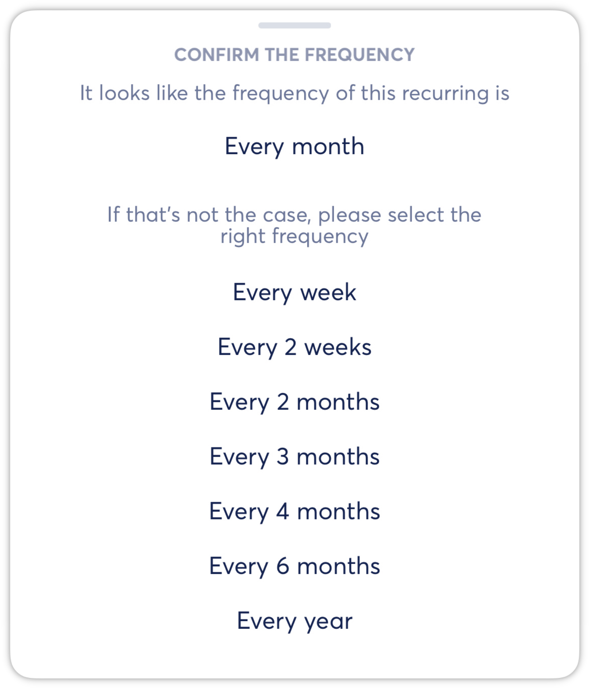](https://downloads.intercomcdn.com/i/o/525512666/0d88107b78932c1aa5c915c4/Pic02.png?expires=1773322200&signature=ab491a41297dfb6bc36bcbbb0eb5d1bc381111322b1561af6e2037341895c9e7&req=cSIiE8h8m4dZFb4f3HP0gEk2Z6GvJ73MZ385h9LWsCFuO7h5ZnLdo1Iws2cA%0AN3s%3D%0A)

- Select **Every year** to update to an annual recurring.
[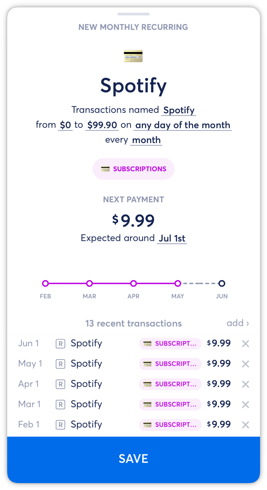](https://downloads.intercomcdn.com/i/o/525512743/b2dbddd1ddd9a692280654a7/Pic03.png?expires=1773322200&signature=cc0b7cff1babcee41593758b2e764f3872e75cf047e48ad115db5eb6da25b9cf&req=cSIiE8h8moVcFb4f3HP0gHARBtQmoATTyorUAi2rEFGbA5fKgR9ICQoAnP1b%0AD0E%3D%0A)

- **Save** and then decide if you want to apply the **Recurring Filter Changes** to only future payments or also include previous payments. *NOTE: You will receive this prompt anytime you edit a recurring filter setting.*
[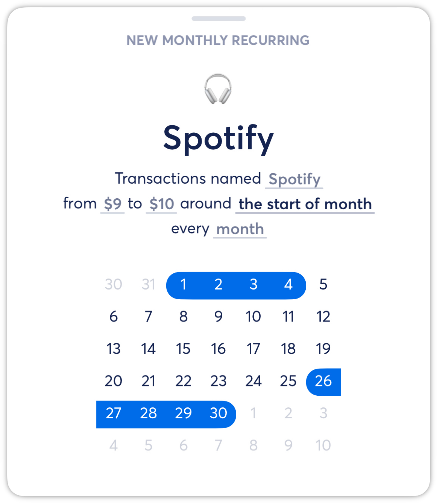](https://downloads.intercomcdn.com/i/o/525512812/72543ccf2ddec8dbe05f7a52/Pic04.png?expires=1773322200&signature=6958ddc3b637d90daa9d621cc9e9371eaecbfd86b8439703073fc681cf6b4bcc&req=cSIiE8h8lYBdFb4f3HP0gKqM4PNysgstXzph5kDTMDkchqzJWK8i%2FjiLsCWD%0AMsA%3D%0A)

- In this example, the changes were applied to previous and future payments.

# Manually Add a Transaction to a Recurring

There are two ways to manually add a transaction to a recurring.

## From the Transactions View

- In the **Transactions** view, search for the recurring transaction by name or amount. Select the transaction and select **Recurring** at the bottom of the view.
​
[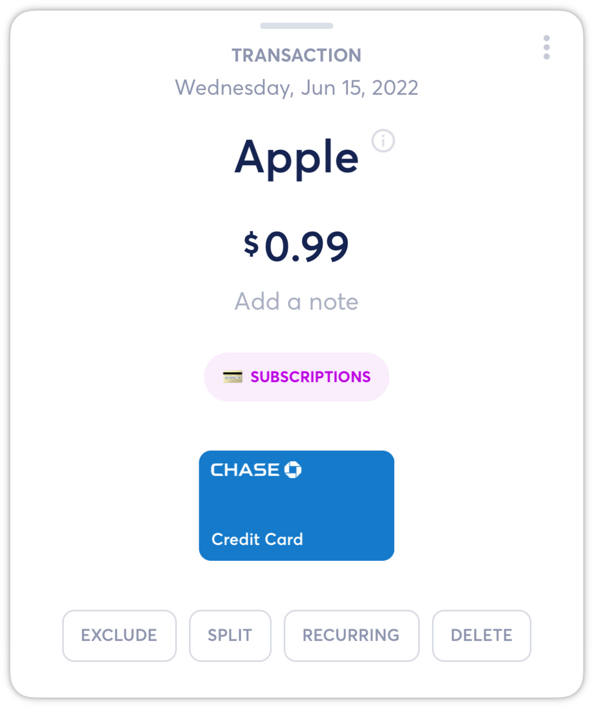](https://downloads.intercomcdn.com/i/o/525513133/6b027c7df51dd7cab08c6646/Pic06.png?expires=1773322200&signature=e63b69018e61b6aa12ba40d030d40fd0e2295139eb341ddac8d0f044585a4eb4&req=cSIiE8h9nIJcFb4f3HP0gFMw70%2Bh%2BONFdDM5yNqkpC2qDNDnI%2FeAZWRZ0DiZ%0AsL8%3D%0A)

- This will open your list of existing**Recurrings**. Select the appropriate**Recurring** and the transaction will be added.
[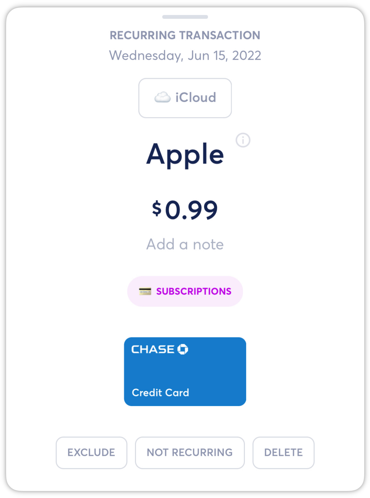](https://downloads.intercomcdn.com/i/o/525513186/ce2558e7a5e28e143e9586ef/Pic07.png?expires=1773322200&signature=ecc9a0e15876d1b70c87c083575c1b8bf130868902cbd1953d2fcf98bf72a188&req=cSIiE8h9nIlZFb4f3HP0gJizkmV8hgsC7xHyf1G0UFYdJNJF6MPkmViWn7qB%0A5RE%3D%0A)

## From the Recurring View

- In the **Recurring** view, select the appropriate recurring, and then **Edit Transactions** at the bottom of the view.
[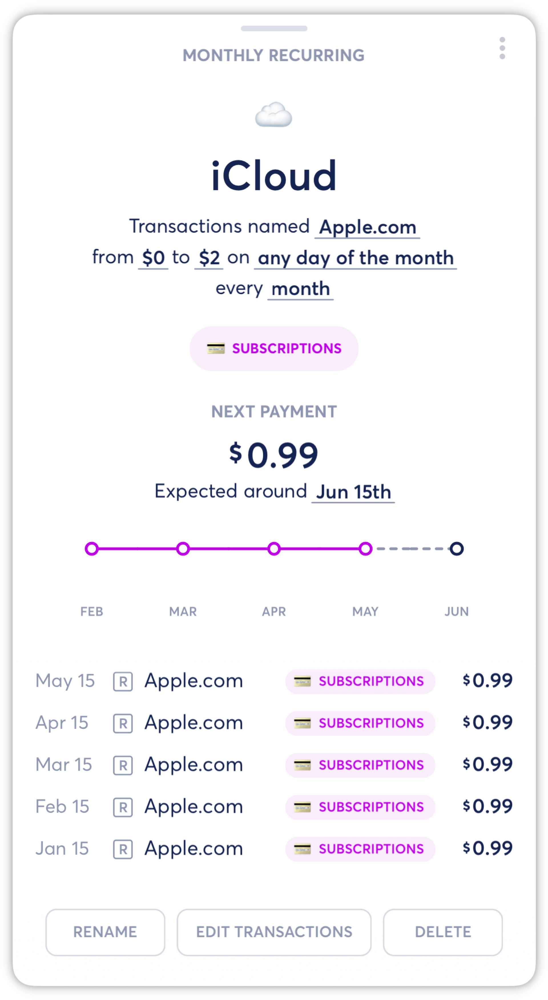](https://downloads.intercomcdn.com/i/o/525513269/8d09d05e9c0d44e489b2988d/Pic08.png?expires=1773322200&signature=d15a8f6bb7968f5619160daed2ceaf2a8970cde7818bc44f161c90d118561f3d&req=cSIiE8h9n4dWFb4f3HP0gK7ePlsK0R4bT9LrkL%2BnTyJOYdGj%2Bg04fJ4pAXh%2B%0AMYw%3D%0A)

- Tap **Add** and search for the transaction by name or amount. Select the transaction to add to the**Recurring**.
[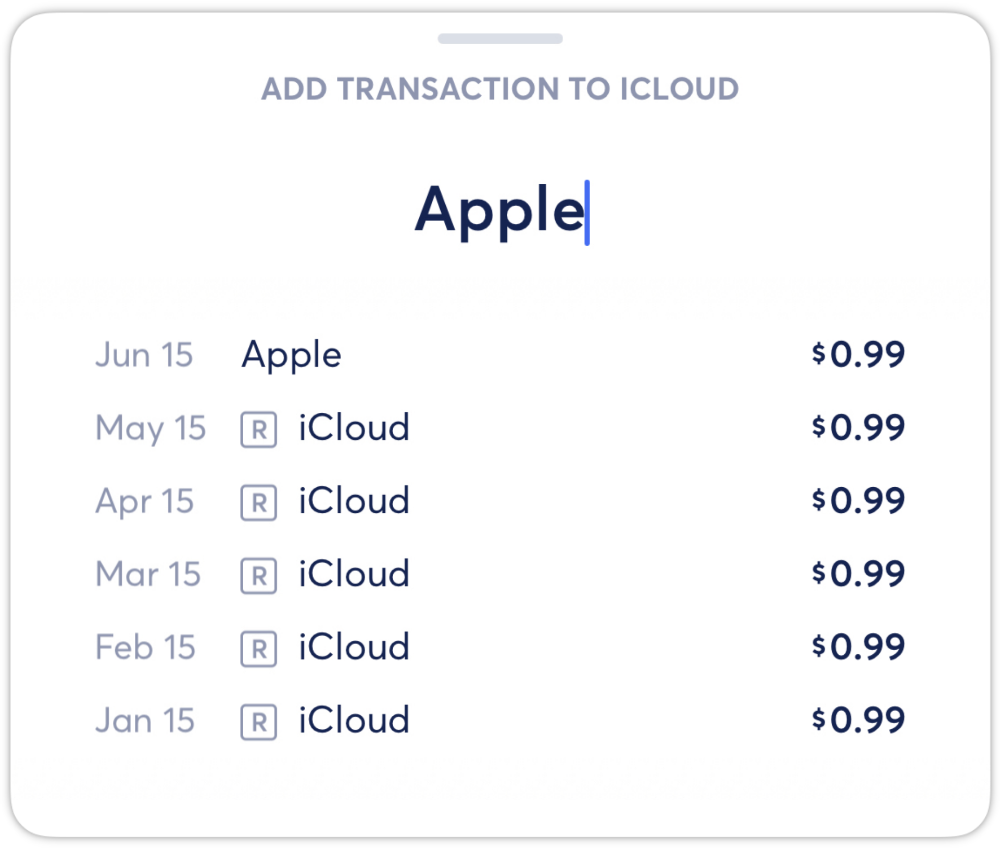](https://downloads.intercomcdn.com/i/o/525513389/a4ca33e7547921b85b033685/Pic09.png?expires=1773322200&signature=60aed756a173bd4fa4e30e65d319143d31568523ad0952634e8bd9bf5f22a656&req=cSIiE8h9nolWFb4f3HP0gO%2FmIvrJ%2BqYkGdf5X7RJqAJLByTSnXHi8wVF3tba%0AFw0%3D%0A)

- **Save** and then decide if you want to apply the **Recurring Filter Changes** to only future payments or also include previous payments. *NOTE: You will receive this prompt anytime you add a new transaction to a recurring.*
​
[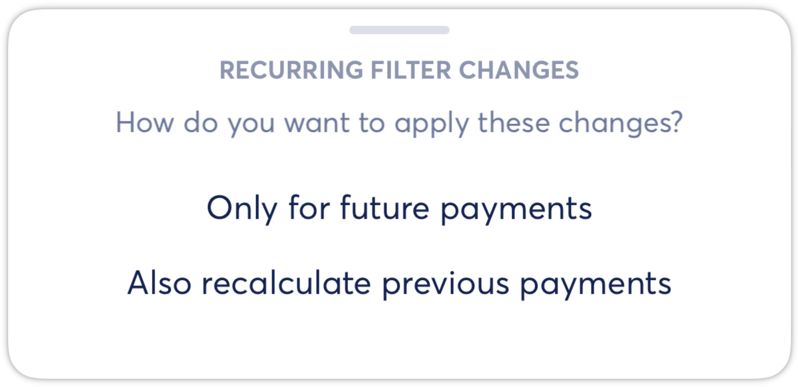](https://downloads.intercomcdn.com/i/o/525513430/61a465b25a0ca9d95fbba95e/Pic10.png?expires=1773322200&signature=d0d5d1a728ed9a953f7c08eff41cc58608241b098673a2f4140c6a39215a915b&req=cSIiE8h9mYJfFb4f3HP0gLQ1nzJeW%2ByVe2VHKNk1MnY6xmEe7%2F1Su8xeKL0X%0A0qc%3D%0A)

- You may need to update your recurring filter settings if transactions are not automatically being detected. In this example, I updated "Transactions named **Apple.com**" to "Transactions named **Apple**".
[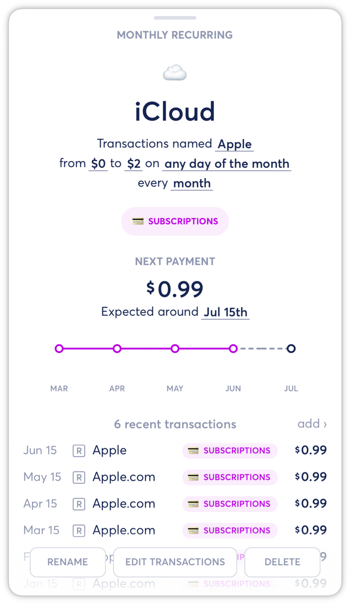](https://downloads.intercomcdn.com/i/o/525513521/c7f210bd67df2f6a284b3141/Pic11.png?expires=1773322200&signature=e89c2b69796a05832a910be0df4bf0f431ce8e241784934189f4bc03b12e709e&req=cSIiE8h9mINeFb4f3HP0gK8h0rluruS3r9dQ98YNNjdFgnCktZ9QtUBYY%2Br2%0ALh4%3D%0A)

# Manually Remove a Transaction from a Recurring

There are two ways to manually remove a transaction from a recurring.

## From the Transactions View

- In the **Transactions** view, search for the transaction by name or amount. Select **Not Recurring** at the bottom of the view.
[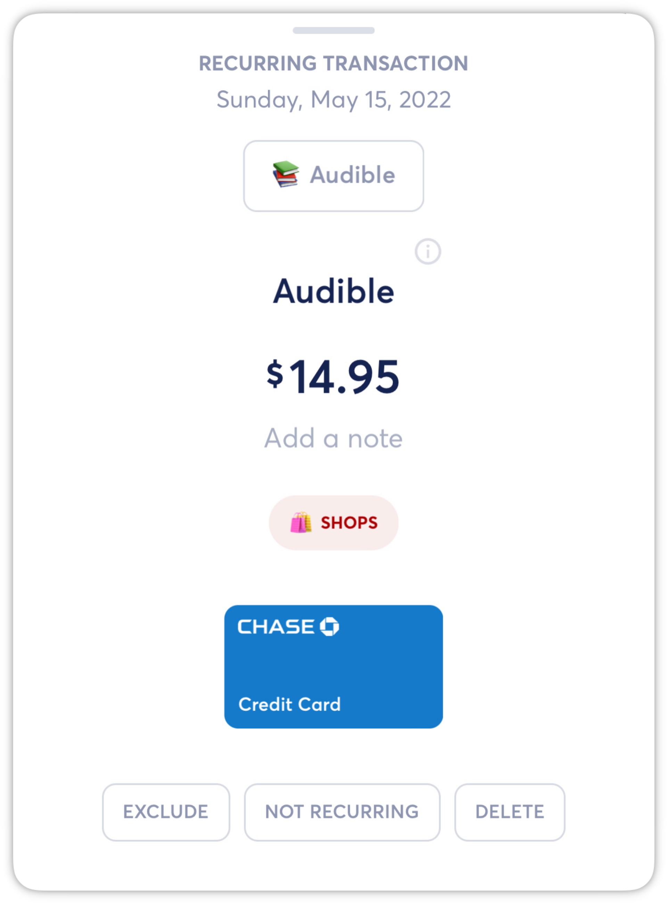](https://downloads.intercomcdn.com/i/o/525513666/728ad0f91fc8398a9b9eefb2/Pic12.png?expires=1773322200&signature=33388a4e36abab861616b2f820de9096921fc4ae07a1a9ac69b99110da3dc0aa&req=cSIiE8h9m4dZFb4f3HP0gNMAc%2FRXERpQTNKpBEFEceQDoauSDJizoOHXUtIB%0ANJ4%3D%0A)

- This will remove the transaction from the**Recurring**.
[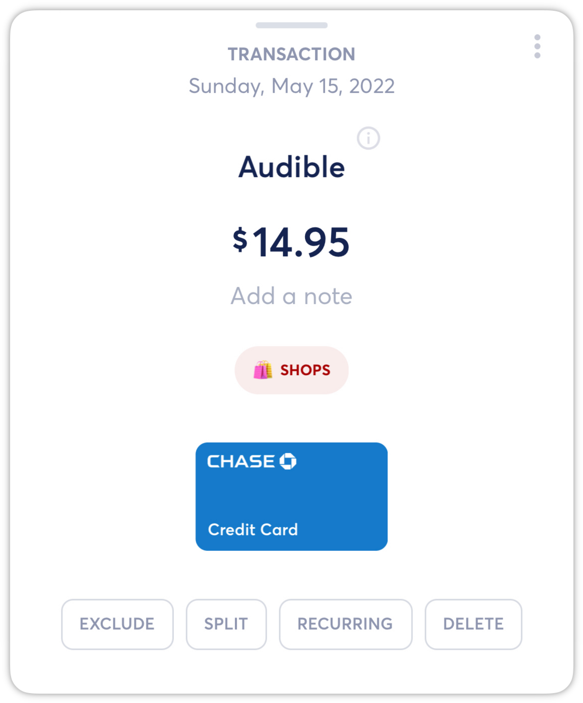](https://downloads.intercomcdn.com/i/o/525513708/32090ffc9de5644eb2ffe667/Pic13.png?expires=1773322200&signature=6a8a75dc728e3404403cc24b2848bfe40ca84567bb54c1a4c0a599dceaebe613&req=cSIiE8h9moFXFb4f3HP0gExOr%2F3HShRnnHvSCsYIFc0%2FLGN45bxMmfXsKAjK%0Aiaw%3D%0A)

- You may need to update your**Recurring** filter settings if transactions are being incorrectly added (see details below).

## From the Recurring View

- In the **Recurring** view, select the appropriate recurring.
​
[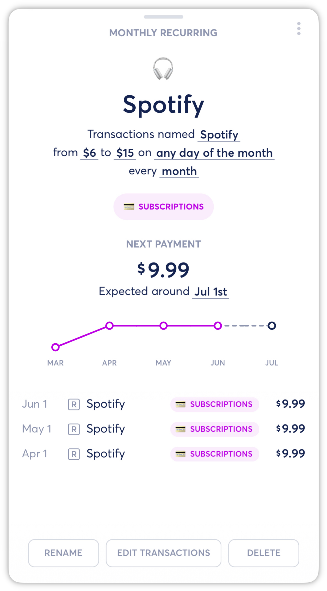](https://downloads.intercomcdn.com/i/o/525513759/f4ca4115c60c8d13179335e6/Pic14.png?expires=1773322200&signature=e678bbb0deda174775b0c8fac45cd1d63bee7d0ad4300172ef521be2ecb33e17&req=cSIiE8h9moRWFb4f3HP0gEnmUZ59%2FT4cnHelSI%2BroM%2B2iypjpXNp1OFQvSIU%0A1NY%3D%0A)

- Then select **Edit Transactions** to open this view. Delete the transaction(s) by tapping the **X** and then **Save**.
[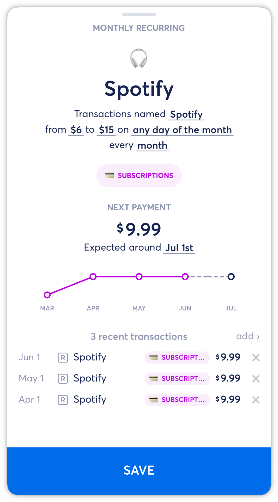](https://downloads.intercomcdn.com/i/o/525513791/d190245f627941229ff33f3c/Pic15.png?expires=1773322200&signature=67ddf4e2ef7d525955e7c7c91238e7f92f53baa727fe68fc2df83b95ab287fc5&req=cSIiE8h9moheFb4f3HP0gBksrd2UpZnd%2FALBMvSvOfg7dbf%2FciRQiwoEVihG%0AkOY%3D%0A)

- You may need to update your**Recurring** filter settings if transactions are being incorrectly added. In this example, I updated the transaction amount range from "**$6** to **$15**" to "**$8** to **$10**".
[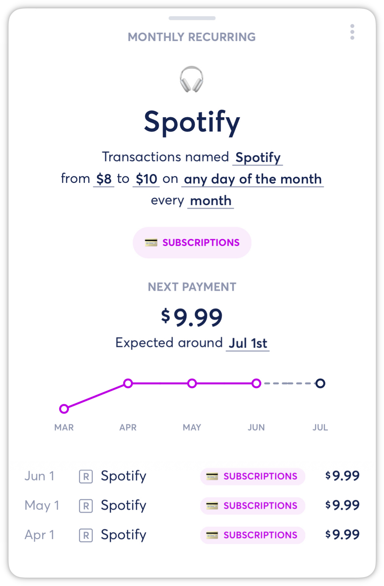](https://downloads.intercomcdn.com/i/o/525513855/52478de0b46f2dfa2f0dcd96/Pic16.png?expires=1773322200&signature=38cf153422d19c65eb85ea991f4fa3b39817abb3ad2801902b386c60dd6df2e4&req=cSIiE8h9lYRaFb4f3HP0gCU0fmzsTYSHLY0pziLgPvhyU16rCQm%2FywjL6r%2FL%0A3fo%3D%0A)

# Delete a Recurring

- You can permanently delete a **Recurring** by either selecting **Delete** at the bottom of the view, or by tapping the icon in the upper right hand corner to open the **Recurring Option** menu.
[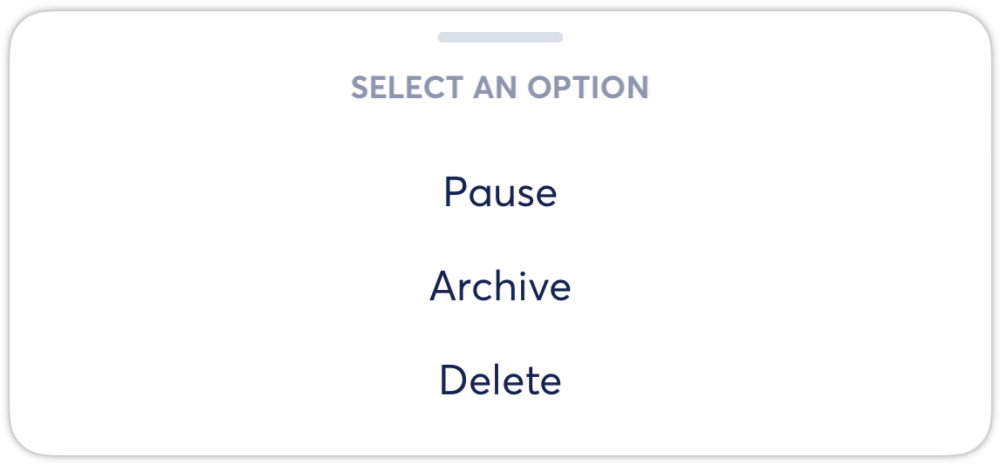](https://downloads.intercomcdn.com/i/o/525513918/f5cfdc161e57fda74cbbd02b/Pic17.png?expires=1773322200&signature=f4fb1bb611bf2538058078e9ebaaf36188920c372ddee3376987c6dc26e184d6&req=cSIiE8h9lIBXFb4f3HP0gP3jOdUS%2FtXQy4XWls21rVvT3TzFkNEJBDri1ma7%0AkSg%3D%0A)

- You will be prompted to confirm the deletion. If you decide not to delete the recurring, then simply tap outside of the recurring view.
[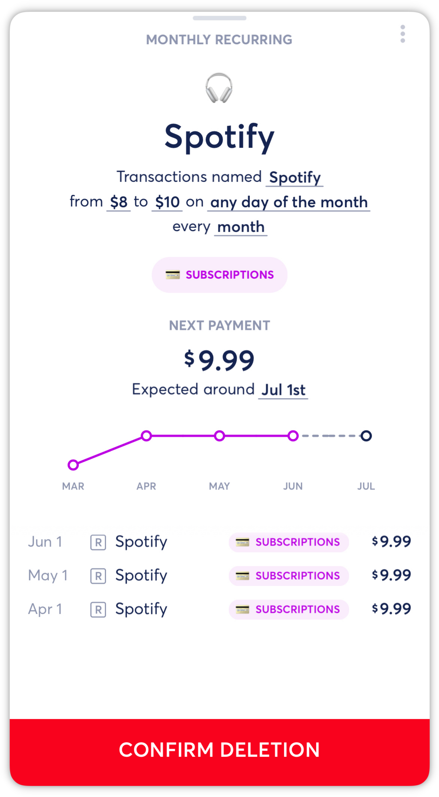](https://downloads.intercomcdn.com/i/o/525513974/82918910897e8726b08cd024/Pic18.png?expires=1773322200&signature=5734dc3b7266b6b052cb1bd1015202e5e492d59b1048c2a86965340f1cc2af65&req=cSIiE8h9lIZbFb4f3HP0gBbKuIkV47%2Fy%2F2w5%2BJrMiEyZSQTgHePrhHQZalVQ%0AvOw%3D%0A)

- Deleting a**Recurring** has no impact on the transactions, but it will permanently delete the recurring history.
- You can also Pause or Archive a recurring if you do not want to delete the historical record. See this [article](https://intercom.help/copilotmoney/en/articles/3983286-pause-or-archive-recurrings) for more details.

👋 Still have questions? Contact us via the in-app chat.

---
Related Articles[Creating Recurrings](https://help.copilot.money/en/articles/3760068-creating-recurrings)[Optimizing Recurrings](https://help.copilot.money/en/articles/3783499-optimizing-recurrings)[Pausing and Archiving Recurrings](https://help.copilot.money/en/articles/3983286-pausing-and-archiving-recurrings)[Multiple Recurrings for the Same Merchant](https://help.copilot.money/en/articles/5327632-multiple-recurrings-for-the-same-merchant)[Recurring Transaction Name](https://help.copilot.money/en/articles/10671662-recurring-transaction-name)
