# Pausing and Archiving Recurrings

**Source:** https://help.copilot.money/en/articles/3983286-pausing-and-archiving-recurrings

# **Pause a Recurring**

Copilot allows you to pause a Recurring if the expense has been temporarily paused in your budget. For example, if you want to take a break from TV, you may pause your streaming service subscription for three months.

To **Pause** a Recurring, go to the **Recurring** view and select it.
[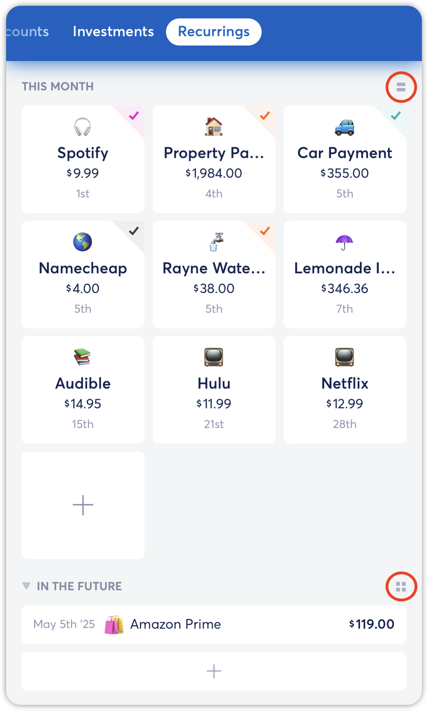](https://downloads.intercomcdn.com/i/o/gw2wbwl7/1278427591/c52d0202801cc9c8ac409f48e390/image.png?expires=1773322200&signature=1d659db213a351f2bf8df430e585ea570e290f4d341e05e10285ac79465aca96&req=dSIgHs18moRWWPMW1HO4zd%2Bo%2BOqhb0vAq4YrXF9jfC1o4Ae6WI7Y7pm9%2B%2FQp%0Abql%2B9SeQCOu4693YTYA%3D%0A)[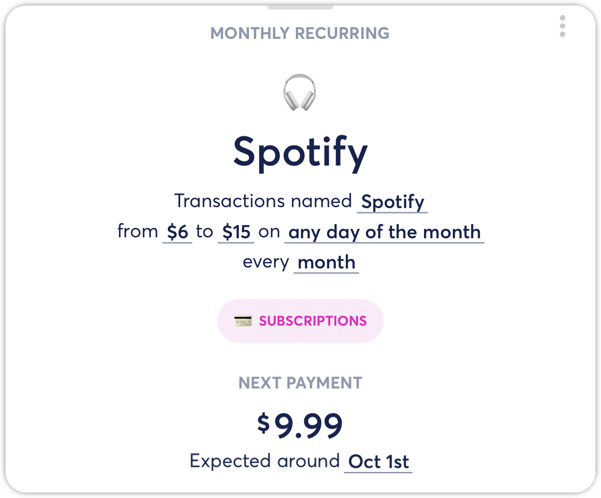](https://downloads.intercomcdn.com/i/o/gw2wbwl7/1278428180/946f38835ddf27caf4e5479e34e0/image.png?expires=1773322200&signature=d16d48920e8cac0723a5972d7a9605c7524d3e374fa3a6d1b297c743b6a47600&req=dSIgHs18lYBXWfMW1HO4zb4DhireG%2BTM1X816Ai5K4Chi9gBQozqDUi%2B9PCX%0AdUM5y0wHWDmeav%2FU9zI%3D%0A)
Tap or click the menu icon in the upper right hand corner to open the **Recurring Option** menu.
[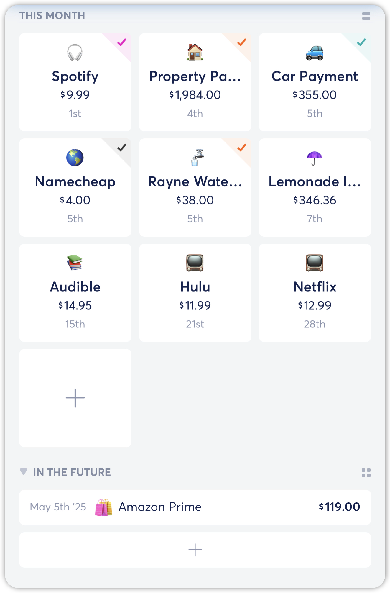](https://downloads.intercomcdn.com/i/o/gw2wbwl7/1278429324/5136ebe93bb09a38fb54f765dff0/image.png?expires=1773322200&signature=85baf17ef864fe86cab9c2d01641af1b931c1ee12b046a476f1ebca3ddb6f02b&req=dSIgHs18lIJdXfMW1HO4zajqPa4JL36pbSYPbLuP9R%2F0czlZxyJMzVA8bhYa%0AC8nVQ2NDiXOcLfuBiqw%3D%0A)
Select **Pause** and the Recurring will be updated accordingly.
[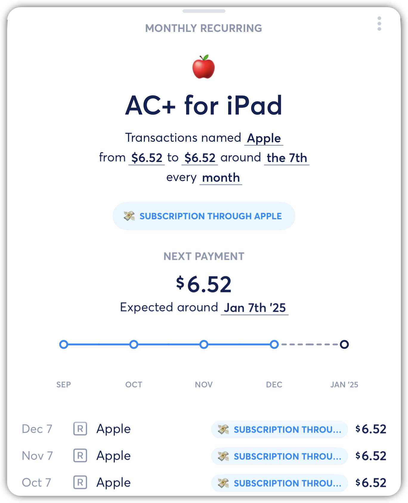](https://downloads.intercomcdn.com/i/o/gw2wbwl7/1278431011/71bfe8e141123e3eb27cb89ac47f/image.png?expires=1773322200&signature=4145873078d166661b84cb4707481bada94d374d57bfa6fcbdeae265d40d14e4&req=dSIgHs19nIFeWPMW1HO4zZm9VRbYgV4dZ1uca9o221uMMtFbrxsom%2BFgJVkw%0Afx9lZEvVVb3tJ%2FvlTYg%3D%0A)
Once you have paused a Recurring, Copilot doesn’t expect that Recurring transaction to be paid in the future, so the expense will be removed from your expected spend if it hasn't been paid already.

The next time Copilot receives a payment for a paused Recurring, it will automatically be marked as active again.

---

# **Archive a Recurring**

Copilot also allows you to archive a Recurring if the expense has been permanently removed from your budget. For example, if you cancel a gym membership, then you can archive the Recurring transaction data for historical reference.

To **Archive** a Recurring, go to the **Recurring** view and select it.
[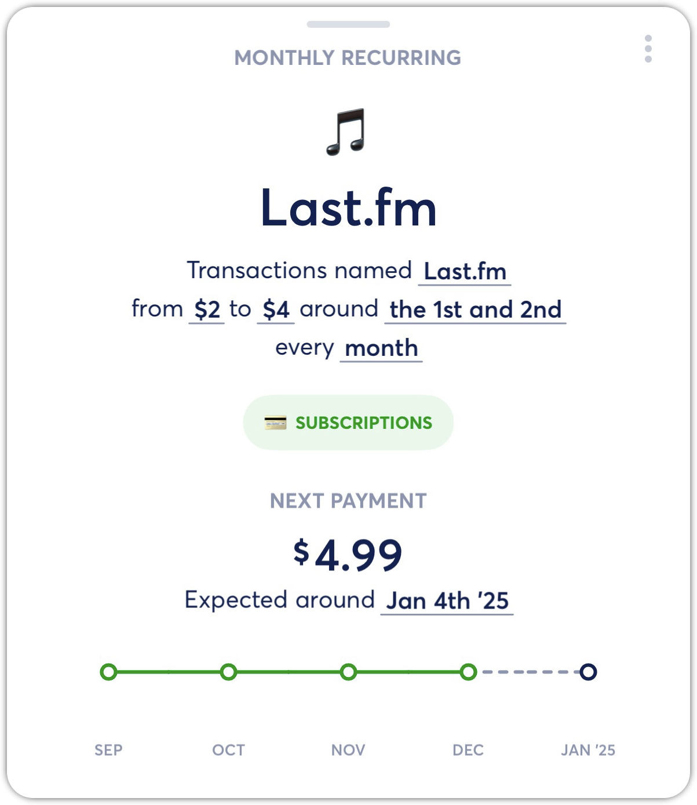](https://downloads.intercomcdn.com/i/o/gw2wbwl7/1278432695/9c1f667985e590ec1a5c167fe992/image.png?expires=1773322200&signature=97bf38a334b30cdf5f3da51466c6d9ec274dcfb0a138c8e4a6c3127a92d85e5f&req=dSIgHs19n4dWXPMW1HO4zQgLZzZAgrwIlFcij8on5GRN8oPztKKg4tQwDiC4%0AZIvBm1LBl04BINyR82M%3D%0A)[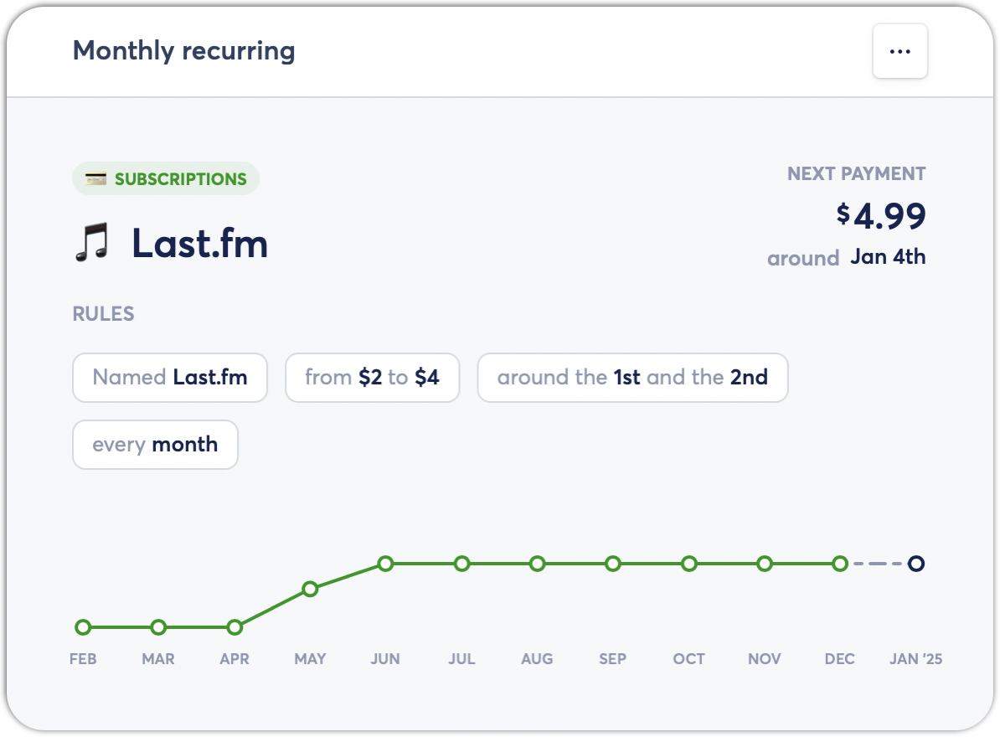](https://downloads.intercomcdn.com/i/o/gw2wbwl7/1278432897/d299523c4aece718a146a4a05850/image.png?expires=1773322200&signature=070b8860e4f59c965e464e147ed429fad6a58c8bab7f00e21faeea50650c2da9&req=dSIgHs19n4lWXvMW1HO4zeugxnpwjOcZncwF3ZJpwKPkS86w9s%2BM1%2BSyksjI%0A2SyumS%2FiFa3fZGHlxGk%3D%0A)
Tap the menu icon in the upper right hand corner to open the **Recurring Option** menu.
[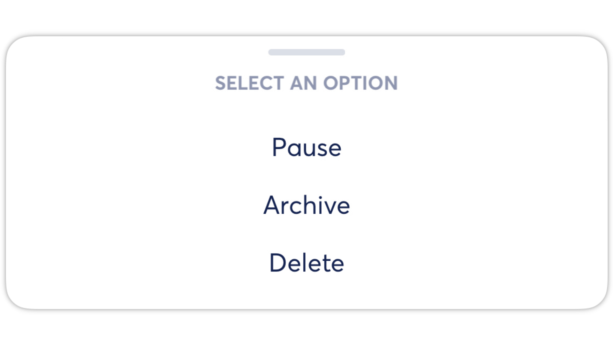](https://downloads.intercomcdn.com/i/o/gw2wbwl7/1278433216/fc4d02dbce4527307f69dae2562d/Options.png?expires=1773322200&signature=cd23341c93e57cbf4f5dd40349af4325f0275879d1f1cd7921cd54911217afb7&req=dSIgHs19noNeX%2FMW1HO4zaIkONuM3m8AlUSCWvcj5hIYcyLYen%2FzdQ1t3UM7%0A20qh%2B1qUDGj5PFtrW2Y%3D%0A)[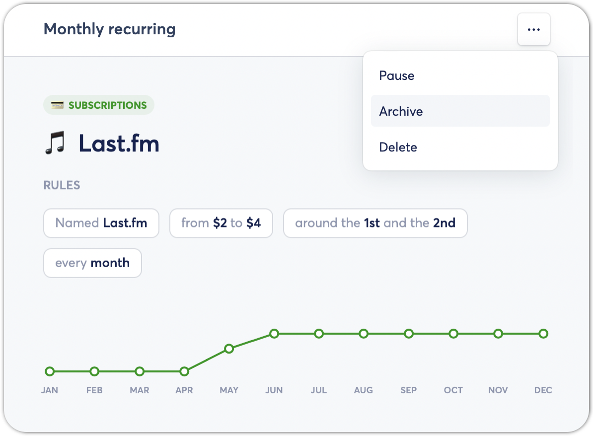](https://downloads.intercomcdn.com/i/o/gw2wbwl7/1278433916/228c101d74ada8b1f99ab65e0329/image.png?expires=1773322200&signature=20eacb69fe3d4a42d3711c78131cfc449ed5da3beab1144cc5d8213b0e27aca0&req=dSIgHs19noheX%2FMW1HO4zSzcAG7gvmU3KHwTlY%2FOJaIVn1eVNWiPh%2FDIfa%2Bc%0A7K76H41efnMcUIIr0Ic%3D%0A)
Select **Archive** and the Recurring will no longer be active.
[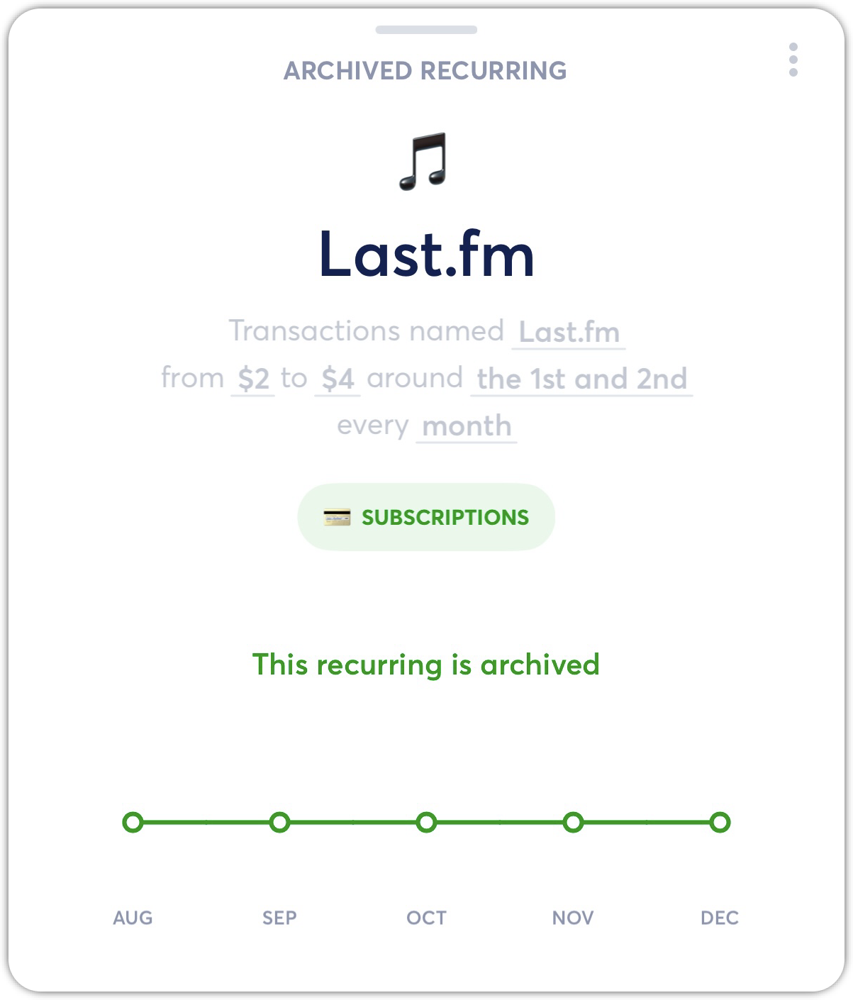](https://downloads.intercomcdn.com/i/o/gw2wbwl7/1278435051/7cb03dd8dd6752cd9d748c8a2222/image.png?expires=1773322200&signature=1979a6312b35d2748b86409ffef29f4bed3ddc93cc2aa3ea0399dba0700b5bed&req=dSIgHs19mIFaWPMW1HO4zYAwg3V%2B9pyyRghONn7bzKZCsHp7G2GpB8ysajQ0%0AiuXcsZCdpo8WKvBNXLw%3D%0A)[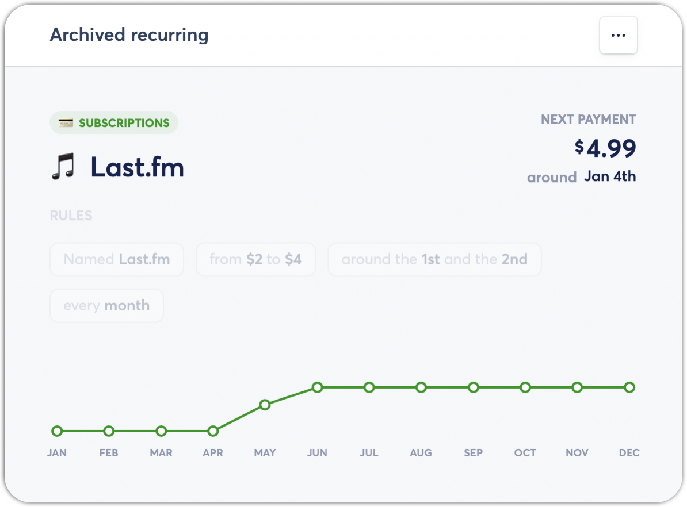](https://downloads.intercomcdn.com/i/o/gw2wbwl7/1278435332/d5f4c5e4f897cc5348c8e0b11bed/image.png?expires=1773322200&signature=339261deee76a0b110d35a0c532c033abc67cd9819384d74b4b200b68b1ea6cf&req=dSIgHs19mIJcW%2FMW1HO4zYlGO2Of7BQgmb0SXwjBV9Zg%2BCAGtz28pc314tY0%0AziZgCN5SfZJYALEqq3I%3D%0A)
Once you have archived a Recurring, Copilot doesn’t expect that Recurring transaction to be paid so the expense will be permanently removed from your expected spend.

---

# **Activate a Recurring**

Copilot also allows you to activate a Recurring that was previously marked as **Paused** or **Archived**.

To **Activate** a Recurring, go to the **Recurring** view and select it.
[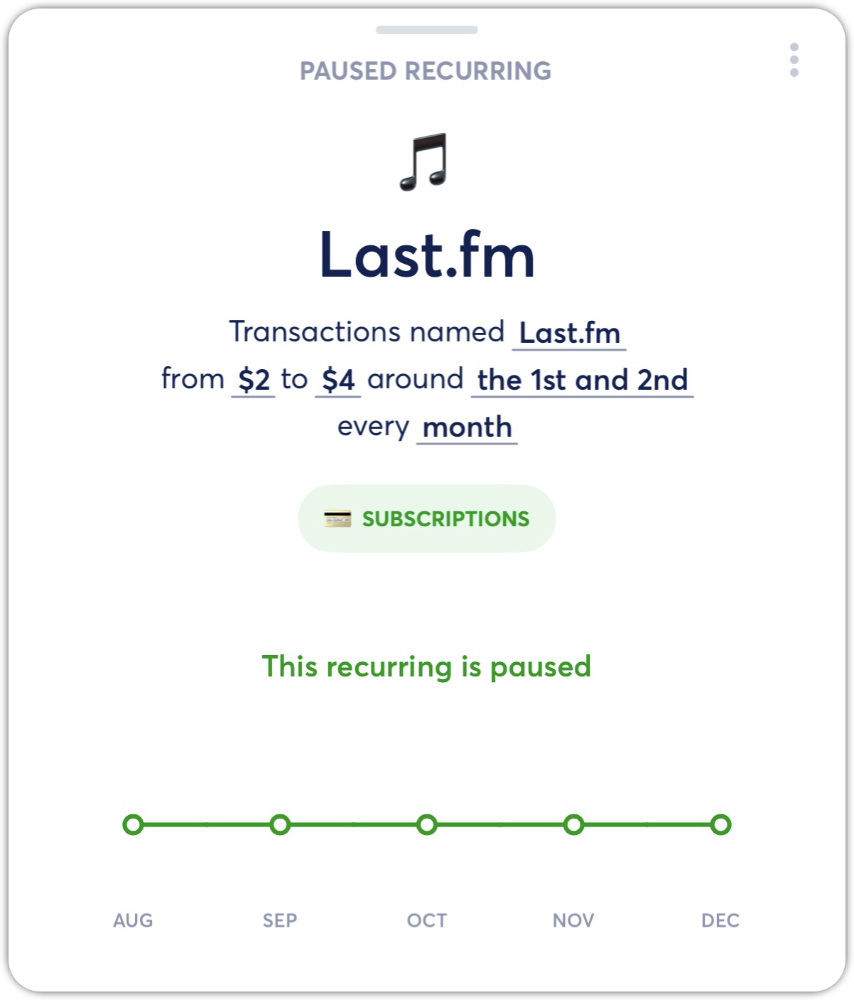](https://downloads.intercomcdn.com/i/o/gw2wbwl7/1278438168/01565423f94726cee11f370a7242/image.png?expires=1773322200&signature=941d55b5b1505a3208166bce48086febfc29e0b12f7ae2e449a8fc124790c97a&req=dSIgHs19lYBZUfMW1HO4zTfxOEMl%2B79A5TR0iZJXdapdm8gVZ2O2YPrwzazn%0ApA8oIBwrtsVviEWAIPM%3D%0A)[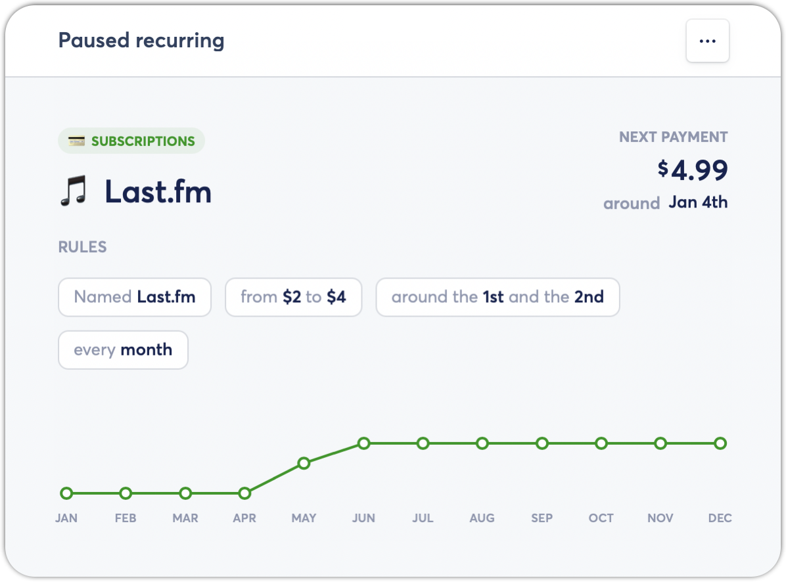](https://downloads.intercomcdn.com/i/o/gw2wbwl7/1278438828/702ba1a276062cdebf464ebff130/image.png?expires=1773322200&signature=3d0652f9035333bbf21e66ec0896786867573a84793a478163867535f91a3dd4&req=dSIgHs19lYldUfMW1HO4zUgXDB1txamfMCADLSN4oDckBGHaM1pDbUnWwAVM%0AA%2F7zknw4pGjR2TewRjg%3D%0A)
​Select **Activate** and the Recurring will be active again.
[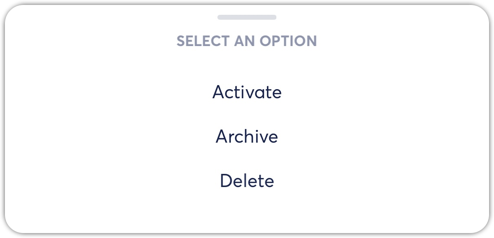](https://downloads.intercomcdn.com/i/o/gw2wbwl7/1278449567/5a6cbcc41c02596b068f0894d6df/image.png?expires=1773322200&signature=8e9024a23886bd7ca87e5a76f118ccce720827278d51f7648086a29881b584fc&req=dSIgHs16lIRZXvMW1HO4zVx%2BjhxhNDrT3Aav1NDAJ8lsRJbTuoReqHb%2BpOkc%0AaAi%2BDFPoyZfZzLWycMI%3D%0A)[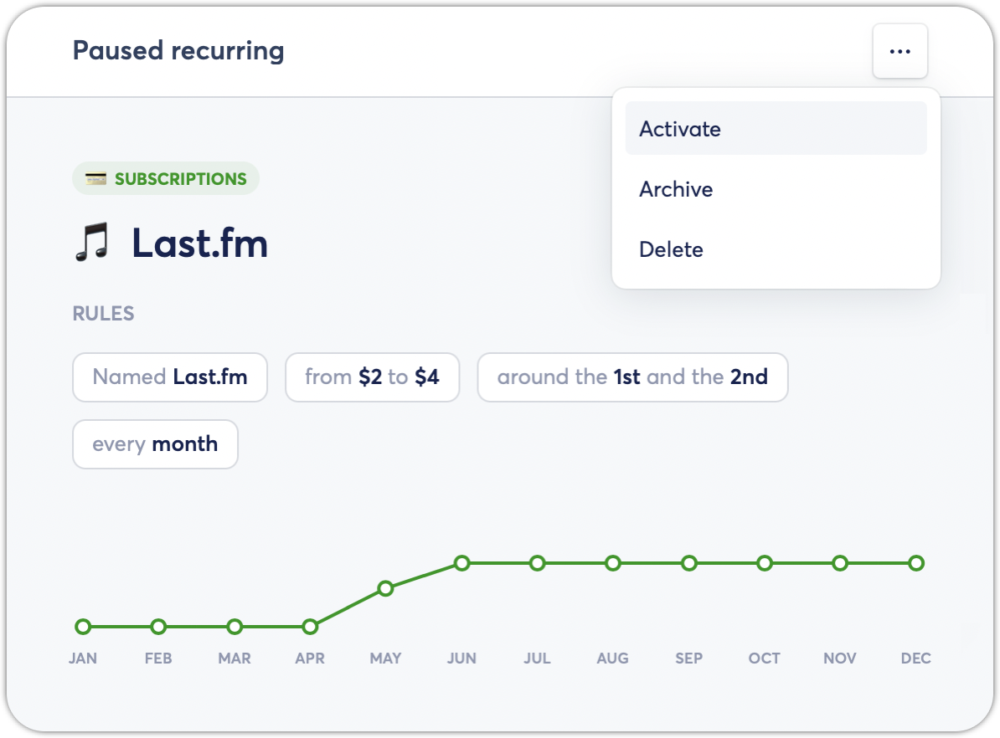](https://downloads.intercomcdn.com/i/o/gw2wbwl7/1278449345/2e3e35c3972d658832e955122370/image.png?expires=1773322200&signature=5fcb0992ab364903359ba3822c30778c1b0108016d6ebb25d6fda544007da62c&req=dSIgHs16lIJbXPMW1HO4zRMr%2B6WyuEtA%2F5xjTMBBldItiN5HnF3fnJFxbQhH%0Aqu6zHLKmboZUKKV09sM%3D%0A)
---

# **Recurring View Options**

Copilot on iPhone allows you to view your Active (Monthly & Future), Paused and Archived Recurrings in either a block or list view

To change the **Recurring** view, tap the block or list icons on the right hand side of each section.
[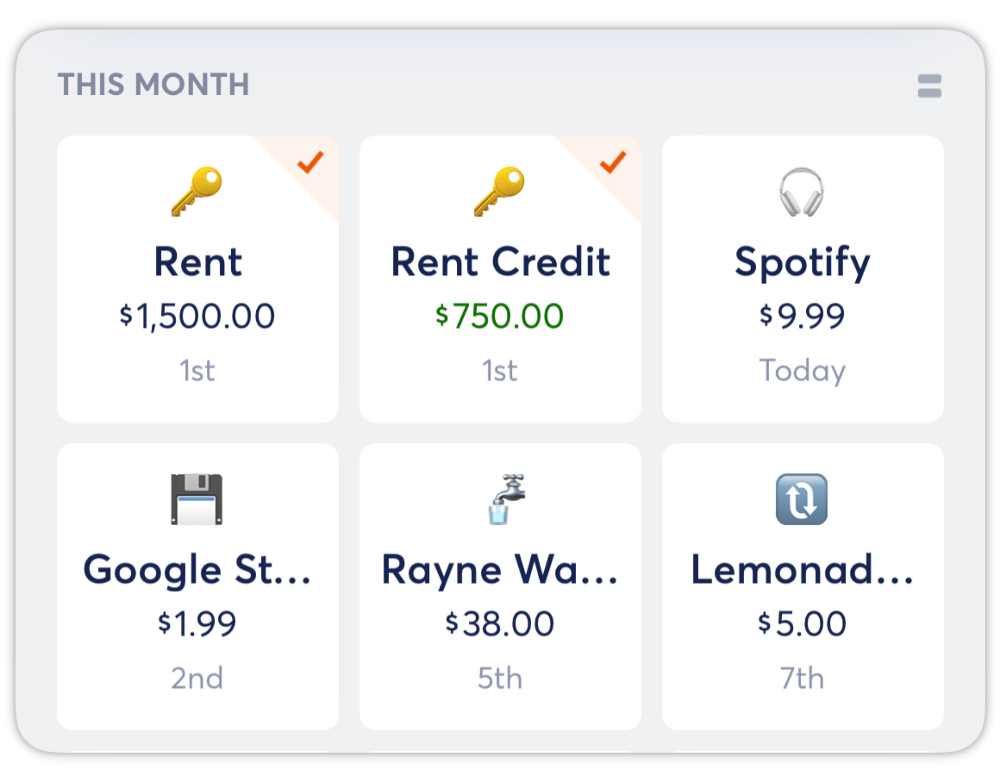](https://downloads.intercomcdn.com/i/o/525537172/a6213ec495fd7bca0cf1b99c/GridView.png?expires=1773322200&signature=4b82b9369ca85c2a22d4245e82d7de5311a589edda10e215b70c318a020596d4&req=cSIiE8p5nIZdFb4f3HP0gDhu%2Fp0rp2lR28GcgVAmxukMhxjiwZJYMqc%2FhkuS%0AhbFemYvkcQsk8cpbig%3D%3D%0A)[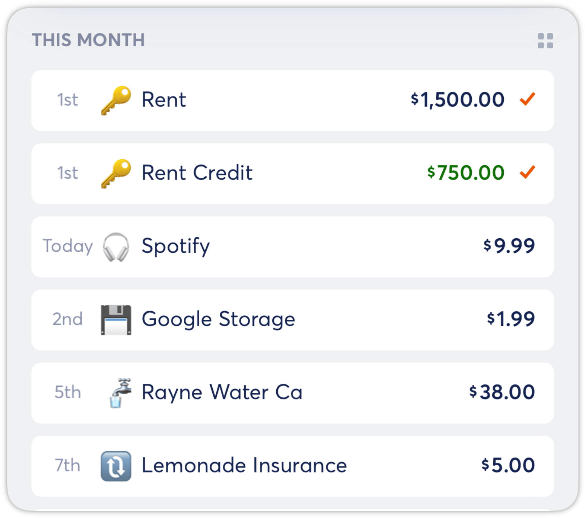](https://downloads.intercomcdn.com/i/o/525537202/0e50afb10de564fab185e4ab/ListView.png?expires=1773322200&signature=ef3ee3ce608e3b88ade06fe340a740d3afa19d2c1a21c03253ae64c6a949af64&req=cSIiE8p5n4FdFb4f3HP0gOy%2BH2B9JEJm2jDZAwZxnC22QvuWARbUBgzsqhAG%0AbiFtF4umpfsRo70VHg%3D%3D%0A)
👋 Still have questions? Contact us via the in-app chat.

---
Related Articles[Creating Recurrings](https://help.copilot.money/en/articles/3760068-creating-recurrings)[Editing Recurrings](https://help.copilot.money/en/articles/3783837-editing-recurrings)[Shared Recurring Expenses](https://help.copilot.money/en/articles/5324776-shared-recurring-expenses)[Recurrings Tab Overview](https://help.copilot.money/en/articles/9778259-recurrings-tab-overview)[Recurrings FAQ](https://help.copilot.money/en/articles/10244751-recurrings-faq)
