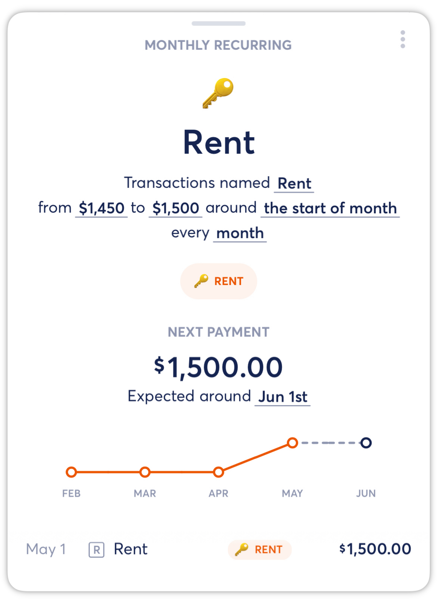
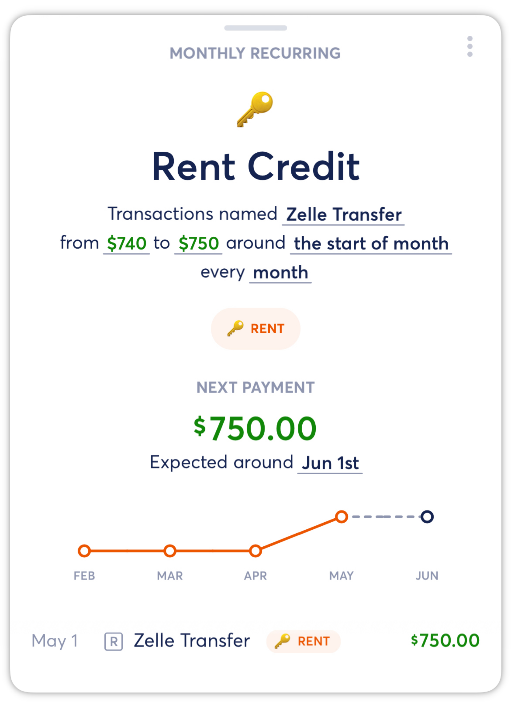
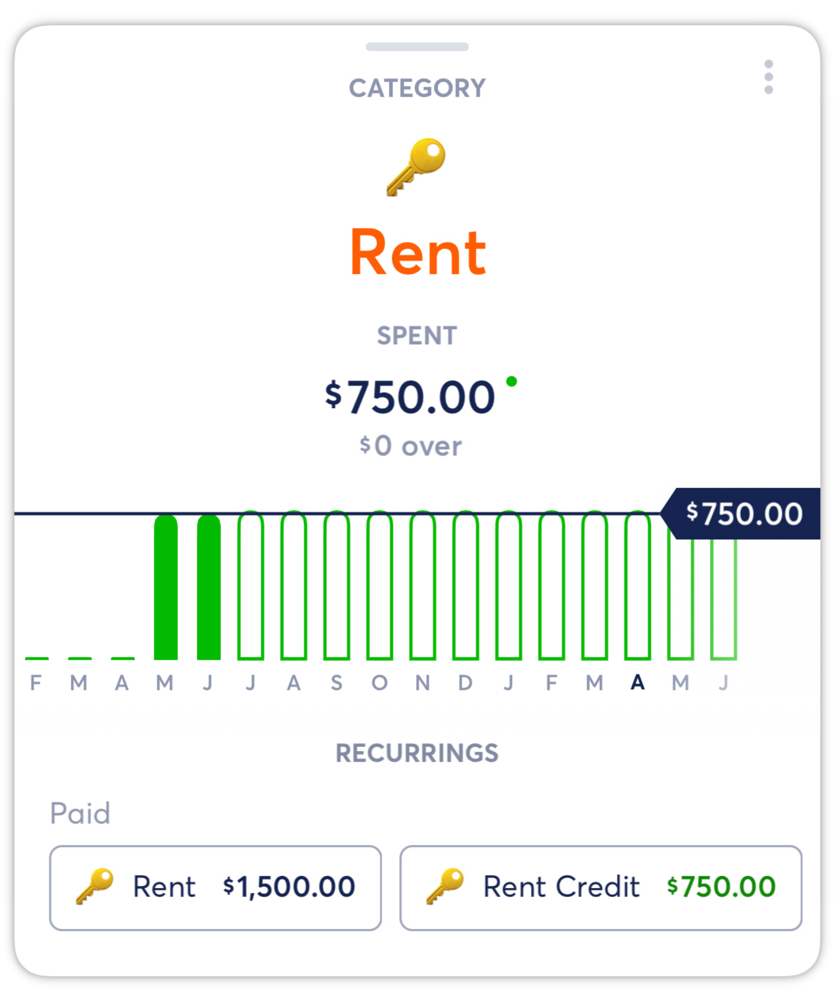

# Shared Recurring Expenses

**Source:** https://help.copilot.money/en/articles/5324776-shared-recurring-expenses

In Copilot, it's easy to see your actual spend for shared expenses by associating spending and reimbursement Recurrings with the same category. We suggest the following method for handling shared recurring expenses:

Create two monthly Recurrings under the same Category (ex. **Rent**).

One Recurring for the full payment amount (ex. **Total Rent**):

Second Recurring for the reimbursed credit amount (ex. **Rent Credit**):

***Note:****before setting up your Recurring, the reimbursement transaction may initially be categorized as Income or Internal Transfer, so you may need to update the transaction type to Regular to start.[Learn more about Copilot's Transaction Types here.](https://intercom.help/copilotmoney/en/articles/3971267-transaction-types)*

Your **Rent** category budget should be set to the amount you pay, so that it will reflect your actual monthly spend:

From the start of each month, Copilot will sum your total recurring spend for the month to show your total expected spend. In this case, it will be your Rent Recurring ($1,500) plus your Rent Credit (-$750) for a total actual spend of $750 in your Rent category.

👋 Still have questions? Contact us via the in-app chat.

---
Related Articles[Creating Recurrings](https://help.copilot.money/en/articles/3760068-creating-recurrings)[Pausing and Archiving Recurrings](https://help.copilot.money/en/articles/3983286-pausing-and-archiving-recurrings)[Dashboard Tab Overview](https://help.copilot.money/en/articles/6045480-dashboard-tab-overview)[Dashboard FAQ](https://help.copilot.money/en/articles/10238054-dashboard-faq)[Quick Start Guide](https://help.copilot.money/en/articles/11157550-quick-start-guide)
