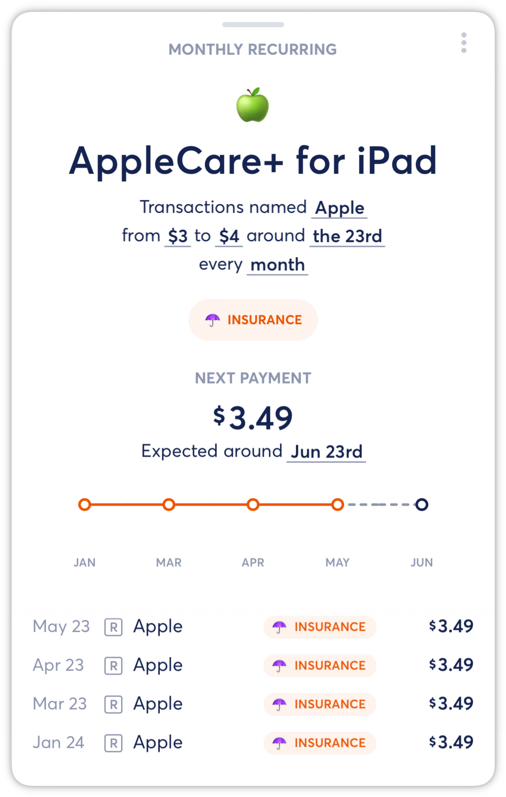
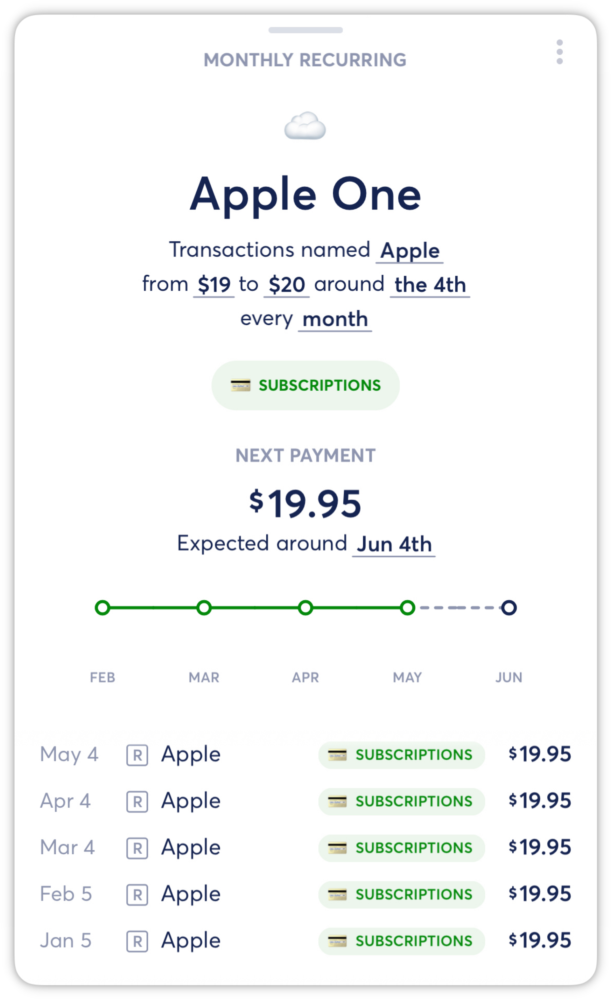
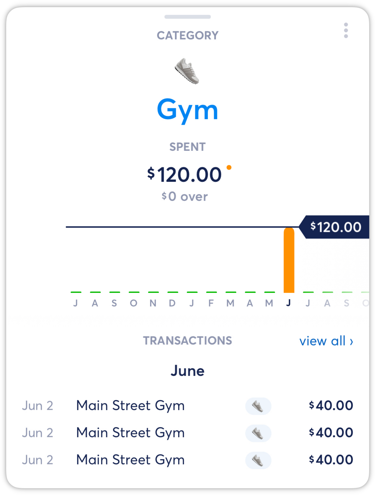
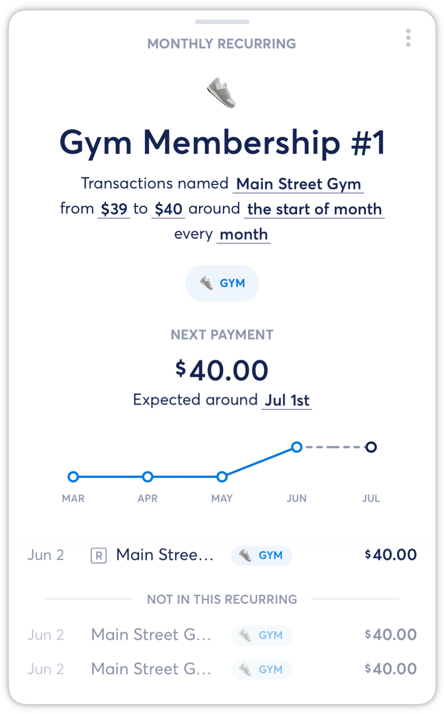
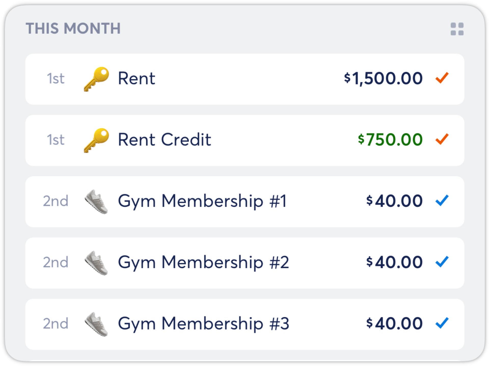
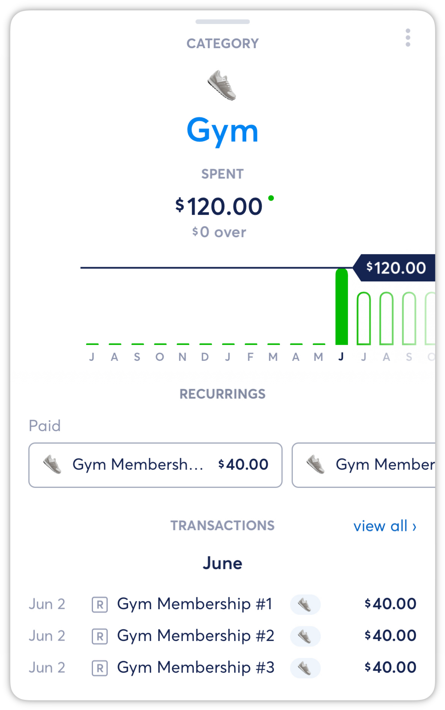

# Multiple Recurrings for the Same Merchant

**Source:** https://help.copilot.money/en/articles/5327632-multiple-recurrings-for-the-same-merchant

Set up multiple recurring transactions from the same merchant with identical dates and amounts for accurate tracking and budgeting.

---

# Multiple Recurring Transactions with Same Merchant

If you have more than one recurring transaction posted under the same merchant name, then you should create multiple Recurrings. For example, both AppleCare and Apple One subscriptions are posted under "Apple.com-bill" or "Apple."

- Edit the amount range, expected date and recurring frequency to filter each Recurring correctly.

---

# Multiple Recurrings with the Same Merchant, Date, and Amount

If you have monthly recurring transactions with the exact same transaction name, date, and amount, then you should create unique **Monthly Recurrings**.

For example, if you have a $40 monthly gym membership fee for three family members, then you will have three different transactions from the same merchant on the same date. In this case, your monthly Gym budget is $120.

To do this, first, delete any existing Monthly Recurrings for these transactions, then follow these steps for the initial setup:

- Create the first **Monthly Recurring** by selecting one of the monthly payments from the Transactions or Category view.
- Select Recurring, Start a new one, and then update the Recurring Name, Category, and filter settings (transaction name, amount range, expected date, and frequency). See [this article](https://intercom.help/copilotmoney/en/articles/3760068-create-recurrings) for detailed instructions.

If more than one payment is listed in the included transactions, then you will need to remove it before saving the new Monthly Recurring. Tap the **X** next to each duplicate transaction, leaving only one payment per month.

- Save the first **Monthly Recurring**.
- Then, repeat this process for each monthly subscription instance, but update the **Monthly Recurring** name for each. For this example, "Gym Membership #1," "Gym Membership #2, "and "Gym Membership #3."

- Once you have completed these steps, you will have three **Monthly Recurrings** with the same configuration, but with only one payment per month.

After you complete the initial set-up, then all future monthly recurring transactions will automatically be applied to each unique **Monthly Recurring**.

👋 Still have questions? Contact us via the in-app chat.

---
Related Articles[Creating Recurrings](https://help.copilot.money/en/articles/3760068-creating-recurrings)[Optimizing Recurrings](https://help.copilot.money/en/articles/3783499-optimizing-recurrings)[Editing Recurrings](https://help.copilot.money/en/articles/3783837-editing-recurrings)[Pausing and Archiving Recurrings](https://help.copilot.money/en/articles/3983286-pausing-and-archiving-recurrings)[Shared Recurring Expenses](https://help.copilot.money/en/articles/5324776-shared-recurring-expenses)
