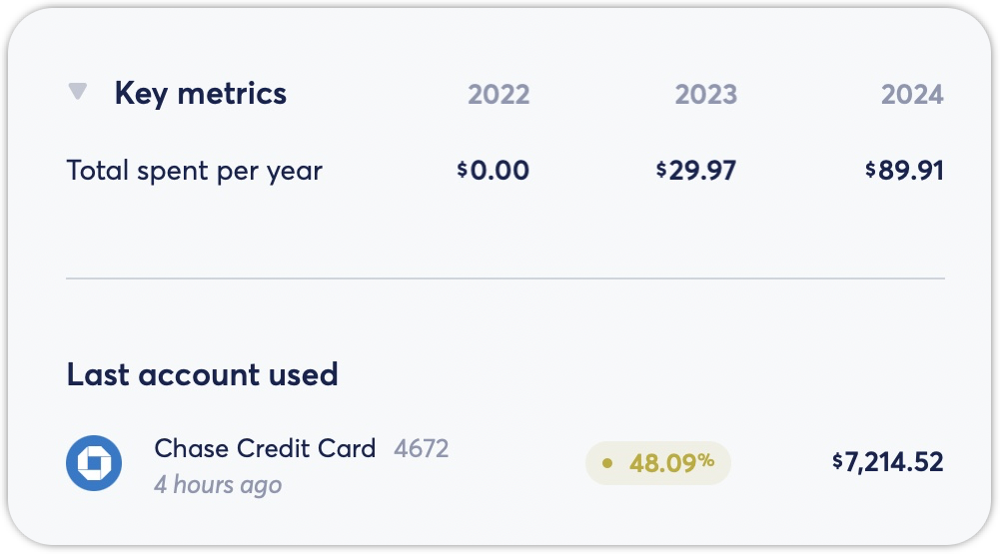

# Recurrings Tab Overview

**Source:** https://help.copilot.money/en/articles/9778259-recurrings-tab-overview

Copilot's Recurrings tab allows you to review all paid and left to pay recurrings for the current month, future recurrings that occur less frequently, and archived recurrings. You can also review and edit any recurring filters to make necessary changes.

---

# Display Options

In the Recurrings tab, you can view your recurrings in **list view** or **grid view** by tapping on the icon next to the recurring's list.
​

**Note**: Display options are not currently available on the**Mac or iPad app**, all recurrings will be shown in the list view.

# Recurring Details View

Recurring details view allows you to review recurring filters for each recurrings to make sure they're all still up to date. If anything has changed, you can tap on the appropriate underlined section to update those filters to make sure the recurring is still capturing the correct transaction. You can use [this article](https://help.copilot.money/en/articles/3783837-edit-recurrings) to learn more about editing your recurring filters.

On **Copilot Mac and iPad apps**, you can also see **Key Metric** and **Last Account Used** in the recurring details view.

# Create New Recurrings

You can create new recurrings from the Recurrings tab by tapping on the **+** icon at the end of the list or the **+** icon on the lower right of the display. You can use [this article](https://help.copilot.money/en/articles/3760068-create-recurrings) to learn more about creating new recurrings.
​

👋 Still have questions? Contact us via the in-app chat.

---
Related Articles[Dashboard Tab Overview](https://help.copilot.money/en/articles/6045480-dashboard-tab-overview)[Categories Tab Overview](https://help.copilot.money/en/articles/9504513-categories-tab-overview)[Transactions Tab Overview](https://help.copilot.money/en/articles/9554412-transactions-tab-overview)[Cash Flow Tab Overview](https://help.copilot.money/en/articles/9682232-cash-flow-tab-overview)[Savings Goal Tab Overview](https://help.copilot.money/en/articles/11470324-savings-goal-tab-overview)
