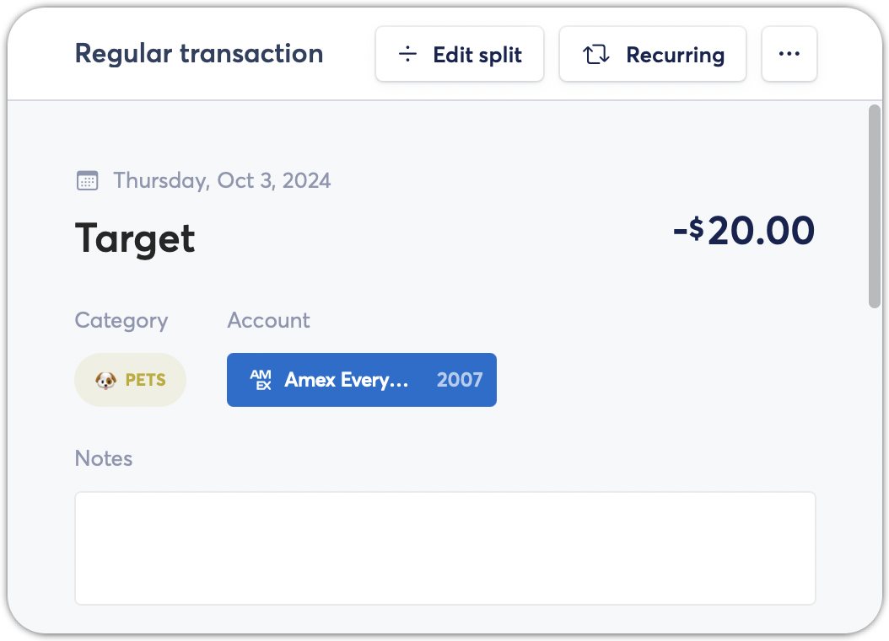
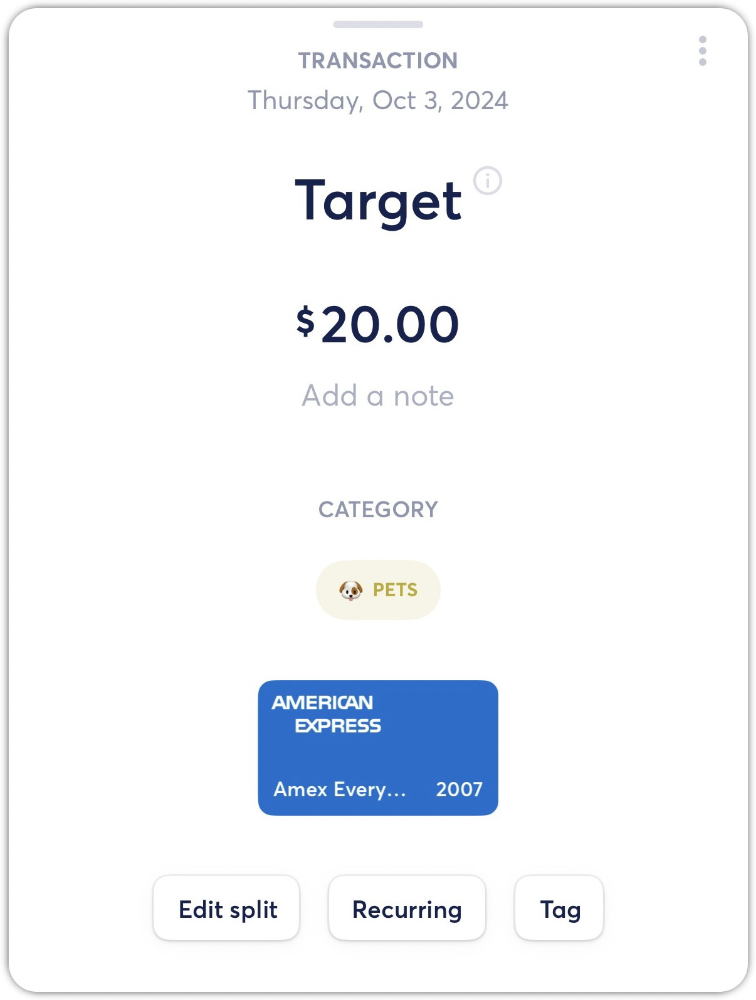

# Creating Name Rules

**Source:** https://help.copilot.money/en/articles/3971270-creating-name-rules

When you categorize a transaction, you can choose to automatically categorize all transactions based on a name matching rule. You can create exact or partial transaction name matching rules.

---

# Exact Name Match Rule

- In the Transactions tab, search for the transaction by name.

- Select the incorrectly categorized transaction.

- Tap on the current category to change and create an exact name rule.

- Select the correct category, then decide if you want to apply the same change to similar transactions based on the name or the Plaid transaction categorization (ex. Apply to all “Walmart” Transactions).

- If you do not want to create a rule, then select **No thanks** to update the individual transaction.
- Tap **Create a Rule Based on the Name**, select **Exact Match** and **Create Rule**.

# Partial Name Match Rule

- Transactions from the same merchant may not always post with the same name, or transactions may have a custom name each month (ex. GasBill032020, GasBill042020). You can create a partial transaction name match rule to ensure that future transactions are categorized correctly.
- In the **Transactions** tab, search for the transaction with a portion of the name. In this example, the merchant name varies based on store location.

- Select the incorrectly categorized transaction.

- Tap on the current category to change and create a partial name rule.

- Select the correct category, then decide if you want to apply the same change to similar transactions based on the name or the Plaid transaction categorization (ex. Apply to all "Tommy Hilfiger" transactions).

- If you do not want to create a rule, then select **No thanks** to update the individual transaction.
- Tap **Create a Rule Based on the Name** and select **Partial Match**.

- Then select a portion of the transaction name and **Create Rule**.

***NOTE:****This will not not automatically update future transaction names with the partial name - these rules are for transaction categorization.*

# Replacing Existing Transaction Name Rules

If you have an existing transaction name rule, creating a new rule for the same name will overwrite the old rule.

For example, you might have a transaction name rule for transactions named "**Whole Foods**" to be categorized as **Groceries**, but you decide that you want these transactions to be categorized as **Shops** instead.

In this case, you can create a new transaction name rule for "**Whole Foods**" to categorize those transactions as **Shops**. This will overwrite you previous name rule, meaning all **"Whole Foods"** transactions will be categorized as **Shops**. Please note, this will also recategorize any historic transactions that match this rule as well.

👋 Still have questions? Contact us via the in-app chat.

---
Related Articles[Creating Recurrings](https://help.copilot.money/en/articles/3760068-creating-recurrings)[Transaction Types](https://help.copilot.money/en/articles/3971267-transaction-types)[Creating Manual Transactions](https://help.copilot.money/en/articles/4038706-creating-manual-transactions)[Splitting Transactions](https://help.copilot.money/en/articles/5325255-splitting-transactions)[Categories FAQ](https://help.copilot.money/en/articles/10216528-categories-faq)
