# Creating Manual Transactions

**Source:** https://help.copilot.money/en/articles/4038706-creating-manual-transactions

Copilot allows you to create manual transactions when necessary.

# Regular Transaction

- In the Transactions view, tap **the "+" on lower right corner**. Then select the type of transaction: **Regular**, **Income** or **Transfer**. See this article to learn more about **[Transaction Types](https://intercom.help/copilotmoney/en/articles/3971267-transaction-types)**.

- This is an example of a manual **Regular** transaction.
[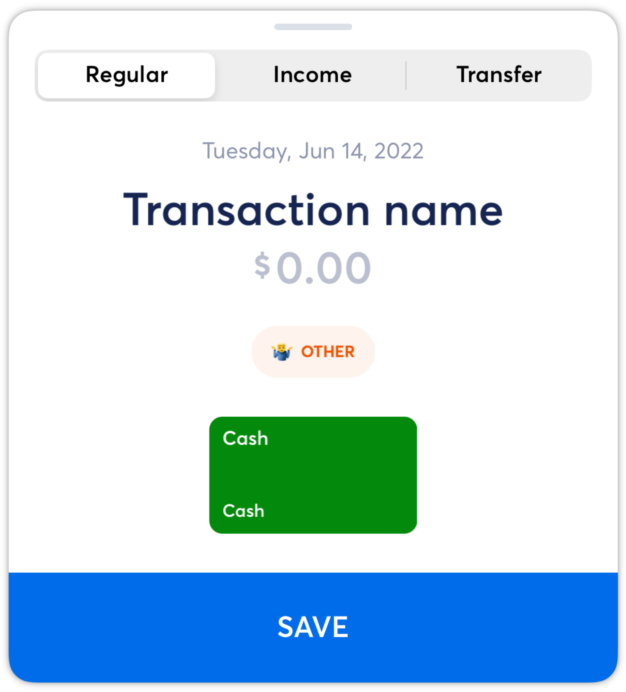](https://downloads.intercomcdn.com/i/o/530158599/42435c2ecff535bcdf87b6af/Default.png?expires=1773322200&signature=101bca184d15ec2a9aa65a60b5ef26f55d446695408e882a30e695ba05ac7d0b&req=cSMnF8x2mIhWFb4f3HP0gB30%2Byv%2B%2Bw2pIKJTI2WlcOzFW8v7UtlBwqqGtGYt%0AffUaUKQn5reiPM55Rw%3D%3D%0A)
- Tap on the current date to update the transaction date, then continue.
[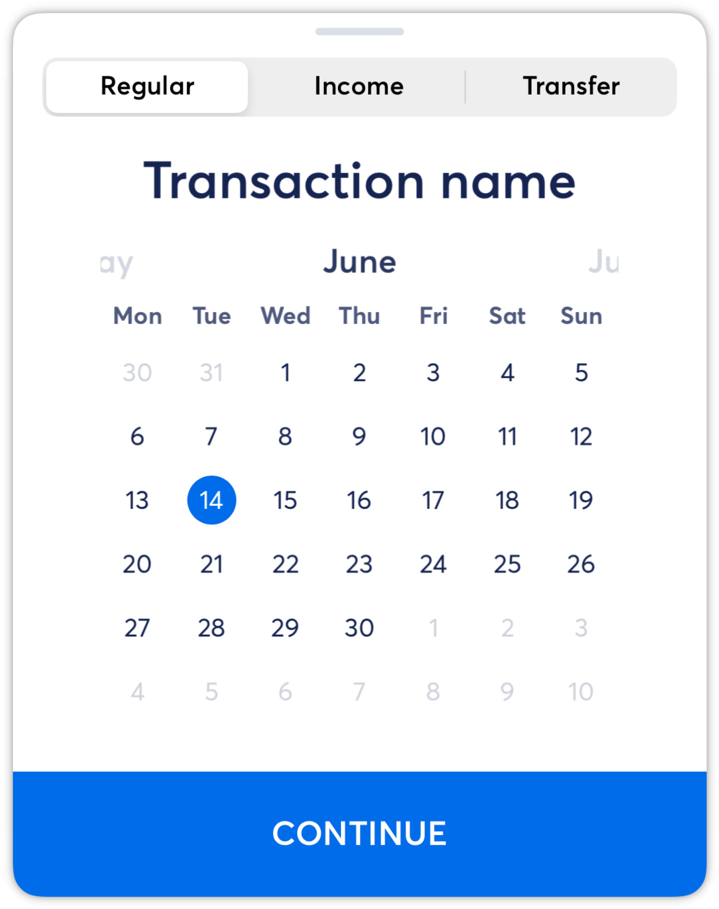](https://downloads.intercomcdn.com/i/o/530158662/82683eefb840275fc2e867f3/Date_Selection.png?expires=1773322200&signature=c80b43e573b5621bfe6a7a3a7b87baafd06e02100aa505d3bdf9e32d9d4ab578&req=cSMnF8x2m4ddFb4f3HP0gHLm3iR8yN%2BBXBjpSrE5DkxHfpqm4OmGefGJmHhP%0AJz%2FUY%2BWOm6kfFWGhUA%3D%3D%0A)
- Enter the **Transaction Name**, then the **Amount** as an **Expense** or **Refund**.
[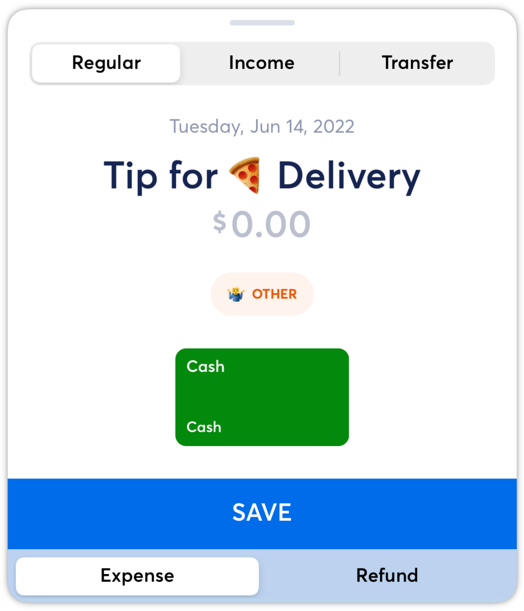](https://downloads.intercomcdn.com/i/o/530159785/0e6a6ef1543a7dd415929846/Expense.png?expires=1773322200&signature=222b4915eb5075a845cc560050996bf1047332f67ef62750199878715d641bbb&req=cSMnF8x3molaFb4f3HP0gJzeXJsH0lYSwObqPbhLDYIwZT2H1pxOunZtYa4e%0A29pRSin7hFyp7%2F1NeA%3D%3D%0A)
- Tap the default category to re-categorize accordingly. Then tap the account to select the correct one. Save the transaction.
[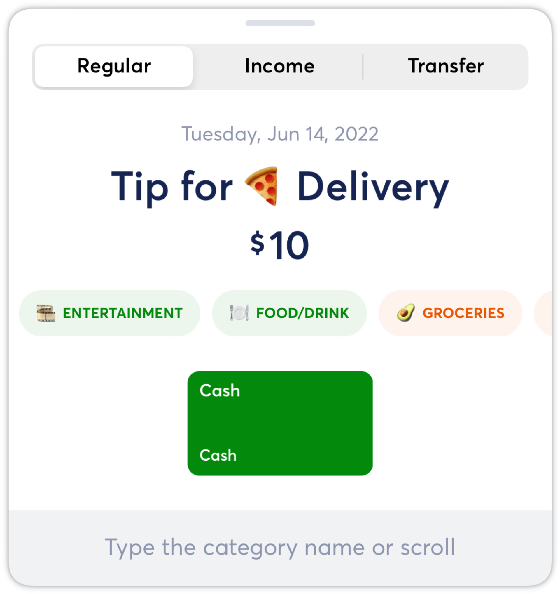](https://downloads.intercomcdn.com/i/o/530159893/7cfd9c7d4ac126f99aa5ec01/Select_Category.png?expires=1773322200&signature=fd669bb2e5c0ada7e86059209141e1127f3a6c7d4a012d6cd356c48922241d58&req=cSMnF8x3lYhcFb4f3HP0gLnbHVE40Keca3zLDFJ3Hc8V%2Bwm%2BIFNY9ob%2F9vbk%0AzXvJqxsGNXomMPkKHQ%3D%3D%0A)[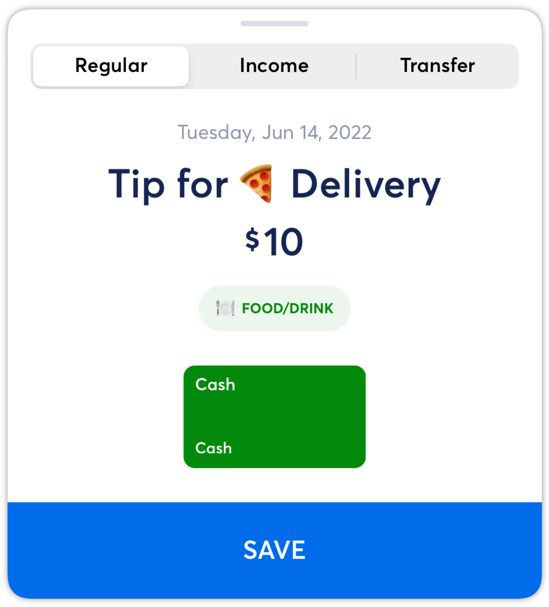](https://downloads.intercomcdn.com/i/o/530159955/fb530dec7f16448f1a362025/Completed.png?expires=1773322200&signature=81fdfa0b1fa544f26128c66bf925515ed04d384cc4e93a305a05c6a5ebb98038&req=cSMnF8x3lIRaFb4f3HP0gIVNtuglgFIR2sflK8W1i6w%2Fk9O%2B%2BfF8xUnJ08b6%0AtyyceAHGq7V3Y1QkwQ%3D%3D%0A)[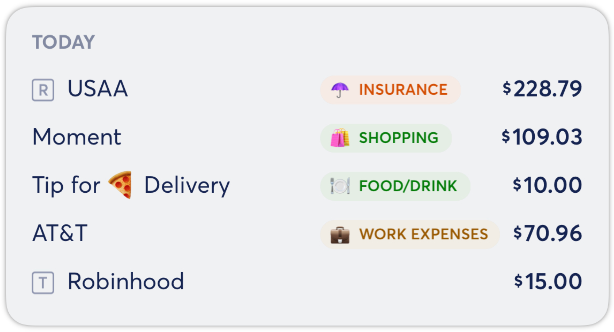](https://downloads.intercomcdn.com/i/o/530159991/e2bba18f185fd4c13c2d926d/Manual_Cash.png?expires=1773322200&signature=ec1203627764f1677d534fc07644d80248b0db46b5f6a27b9a5ebaf7626bcad0&req=cSMnF8x3lIheFb4f3HP0gPvGiAZUr5BXJw9R2%2FBYP7Ew284JpC4qBs8NAXf4%0AjkF4ijgNewMLnI4ZLg%3D%3D%0A)
# Income Transactions

- This is an example of a manual **Income** transaction, which could be used if you receive a cash payment.
[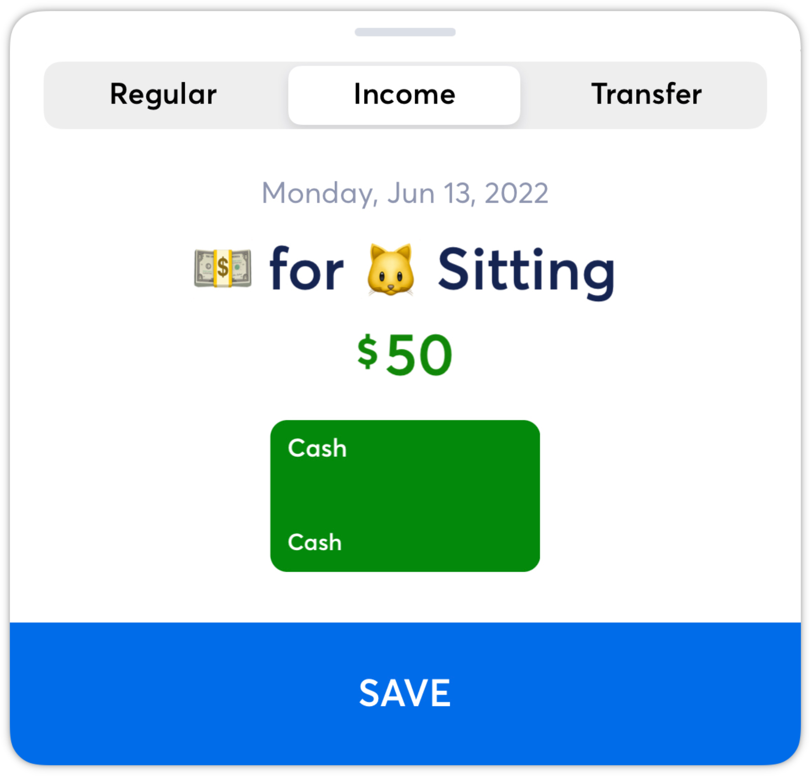](https://downloads.intercomcdn.com/i/o/530160089/c6acf06ab328246cdeecfc1c/Income.png?expires=1773322200&signature=f48f72fe703d12ffed27856310e8df1f64ccf7e677445b648ac528c775ea9ae6&req=cSMnF89%2BnYlWFb4f3HP0gLwNZ1ovEI8zUgLGFdsJwYan%2Bnpa7QeMLTZVKBkm%0Ab19C7CHkFmvArox4Fg%3D%3D%0A)[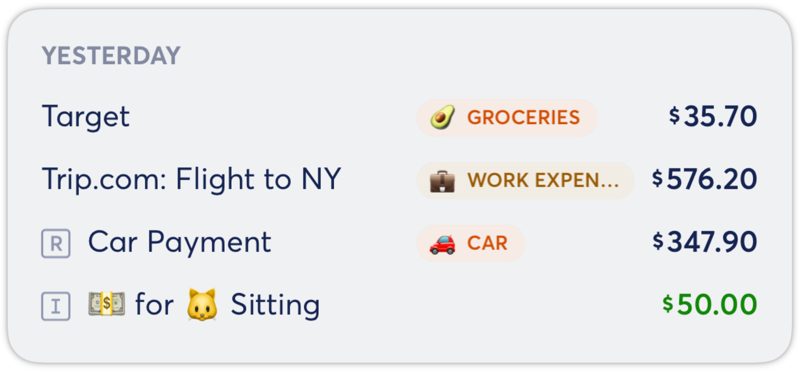](https://downloads.intercomcdn.com/i/o/530160108/15c81588fb130f098e1b3208/Manual_Income.png?expires=1773322200&signature=1415d7d8bbab36c86974d01c8dcc145167ff51fa3f815c67b71444cbab27efc1&req=cSMnF89%2BnIFXFb4f3HP0gE9jGmcrHr23khQbDlXo4dlA5XSHyFrrkY5IMkEF%0AWYrW2P8MPqj7ccIApQ%3D%3D%0A)
# Transfer Transaction

- This is an example of a manual **Internal Transfer**, which could be used for transferring funds from your checking account to your savings account. You would need to post two manual transactions:

1. **Outgoing Transfer** from the checking account.
[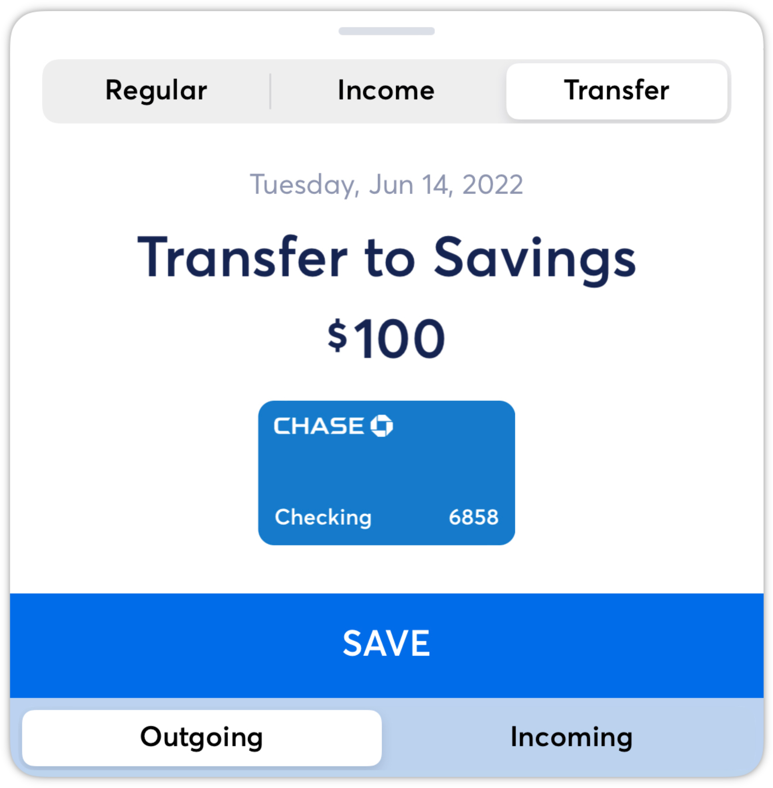](https://downloads.intercomcdn.com/i/o/530160242/5d0d5de5d125735165880031/Transfer_Out.png?expires=1773322200&signature=0095ec9750f9d8f0c301acc7bb4dfc60d398a06379bfd8be5002292858b89599&req=cSMnF89%2Bn4VdFb4f3HP0gNKOAXVFAdVO5AerBZ8yfdDHuVOHIl55MbAHdrxm%0AikE5xIPdkLL8rneC0A%3D%3D%0A)
2. **Incoming Transfer** to the savings account.
[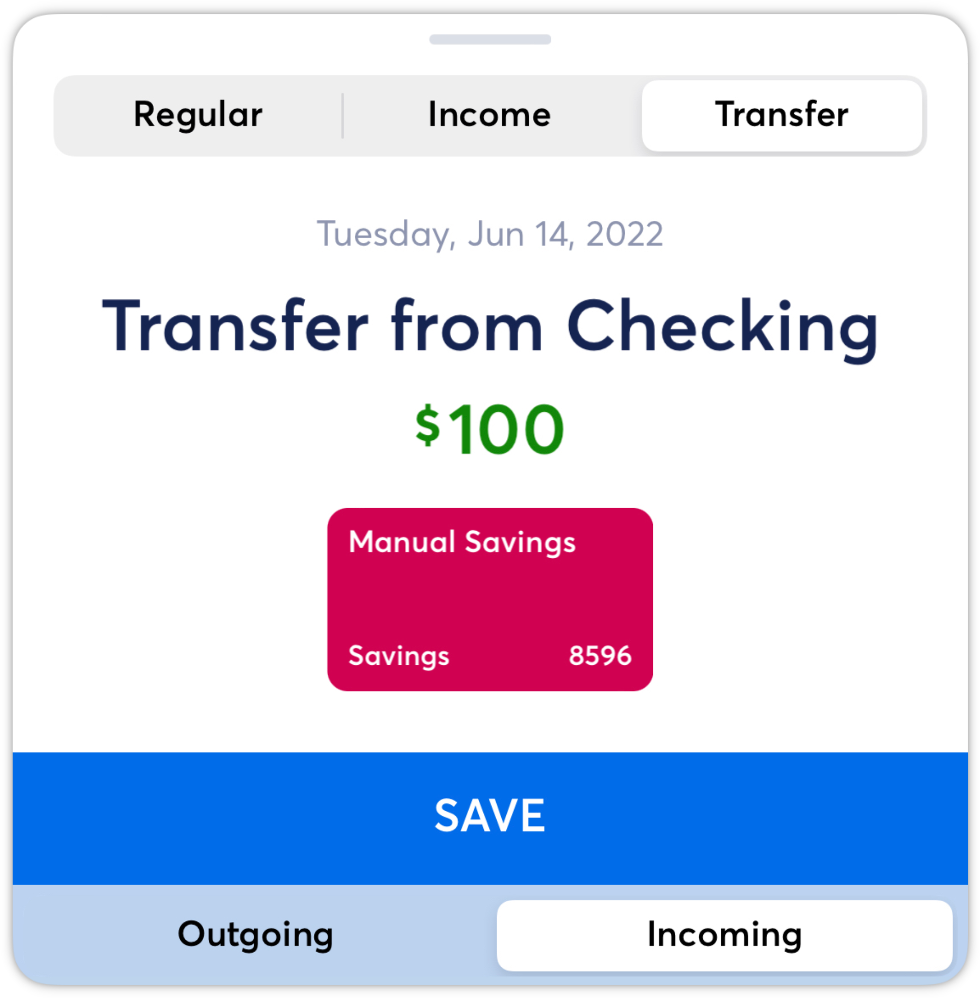](https://downloads.intercomcdn.com/i/o/530160311/c73823c5d03fc08fac746c30/Transfer_In.png?expires=1773322200&signature=1f64f361851c23272e19dec3eabc5282739b2079477cc4613b3db84eca38c99d&req=cSMnF89%2BnoBeFb4f3HP0gDrO7lwIH2a79sRoeLIDa7GYEsh5wEIltAkpuvqr%0AZY%2FjZxKSwEFuQXG9gw%3D%3D%0A)[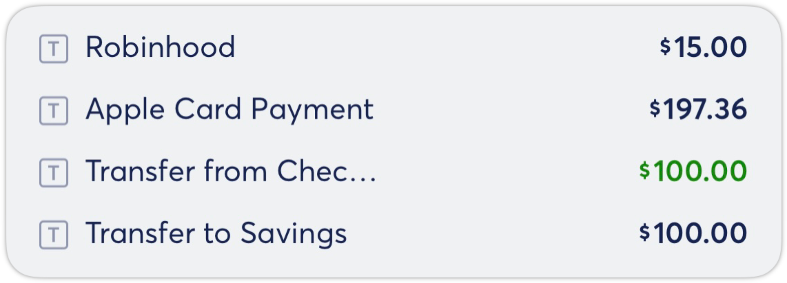](https://downloads.intercomcdn.com/i/o/530160339/96a6a8c7d8722daa385072b7/Manual_Transfers.png?expires=1773322200&signature=21e82cec9587ab994ae60af9fdccf4380295fc26abe43e4c8ea4d293252e24a7&req=cSMnF89%2BnoJWFb4f3HP0gEeJSGb9%2BkkW7h%2Ft5KqmdbSOyac4sEYzS7iNgM65%0ATSOuyR5pkybNLjTlsA%3D%3D%0A)
*NOTE: Internal Transfer transactions should automatically be captured in your account transaction data. Please contact support if you are missing transactions!*

Learn about how manual account balances and transactions work together in Copilot [here](https://help.copilot.money/en/articles/10682991-understanding-manual-accounts).

👋 Still have questions? Contact us via the in-app chat.

---
Related Articles[Transaction Types](https://help.copilot.money/en/articles/3971267-transaction-types)[Creating Manual Internal Transfer Payments](https://help.copilot.money/en/articles/4235839-creating-manual-internal-transfer-payments)[Creating Manual Accounts](https://help.copilot.money/en/articles/4537532-creating-manual-accounts)[Understanding Manual Accounts](https://help.copilot.money/en/articles/10682991-understanding-manual-accounts)[Transactions FAQ](https://help.copilot.money/en/articles/10761907-transactions-faq)
