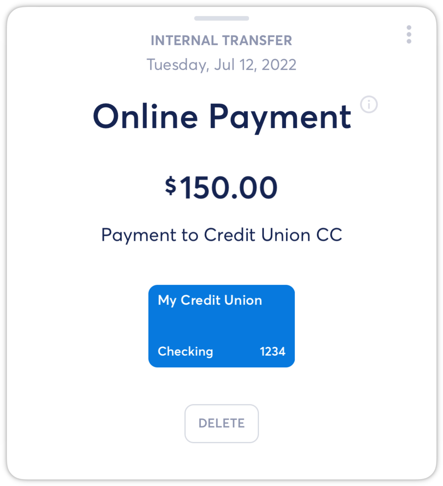
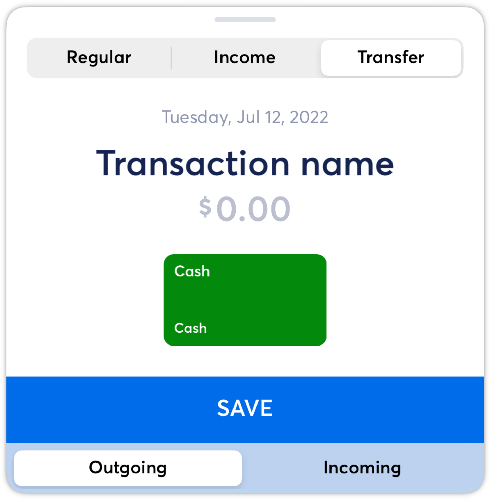
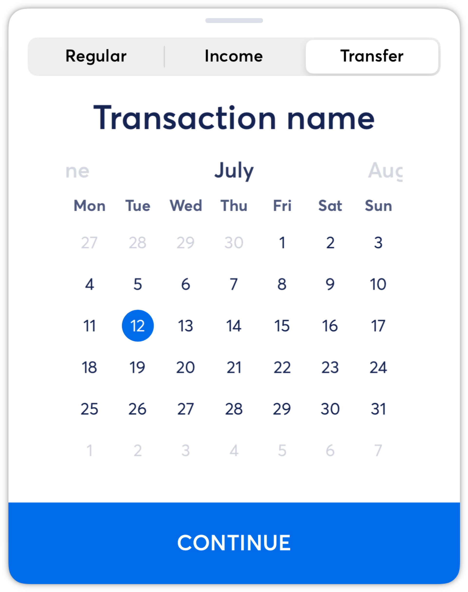
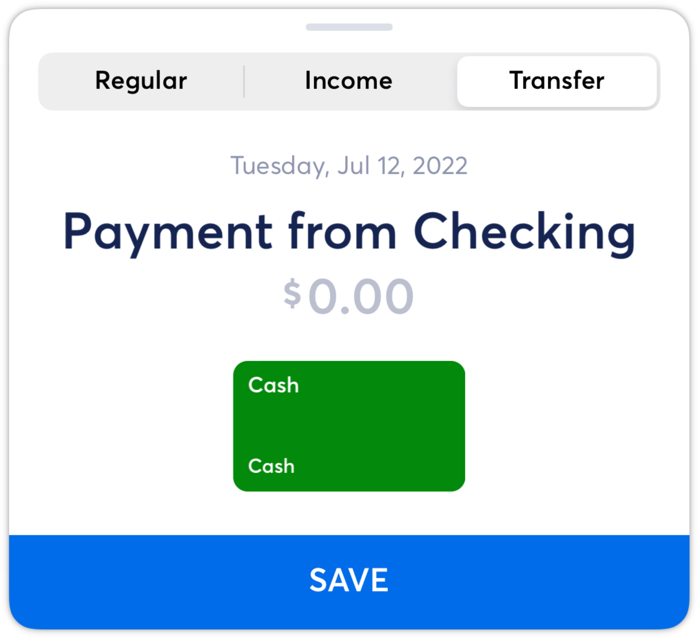
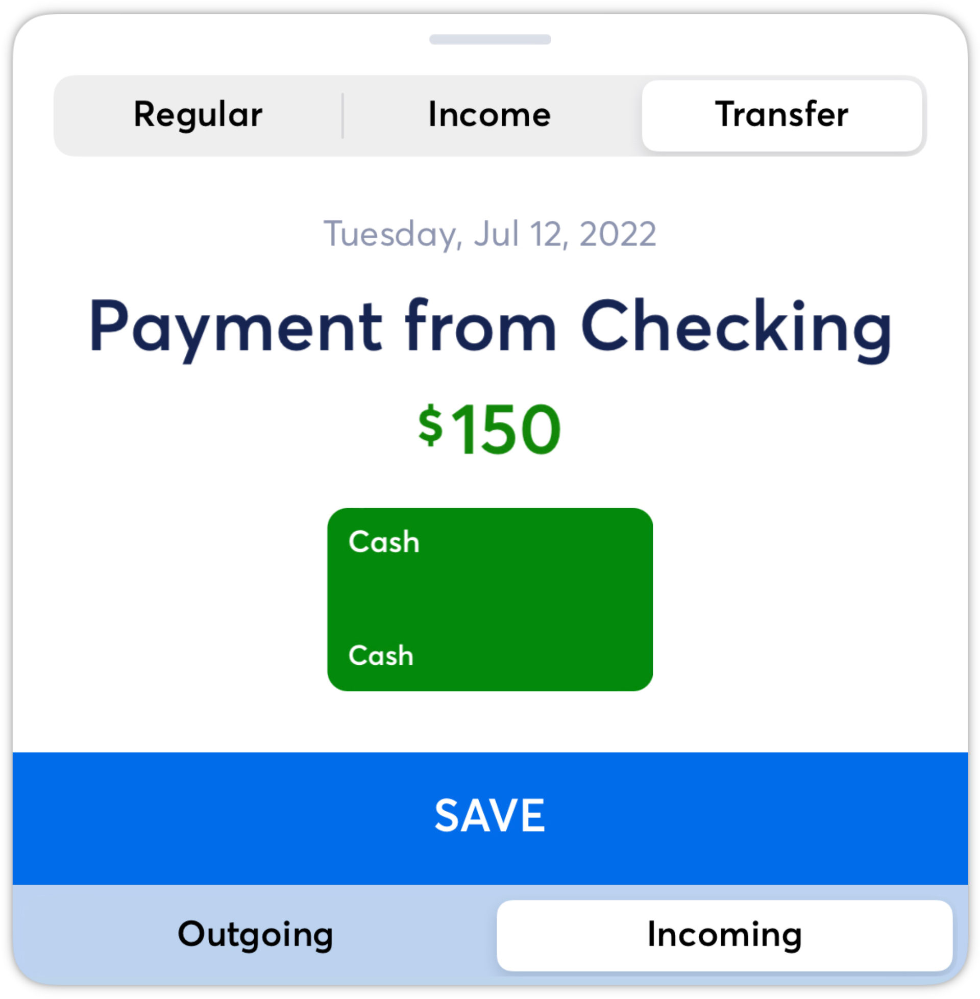
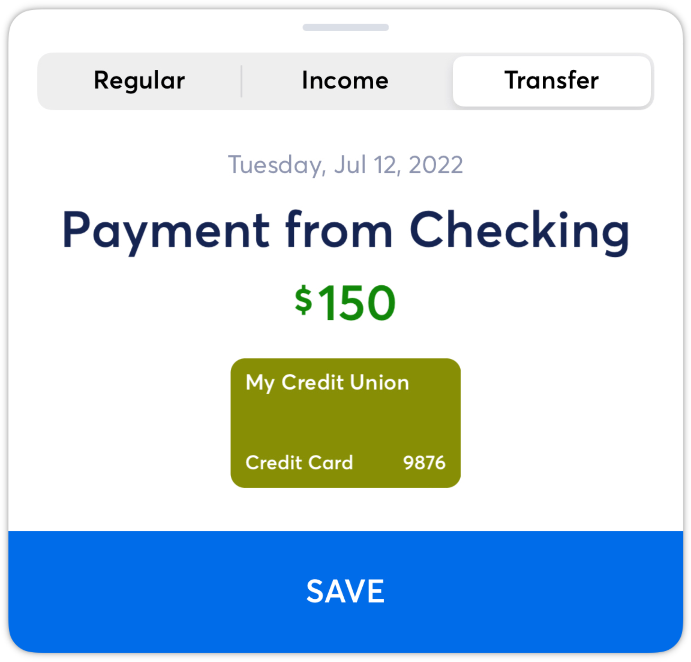
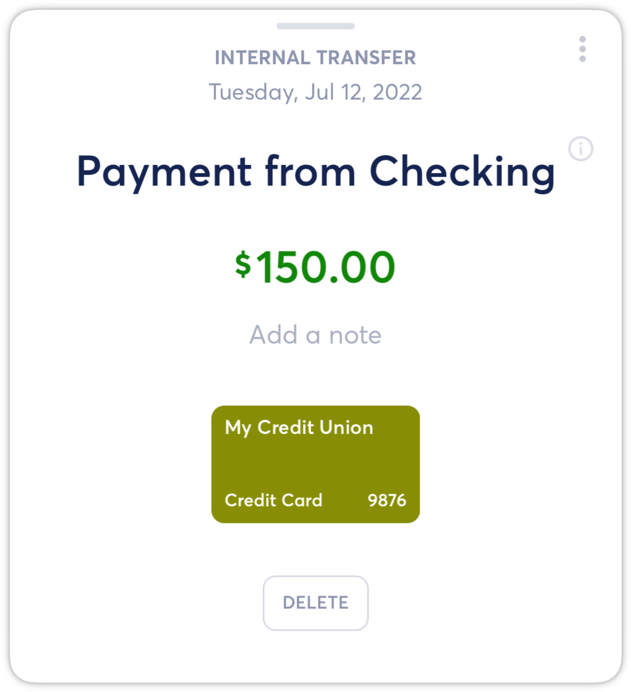
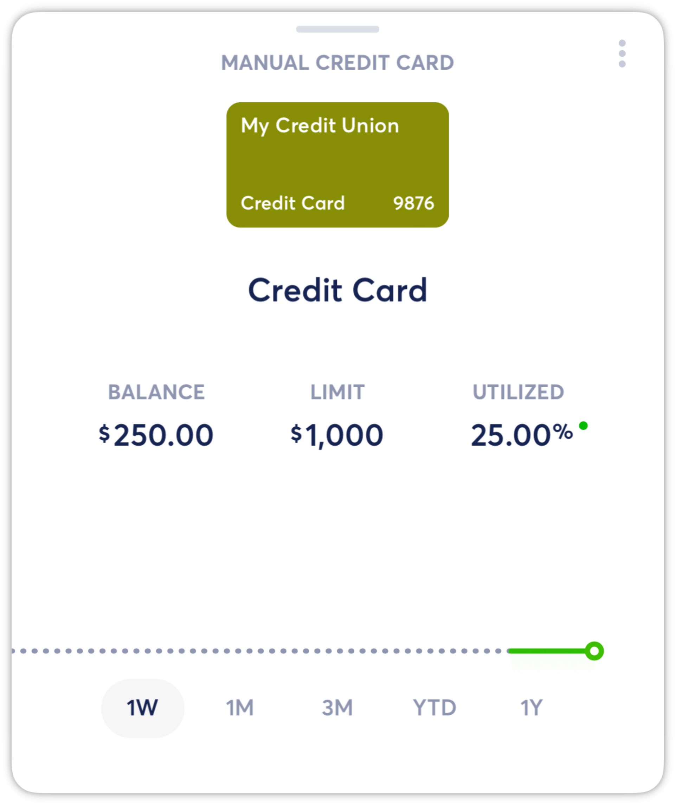
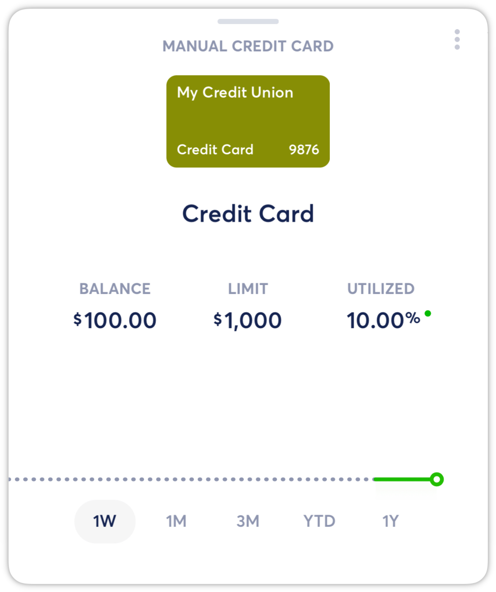

# Creating Manual Internal Transfer Payments

**Source:** https://help.copilot.money/en/articles/4235839-creating-manual-internal-transfer-payments

If you are tracking a credit card or loan account manually, then you will need to create an internal transfer transaction when you make a payment to the manual account from a linked depository account (checking or savings).

*NOTE: To learn more about transaction types, please see this [article](https://intercom.help/copilotmoney/en/articles/3971267-transaction-types).*

For a payment from a linked account to a manual credit card or loan account, you will need two internal transfer transactions:

An **Outgoing Internal Transfer**from your checking or savings account. If this account is linked in Copilot, then this transaction is automatically posted.

An **Incoming Internal Transfer**to your manual credit card account, which you need to create manually.

To create the **Incoming Internal Transfer** for your manual credit card account payment, please follow these steps:

From the Transactions view, select **Add a New Transaction**

Select **Transfer**

Update the date of your payment, if necessary, and **Continue**

Add the **Transaction Name**

Enter the payment amount and select **Incoming**

Tap on the account, scroll to your manual credit card, select it and **Save**

After creating this Internal Transfer transaction, your payment will be reflected on your manual credit card account balance.

*NOTE: To create other types of manual transactions, please see this [article](https://intercom.help/copilotmoney/en/articles/4038706-create-manual-transactions).*

👋 Still have questions? Contact us via the in-app chat.

---
Related Articles[Transaction Types](https://help.copilot.money/en/articles/3971267-transaction-types)[Creating Manual Transactions](https://help.copilot.money/en/articles/4038706-creating-manual-transactions)[Creating Manual Accounts](https://help.copilot.money/en/articles/4537532-creating-manual-accounts)[Credit Card Payment Transactions](https://help.copilot.money/en/articles/10671434-credit-card-payment-transactions)[Understanding Manual Accounts](https://help.copilot.money/en/articles/10682991-understanding-manual-accounts)
