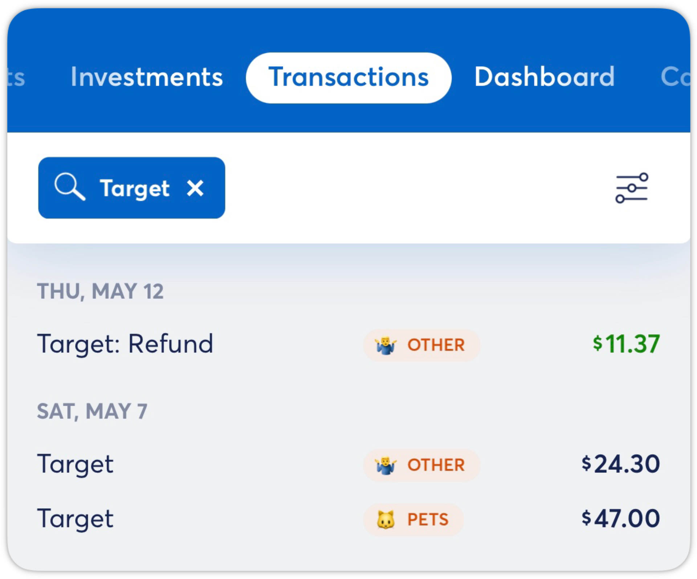
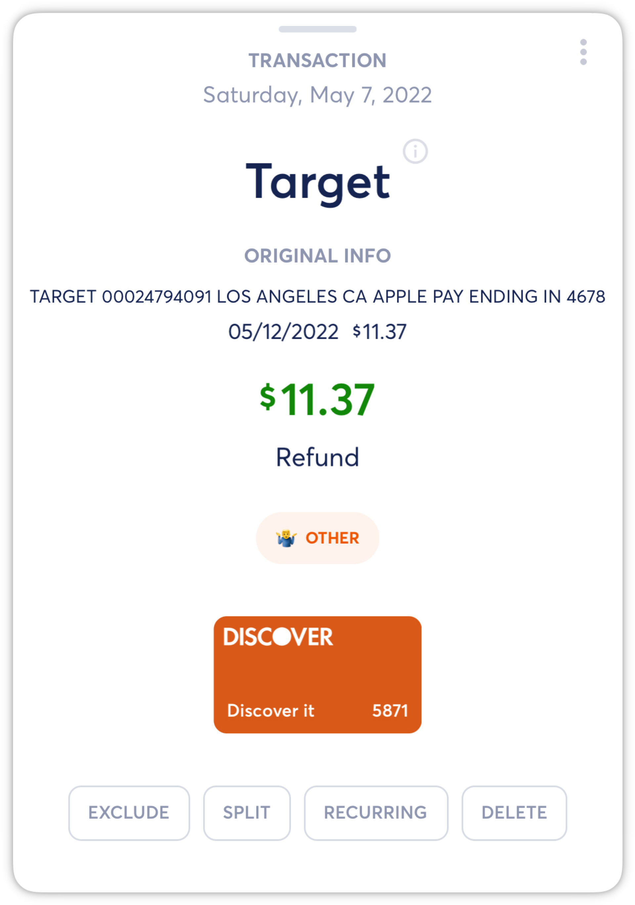
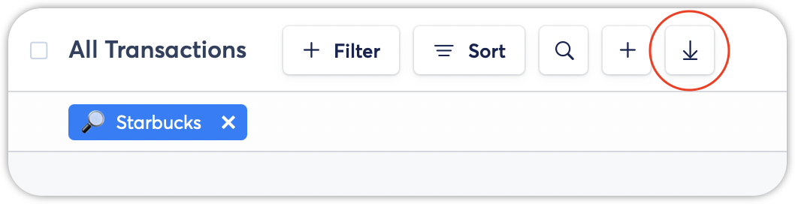
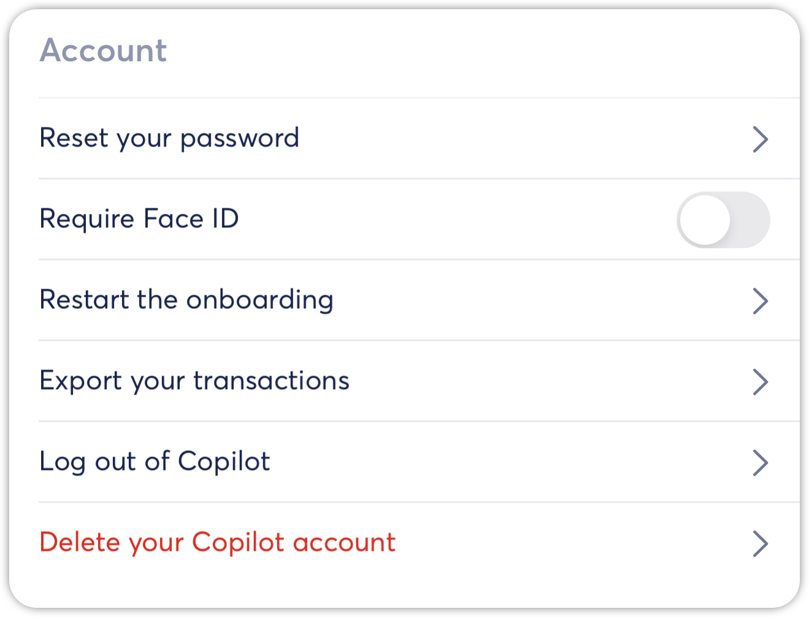
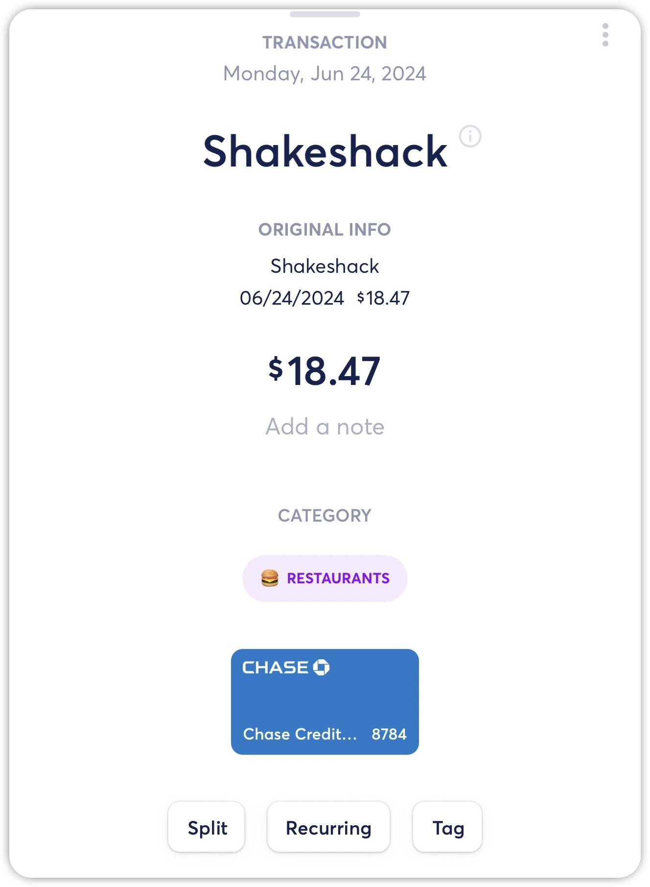
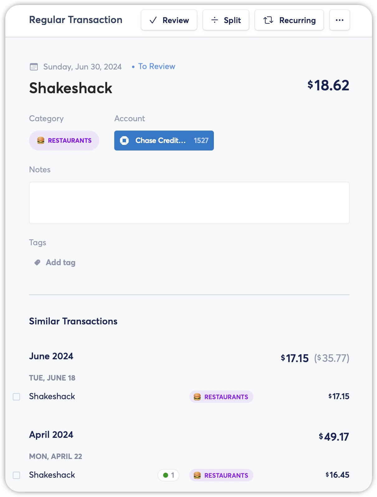
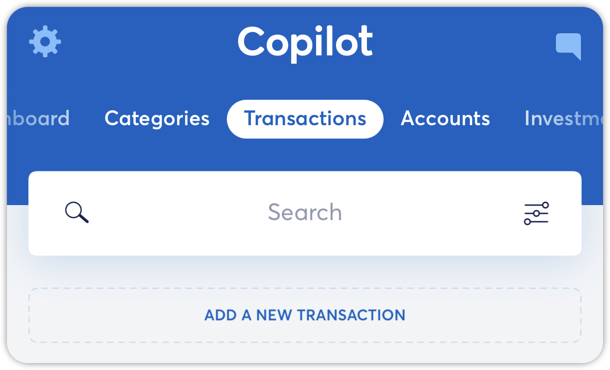
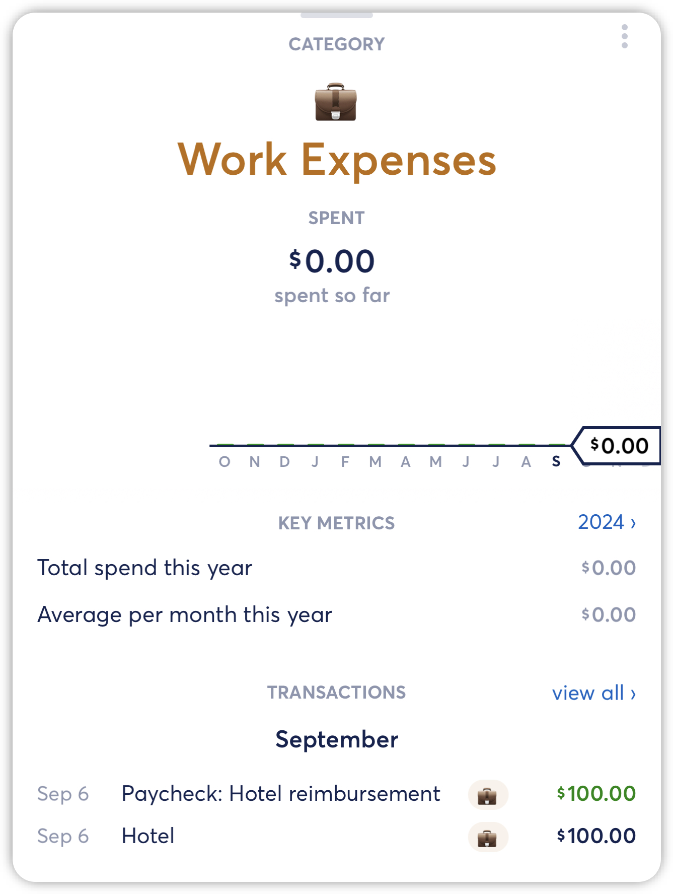

# Refund and Reimbursement Transactions

**Source:** https://help.copilot.money/en/articles/5325170-refund-and-reimbursement-transactions

When you receive a refund for a purchase, we suggest the following steps to accurately apply the credit amount to your monthly budget.

Confirm that the refund is categorized in the same category as the original purchase.

Edit the date on the refund transaction to match the date of the original transaction, particularly if the original transaction occurred in a previous month.

Select the refund transaction and tap on the date to edit.

*Note: the original transaction information is available by tapping on the (i).*

Your monthly category spend will now include the purchase refund.

**If your reimbursement or refund payment is part of a larger payment**, you can split the transaction in to two or multiple transactions and move the reimbursement portion of the transaction into the same category as the original purchase transactions. You can follow the steps below to lean more.

Select the transaction thats includes your reimbursement or refund, and tap on **Split** on the bottom of the transaction details view.

Split the transaction into **2 or multiple transactions** with transaction amounts reflecting the reimbursement amount, then tap SAVE.

Tap on the split transaction reflecting the reimbursement amount, then tap on the three dots on the upper right hand corner, then update the transaction type**from Income to Regular**.

Then, update category of the transaction into the original purchase category, this should update the category spending amount to include the reimbursement and refund.

👋 Still have questions? Contact us via the in-app chat.

---
Related Articles[Transaction Types](https://help.copilot.money/en/articles/3971267-transaction-types)[Creating Manual Transactions](https://help.copilot.money/en/articles/4038706-creating-manual-transactions)[Splitting Transactions](https://help.copilot.money/en/articles/5325255-splitting-transactions)[Transactions Tab Overview](https://help.copilot.money/en/articles/9554412-transactions-tab-overview)[Excluding Transactions](https://help.copilot.money/en/articles/9718801-excluding-transactions)
