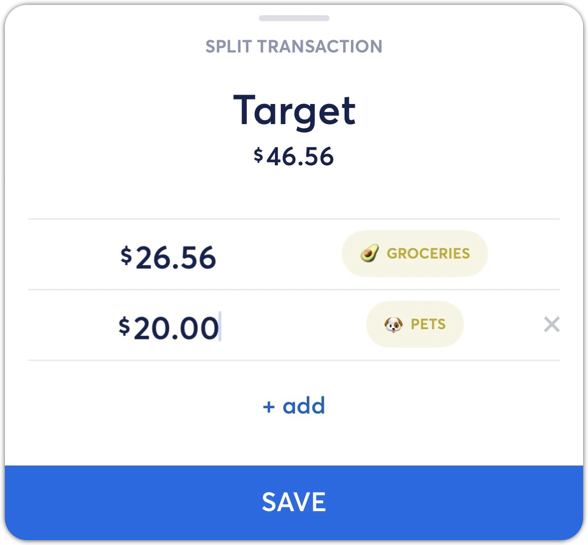
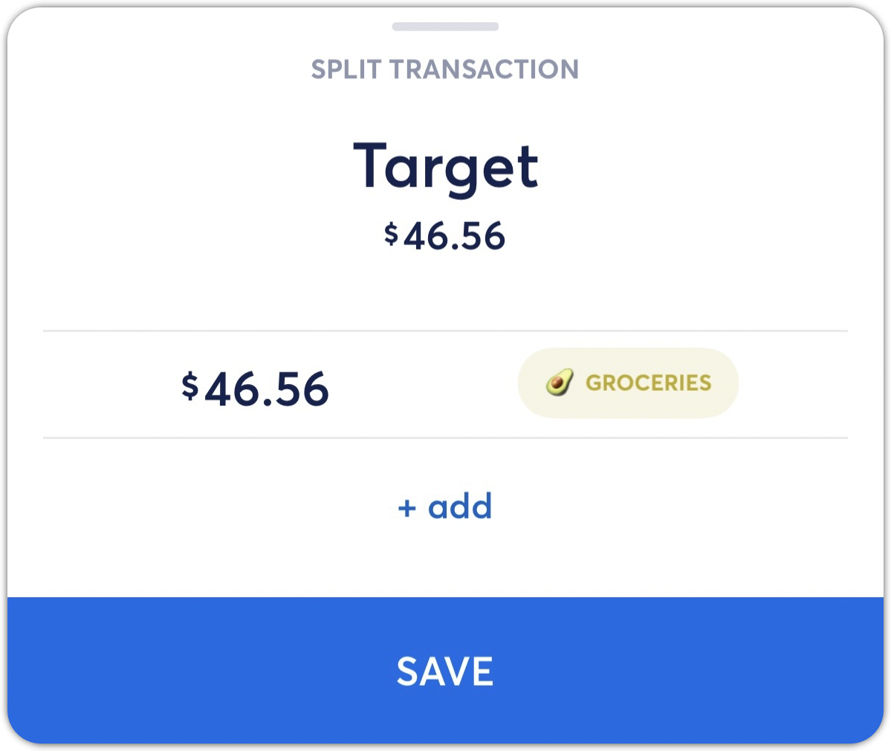

# Splitting Transactions

**Source:** https://help.copilot.money/en/articles/5325255-splitting-transactions

In some cases, you might prefer to split a transaction across different categories, or spread the transaction over a period of time. Copilot supports splitting any transaction and editing the categorization, type, and dates for those splits.

---

# Splitting Transaction for Categorization

In cases where you want to recategorize or exclude a portion of a split, you can follow these steps.

- Select **Split** at the bottom of the specific transaction view on iOS or at the top of the transaction view on the Mac or iPad app. Then split the total amount by however many categories you'd like to use.

- Once you have split the original transaction into separate transactions, then you can edit the categorization on each split, or exclude them.

- Once your split amounts and categories are set, tap **Save**to save those splits in Copilot.

*Note: After saving your splits, you can also change the transaction type for one your splits if needed. For example, when work expenses are reimbursed and included in your paycheck.*

---

# Splitting a Transaction Across Multiple Months

In cases where you want to spread an expense across several months, then we suggest the following steps.

- Select **Split** at the bottom of the specific transaction view on iOS or at the top of the transaction view on the Mac or iPad app. Then split the total amount by the number of months. This is an example of 6-month insurance premium.

- Once you have split the original transaction into separate transactions, then you can edit the date on each transaction to correspond to a specific month.

*Note: you can update the dates to be in the past or future.*

If you need to update the split amount, then select **Edit the Split** on any of the associated transactions.

---

# Restoring Split Transactions

If you would like to restore a split transaction to its original transaction, you can follow the steps below.

- Select one of the "children" transactions

- Select **Edit split.**In this view,the top transaction is the "parent" transaction.

- Tap the **X** next to the children transaction(s) to remove them. The parent transaction amount will update accordingly. Then tap **Save**to restore the original transaction in Copilot.

*Note: When you are in the Split Transaction view, you will see the original transaction amount under the Transaction name for reference.*

👋 Still have questions? Contact us via the in-app chat.

---
Related Articles[Creating Manual Transactions](https://help.copilot.money/en/articles/4038706-creating-manual-transactions)[Refund and Reimbursement Transactions](https://help.copilot.money/en/articles/5325170-refund-and-reimbursement-transactions)[Exporting Your Transaction Data](https://help.copilot.money/en/articles/5944414-exporting-your-transaction-data)[Transactions Tab Overview](https://help.copilot.money/en/articles/9554412-transactions-tab-overview)[Excluding Transactions](https://help.copilot.money/en/articles/9718801-excluding-transactions)
