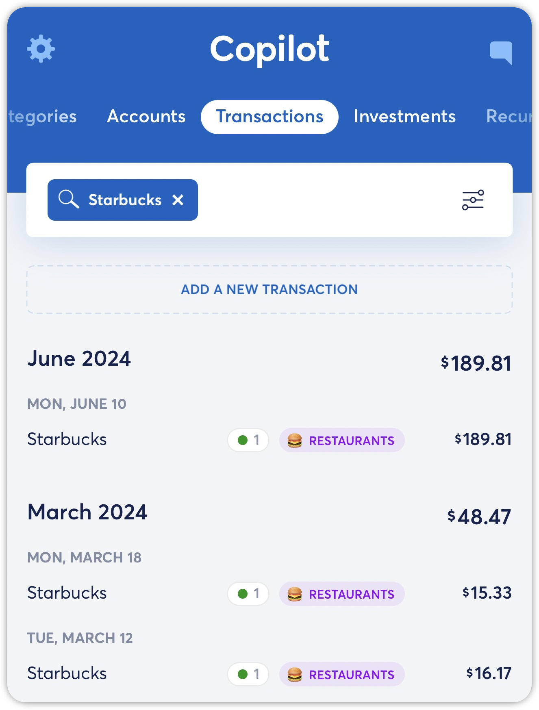
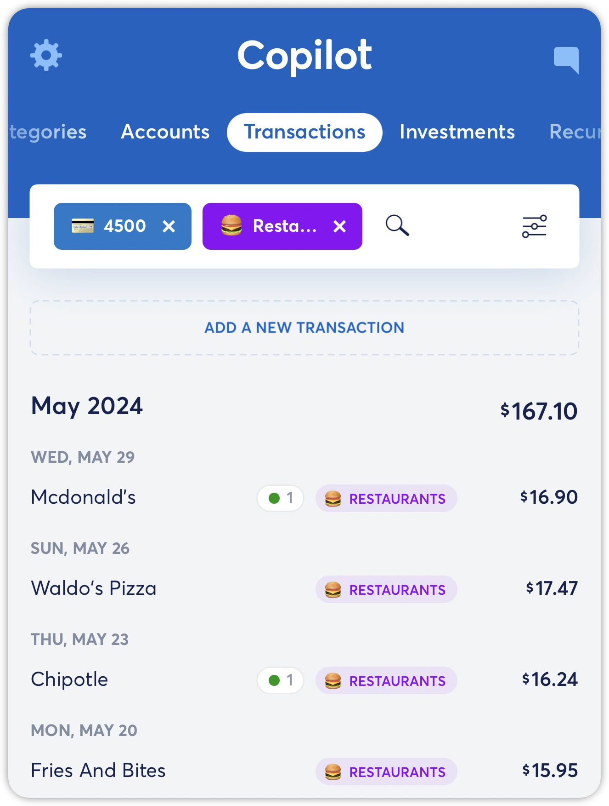
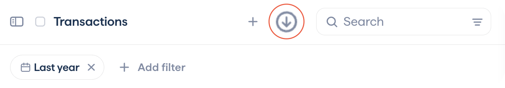

# Exporting Your Transaction Data

**Source:** https://help.copilot.money/en/articles/5944414-exporting-your-transaction-data

## Copilot allows you to export all of your transaction data as a spreadsheet on**iOS**, **iPadOS**, **macOS** and **Web**.

## ​**On iOS:**

- In the Settings menu, scroll down to **Account**
- Tap on **Export your transactions**

- Copilot will open a CSV file of all of your transaction data
- Tap on the **share button** on the lower bottom left corner to save to Files or share it through other channels.

The following information will be included in your transaction export:

- Date
- Name
- Amount
- Pending or Posted Status
- Category and Parent Category
- Excluded True or False
- Transaction Type
- Account and Account Mask
- Notes
- Associated Recurrings

## **On iPadOS & macOS:**

You have the ability to export specific transactions after applying different filters,  searching for a specific merchant, or transaction name in the Transactions tab.

## On Web:

You have the ability to export specific transactions using the unique filters available only on the Web app in the Transactions tab.

👋 **Still have questions?** Contact us via the in-app chat.

---
Related Articles[Creating Manual Transactions](https://help.copilot.money/en/articles/4038706-creating-manual-transactions)[Splitting Transactions](https://help.copilot.money/en/articles/5325255-splitting-transactions)[Transactions Tab Overview](https://help.copilot.money/en/articles/9554412-transactions-tab-overview)[Excluding Transactions](https://help.copilot.money/en/articles/9718801-excluding-transactions)[Transactions FAQ](https://help.copilot.money/en/articles/10761907-transactions-faq)
