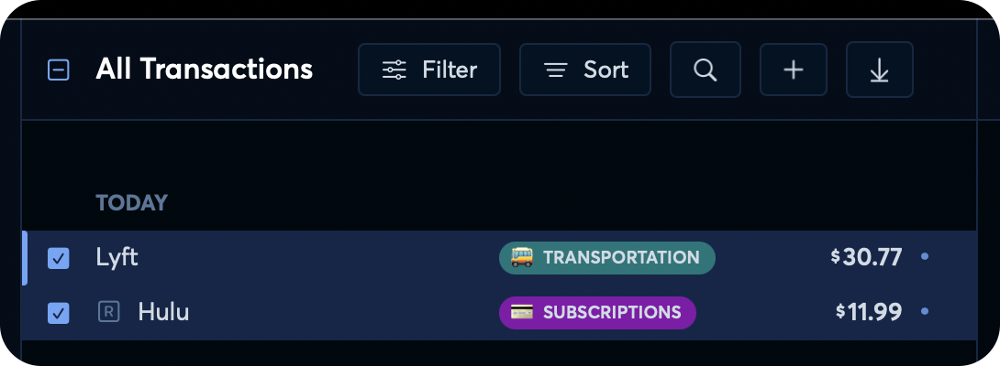

# Bulk Editing Transactions

**Source:** https://help.copilot.money/en/articles/7668990-bulk-editing-transactions

In Copilot, you can bulk edit transactions for fast changes.

**In the Mac or iPad app,** enter multi-select mode by tapping on the box to the left of a transaction anywhere in the app.  After the transaction's box is checked, you'll be able to select additional transactions and use the Bulk Edit bar at the bottom of the view to make changes depending on the state of the selected transactions.

**The following shortcuts are also available for interacting with transactions:**

- Move up and down the list of transactions with the **arrows** on the keyboard
- **X** for selecting a transaction
- **R** for marking it as Reviewed
- **C** for changing the category
- **F** to open the Filters menu
- **⌘ + A** to select all transactions
- **⌘ + Shift + A** to deselect all transactions

#### **In the iOS app,** enter multi-select mode by long pressing a transaction in the Transactions tab. After the transaction appears highlighted, you'll be able to select additional transactions and use the Bulk Edit bar at the bottom of the view to make changes depending on the state of the selected transactions.

You can also "Select All" transactions in the list from the overflow menu in the Bulk Edit bar.

**Unselect all selected transactions in three ways:**

- Tap to unselect each selected transaction one-by-one
- Tap the unselect box in the Transaction Search bar
- Select overflow menu in the Bulk Edit bar, then tap "Unselect All".

**If Copilot's shortcuts are not working on your device, they may be blocked**by one of your computer's settings.

To use Copilot shortcuts, please click the Apple icon on the top left corner of your Mac > System Settings > Keyboard > Keyboard navigation > Make sure this is toggled "off."

👋 Still have questions? Contact us via the in-app chat.

---
Related Articles[Creating Manual Transactions](https://help.copilot.money/en/articles/4038706-creating-manual-transactions)[Splitting Transactions](https://help.copilot.money/en/articles/5325255-splitting-transactions)[Transactions Tab Overview](https://help.copilot.money/en/articles/9554412-transactions-tab-overview)[Copilot Money for iPad](https://help.copilot.money/en/articles/10003978-copilot-money-for-ipad)[Web FAQ](https://help.copilot.money/en/articles/13157382-web-faq)
