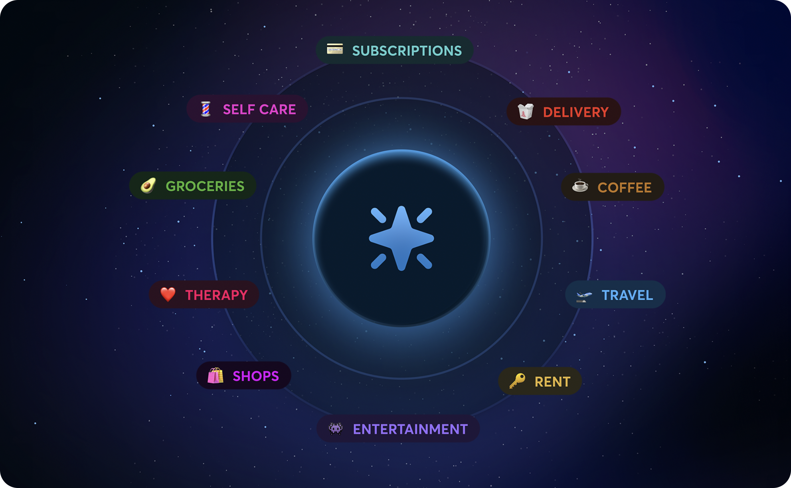
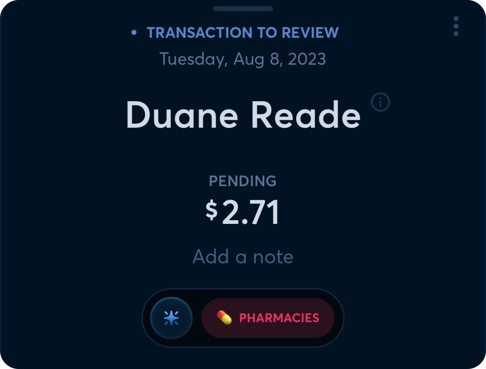
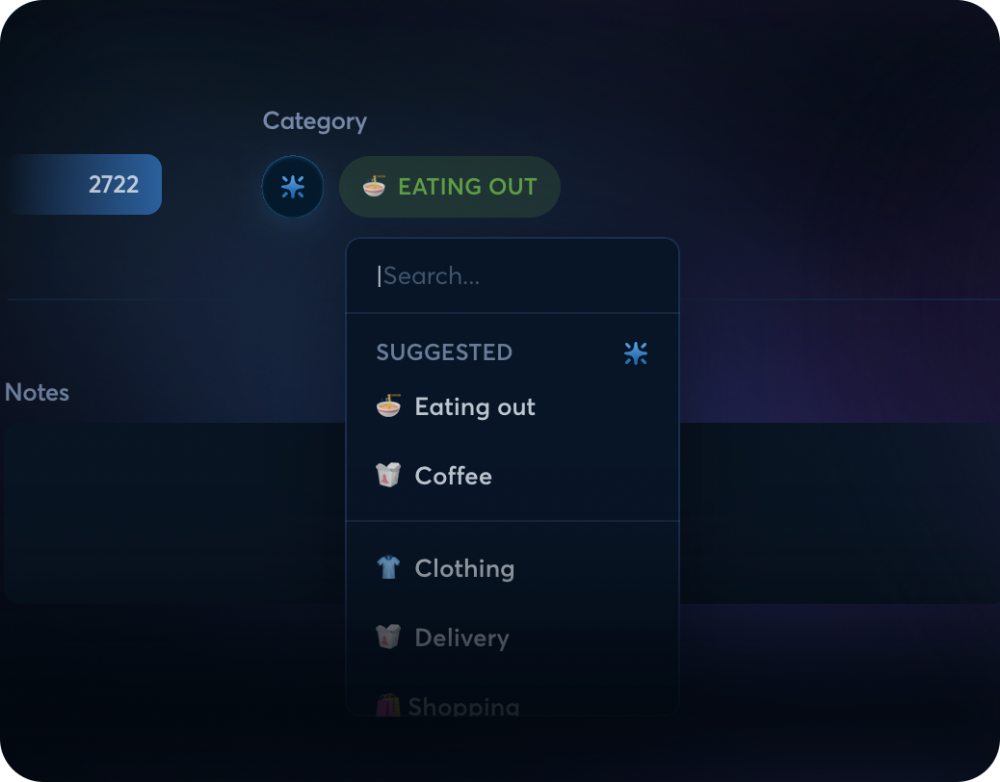

# Copilot Intelligence for Spending

**Source:** https://help.copilot.money/en/articles/8182433-copilot-intelligence-for-spending

We're excited to introduce Copilot Intelligence for Spending. This new AI system uses Machine Learning to better predict your transactions’ categories based on the transactions you’ve reviewed in the past.
​
​**If you're new to Copilot, you'll see that you need to review 30 transactions before this is enabled for your account.** Once you reach that threshold, Intelligence will be automatically trained on how you want things categorized.

We built this in-house and with privacy in mind. Each Copilot user gets their own AI model, so all you have to do to make it even smarter is to review your transactions and make sure things are categorized correctly.

The new machine learning model takes into account the name of the transaction, amount, day of the week, which card was used, and a few other data points to predict how you want it categorized. If Copilot Intelligence can’t find a pattern and is not very confident in the prediction, it won’t apply it. When the confidence score is high enough, the prediction will be applied and you’ll see this in the app:

In case the prediction isn't correct, Copilot Intelligence will surface the top two guesses at the front of the list to make it easy to re-categorize the transaction.

When the model isn't confident enough to make a prediction, Copilot will take care of categorizing the transaction as normal and you won't see the Intelligence badge next to the category.

Copilot Intelligence gets smarter with every transaction you review, so make sure to keep your To Review inbox at 0!

👋 **Still have questions?** Contact us via the in-app chat.

---
Related Articles[Copilot Money for macOS](https://help.copilot.money/en/articles/6778561-copilot-money-for-macos)[Copilot Money for iPad](https://help.copilot.money/en/articles/10003978-copilot-money-for-ipad)[Transactions FAQ](https://help.copilot.money/en/articles/10761907-transactions-faq)[Quick Start Guide](https://help.copilot.money/en/articles/11157550-quick-start-guide)[Copilot Money for Web](https://help.copilot.money/en/articles/11780342-copilot-money-for-web)
