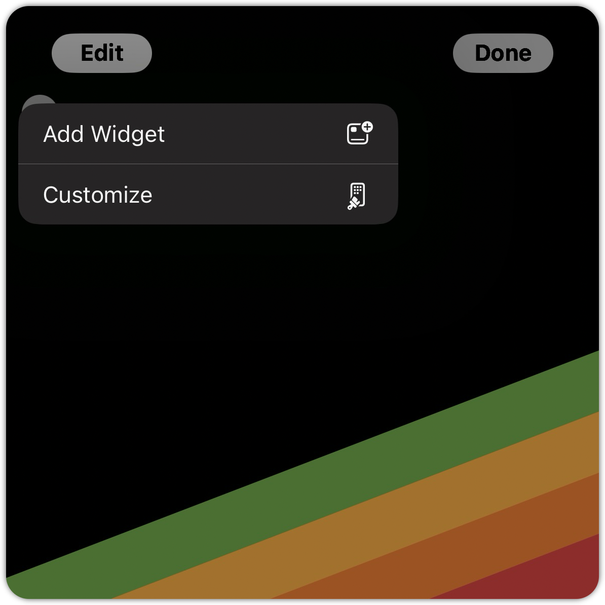
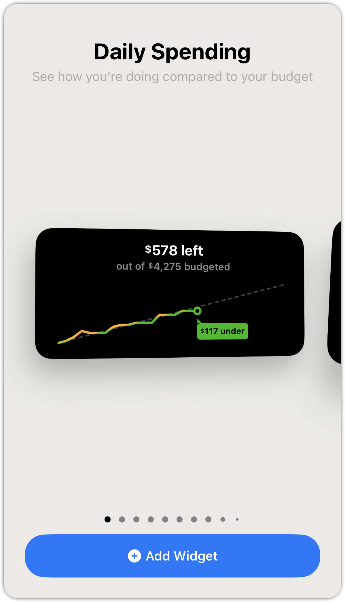

# Adding Widgets

**Source:** https://help.copilot.money/en/articles/9834331-adding-widgets

Copilot has a variety of widgets to suit your specific needs and keep you updated on your budgets, financial history, data, and information.

Get a quick glance at your financial information without opening the Copilot app.

---

## **How to add a Widget**

You can access them by swiping right on your home screen and long-pressing an empty spot on the screen. From there, you would tap on the "**Edit**" and then "**Add Widget**" button at the top left of the screen. You can then search for Copilot in the search bar or scroll down until the Copilot app icon is displayed to access all of our available widgets.

## Available Copilot Widgets

Choose one or more to add to your home screen.

- ​**Daily Spending** - See how you're doing compared to your budget.
- **Spending Category** - See your spending and budget.
- **Budgets** - See four budgets at a time.
- **Net Worth** - Track your net worth across all accounts.
- **Credit Card** - Track the balance and utilization rate.
- **Account** - Track the balance and the net change.
- **Recent Transactions** - See your most recent transactions.
- **Transactions To Review** - Review transactions with a tap

If you're using**iOS 18**on your device:

*It's not possible to see or add Copilot widgets when the "Require Face ID" feature is enabled for Copilot on your device. "Require Face ID" is a security setting controlled by Apple, and is different than using "Face ID" to log into Copilot.*

👋 **Still have questions?**Contact us via the in-app chat.

---
Related Articles[Improving Widget Performance](https://help.copilot.money/en/articles/4968599-improving-widget-performance)[Income vs. Budget](https://help.copilot.money/en/articles/5542019-income-vs-budget)[Dashboard Tab Overview](https://help.copilot.money/en/articles/6045480-dashboard-tab-overview)[Dashboard FAQ](https://help.copilot.money/en/articles/10238054-dashboard-faq)[Quick Start Guide](https://help.copilot.money/en/articles/11157550-quick-start-guide)
